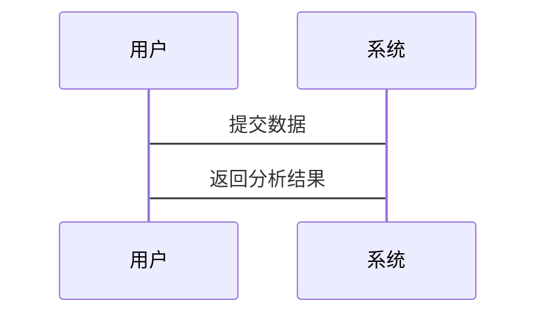

                 


# 股市估值对绿色债券市场的影响

## 关键词：绿色债券、股市估值、金融市场、环境影响、投资策略

## 摘要：  
随着全球对可持续发展的关注不断增加，绿色债券作为一种重要的融资工具，在金融市场中扮演着越来越重要的角色。本文探讨股市估值与绿色债券市场的相互影响，分析绿色债券对股市估值的正面与负面影响，以及如何通过合理的投资策略来优化绿色债券的市场表现。通过系统分析与实证研究，本文旨在为投资者和政策制定者提供有价值的参考。

---

# 第1章: 股市估值与绿色债券的背景与概念

## 1.1 股市估值的基本概念

### 1.1.1 股市估值的定义
股市估值是指通过对上市公司的财务数据和市场表现进行分析，对其股票的内在价值进行评估的过程。常见的估值方法包括市盈率（P/E）、市净率（P/B）、现金流折现法（DCF）等。

### 1.1.2 股市估值的主要方法
- **市盈率（P/E）**：股票价格与每股净利润的比值，反映市场对公司盈利能力的预期。
- **市净率（P/B）**：股票价格与每股净资产的比值，适用于评估资产密集型行业。
- **现金流折现法（DCF）**：通过预测公司未来现金流并将其折现，计算股票的内在价值。
- **股息率**：股息与股票价格的比值，反映股票的分红能力。

### 1.1.3 股市估值的影响因素
- **宏观经济环境**：GDP增长率、利率、通货膨胀等。
- **行业特性**：行业周期、竞争格局、政策法规。
- **公司基本面**：收入、利润、资产负债情况等。
- **市场情绪**：投资者情绪、市场流动性等。

## 1.2 绿色债券的基本概念

### 1.2.1 绿色债券的定义
绿色债券是一种专门用于支持环保、气候变化应对和可持续发展项目的债务工具。其募集资金必须用于绿色项目，且需符合相关监管要求。

### 1.2.2 绿色债券的分类
- **普通绿色债券**：募集资金直接用于绿色项目。
- **可转换绿色债券**：债券持有人可选择将其转换为公司股票。
- **附认股权绿色债券**：债券附带认股权，持有人有权以特定价格购买公司股票。
- **收益支持债券**：通过绿色项目产生的收益支持债券本息偿还。

### 1.2.3 绿色债券的发行与投资主体
- **发行主体**：政府、企业和金融机构。
- **投资主体**：机构投资者、零售投资者和绿色基金。

## 1.3 股市估值与绿色债券的关系

### 1.3.1 绿色债券对股市估值的潜在影响
- 绿色债券的发行可能影响相关公司的资本结构，进而影响其股票价值。
- 绿色债券的收益率与股市估值之间存在一定的相关性。

### 1.3.2 股市估值对绿色债券市场的影响
- 股市估值的变化可能影响投资者对绿色债券的需求，进而影响绿色债券的市场价格。

---

# 第2章: 绿色债券的市场机制与影响因素

## 2.1 绿色债券的发行机制

### 2.1.1 绿色债券的发行流程
1. 确定绿色项目并获得相关认证。
2. 发行人向监管机构提交发行申请。
3. 发行定价与承销。
4. 债券上市与交易。

### 2.1.2 绿色债券的评级标准
- **信用评级**：由评级机构对债券发行人进行信用评级。
- **绿色债券评级**：对绿色项目的环保效益和财务可行性进行评估。

### 2.1.3 绿色债券的发行主体与投资者行为
- 发行人通过绿色债券融资，投资者通过购买债券支持环保项目。

## 2.2 绿色债券的市场需求与供给分析

### 2.2.1 市场需求分析
- 投资者对绿色投资的需求增加。
- 绿色债券的风险与收益特征吸引特定投资者。

### 2.2.2 市场供给分析
- 发行人通过绿色债券融资的需求增加。
- 监管政策推动绿色债券市场发展。

### 2.2.3 市场供需平衡与价格形成机制
- 供需平衡影响绿色债券的市场价格。
- 市场价格反映绿色债券的内在价值。

## 2.3 绿色债券的外部影响因素

### 2.3.1 宏观经济环境
- 利率水平影响绿色债券的吸引力。
- 经济政策影响绿色债券的市场需求。

### 2.3.2 政策法规
- 政府政策推动绿色债券市场发展。
- 监管政策影响绿色债券的发行与交易。

### 2.3.3 市场参与者行为
- 投资者行为影响绿色债券的市场需求。
- 发行人的行为影响绿色债券的供给。

## 2.4 本章小结

---

# 第3章: 股市估值的核心方法与应用

## 3.1 股市估值的主要方法

### 3.1.1 市盈率法
- **定义**：股票价格与每股净利润的比值。
- **应用**：适用于盈利稳定的公司。

### 3.1.2 市净率法
- **定义**：股票价格与每股净资产的比值。
- **应用**：适用于资产密集型行业。

### 3.1.3 现金流折现法
- **定义**：通过预测未来现金流并折现，计算股票的内在价值。
- **应用**：适用于高成长性公司。

### 3.1.4 其他估值方法
- **股息率**：股票分红能力的衡量。
- **EV/EBITDA**：企业价值与息税折旧及摊销前利润的比值。

## 3.2 股市估值的关键指标

### 3.2.1 市盈率（P/E）
- $$ P/E = \frac{股票价格}{每股净利润} $$

### 3.2.2 市净率（P/B）
- $$ P/B = \frac{股票价格}{每股净资产} $$

### 3.2.3 股息率
- $$ 股息率 = \frac{每股股息}{股票价格} $$

### 3.2.4 净值收益率（ROE）
- $$ ROE = \frac{净利润}{净资产} $$

## 3.3 股市估值的局限性与改进方向

### 3.3.1 股市估值的主要局限性
- 市场情绪影响估值结果。
- 无法完全反映公司的未来风险。

### 3.3.2 绿色债券对股市估值的改进方向
- 结合环境、社会和治理（ESG）因素进行综合估值。

---

# 第4章: 绿色债券对股市估值的影响分析

## 4.1 绿色债券对股市估值的正面影响

### 4.1.1 提升公司的可持续发展形象
- 通过发行绿色债券，公司可能获得更好的市场形象，进而提升股票估值。

### 4.1.2 增加公司的资金来源
- 绿色债券为公司提供新的融资渠道，降低财务风险。

## 4.2 绿色债券对股市估值的负面影响

### 4.2.1 稀释股东权益
- 可转换绿色债券和附认股权债券可能稀释股东权益。

### 4.2.2 影响公司的资本结构
- 过多发行绿色债券可能影响公司的资本结构，进而影响股票估值。

## 4.3 绿色债券对股市估值的综合影响

### 4.3.1 绿色债券对不同行业的影响
- 环保行业可能受益，传统行业可能面临压力。

### 4.3.2 绿色债券对不同规模公司的影响
- 大公司更容易获得绿色债券融资，小公司可能面临更多挑战。

---

# 第5章: 绿色债券对股市估值的系统分析与架构设计

## 5.1 系统分析

### 5.1.1 问题场景
- 研究绿色债券对股市估值的具体影响。

### 5.1.2 项目介绍
- 构建一个模型，分析绿色债券对股市估值的影响。

## 5.2 系统功能设计

### 5.2.1 领域模型


### 5.2.2 系统架构


## 5.3 系统接口设计

### 5.3.1 数据输入接口
- 接收绿色债券和股市数据。

### 5.3.2 数据输出接口
- 提供分析结果和报告。

## 5.4 系统交互设计

### 5.4.1 用户与系统交互


---

# 第6章: 绿色债券对股市估值的项目实战

## 6.1 环境安装

### 6.1.1 安装Python
- 使用Anaconda安装Python环境。

### 6.1.2 安装相关库
- 使用pip安装numpy、pandas、matplotlib。

## 6.2 核心实现源代码

### 6.2.1 数据处理
```python
import pandas as pd
import numpy as np

# 加载绿色债券数据
green_bond_data = pd.read_csv('green_bond.csv')

# 加载股市数据
stock_data = pd.read_csv('stock.csv')

# 数据清洗
green_bond_data.dropna(inplace=True)
stock_data.dropna(inplace=True)
```

### 6.2.2 分析模块
```python
from sklearn.linear_model import LinearRegression

# 构建回归模型
model = LinearRegression()
model.fit(green_bond_data[['bond_price', 'interest_rate']], stock_data['stock_price'])
```

### 6.2.3 结果展示
```python
import matplotlib.pyplot as plt

plt.scatter(green_bond_data['bond_price'], stock_data['stock_price'])
plt.plot(green_bond_data['bond_price'], model.predict(green_bond_data[['bond_price', 'interest_rate']]), color='red')
plt.xlabel('Green Bond Price')
plt.ylabel('Stock Price')
plt.show()
```

## 6.3 项目小结

---

# 第7章: 总结与展望

## 7.1 总结
- 绿色债券对股市估值的影响是多方面的，既有正面也有负面影响。
- 投资者和公司需要综合考虑多种因素，制定合理的投资策略。

## 7.2 展望
- 进一步研究绿色债券对不同行业和公司的具体影响。
- 探索结合ESG因素的综合估值方法。

---

# 附录

## A. 绿色债券的相关法规

## B. 股市估值的常用公式

## C. 数据来源与处理方法

---

# 作者：AI天才研究院 & 禅与计算机程序设计艺术

---

以上是关于《股市估值对绿色债券市场的影响》的完整文章结构，涵盖了从基本概念到系统分析和项目实战的各个方面，旨在为读者提供全面且深入的分析。

