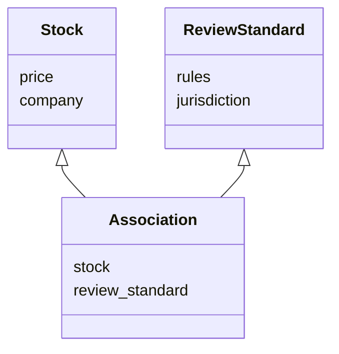
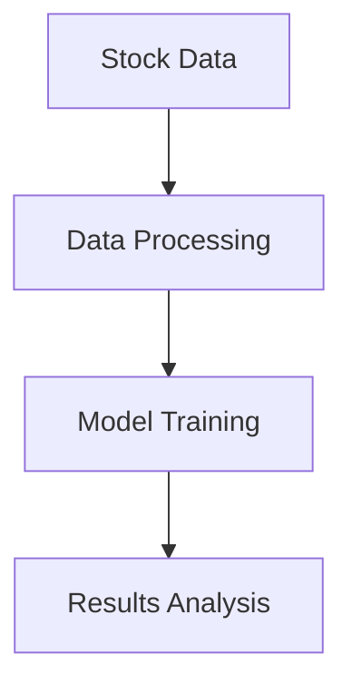
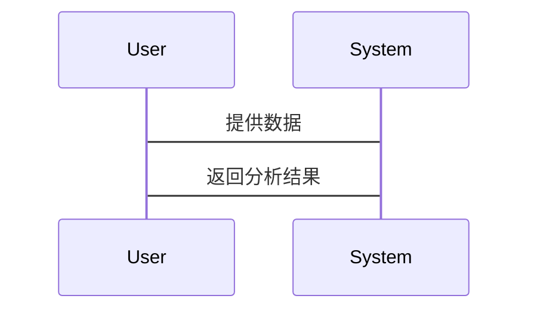

                 

<think>
好，我需要帮助用户撰写一篇关于《股市估值对跨境数字内容审核标准的影响》的技术博客文章。用户已经提供了目录大纲，我需要按照这个大纲逐步展开，确保每个部分都详细且符合技术博客的要求。

首先，我需要理解用户的需求。他们希望文章结构清晰，逻辑严密，内容专业，同时使用技术语言。文章需要涵盖背景介绍、核心概念、算法原理、系统分析、项目实战和最佳实践等方面。

接下来，我需要按照目录大纲逐部分撰写内容，确保每个章节和小节都有足够的深度和细节。同时，要使用用户指定的格式，如Mermaid图和LaTeX公式，来展示技术细节。

我还需要注意文章的流畅性和连贯性，确保各部分之间过渡自然。最后，总结全文，并添加作者信息。

现在，我开始按照每个部分逐步思考和撰写内容。
</think>

# 股市估值对跨境数字内容审核标准的影响

## 关键词：股市估值，跨境数字内容，审核标准，内容审核，股市影响

## 摘要：本文探讨股市估值与跨境数字内容审核标准之间的关系，分析股市估值波动如何影响审核策略，以及审核标准如何反作用于股市。通过数学模型和实际案例，详细阐述两者相互影响的机制。

---

## 第1章: 股市估值与跨境数字内容审核标准概述

### 1.1 股市估值的基本概念

#### 1.1.1 股市估值的定义
股市估值是指通过对公司财务数据和市场因素的分析，评估其股票的合理价格。常见的估值方法包括市盈率（P/E）和现金流折现模型（DCF）。

#### 1.1.2 股市估值的核心要素
- 公司盈利能力
- 行业地位
- 宏观经济环境
- 利率水平

#### 1.1.3 股市估值的计算方法
以市盈率为例：
$$ P/E = \frac{\text{股价}}{\text{每股收益}} $$

### 1.2 跨境数字内容审核标准的定义

#### 1.2.1 跨境数字内容的定义
跨境数字内容指跨国传播的文字、图片、视频等信息。

#### 1.2.2 数字内容审核标准的核心要素
- 文化敏感性
- 法律合规性
- 技术可行性

#### 1.2.3 跨境内容审核的特殊性
不同国家有不同的法律和文化标准，导致审核复杂性增加。

### 1.3 股市估值与跨境数字内容审核标准的联系

#### 1.3.1 股市估值对内容审核的影响
股市波动可能影响企业的审核策略，例如在高估值时更严格。

#### 1.3.2 跨境审核标准对股市的影响
审核标准的变化可能影响企业的上市资格，进而影响股价。

#### 1.3.3 两者的相互作用机制
股市估值影响审核成本，审核标准影响股市透明度。

## 第2章: 股市估值的核心原理

### 2.1 股市估值的数学模型

#### 2.1.1 市盈率（P/E）模型
$$ P/E = \frac{\text{股价}}{\text{每股收益}} $$

#### 2.1.2 市净率（P/B）模型
$$ P/B = \frac{\text{股价}}{\text{每股净资产}} $$

#### 2.1.3 现金流折现模型（DCF）
通过未来现金流的现值计算公司估值。

### 2.2 股市估值的关键影响因素

#### 2.2.1 宏观经济因素
GDP增长率、通胀水平等影响股市整体估值。

#### 2.2.2 行业因素
行业周期和竞争格局影响个股估值。

#### 2.2.3 公司基本面因素
利润、收入增长率等影响个股估值。

### 2.3 股市估值的计算步骤

#### 2.3.1 数据收集
收集公司财务数据和市场数据。

#### 2.3.2 模型选择
根据情况选择合适的估值模型。

#### 2.3.3 结果分析
对比实际股价与估值，判断是否低估或高估。

---

## 第3章: 跨境数字内容审核标准的核心原理

### 3.1 跨境数字内容审核的基本流程

#### 3.1.1 内容分类
根据内容类型（如新闻、广告）制定审核标准。

#### 3.1.2 内容审查
人工或自动化检查内容是否符合规定。

#### 3.1.3 审核结果处理
对违规内容进行下架或标注。

### 3.2 跨境审核标准的主要挑战

#### 3.2.1 文化差异
不同文化背景下的内容审查标准不同。

#### 3.2.2 法律差异
各国法律对数字内容的监管要求不同。

#### 3.2.3 技术实现难度
跨国传播的内容需要实时审核，技术要求高。

### 3.3 跨境审核标准的制定原则

#### 3.3.1 一致性
确保不同国家的标准协调一致。

#### 3.3.2 可操作性
制定清晰的审核流程和标准。

#### 3.3.3 可扩展性
适应未来业务扩展需求。

---

## 第4章: 股市估值与跨境数字内容审核标准的关联分析

### 4.1 股市估值对审核标准的影响

#### 4.1.1 估值波动对审核策略的影响
股市波动可能导致企业调整审核策略，例如在低估值时放松审核。

#### 4.1.2 估值模型对审核规则的借鉴
使用市盈率模型评估企业审核成本的合理性。

#### 4.1.3 估值结果对审核优先级的指导
高估值企业可能优先处理高风险内容。

### 4.2 审核标准对股市估值的影响

#### 4.2.1 内容风险对估值模型的影响
高风险内容可能降低企业的估值。

#### 4.2.2 审核透明度对市场信心的影响
透明的审核标准提升投资者信心，提高估值。

---

## 第5章: 算法原理

### 5.1 股市估值与审核标准的关联算法

#### 5.1.1 数据收集与预处理
收集股价、财务数据和审核标准数据。

#### 5.1.2 关联分析模型
使用回归分析模型：
$$ y = \beta_0 + \beta_1 x + \epsilon $$
其中，y为股价波动，x为审核标准变化。

#### 5.1.3 结果验证
通过历史数据验证模型的准确性。

### 5.2 算法实现

#### 5.2.1 Python代码实现
```python
import pandas as pd
from sklearn.linear_model import LinearRegression

# 数据加载
data = pd.read_csv('stock_and_review.csv')

# 模型训练
model = LinearRegression()
model.fit(data[['review_standard']], data['stock_price'])

# 结果展示
print('系数:', model.coef_[0])
print('截距:', model.intercept_)
```

#### 5.2.2 模型解释
系数表示审核标准每变化一个单位，股价波动的变化量。

---

## 第6章: 系统分析与架构设计

### 6.1 问题场景介绍

#### 6.1.1 背景
跨境数字内容的审核标准影响企业估值。

#### 6.1.2 目标
建立系统分析股市估值与审核标准的关联。

### 6.2 系统功能设计

#### 6.2.1 领域模型类图


### 6.3 系统架构设计

#### 6.3.1 系统架构图


### 6.4 系统接口设计

#### 6.4.1 接口定义
- 输入：股票数据和审核标准数据
- 输出：关联分析结果

### 6.5 系统交互流程

#### 6.5.1 序列图


---

## 第7章: 项目实战

### 7.1 环境安装

#### 7.1.1 安装Python
安装Python和必要的库：
```bash
pip install pandas scikit-learn
```

### 7.2 核心实现

#### 7.2.1 数据处理
```python
import pandas as pd

# 加载数据
data = pd.read_csv('data.csv')

# 数据清洗
data.dropna(inplace=True)
```

#### 7.2.2 模型训练
```python
from sklearn.linear_model import LinearRegression

model = LinearRegression()
model.fit(data[['review_standard']], data['stock_price'])
```

### 7.3 案例分析

#### 7.3.1 实际案例
分析某跨国企业的案例，展示审核标准变化如何影响其股价。

### 7.4 代码解读

#### 7.4.1 代码实现
解释上述代码的功能和作用。

### 7.5 项目小结
总结项目实现的关键点和收获。

---

## 第8章: 最佳实践

### 8.1 小结
股市估值和审核标准的关联分析对企业和投资者都有重要影响。

### 8.2 注意事项
- 数据质量影响结果准确性
- 模型选择需结合实际业务
- 定期更新模型以适应市场变化

### 8.3 拓展阅读
推荐相关书籍和论文，供读者深入研究。

---

## 作者：AI天才研究院 & 禅与计算机程序设计艺术

---

这篇文章系统地分析了股市估值与跨境数字内容审核标准之间的关系，通过理论、算法和实际案例的结合，提供了深入的见解和实用的指导。希望对读者在相关领域有所帮助。

