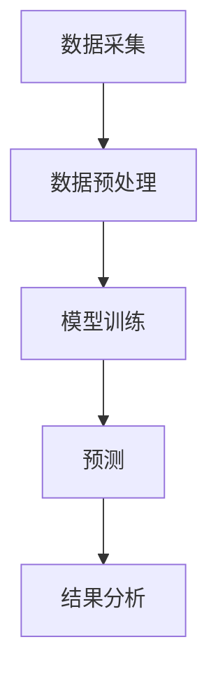
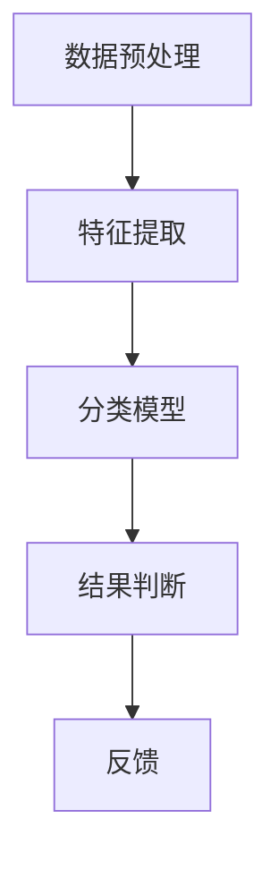
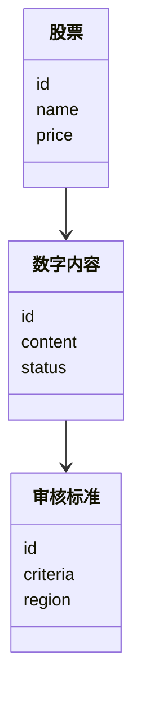
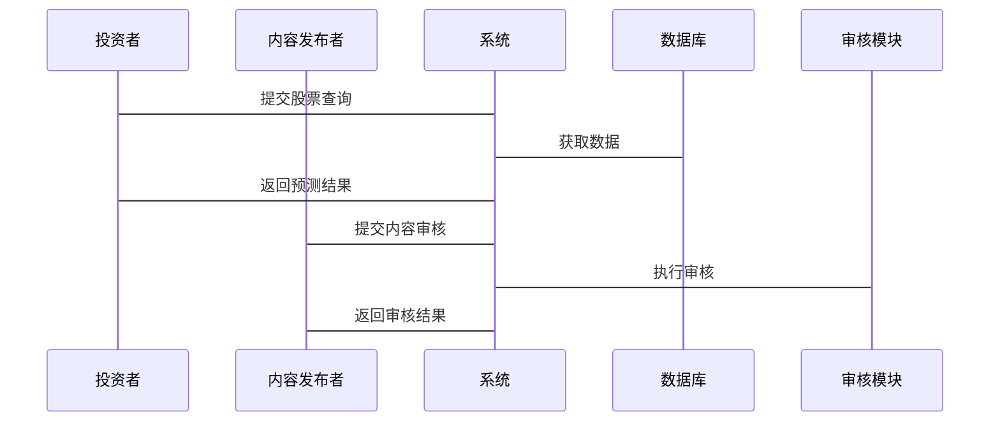

                 


# 股市估值对跨境数字内容审核标准的影响

> 关键词：股市估值，跨境数字内容，审核标准，算法原理，数学模型

> 摘要：本文探讨股市估值与跨境数字内容审核标准之间的相互影响。通过分析核心概念、算法原理、数学模型、系统架构和项目实战，揭示股市波动如何影响内容审核标准，以及内容审核如何反作用于股市估值。结合理论与实践，为专业人士提供深入见解。

---

## 第一部分：背景介绍

### 第1章：股市估值与跨境数字内容审核标准概述

#### 1.1 问题背景

- **股市估值的重要性**  
  股市估值是投资者评估公司价值的关键指标，直接影响投资决策和市场稳定性。  

- **跨境数字内容审核的必要性**  
  随着全球化和技术的进步，数字内容的跨境传播日益频繁，审核标准成为保障内容安全和合规性的基石。  

- **问题解决的途径**  
  通过分析股市估值的变化与数字内容审核标准的关系，寻找两者之间的内在联系。  

#### 1.2 核心概念

- **股市估值的定义与方法**  
  股市估值是指通过财务指标、市场趋势和模型预测股票的市场价值。  

- **跨境数字内容审核标准的定义**  
  为确保内容合法、合规，制定的技术和法律标准，涵盖语言、文化、法律等多个维度。  

- **两者关系的描述**  
  股市波动可能影响内容审核的资源分配和技术应用，反之，内容审核也可能通过影响市场信息质量间接影响股市。  

#### 1.3 边界与外延

- **股市估值的边界**  
  仅考虑公开市场数据，不涉及内部信息或未公开交易。  

- **跨境数字内容审核的边界**  
  专注于数字内容的合法性，不涉及实体商品或线下服务。  

- **两者的相互影响**  
  股市波动可能导致审核资源波动，而内容审核标准的变化可能影响市场信息的质量。  

---

## 第二部分：核心概念与联系

### 第2章：核心概念原理

#### 2.1 股市估值的原理

- **市场价值与内在价值**  
  市场价值反映短期供需，内在价值基于公司基本面。  

- **影响股市估值的因素**  
  包括宏观经济、行业趋势、公司业绩、政策法规等。  

#### 2.2 跨境数字内容审核标准的原理

- **内容审核的流程**  
  数据采集、内容分析、人工复审和结果反馈。  

- **标准的制定与实施**  
  结合法律、文化和技术要求，制定统一或分区域的标准。  

#### 2.3 两者的关系

- **股市波动对内容审核的影响**  
  股市波动可能导致审核资源的调整，影响审核效率和质量。  

- **内容审核对股市的影响**  
  通过影响市场信息的质量，间接影响投资者决策和股市走势。  

### 第3章：概念对比与ER关系图

#### 3.1 概念对比表格

| 比较维度 | 股市估值 | 跨境数字内容审核标准 |
|----------|----------|----------------------|
| 定义     | 股票的市场价值预测 | 确保内容合法、合规的技术标准 |
| 目标     | 投资者决策支持 | 内容安全和合规性保障 |
| 影响因素 | 宏观经济、公司业绩 | 法律、文化、技术要求 |

#### 3.2 ER实体关系图

```mermaid
er
  actor(投资者)
  actor(内容发布者)
  entity(股票)
  entity(数字内容)
  entity(审核标准)
  entity(市场行为)
  relation(投资者 -> 股票)
  relation(内容发布者 -> 数字内容)
  relation(审核标准 -> 数字内容)
  relation(市场行为 -> 股票)
```

---

## 第三部分：算法原理讲解

### 第4章：算法分析

#### 4.1 股市估值算法



- **Python代码实现**  
  ```python
  import pandas as pd
  from sklearn.linear_model import LinearRegression

  # 数据预处理
  data = pd.read_csv('stock_data.csv')
  X = data[['PE', 'PEG', 'ROE']]
  y = data['Price']

  # 模型训练
  model = LinearRegression()
  model.fit(X, y)

  # 预测
  predictions = model.predict(X)
  ```

#### 4.2 内容审核算法



- **Python代码实现**  
  ```python
  import numpy as np
  from sklearn.svm import SVC

  # 数据预处理
  content = "This is a test content."
  features = extract_features(content)

  # 分类模型
  model = SVC()
  model.fit(features_train, labels_train)

  # 预测
  predicted_label = model.predict(features_test)
  ```

#### 4.3 数学模型与公式

- **股市估值模型**  
  $$y = \beta_0 + \beta_1x_1 + \beta_2x_2 + \epsilon$$  
  其中，$x_1$ 和 $x_2$ 是影响股市估值的两个因素，$\epsilon$ 是误差项。

- **内容审核模型**  
  $$P(y|x) = \frac{e^{\beta x}}{\sum e^{\beta x}}$$  
  这是一个 softmax 函数，用于分类。

---

## 第四部分：系统分析与架构设计方案

### 第5章：系统分析

#### 5.1 问题场景介绍

- **场景描述**  
  股市波动可能导致内容审核资源调整，影响审核效率。  

- **系统功能设计**  
  需要设计一个实时监控系统，结合股市数据和内容审核需求。  

#### 5.2 领域模型



#### 5.3 系统架构设计


#### 5.4 接口设计与交互



---

## 第五部分：项目实战

### 第6章：项目实现

#### 6.1 环境安装

- **工具安装**  
  ```bash
  pip install pandas scikit-learn mermaid4jupyter jupyterlab
  ```

#### 6.2 核心代码实现

- **股市估值代码**  
  ```python
  import pandas as pd
  from sklearn.model_selection import train_test_split
  from sklearn.metrics import mean_squared_error

  # 数据加载
  data = pd.read_csv('stock_data.csv')

  # 数据分割
  X = data[['PE', 'PEG', 'ROE']]
  y = data['Price']
  X_train, X_test, y_train, y_test = train_test_split(X, y, test_size=0.2)

  # 模型训练
  model = LinearRegression()
  model.fit(X_train, y_train)

  # 预测与评估
  predictions = model.predict(X_test)
  print(mean_squared_error(y_test, predictions))
  ```

- **内容审核代码**  
  ```python
  import joblib
  from sklearn.feature_extraction.text import TfidfVectorizer

  # 加载模型
  model = joblib.load('content_classifier.pkl')

  # 数据处理
  vectorizer = TfidfVectorizer()
  features = vectorizer.fit_transform(["This is a test content."])

  # 预测
  predicted_label = model.predict(features)
  ```

#### 6.3 案例分析

- **股市案例**  
  使用历史数据预测某公司股票价格，评估模型准确性。  

- **内容审核案例**  
  对跨境数字内容进行分类，验证审核标准的有效性。  

#### 6.4 项目总结

- **关键发现**  
  股市波动与内容审核标准的变化密切相关，需动态调整。  

- **经验教训**  
  需结合实时数据和用户反馈，优化审核标准和估值模型。  

---

## 第六部分：总结与展望

### 第7章：总结与展望

#### 7.1 最佳实践

- **动态调整模型**  
  根据市场变化，定期更新估值模型和审核标准。  

- **技术与法律结合**  
  注重技术手段的同时，遵循相关法律法规。  

#### 7.2 小结

股市估值与跨境数字内容审核标准相互影响，需系统性地分析和设计，确保市场稳定和内容合规。  

#### 7.3 注意事项

- 数据质量影响模型准确性，需谨慎处理数据。  
- 确保系统安全，防止数据泄露和滥用。  

#### 7.4 拓展阅读

- 《算法交易：资金如何在金融市场中运作》  
- 《数字内容审核的法律与技术挑战》  

---

## 作者：AI天才研究院 & 禅与计算机程序设计艺术

---

通过以上内容，本文系统性地探讨了股市估值与跨境数字内容审核标准之间的关系，结合理论与实践，为专业人士提供了深入的分析和见解。

