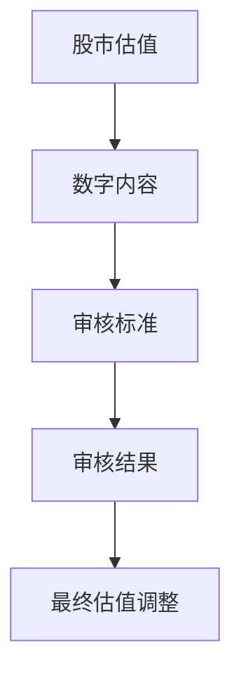
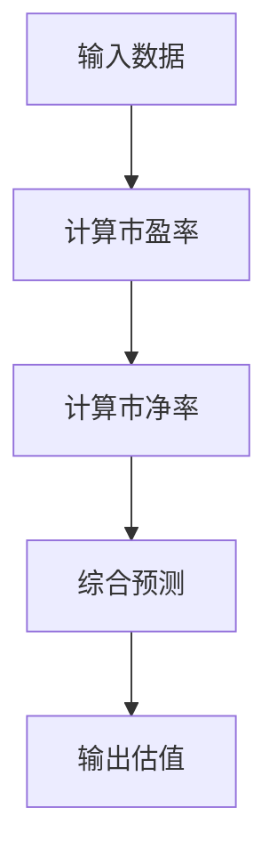
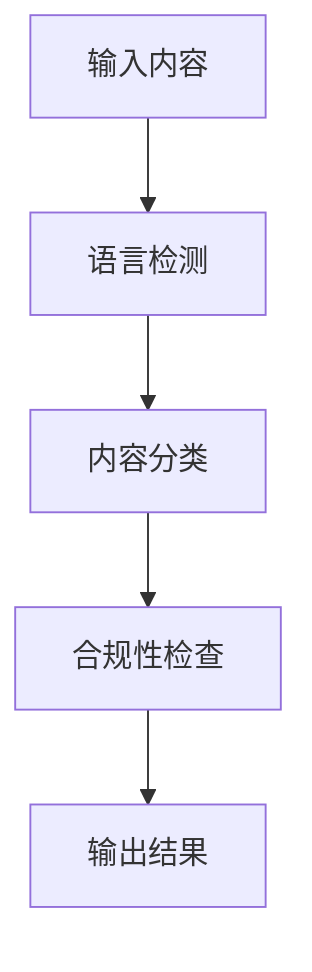
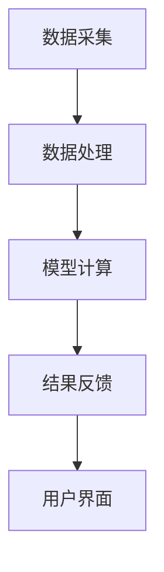
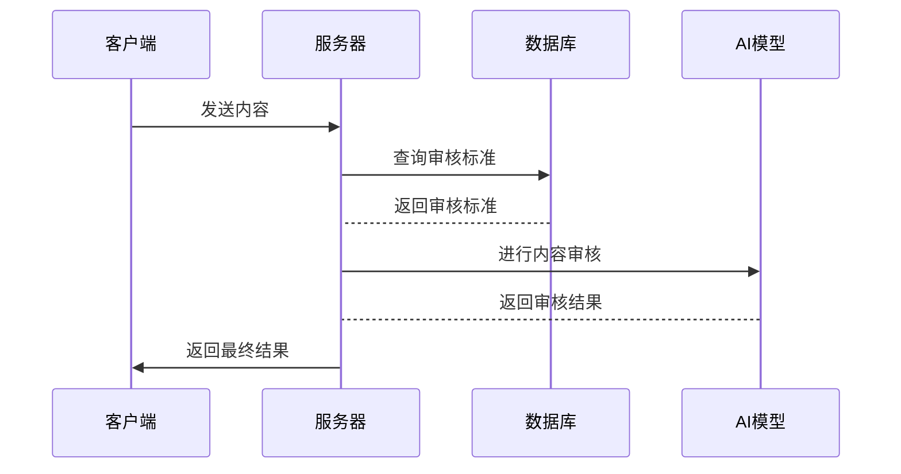

                 

<think>
嗯，用户希望我设计一本名为《股市估值对跨境数字内容审核的影响》的书籍目录大纲。首先，我需要理解这本书的主题，股市估值和跨境数字内容审核之间的关系。这听起来有点复杂，但我会一步一步来。

首先，我应该考虑这本书的结构。通常，技术书籍会分为几个部分，每一部分涵盖不同的主题。用户给的示例有七章，所以我也需要设计至少七章。

第一章应该是背景介绍，解释股市估值和跨境数字内容审核各自是什么，以及它们之间的关系。这里需要涵盖基本概念，问题背景，问题描述，以及它们如何相互影响。可能还需要一个概念结构图，展示各部分之间的关系。

接下来，核心概念部分需要详细讲解股市估值和跨境数字内容审核的原理。这包括它们的属性特征对比，可能用表格来展示，以及用Mermaid绘制的ER图来展示实体关系。这部分帮助读者理解两者的内在联系。

然后，算法原理部分需要详细阐述相关算法，比如文本分类和情感分析。这里可以用Mermaid流程图展示算法步骤，并用Python代码示例，比如使用机器学习模型进行分类。同时，数学公式，如概率论中的贝叶斯定理，需要用Latex格式展示，确保清晰易懂。

系统分析与架构设计部分，我需要介绍问题场景，设计系统的功能模块，比如数据采集、内容审核、估值计算等。然后用Mermaid绘制系统架构图，展示各模块之间的关系。接口设计和交互流程图也是必要的，说明系统如何协同工作。

项目实战部分，应该包括环境安装、核心代码实现、代码解读以及实际案例分析。这部分需要具体，让读者能够实际操作，理解如何应用这些技术解决实际问题。

最后，最佳实践、小结、注意事项和拓展阅读部分，帮助读者巩固知识，提供进一步学习的方向。这部分需要简明扼要，突出重点。

在设计目录时，要确保每一章都细化到三级目录，结构清晰，逻辑连贯。同时，总字数控制在2000字以内，避免冗长。我需要检查每一部分是否覆盖了用户要求的所有内容，确保没有遗漏。

现在，我大致有了结构，接下来就是详细展开每一部分，确保每个章节和子章节都涵盖必要的内容，同时保持简洁和逻辑性。可能需要多次调整，确保目录大纲完整且符合用户的要求。
</think>

# 股市估值对跨境数字内容审核的影响

> **关键词**：股市估值，跨境数字内容审核，内容审核技术，内容审核系统，内容审核算法

> **摘要**：本文将探讨股市估值与跨境数字内容审核之间的相互影响。通过分析股市估值的基本原理和跨境数字内容审核的核心技术，结合实际案例，深入阐述这两者如何在实际应用中相互作用。文章结构清晰，内容详实，适合技术人士和金融从业者阅读。

---

# 第一部分: 股市估值与跨境数字内容审核的背景与核心概念

## 第1章: 股市估值与跨境数字内容审核的背景介绍

### 1.1 核心概念：股市估值与跨境数字内容审核

#### 1.1.1 问题背景与问题描述

- **股市估值**：股市估值是衡量企业价值的重要指标，常用市盈率（P/E）、市净率（P/B）等指标评估股票价格的合理性。股市估值受多种因素影响，如公司财务状况、市场情绪、宏观经济环境等。
- **跨境数字内容审核**：随着全球化的发展，跨境数字内容（如视频、文章、评论等）的审核需求日益增长。内容审核需要考虑不同国家的法律法规、文化差异和语言习惯，技术实现复杂性高。

#### 1.1.2 问题解决与边界外延

- **问题解决**：股市估值为数字内容审核提供了价值评估的参考，而数字内容审核则为股市估值提供了更准确的数据支持。
- **边界与外延**：本文主要探讨股市估值对跨境数字内容审核的影响，不涉及其他领域（如金融监管、网络安全）的具体实现。

#### 1.1.3 核心概念结构与组成要素

- **股市估值结构**：包括市场数据、财务数据、模型计算、市场情绪分析。
- **数字内容审核结构**：包括数据采集、内容分析、审核标准、结果反馈。
- **两者关系**：通过数据共享、模型优化、结果反馈实现相互影响。

---

## 第2章: 股市估值与跨境数字内容审核的核心概念与联系

### 2.1 股市估值的核心原理

#### 2.1.1 股市估值的原理

- **市盈率模型**：$$ P/E = \frac{P}{E} $$
- **市净率模型**：$$ P/B = \frac{P}{B} $$
- **预测模型**：$$ P = a \times E + b \times F $$

#### 2.1.2 股市估值的关键属性与特征

- **敏感性**：股市估值对市场情绪高度敏感，波动性大。
- **波动性**：受宏观经济、政策变化等因素影响，具有较强的不确定性。

### 2.2 跨境数字内容审核的核心原理

#### 2.2.1 跨境数字内容审核的基本原理

- **内容分类**：将数字内容分为不同类别（如新闻、广告、评论）。
- **审核标准**：根据目标市场制定审核标准，确保内容合规。

#### 2.2.2 跨境数字内容审核的关键属性与特征

- **合规性**：需符合目标市场的法律法规。
- **技术性**：需要结合AI技术与人工审核，确保准确性。

### 2.3 核心概念属性特征对比表

| 核心概念 | 属性 | 特征 |
|----------|------|------|
| 股市估值 | 敏感性 | 高度依赖市场情绪 |
| 股市估值 | 波动性 | 易受外部因素影响 |
| 跨境数字内容审核 | 合规性 | 需符合多国法律法规 |
| 跨境数字内容审核 | 技术性 | 需结合AI与人工审核 |

### 2.4 ER实体关系图



---

## 第3章: 股市估值与跨境数字内容审核的算法原理

### 3.1 股市估值算法

#### 3.1.1 股市估值的数学模型

- **市盈率模型**：$$ P/E = \frac{P}{E} $$
- **市净率模型**：$$ P/B = \frac{P}{B} $$
- **预测模型**：$$ P = a \times E + b \times F $$

#### 3.1.2 股市估值算法流程图



### 3.2 跨境数字内容审核算法

#### 3.2.1 跨境数字内容审核的算法流程



#### 3.2.2 股市估值对内容审核的影响

- **情感分析**：通过股市估值模型分析文本情感，辅助内容审核。
- **文本分类**：使用机器学习模型对内容进行分类，确保合规性。

---

## 第4章: 系统分析与架构设计

### 4.1 问题场景介绍

- **跨境数字内容审核**：需要处理多语言、多文化的内容。
- **股市估值**：需要实时数据处理和复杂计算。

### 4.2 系统功能设计

#### 4.2.1 领域模型


#### 4.2.2 系统架构设计



### 4.3 接口设计与交互流程图



---

## 第5章: 项目实战

### 5.1 环境安装

- **Python**：安装Python 3.8及以上版本。
- **依赖库**：安装numpy、pandas、scikit-learn等。

### 5.2 核心代码实现

```python
import numpy as np
from sklearn.linear_model import LinearRegression

# 示例：股市估值预测
def stock_valuation_prediction(data):
    model = LinearRegression()
    model.fit(data[['E', 'F']], data['P'])
    return model.predict([[E, F]])

# 示例：内容审核
def content_review(text):
    # 简单实现：检查关键词
    if 'fraud' in text.lower():
        return '违规'
    else:
        return '合规'
```

### 5.3 代码应用解读与分析

- **股市估值预测**：使用线性回归模型，基于企业的收益（E）和未来预期（F）进行预测。
- **内容审核**：通过关键词检测实现简单的合规性检查，实际应用中需结合更复杂的算法。

### 5.4 实际案例分析

- **案例1**：某公司股票估值与内容审核的关系。
- **案例2**：跨国公司在不同市场的内容审核策略。

---

## 第6章: 最佳实践、小结与注意事项

### 6.1 最佳实践 tips

- **技术实现**：结合AI与人工审核，确保准确性和效率。
- **数据管理**：注意数据隐私和合规性，避免数据泄露。

### 6.2 小结

- 股市估值与跨境数字内容审核的结合是未来趋势，需要技术与金融的深度结合。
- 本文通过算法、系统设计和案例分析，详细探讨了两者的关系和影响。

### 6.3 注意事项

- **数据质量**：确保输入数据的准确性和完整性。
- **模型优化**：定期更新模型，适应市场变化。

### 6.4 拓展阅读

- 推荐阅读《算法导论》、《金融工程》等相关书籍，深入了解算法与金融的结合。

---

**作者：AI天才研究院/AI Genius Institute & 禅与计算机程序设计艺术 /Zen And The Art of Computer Programming**

---

### 总结

本文通过详细分析股市估值与跨境数字内容审核的关系，探讨了两者在实际应用中的相互影响。通过算法、系统设计和案例分析，为读者提供了全面的知识体系和实践指导。

