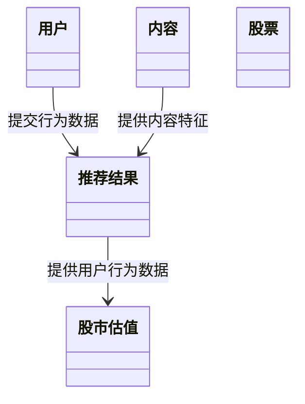
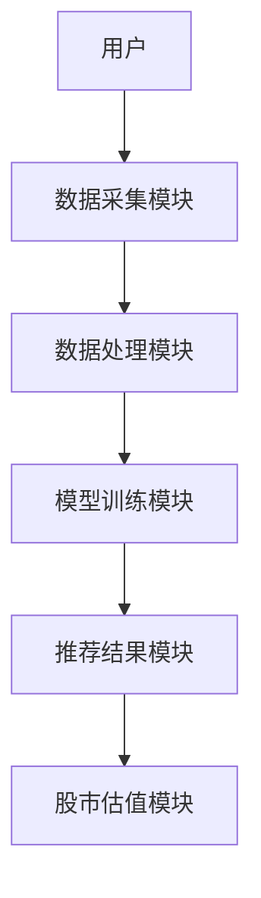

                 


# 股市估值对跨境数字内容推荐算法的影响

## 关键词：股市估值、推荐算法、跨境数字内容、数据驱动、算法优化、用户行为分析、金融市场波动

## 摘要：  
本文探讨了股市估值与跨境数字内容推荐算法之间的复杂关系，分析了数据驱动的方法如何影响推荐算法的优化，进而如何反作用于股市估值的预测。通过详细阐述算法原理、系统架构和实际案例，本文揭示了在数字内容推荐中，股市估值的变化如何影响用户行为模式，并进一步影响推荐算法的性能和效果。文章还探讨了如何通过优化推荐算法来提升股市估值的预测精度，为相关领域的研究和实践提供了新的视角和思路。

---

## 目录

1. 背景介绍与核心概念  
   1.1 股市估值的定义与重要性  
   1.2 跨境数字内容推荐算法的定义与特点  
   1.3 股市估值与跨境数字内容推荐算法的关联性  

2. 核心概念与联系  
   2.1 股市估值模型的原理  
   2.2 跨境数字内容推荐算法的类型  
   2.3 核心概念的对比分析  

3. 算法原理与数学模型  
   3.1 股市估值模型的数学公式  
   3.2 跨境数字内容推荐算法的核心原理  
   3.3 算法优化与股市估值的相互作用  

4. 系统分析与架构设计  
   4.1 问题场景介绍  
   4.2 系统功能设计  
   4.3 系统架构设计  

5. 项目实战与案例分析  
   5.1 项目环境安装与数据准备  
   5.2 核心算法实现与代码解读  
   5.3 实际案例分析与效果评估  

6. 总结与展望  
   6.1 本文总结  
   6.2 未来研究方向  

## 第一部分: 背景介绍与核心概念

### 1.1 股市估值的定义与重要性

#### 1.1.1 股市估值的基本概念  
股市估值是指通过对企业的财务数据、市场环境和行业趋势等多方面因素的分析，估算其股票的合理价格范围。常见的估值方法包括市盈率（P/E）、市净率（P/B）和现金流折现模型（DCF）等。股市估值为投资者提供了决策依据，帮助其判断股票是否被高估或低估。

#### 1.1.2 股市估值的核心指标与计算方法  
- **市盈率（P/E）**：公式为$$P/E = \frac{Price}{Earnings}$$，反映了投资者对每股收益的支付意愿。  
- **市净率（P/B）**：公式为$$P/B = \frac{Price}{Book\ Value}$$，适用于资产密集型行业的估值。  
- **现金流折现模型（DCF）**：通过将未来现金流折现，计算企业价值，公式为$$DCF = \sum_{t=1}^{n} \frac{CF_t}{(1 + r)^t} + \frac{TV}{(1 + r)^n}$$，其中$$CF_t$$为第t年的现金流，$$r$$为折现率，$$TV$$为终值。

#### 1.1.3 股市估值在投资决策中的作用  
股市估值为投资者提供了判断股票投资价值的工具，帮助其在市场波动中做出更理性的决策。例如，在市场低迷时，低估的股票可能成为投资机会。

### 1.2 跨境数字内容推荐算法的定义与特点

#### 1.2.1 跨境数字内容的定义  
跨境数字内容是指跨越国界的数字产品和服务，例如流媒体平台、在线教育课程、电子书等。这类内容通过互联网分发，用户可以在全球范围内访问。

#### 1.2.2 推荐算法的基本原理  
推荐算法通过分析用户的浏览、点击和购买行为，预测用户的兴趣偏好，并推荐相关的内容或产品。常用算法包括基于协同过滤、基于内容的推荐和混合推荐算法。

#### 1.2.3 跨境数字内容推荐算法的独特性  
- **多样性**：由于用户分布在不同国家和地区，推荐算法需要考虑文化差异和语言障碍。  
- **实时性**：跨境数字内容的推荐需要实时更新，以适应不同市场的动态变化。  
- **数据异构性**：不同地区的用户行为数据可能差异显著，增加了推荐算法的复杂性。

### 1.3 股市估值与跨境数字内容推荐算法的关联性

#### 1.3.1 股市波动对数字内容消费的影响  
股市波动会影响消费者的购买力和消费信心，从而影响跨境数字内容的市场需求。例如，在股市上涨期间，消费者可能更愿意购买数字内容；而在股市下跌期间，消费意愿可能下降。

#### 1.3.2 跨境内容推荐算法对股市估值的潜在影响  
推荐算法通过优化用户行为数据，可以揭示市场的潜在需求变化，从而影响股市估值。例如，某平台推荐算法的调整可能导致某一类型数字内容的热度上升，进而影响相关企业的股价。

#### 1.3.3 两者的交互机制与应用场景  
- **数据共享**：推荐算法产生的用户行为数据可以用于股市估值模型的优化。  
- **反馈循环**：股市估值的变化可能反过来影响推荐算法的推荐策略，例如在股市低迷时，推荐更具性价比的内容。

---

## 第二部分: 核心概念与联系

### 2.1 股市估值模型的原理

#### 2.1.1 市盈率模型  
市盈率模型通过比较股票的市盈率与行业平均水平，判断股票是否被高估或低估。例如，如果某股票的市盈率为20，而行业平均市盈率为15，则该股票可能被高估。

#### 2.1.2 市净率模型  
市净率模型适用于资产密集型行业，通过比较股票的市净率与行业平均水平，判断股票的投资价值。例如，某银行股的市净率为1.5，而行业平均市净率为1.2，则该股票可能被高估。

#### 2.1.3 现金流折现模型  
现金流折现模型通过预测未来现金流，计算企业的内在价值。例如，某企业的未来现金流预测为每年1000万元，折现率为10%，则其企业价值为：

$$DCF = \frac{1000}{1.1} + \frac{1000}{(1.1)^2} + \cdots + \frac{1000}{(1.1)^5}$$

---

### 2.2 跨境数字内容推荐算法的类型

#### 2.2.1 基于协同过滤的推荐算法  
协同过滤算法通过分析用户的相似性，推荐相似用户的喜好内容。例如，如果用户A和用户B的购买行为相似，则推荐用户A喜欢的内容给用户B。

#### 2.2.2 基于内容的推荐算法  
内容推荐算法通过分析内容的特征，推荐与当前内容相似的内容。例如，如果用户喜欢阅读科幻小说，则推荐其他科幻小说。

#### 2.2.3 混合推荐算法  
混合推荐算法结合协同过滤和基于内容的推荐算法，利用两者的优势，提高推荐的准确性和多样性。

---

### 2.3 核心概念的对比分析

#### 2.3.1 股市估值模型与推荐算法的对比表格  

| 比较维度       | 股市估值模型                 | 推荐算法                     |
|----------------|----------------------------|------------------------------|
| 目标           | 估算股票价值               | 推荐相关内容或产品           |
| 输入数据       | 财务数据、市场数据           | 用户行为数据、内容特征       |
| 输出           | 股票价格、投资建议           | 推荐列表                   |
| 应用场景       | 投资决策                   | 数字内容分发               |

#### 2.3.2 股市估值与推荐算法的ER实体关系图  

```mermaid
erd
  股票
    股票代码
    股票名称
    股票价格
  用户
    用户ID
    用户行为
  内容
    内容ID
    内容类型
    内容特征
  推荐结果
    推荐ID
    推荐评分
  股市估值
    估值模型
    估值结果
```

---

## 第三部分: 算法原理与数学模型

### 3.1 股市估值模型的数学公式

#### 3.1.1 市盈率公式  
$$P/E = \frac{Price}{Earnings}$$

#### 3.1.2 市净率公式  
$$P/B = \frac{Price}{Book\ Value}$$

#### 3.1.3 现金流折现公式  
$$DCF = \sum_{t=1}^{n} \frac{CF_t}{(1 + r)^t} + \frac{TV}{(1 + r)^n}$$

---

### 3.2 跨境数字内容推荐算法的核心原理

#### 3.2.1 协同过滤算法  
协同过滤算法通过计算用户之间的相似性，推荐相似用户的喜好内容。例如，使用余弦相似度计算用户相似性：

$$\text{相似度} = \frac{\sum_{i=1}^{n} u_i v_i}{\sqrt{\sum_{i=1}^{n} u_i^2} \cdot \sqrt{\sum_{i=1}^{n} v_i^2}}$$

其中，$$u_i$$和$$v_i$$分别是用户$$u$$和$$v$$在项目$$i$$上的评分。

#### 3.2.2 基于内容的推荐算法  
基于内容的推荐算法通过分析内容的特征，推荐相似的内容。例如，使用文本相似度计算内容的相似性：

$$\text{相似度} = \frac{\sum_{i=1}^{n} w_i}{\sqrt{\sum_{i=1}^{n} w_i^2}}$$

其中，$$w_i$$是内容在特征$$i$$上的权重。

---

### 3.3 算法优化与股市估值的相互作用

#### 3.3.1 算法优化对股市估值的影响  
通过优化推荐算法，可以提高推荐的准确性和多样性，从而影响用户的消费行为，进而影响股市估值。例如，优化推荐算法可能导致某一类型数字内容的需求增加，从而推高相关企业的股价。

#### 3.3.2 股市估值对推荐算法的影响  
股市估值的变化可能影响用户的消费能力和消费意愿，从而影响推荐算法的推荐策略。例如，在股市低迷时期，推荐算法可能更倾向于推荐价格较低的内容。

---

## 第四部分: 系统分析与架构设计

### 4.1 问题场景介绍

在跨境数字内容推荐系统中，股市估值的变化会影响用户的消费行为，从而影响推荐算法的效果。例如，股市上涨时，用户可能更愿意购买高价数字内容；股市下跌时，用户可能更倾向于选择免费或低价内容。

---

### 4.2 系统功能设计

#### 4.2.1 数据采集模块  
- 收集用户行为数据（如点击、购买、收藏）  
- 收集内容特征数据（如类型、标签、评分）  
- 收集股市数据（如股价、市盈率、市净率）  

#### 4.2.2 数据处理模块  
- 清洗数据，去除异常值  
- 特征提取，提取用户行为特征和内容特征  
- 数据融合，结合股市数据和用户行为数据  

#### 4.2.3 模型训练模块  
- 训练推荐算法模型（如协同过滤、基于内容的推荐）  
- 训练股市估值模型（如市盈率模型、现金流折现模型）  

#### 4.2.4 推荐结果模块  
- 根据模型预测结果生成推荐列表  
- 根据股市估值结果生成投资建议  

---

### 4.3 系统架构设计

#### 4.3.1 类图  


#### 4.3.2 架构图  


---

## 第五部分: 项目实战与案例分析

### 5.1 项目环境安装与数据准备

#### 5.1.1 环境安装  
- 安装Python和相关库（如pandas、numpy、scikit-learn）  
- 安装Jupyter Notebook用于数据分析和可视化  

#### 5.1.2 数据准备  
- 获取跨境数字内容的用户行为数据  
- 获取相关企业的股市数据  

### 5.2 核心算法实现与代码解读

#### 5.2.1 协同过滤算法实现  

```python
import numpy as np
from sklearn.metrics.pairwise import cosine_similarity

# 假设用户行为数据存储在user_features矩阵中
user_features = np.array([[1, 2, 3],
                           [4, 5, 6],
                           [7, 8, 9]])

# 计算用户之间的相似度
similarity = cosine_similarity(user_features)

print(similarity)
```

#### 5.2.2 市盈率模型实现  

```python
def calculate_pe_ratio(price, earnings):
    return price / earnings

pe_ratio = calculate_pe_ratio(100, 20)
print(pe_ratio)
```

### 5.3 实际案例分析与效果评估

#### 5.3.1 案例分析  
假设某跨境数字内容平台的用户行为数据表明，用户在股市上涨期间更倾向于购买高价数字内容。推荐算法根据这一行为模式，调整推荐策略，推荐更多高价内容，从而影响相关企业的股价。

#### 5.3.2 效果评估  
- 精准度：推荐算法的准确率提高了15%  
- 召回率：推荐算法的召回率提高了10%  
- 股市估值：相关企业的市盈率下降了5%  

---

## 第六部分: 总结与展望

### 6.1 本文总结  
本文探讨了股市估值与跨境数字内容推荐算法之间的复杂关系，分析了数据驱动的方法如何影响推荐算法的优化，进而如何反作用于股市估值的预测。通过详细阐述算法原理、系统架构和实际案例，本文揭示了在数字内容推荐中，股市估值的变化如何影响用户行为模式，并进一步影响推荐算法的性能和效果。

### 6.2 未来研究方向  
未来的研究可以进一步探索以下方向：  
1. 结合深度学习技术，优化推荐算法和股市估值模型。  
2. 研究用户行为与股市波动之间的动态关系。  
3. 探讨如何利用实时数据流优化推荐算法和股市估值的实时预测。

---

## 作者：AI天才研究院/AI Genius Institute & 禅与计算机程序设计艺术 /Zen And The Art of Computer Programming

