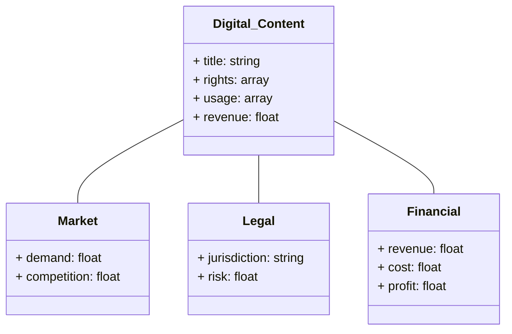
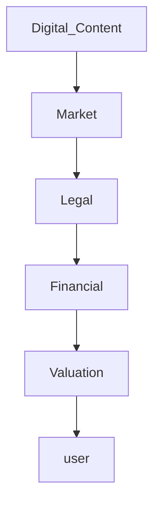
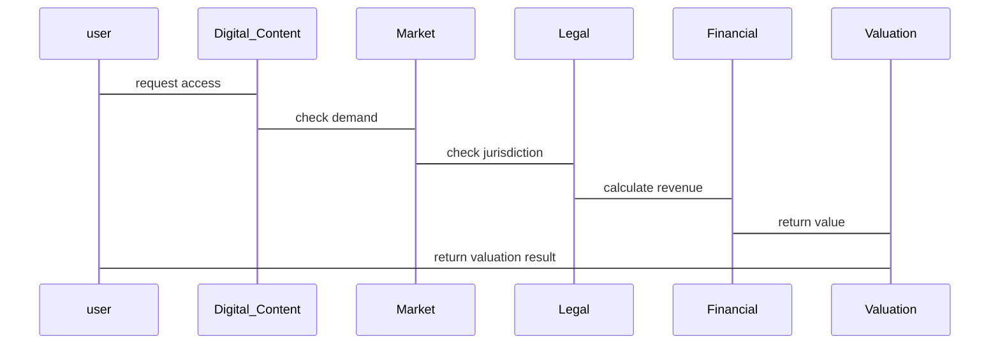

                 

# 股市估值对跨境数字内容版权估值的影响

## 关键词：股市估值、数字内容版权、跨境版权、版权估值、经济模型

## 摘要：本文深入探讨了股市估值方法在数字内容版权评估中的应用，分析了数字版权的无形资产特性、跨境流通特性，以及市场需求、技术风险、法律环境等关键因素对估值的影响。通过构建资产定价模型、期权定价模型和收益分成模型，提出了数字内容版权的综合估值方法。文章还结合实际案例，展示了如何在跨国企业中应用这些模型进行版权估值。

---

## 第1章 股市估值与数字内容版权的背景与基础

### 1.1 股市估值的基本概念

#### 1.1.1 股市估值的定义与作用
股市估值是通过对企业的财务指标、市场表现和行业前景等多方面因素的分析，估算公司股票的内在价值。其作用在于帮助投资者做出合理的投资决策，避免盲目跟风。

#### 1.1.2 数字内容版权的基本概念
数字内容版权是指对数字化作品（如音乐、视频、软件、电子书等）的所有权。其特性包括无形性、可复制性和跨境流通性，这些特性使得其估值具有特殊性。

#### 1.1.3 股市估值与数字内容版权的关系
股市估值方法为数字内容版权提供了参考框架，尤其是在企业持有大量数字版权资产的情况下，如何将这些资产的价值反映到公司整体估值中，成为关键问题。

---

### 1.2 股市估值的核心方法

#### 1.2.1 市盈率法
市盈率（P/E）= 股价 / 每股收益。适用于盈利稳定的企业，但对高增长或亏损企业参考性较弱。

#### 1.2.2 市净率法
市净率（P/B）= 股价 / 每股净资产。适用于资产-heavy的企业，但对无形资产为主的数字版权企业参考性有限。

#### 1.2.3 现金流折现法
DCF模型通过将未来现金流折现至现值，估算企业整体价值。适用于具有稳定现金流的数字版权企业。

---

### 1.3 数字内容版权的特性

#### 1.3.1 数字内容的无形性
数字内容是无形资产，其价值难以通过物理形态直接衡量，但可以通过市场表现和用户行为间接评估。

#### 1.3.2 数字内容的可复制性
数字内容易于复制和传播，这可能导致盗版问题，但也为版权估值带来了新的挑战和机会。

#### 1.3.3 数字内容的跨境流通性
数字内容可以快速在全球范围内流通，这使得跨境版权交易成为可能，但也带来了复杂的法律和税务问题。

---

## 第2章 数字内容版权的经济与金融理论基础

### 2.1 资产定价理论

#### 2.1.1 资产定价模型（CAPM）
CAPM公式为：
$$ R_i = R_f + β_i (R_m - R_f) $$
其中，$R_i$为资产的预期收益率，$R_f$为无风险利率，$β_i$为资产的贝塔系数，$R_m$为市场预期收益率。

对于数字内容版权，$β_i$可以反映其在市场中的波动性和系统性风险。

#### 2.1.2 股权资本定价模型
数字内容版权可以通过股权激励机制与企业价值绑定，员工持股计划（ESOP）和股票期权计划是常见的激励工具。

#### 2.1.3 数字版权的资产属性分析
数字版权具有低边际成本和高杠杆效应，这使其在资产定价中表现出独特的特性。

---

### 2.2 期权定价理论

#### 2.2.1 Black-Scholes模型
Black-Scholes公式为：
$$ C = S_0 N(d_1) - K e^{-rT} N(d_2) $$
其中，$S_0$为标的资产价格，$K$为行权价，$r$为无风险利率，$T$为到期时间，$N(d)$为标准正态分布的累积概率函数。

数字版权的期权特性体现在其未来的潜在收益和风险上。

#### 2.2.2 数字版权的期权特性
数字版权的估值可以看作一种看涨期权，其价值取决于市场需求和版权持有者的行权能力。

#### 2.2.3 期权定价与数字版权估值的关系
通过期权定价模型，可以将数字版权的未来收益折现为当前价值，从而实现对版权的合理估值。

---

### 2.3 股权激励与员工持股计划

#### 2.3.1 股权激励的基本原理
通过股权激励，企业可以将员工利益与企业价值绑定，激励员工创造更多价值。

#### 2.3.2 股权激励对版权估值的影响
股权激励机制可以提升员工对版权资产的保护意识，从而间接提升版权的价值。

#### 2.3.3 员工持股计划与版权价值的关联
员工持股计划（ESOP）可以通过员工对企业的投资，间接反映数字版权的市场价值。

---

## 第3章 数字内容版权的估值模型与方法

### 3.1 传统估值方法的适用性分析

#### 3.1.1 市盈率法的优缺点
优点：简单易用，适用于盈利稳定的数字内容企业；缺点：不适用于亏损或高增长企业。

#### 3.1.2 市净率法的优缺点
优点：适用于资产-heavy的企业；缺点：不适用于无形资产为主的数字版权企业。

#### 3.1.3 现金流折现法的优缺点
优点：考虑了未来现金流的现值；缺点：依赖于对未来现金流的准确预测。

---

### 3.2 数字内容版权的特殊估值方法

#### 3.2.1 数字版权的收益分成模型
收益分成模型将版权的价值与实际收入分成比例相关联，公式为：
$$ V = R \times \alpha $$
其中，$V$为版权价值，$R$为收入，$\alpha$为分成比例。

#### 3.2.2 数字版权的市场参与模型
市场参与模型通过分析市场参与者的博弈行为，估算版权的均衡价值。

#### 3.2.3 数字版权的用户价值模型
用户价值模型将用户对版权的使用价值转化为市场价值，公式为：
$$ V = U \times N $$
其中，$V$为价值，$U$为单个用户的使用价值，$N$为用户数量。

---

### 3.3 综合估值模型的设计与应用

综合估值模型结合了资产定价理论、期权定价理论和收益分成模型，公式为：
$$ V = \alpha R + \beta S_0 + \gamma C $$
其中，$\alpha$、$\beta$、$\gamma$为模型参数，$R$为收入，$S_0$为标的资产价格，$C$为期权价值。

---

## 第4章 项目实战：数字内容版权估值的系统分析与设计

### 4.1 系统功能设计（领域模型）

---

### 4.2 系统架构设计

---

### 4.3 系统接口设计与交互

---

## 第5章 总结与展望

### 5.1 核心结论
数字内容版权的估值需要综合考虑市场需求、技术风险、法律环境和企业财务表现等多方面因素，通过资产定价模型、期权定价模型和收益分成模型的综合应用，可以实现对数字版权的合理估值。

### 5.2 未来研究方向
1. 探索AI技术在数字版权估值中的应用。
2. 研究区块链技术对数字版权保护和估值的影响。
3. 进一步完善跨境数字内容版权的估值模型。

### 5.3 最佳实践 tips
1. 在进行数字版权估值时，建议结合企业的实际财务数据和市场环境。
2. 注意法律和税务问题，避免因跨境交易引发的法律纠纷。
3. 定期更新估值模型，以适应市场变化和技术进步。

---

## 作者：AI天才研究院/AI Genius Institute & 禅与计算机程序设计艺术/Zen And The Art of Computer Programming

---

本文通过对数字内容版权的特性分析和经济金融理论的应用，提出了综合估值模型，并结合实际案例进行了详细分析。希望本文能为读者在数字内容版权的估值实践中提供有价值的参考和启示。

