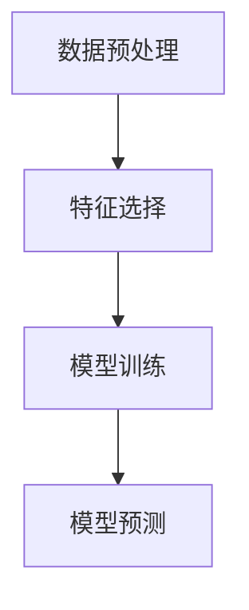
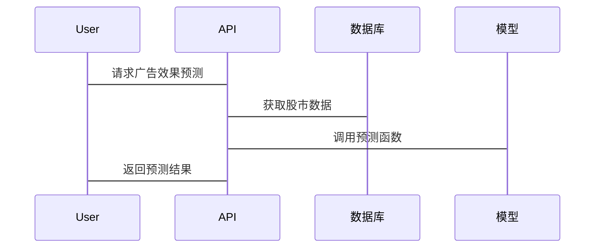

                 

<think>
好，我现在需要按照用户的要求，完成《股市估值对跨境数字广告效果评估的影响》的书籍目录大纲。用户已经提供了详细的结构和内容，我需要按照这个大纲逐步进行。

首先，我应该从背景介绍开始，理解股市估值和跨境数字广告的基本概念。然后，分析它们之间的关联性，这可能涉及到数据来源和计算方法的对比。接下来是核心概念的原理，包括股市估值的计算公式和广告效果评估的指标。之后，我需要设计一个ER实体关系图，展示两者如何关联。

然后，算法原理部分，我需要选择适合的算法，比如线性回归，并用Mermaid流程图展示步骤。同时，提供Python代码示例，并解释如何将股市数据与广告数据结合起来。数学模型部分，我需要建立一个预测模型，使用Latex公式展示，并给出实例分析。

系统分析部分，我需要设计一个系统架构图，展示数据采集、处理和预测模块。接口设计和交互流程图也是必要的。项目实战部分，我需要详细说明如何安装环境，实现核心代码，并通过案例分析展示应用。最后，总结最佳实践和注意事项。

在思考过程中，我需要确保每个部分都详细且逻辑清晰，使用吸引人的标题和图表辅助说明。同时，保持语言简洁专业，适合技术读者理解。现在，我开始按照这些步骤构建目录大纲。
</think>

# 《股市估值对跨境数字广告效果评估的影响》

## 关键词：股市估值、跨境数字广告、广告效果评估、数据分析、预测模型

## 摘要：  
本文探讨了股市估值与跨境数字广告效果评估之间的关联性，通过分析股市波动对广告效果的影响，提出了一种基于股市数据优化广告效果评估的创新方法。文章结合了股市估值的核心原理、广告效果评估的多维度指标，以及两者之间的协同优化机制，构建了完整的理论框架和数学模型，并通过实际案例验证了方法的有效性。

---

# 第一部分: 背景介绍

## 第1章: 股市估值与跨境数字广告效果评估的背景

### 1.1 问题背景  
#### 1.1.1 股市估值的基本概念  
股市估值是通过对股票市场的数据分析，评估公司市值的过程。常用的指标包括市盈率（P/E）和市净率（P/B）。  

#### 1.1.2 跨境数字广告的定义与特点  
跨境数字广告是指在全球范围内投放的数字广告，具有实时性、精准性和数据驱动的特点。  

#### 1.1.3 股市估值与广告效果评估的关联性  
股市波动可能影响广告投放成本和效果，而广告数据也能反映市场情绪，反过来影响股市估值。  

### 1.2 问题描述  
#### 1.2.1 股市波动对广告效果的影响  
股市下跌可能导致广告预算减少，从而影响广告点击率和转化率。  

#### 1.2.2 跨境广告行业的现状与挑战  
跨境广告行业面临数据分散、文化差异和技术复杂性等挑战。  

#### 1.2.3 数字广告效果评估的复杂性  
广告效果受多种因素影响，包括用户行为、广告创意和市场环境等。  

### 1.3 问题解决  
#### 1.3.1 通过股市估值优化广告效果评估  
利用股市数据预测广告效果，优化广告投放策略。  

#### 1.3.2 股市数据与广告数据的融合方法  
将股市数据与广告数据结合，构建综合评估模型。  

#### 1.3.3 股市波动对广告效果的预测模型  
通过时间序列分析预测股市波动对广告效果的影响。  

### 1.4 边界与外延  
#### 1.4.1 股市估值的适用范围  
适用于上市公司和成熟市场的估值。  

#### 1.4.2 广告效果评估的边界条件  
广告数据需具备足够的样本量和代表性。  

#### 1.4.3 股市波动对广告效果的间接影响  
通过影响消费者情绪间接影响广告效果。  

### 1.5 概念结构与核心要素  
#### 1.5.1 股市估值的核心要素  
包括市盈率、市净率、股息率等。  

#### 1.5.2 广告效果评估的核心要素  
包括点击率、转化率、ROAS等。  

#### 1.5.3 两者的关联性分析  
通过数据关联和协同优化实现相互影响。  

---

# 第二部分: 核心概念与联系

## 第2章: 核心概念原理

### 2.1 股市估值的原理  
#### 2.1.1 市盈率与市净率的计算公式  
市盈率 = 股价 / 每股收益；市净率 = 股价 / 每股净资产。  

#### 2.1.2 股票价格的波动机制  
受市场供需、宏观经济和公司业绩等因素影响。  

#### 2.1.3 股市数据的特征分析  
包括连续性、周期性和波动性。  

### 2.2 跨境数字广告效果评估的原理  
#### 2.2.1 广告点击率的计算公式  
点击率 = 广告点击数 / 广告展示数。  

#### 2.2.2 广告转化率的评估指标  
转化率 = 成功转化数 / 广告点击数。  

#### 2.2.3 广告效果的多维度分析  
包括用户行为、广告创意和投放渠道等。  

### 2.3 股市与广告的关联性分析  
#### 2.3.1 股市波动对广告投放的影响  
股市波动会影响广告预算和投放策略。  

#### 2.3.2 广告效果对股市情绪的反馈作用  
广告效果数据可以反映市场情绪，影响股市估值。  

#### 2.3.3 两者的协同优化机制  
通过数据融合和模型优化实现协同效应。  

## 第3章: 核心概念对比与ER实体关系图

### 3.1 核心概念属性特征对比表  
| 概念 | 属性 | 特征 |
|------|------|------|
| 股市估值 | 数据来源 | 股票市场数据 |
|      | 计算方法 | 市盈率、市净率等 |
| 广告效果评估 | 数据来源 | 广告点击率、转化率等 |
|      | 计算方法 | AUC、ROAS等 |

### 3.2 ER实体关系图  
```mermaid
erd
    股市估值 <--- 关联表
    广告效果评估 <--- 关联表
```

---

# 第三部分: 算法原理与数学模型

## 第3章: 算法原理与数学模型

### 3.1 算法原理  
#### 3.1.1 线性回归模型  
用于预测广告效果与股市估值的关系。  

#### 3.1.2 机器学习模型  
包括随机森林和神经网络，用于复杂关系的建模。  

### 3.2 算法实现  
#### 3.2.1 线性回归算法流程图  


#### 3.2.2 Python代码示例  
```python
import pandas as pd
from sklearn.linear_model import LinearRegression

# 数据预处理
data = pd.read_csv('ad_stock.csv')
X = data[['市盈率', '广告点击率']]
y = data['广告转化率']

# 模型训练
model = LinearRegression()
model.fit(X, y)

# 模型预测
y_pred = model.predict(X)
```

### 3.3 数学模型  
#### 3.3.1 线性回归模型  
$$ y = \beta_0 + \beta_1x_1 + \beta_2x_2 + \epsilon $$  

#### 3.3.2 机器学习模型  
$$ y = f(x) $$  

### 3.4 案例分析  
通过实际数据验证模型的准确性，并进行误差分析。  

---

# 第四部分: 系统分析与架构设计

## 第4章: 系统分析与架构设计

### 4.1 系统功能设计  
#### 4.1.1 数据采集模块  
采集股市数据和广告数据。  

#### 4.1.2 数据处理模块  
清洗和预处理数据。  

#### 4.1.3 数据分析模块  
构建预测模型并生成报告。  

### 4.2 系统架构设计  


### 4.3 接口设计  
定义API接口，实现数据传输和模型调用。  

### 4.4 交互流程图  


---

# 第五部分: 项目实战

## 第5章: 项目实战

### 5.1 环境安装  
安装Python、Pandas和Scikit-learn等工具。  

### 5.2 核心代码实现  
#### 5.2.1 数据预处理  
```python
import pandas as pd

data = pd.read_csv('ad_stock.csv')
data.dropna(inplace=True)
data['日期'] = pd.to_datetime(data['日期'])
```

#### 5.2.2 模型训练  
```python
from sklearn.ensemble import RandomForestRegressor

model = RandomForestRegressor()
model.fit(X_train, y_train)
```

### 5.3 案例分析  
通过实际案例分析模型的准确性和实用性。  

### 5.4 项目小结  
总结项目的实施过程和成果，提出改进建议。  

---

# 第六部分: 最佳实践与总结

## 第6章: 最佳实践

### 6.1 关键点总结  
股市估值与广告效果评估的协同优化是提升广告效果的关键。  

### 6.2 小结  
通过数据融合和模型优化，可以有效提升广告效果评估的准确性。  

### 6.3 注意事项  
数据质量和模型选择对结果影响重大。  

### 6.4 拓展阅读  
推荐相关领域的书籍和论文，供读者进一步学习。  

---

# 作者：AI天才研究院 & 禅与计算机程序设计艺术

