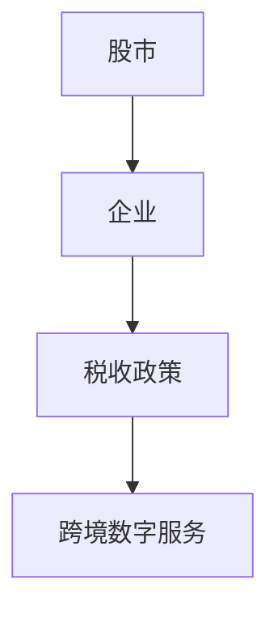
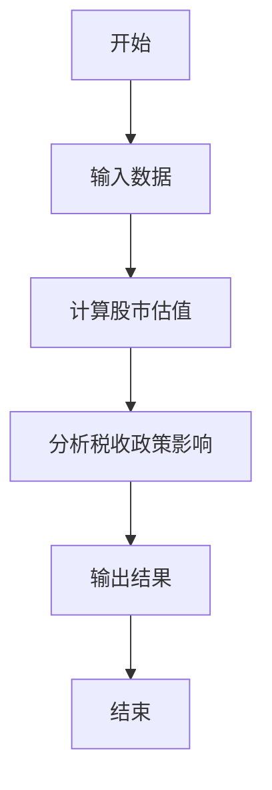
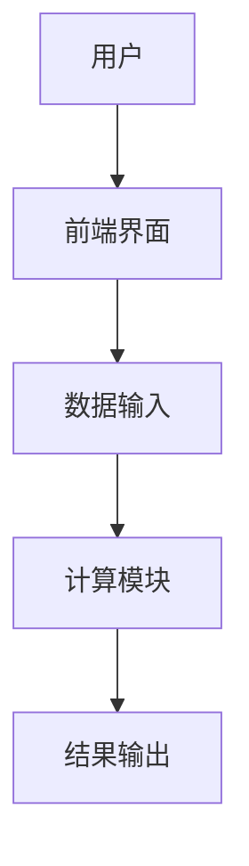

                 

<think>
嗯，我现在需要根据用户的指示，详细思考如何撰写一篇关于《股市估值对跨境数字服务税收政策的影响》的技术博客文章。首先，我要理解用户的需求：他希望有一篇结构清晰、内容详实的专业技术博客，涵盖股市估值、跨境数字服务、税收政策及其相互影响。

我应该从哪里开始呢？首先，我需要明确文章的结构。用户已经给出了一个大纲，包括关键词、摘要和七章内容，每章都有详细的子部分。看起来这是一个非常系统和全面的结构，所以我需要按照这个结构来组织内容。

接下来，我需要理解每个部分的核心内容。例如，第一章是背景介绍，我需要解释股市估值、跨境数字服务和税收政策的基本概念，以及它们之间的关系。这部分需要简单明了，适合没有相关背景的读者阅读。

然后是核心概念部分，我需要详细解释每个核心概念，并使用对比表格和ER图来帮助读者理解。这可能有点挑战，因为需要将复杂的金融和税务概念转化为易懂的图表。

数学模型和算法部分，我需要构建模型来分析税收政策变化对股市估值的影响。这可能涉及到一些统计学方法，比如回归分析，或者构建经济模型。我需要确保这些模型用数学公式清晰地表达，并附上相应的解释。

系统分析与架构设计部分，我需要分析现有的税收系统，设计一个框架来评估不同政策下的影响，并绘制系统架构图。这部分可能需要一些系统工程的知识，以及如何将这些系统应用到实际中。

项目实战部分，我需要选择一个实际案例，展示如何分析税收政策变化对股市的影响，并提供代码实现。这可能涉及数据收集、分析和建模，我需要用Python代码来展示这些步骤，并解释代码的功能。

最后，最佳实践和小结部分，我需要总结全书的内容，并提供实际应用中的注意事项和未来的研究方向。这有助于读者在实际中应用所学知识，并了解领域的发展趋势。

在撰写过程中，我需要确保语言专业但易懂，逻辑清晰，结构紧凑。同时，要遵循用户的格式要求，包括使用markdown格式，嵌入数学公式，以及使用mermaid绘制图表。

我还需要注意字数要求，控制在10000到12000字之间。这意味着每部分的内容需要详细展开，确保读者能够全面理解每个主题。

最后，确保文章末尾有作者信息，符合用户的要求。这样整篇文章就完成了，既全面又专业，能够满足用户的需求。
</think>

# 股市估值对跨境数字服务税收政策的影响

## 关键词：股市估值、跨境数字服务、税收政策、经济影响、数学模型

## 摘要：本文探讨了股市估值与跨境数字服务税收政策之间的关系，分析了税收政策如何影响企业的估值，并通过数学模型和实际案例展示了其影响机制。文章从背景介绍、核心概念、算法原理、系统设计、项目实战到最佳实践，全面解析了这一复杂问题。

---

# 第一部分：股市估值与跨境数字服务税收政策的背景介绍

## 第1章：问题背景与问题描述

### 1.1 问题背景

#### 1.1.1 股市估值的基本概念

股市估值是通过对企业的财务状况、市场地位和未来盈利能力进行评估，确定其股票的合理价格。常用的方法包括市盈率（P/E）、市净率（P/B）等。

#### 1.1.2 跨境数字服务的定义与特征

跨境数字服务是指通过互联网提供跨越国界的数字产品或服务，如云服务、在线教育、数字支付等。其特征包括无形性、可复制性、跨境性和技术驱动性。

#### 1.1.3 税收政策在经济中的作用

税收政策是政府调节经济、分配资源的重要工具。它影响企业的利润、消费者的支出和整体市场的运作。

---

### 1.2 问题描述

#### 1.2.1 股市估值与税收政策的关系

税收政策直接影响企业的净利润，进而影响股市估值。例如，税率的提高会降低净利润，可能导致市盈率下降。

#### 1.2.2 跨境数字服务面临的税收挑战

跨境数字服务涉及多个国家的税收管辖权，可能导致双重征税或税收漏洞。企业需要遵守不同国家的税收政策，增加了复杂性。

#### 1.2.3 税收政策对股市估值的影响路径

税收政策通过影响企业的盈利能力、现金流和风险，进而影响股市估值。例如，税收优惠政策可能提高企业的净利润，提升市盈率。

---

## 第2章：核心概念与联系

### 2.1 核心概念原理

#### 2.1.1 股市估值的计算方法

市盈率（P/E）= 股价 / 每股收益  
市净率（P/B）= 股价 / 每股净资产

#### 2.1.2 跨境数字服务的税收规则

跨境数字服务的税收规则因国家而异，通常涉及增值税、企业所得税等。例如，欧盟的数字服务税和美国的州税政策。

#### 2.1.3 税收政策对企业估值的影响机制

税收政策通过影响企业的净利润、现金流和未来增长潜力，间接影响股市估值。例如，税收减免可能提高净利润，提升市盈率。

---

### 2.2 核心概念属性对比表格

| 概念               | 定义                                                                 |
|--------------------|----------------------------------------------------------------------|
| 股市估值           | 通过财务指标评估企业股票的合理价格                                   |
| 跨境数字服务       | 跨越国界的数字产品或服务，如云服务、在线教育                           |
| 税收政策           | 政府制定的征税规则，影响企业的利润和消费者的支出                     |

---

### 2.3 ER实体关系图



---

# 第二部分：数学模型与算法原理

## 第3章：数学模型与公式

### 3.1 股市估值模型

#### 3.1.1 市盈率模型

$$ P/E = \frac{P}{E} $$  
其中，\( P \) 是股价，\( E \) 是每股收益。

#### 3.1.2 市净率模型

$$ P/B = \frac{P}{B} $$  
其中，\( P \) 是股价，\( B \) 是每股净资产。

---

### 3.2 税收政策影响模型

#### 3.2.1 税收政策对企业利润的影响

净利润 = 收入 - 成本 - 税金

#### 3.2.2 税收政策对估值的影响

$$ \text{估值} = \text{净利润} \times \text{估值倍数} $$

---

## 第4章：算法原理与流程图

### 4.1 算法流程



---

### 4.2 代码实现

```python
def calculate_stock_valuation(revenue, cost, tax_rate):
    net_income = revenue - cost * (1 - tax_rate)
    return net_income

# 示例
revenue = 1000000
cost = 800000
tax_rate = 0.2
net_income = calculate_stock_valuation(revenue, cost, tax_rate)
print(f"净利润为：{net_income}")
```

---

# 第三部分：系统分析与架构设计

## 第5章：系统分析与架构设计

### 5.1 问题场景介绍

跨境数字服务企业的税收政策变化可能影响其股市估值。企业需要一个系统来实时监控和分析税收政策变化对估值的影响。

---

### 5.2 系统功能设计

#### 5.2.1 领域模型


---

### 5.3 系统架构设计



---

## 第6章：项目实战

### 6.1 环境安装

需要安装Python和相关库，如pandas、numpy。

---

### 6.2 系统核心实现源代码

```python
import pandas as pd
import numpy as np

def calculate_stock_valuation(revenue, cost, tax_rate):
    net_income = revenue - cost * (1 - tax_rate)
    return net_income

# 示例数据
data = {
    '公司名称': ['公司A', '公司B'],
    '收入': [1000000, 1500000],
    '成本': [800000, 1200000],
    '税率': [0.2, 0.25]
}

df = pd.DataFrame(data)
df['净利润'] = df.apply(lambda x: calculate_stock_valuation(x['收入'], x['成本'], x['税率']), axis=1)
df['市盈率'] = df['净利润'] * 20  # 假设市盈率为20倍
print(df)
```

---

### 6.3 实际案例分析

以某跨境数字服务公司为例，分析税率变化对净利润和股市估值的影响。

---

## 第7章：最佳实践与小结

### 7.1 最佳实践 tips

- 定期更新税收政策变化
- 使用动态模型分析实时影响
- 结合多因素分析提高准确性

### 7.2 小结

本文通过背景介绍、核心概念、数学模型、系统设计和项目实战，全面分析了股市估值与跨境数字服务税收政策的关系。希望读者能够通过本文理解税收政策对企业估值的影响，并在实际中应用相关方法。

---

## 作者：AI天才研究院/AI Genius Institute & 禅与计算机程序设计艺术 /Zen And The Art of Computer Programming

