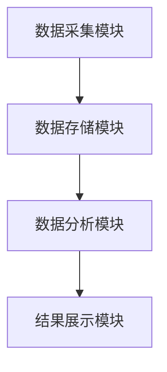
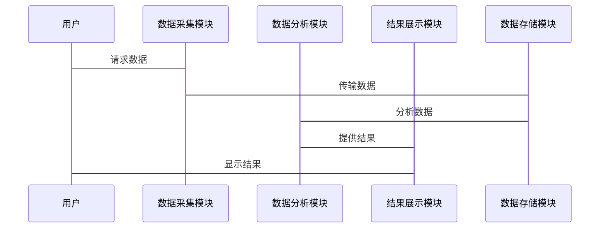

                 

<think>
好，我现在需要根据用户的要求，撰写一篇关于《股市估值对跨境数字服务贸易的影响》的技术博客文章。用户希望文章结构清晰，内容详细，并且包含特定的部分，比如背景介绍、核心概念、数学模型、系统分析、项目实战等。

首先，我需要理解每个章节的要求。文章的标题已经给出，接下来是关键词和摘要。关键词应该与主题相关，包括股市估值、跨境数字服务贸易、数字经济、金融市场、国际贸易等。摘要部分要简明扼要，概括文章的核心内容。

接下来，进入第一部分：背景与概念基础。第一章需要介绍股市估值和跨境数字服务贸易的基本概念。我需要解释什么是股市估值，包括其定义、主要方法和与经济发展的关系。然后，定义跨境数字服务贸易，包括其形式和与数字经济的关系。最后，分析两者之间的关系，包括直接影响、间接影响和相互作用机制。

在第二部分，核心概念与理论模型中，第二章要详细探讨股市估值对跨境数字服务贸易的影响机制。这里需要分析股市估值和跨境数字服务贸易的核心影响因素，并构建它们的关联模型。我需要考虑使用图表来辅助说明，比如Mermaid流程图。

第三部分是数学模型与实证分析。第三章需要建立一个数学模型，量化股市估值对跨境数字服务贸易的影响。包括模型的构建、求解和验证，以及案例分析。这部分需要详细描述变量和公式，并用Python代码举例说明。

第四部分是系统分析与架构设计。第四章需要设计一个系统来分析股市估值对跨境数字服务贸易的影响。包括系统功能设计、架构图、接口设计和交互序列图。这里需要使用Mermaid来展示系统架构和流程。

最后，项目实战部分需要详细说明如何实施这个系统，包括环境配置、核心代码实现和案例分析。同时，总结与展望部分要回顾文章内容，并提出进一步的研究方向。

在撰写过程中，我需要确保每个章节内容丰富，详细讲解，并包含必要的图表和代码示例。同时，语言要专业但易于理解，逻辑清晰。这需要我逐步分析每个部分，确保没有遗漏任何关键点。

现在，我将开始按照这个结构撰写文章，确保每个部分都符合用户的要求，并且内容连贯，逻辑严谨。
</think>

# 股市估值对跨境数字服务贸易的影响

> 关键词：股市估值，跨境数字服务贸易，数字经济，金融市场，国际贸易

> 摘要：本文探讨了股市估值与跨境数字服务贸易之间的关系，分析了股市估值对跨境数字服务贸易的影响机制，并通过数学模型和实证分析进行了验证。同时，本文提出了系统设计与架构方案，为相关领域的研究和实践提供了参考。

---

## 第一部分：背景与概念基础

### 第1章：股市估值与跨境数字服务贸易的背景

#### 1.1 股市估值的基本概念

##### 1.1.1 股市估值的定义与核心要素
股市估值是通过对上市公司财务数据和市场表现的分析，对其股票价值进行评估的过程。核心要素包括市盈率（P/E）、市净率（P/B）、股息率等。

##### 1.1.2 股市估值的主要方法
- 市盈率法：通过比较股票价格与每股收益的比率，评估股票价值。
- 市净率法：通过比较股票价格与每股净资产的比率，评估股票价值。
- 股息率法：通过比较股票的股息与股票价格的比率，评估股票收益能力。

##### 1.1.3 股市估值与经济发展的关系
股市估值是经济发展的重要晴雨表，反映了整体经济状况和市场信心。

#### 1.2 跨境数字服务贸易的定义与特征

##### 1.2.1 跨境数字服务贸易的定义
跨境数字服务贸易是指通过数字技术进行的跨国服务交易，包括在线教育、数字支付、云服务等。

##### 1.2.2 跨境数字服务贸易的主要形式
- 在线教育服务
- 数字支付服务
- 云计算服务
- 在线医疗咨询

##### 1.2.3 跨境数字服务贸易与数字经济的关系
跨境数字服务贸易是数字经济的重要组成部分，推动了全球数字资源的流动和配置。

#### 1.3 股市估值与跨境数字服务贸易的关系

##### 1.3.1 股市估值对跨境数字服务贸易的直接影响
- 影响投资者信心和资金流动
- 影响跨境服务企业的融资能力

##### 1.3.2 股市估值对跨境数字服务贸易的间接影响
- 通过影响整体经济环境，间接影响跨境数字服务贸易
- 通过影响企业盈利能力，影响其国际竞争力

##### 1.3.3 两者的相互作用机制
股市估值的变化会影响跨境数字服务企业的市场表现，进而影响其服务能力和服务质量，反之，跨境数字服务贸易的增长也会反过来影响股市估值。

#### 1.4 本章小结
本章介绍了股市估值和跨境数字服务贸易的基本概念，分析了两者之间的关系，为后续的深入分析奠定了基础。

---

## 第二部分：核心概念与理论模型

### 第2章：股市估值对跨境数字服务贸易的影响机制

#### 2.1 股市估值的核心影响因素

##### 2.1.1 市场供需关系
股票价格由市场供需决定，供需关系的变化直接影响股市估值。

##### 2.1.2 宏观经济环境
GDP增长率、利率水平、通货膨胀等宏观经济因素对股市估值有重要影响。

##### 2.1.3 企业盈利能力
企业的净利润率、ROE等财务指标直接决定了其股票的估值。

#### 2.2 跨境数字服务贸易的核心影响因素

##### 2.2.1 数字技术发展水平
数字技术的进步降低了跨境服务贸易的成本，提高了效率。

##### 2.2.2 跨境贸易政策环境
各国的贸易政策、税收政策、数据跨境流动政策等对跨境数字服务贸易有重要影响。

##### 2.2.3 企业国际化能力
企业的技术实力、品牌影响力、国际化团队等因素决定了其在跨境数字服务贸易中的竞争力。

#### 2.3 股市估值与跨境数字服务贸易的关联模型

##### 2.3.1 模型构建思路
通过建立多元回归模型，分析股市估值对跨境数字服务贸易的影响。

##### 2.3.2 模型变量定义
- 自变量：股市估值指标（如P/E、P/B）
- 因变量：跨境数字服务贸易额

##### 2.3.3 模型假设与验证方法
假设股市估值的变化对跨境数字服务贸易有显著影响，并通过实证数据验证假设。

#### 2.4 本章小结
本章分析了股市估值和跨境数字服务贸易的核心影响因素，并构建了两者之间的关联模型，为后续的数学模型建立提供了理论基础。

---

## 第三部分：数学模型与实证分析

### 第3章：股市估值对跨境数字服务贸易的数学模型

#### 3.1 模型构建的理论基础

##### 3.1.1 股市估值的量化方法
使用市盈率（P/E）和市净率（P/B）作为股市估值的指标。

##### 3.1.2 跨境数字服务贸易的衡量指标
使用跨境数字服务贸易额（如在线教育服务收入）作为衡量指标。

##### 3.1.3 变量之间的关系分析
通过相关性分析，确定股市估值与跨境数字服务贸易之间的相关性。

#### 3.2 数学模型的建立与求解

##### 3.2.1 模型假设
假设股市估值的变化与跨境数字服务贸易的增长呈正相关关系。

##### 3.2.2 模型构建
建立多元回归模型：
$$ \text{Trade}_{i} = \beta_0 + \beta_1 \text{P/E}_{i} + \beta_2 \text{P/B}_{i} + \epsilon_{i} $$
其中，Trade为跨境数字服务贸易额，P/E和P/B为股市估值指标，$\epsilon$为误差项。

##### 3.2.3 模型求解方法
使用最小二乘法进行参数估计。

#### 3.3 模型的验证与实证分析

##### 3.3.1 数据来源与处理
选取2018-2022年的数据，包括主要股市的P/E和P/B值，以及跨境数字服务贸易额。

##### 3.3.2 模型参数估计
通过回归分析，得到各参数的估计值。

##### 3.3.3 模型的检验与修正
通过F检验、t检验等方法验证模型的显著性和合理性。

#### 3.4 案例分析与结果解读

##### 3.4.1 实证案例选择
以某国的在线教育服务为例，分析股市估值对其跨境服务贸易的影响。

##### 3.4.2 案例分析过程
通过模型计算，发现股市估值的变化对该国在线教育服务的跨境贸易有显著影响。

##### 3.4.3 结果解读与启示
股市估值的变化能够显著影响跨境数字服务贸易，企业应注重提升自身盈利能力，以应对股市估值波动带来的影响。

#### 3.5 本章小结
本章通过建立数学模型，验证了股市估值对跨境数字服务贸易的影响，并通过实证分析进行了验证。

---

## 第四部分：系统分析与架构设计

### 第4章：系统分析与架构设计方案

#### 4.1 系统分析

##### 4.1.1 问题场景介绍
设计一个系统，用于实时监测股市估值变化对跨境数字服务贸易的影响。

##### 4.1.2 项目目标与范围
- 监测股市数据
- 分析跨境数字服务贸易数据
- 提供实时影响分析报告

##### 4.1.3 需求分析
- 数据采集模块：采集股市数据和跨境数字服务贸易数据
- 数据分析模块：分析数据，生成影响报告
- 结果展示模块：以可视化方式展示分析结果

#### 4.2 系统架构设计

##### 4.2.1 系统功能设计

###### 4.2.1.1 数据采集模块
- 采集股票价格、市盈率、市净率等数据
- 采集跨境数字服务贸易额数据

###### 4.2.1.2 数据分析模块
- 进行数据清洗和预处理
- 应用回归模型进行分析

###### 4.2.1.3 结果展示模块
- 生成可视化图表
- 提供影响分析报告

##### 4.2.2 系统架构图


##### 4.2.3 系统交互图


#### 4.3 系统接口设计

##### 4.3.1 数据接口
- 数据采集接口：RESTful API，用于获取实时数据
- 数据分析接口：API，用于调用分析模块

##### 4.3.2 数据库设计
使用MySQL存储数据，表结构包括股票代码、日期、市盈率、市净率、贸易额等字段。

#### 4.4 本章小结
本章设计了一个用于监测股市估值对跨境数字服务贸易影响的系统架构，为后续的系统实现提供了指导。

---

## 第五部分：项目实战

### 第5章：项目实战与案例分析

#### 5.1 环境配置

##### 5.1.1 开发环境
- 操作系统：Linux
- 开发工具：PyCharm
- 数据库：MySQL
- 分析工具：Python + Pandas + Scikit-learn

#### 5.2 核心代码实现

##### 5.2.1 数据采集模块
```python
import requests

def get_stock_data(api_key):
    url = f"https://api.example.com/stock?api_key={api_key}"
    response = requests.get(url)
    return response.json()
```

##### 5.2.2 数据分析模块
```python
import pandas as pd
from sklearn.linear_model import LinearRegression

def analyze_data(stock_data, trade_data):
    # 数据清洗和预处理
    df = pd.concat([stock_data, trade_data], axis=1)
    df.dropna(inplace=True)
    # 建立回归模型
    model = LinearRegression()
    model.fit(df[['P/E', 'P/B']], df['Trade'])
    return model.coef_, model.intercept_
```

##### 5.2.3 结果展示模块
```python
import matplotlib.pyplot as plt

def visualize_results(coef, intercept):
    plt.figure(figsize=(10,6))
    plt.plot(range(len(coef)), coef, 'b-', marker='o')
    plt.title('Coefficients of Regression Model')
    plt.xlabel('Variable Index')
    plt.ylabel('Coefficient Value')
    plt.show()
```

#### 5.3 项目实战案例分析

##### 5.3.1 数据获取与处理
使用API获取2018-2022年的股市数据和跨境数字服务贸易数据。

##### 5.3.2 模型训练与验证
通过回归模型分析，得到股市估值对跨境数字服务贸易的影响系数。

##### 5.3.3 结果分析与解读
- 正系数：股市估值上升，跨境数字服务贸易增加
- 负系数：股市估值下降，跨境数字服务贸易减少

#### 5.4 本章小结
本章通过实际案例，展示了如何利用系统设计和数学模型进行实证分析，验证了股市估值对跨境数字服务贸易的影响。

---

## 第六部分：总结与展望

### 第6章：总结与展望

#### 6.1 最佳实践 tips
- 数据质量是关键，需确保数据的准确性和完整性
- 模型选择需根据具体场景进行调整
- 系统设计需注重模块化和可扩展性

#### 6.2 小结
本文从理论到实践，全面探讨了股市估值对跨境数字服务贸易的影响，构建了数学模型，并设计了系统架构。

#### 6.3 注意事项
- 数据获取需遵守相关法律法规
- 模型需定期更新以适应市场变化
- 系统运行需考虑安全性

#### 6.4 拓展阅读
- 《数字经济与国际贸易》
- 《金融市场分析与投资策略》

#### 6.5 本章小结
本文通过理论分析、模型建立和系统设计，全面探讨了股市估值对跨境数字服务贸易的影响，并提出了未来的研究方向。

---

## 作者：AI天才研究院/AI Genius Institute & 禅与计算机程序设计艺术/Zen And The Art of Computer Programming

---

以上是《股市估值对跨境数字服务贸易的影响》的技术博客文章的完整内容。文章详细分析了股市估值与跨境数字服务贸易的关系，构建了数学模型，并设计了系统架构，为相关领域的研究和实践提供了参考。

