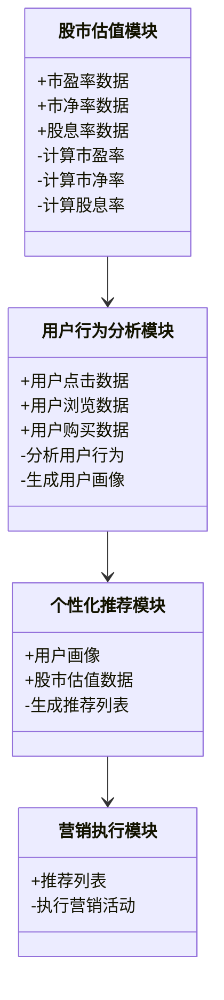

                 


# 股市估值对跨境数字营销个性化策略的影响

**关键词**：股市估值、跨境数字营销、个性化策略、数据驱动、算法优化、系统架构

**摘要**：本文探讨了股市估值与跨境数字营销之间的关系，特别是股市估值对个性化营销策略的影响。文章从股市估值的基本概念出发，分析其对数字营销策略的指导作用，结合数学模型和算法优化，提出了如何利用股市估值优化个性化营销策略的方法。同时，本文还通过实际案例展示了如何将股市估值与个性化策略相结合，并提出了系统的架构设计方案。

---

# 第1章: 股市估值与数字营销概述

## 1.1 股市估值的基本概念

### 1.1.1 股市估值的定义
股市估值是指通过对企业财务数据和市场表现的分析，对其股票的内在价值进行评估的过程。常见的估值方法包括市盈率（P/E）、市净率（P/B）、股息率等。

### 1.1.2 股市估值的核心指标
- **市盈率（P/E）**：市价与每股收益的比率，用于衡量股票的相对价值。
- **市净率（P/B）**：市价与每股净资产的比率，适用于评估资产密集型企业的价值。
- **股息率**：每股股息与股票价格的比率，反映了投资回报率。

### 1.1.3 股市估值与企业价值的关系
股市估值是市场对企业的整体价值的反映，但也会受到市场情绪、宏观经济环境等因素的影响。

---

## 1.2 跨境数字营销的定义与特点

### 1.2.1 跨境数字营销的定义
跨境数字营销是指通过数字渠道（如网站、社交媒体、搜索引擎等）向不同国家或地区的消费者推广产品或服务的过程。

### 1.2.2 跨境数字营销的核心要素
- **目标市场定位**：明确目标客户群体的需求和特征。
- **多语言与本地化**：根据目标市场的语言、文化差异进行内容调整。
- **数据驱动**：通过数据分析优化营销策略。

### 1.2.3 跨境数字营销与传统营销的区别
- **渠道多样性**：数字渠道更加灵活且覆盖面广。
- **数据驱动**：依赖于大数据分析进行决策。
- **实时互动**：消费者与企业的互动更加频繁且实时。

---

## 1.3 股市估值对数字营销的影响

### 1.3.1 股市波动对营销预算的影响
股市波动会影响企业的财务状况，从而影响其营销预算的分配。例如，当股市表现不佳时，企业可能需要减少营销支出。

### 1.3.2 股市估值与企业品牌价值的关系
股市估值反映了市场对企业品牌价值的认可程度，高估值意味着品牌具有较高的市场竞争力。

### 1.3.3 股市表现对营销策略的指导作用
股市表现可以为企业提供市场反馈，指导其调整营销策略。例如，当股市上涨时，企业可以增加广告投入以抓住市场机会。

---

## 1.4 个性化营销策略的核心要素

### 1.4.1 数据驱动的个性化营销
通过收集和分析消费者数据，为企业提供精准的营销策略。

### 1.4.2 个性化推荐算法
利用机器学习算法，根据用户的兴趣和行为推荐相关内容。

### 1.4.3 个性化营销的实现路径
1. 数据收集：通过网站、社交媒体等渠道收集用户行为数据。
2. 数据分析：利用数据分析工具对数据进行挖掘和建模。
3. 策略制定：根据分析结果制定个性化营销策略。
4. 策略执行：通过数字渠道实施个性化营销活动。

---

## 1.5 本章小结

本章介绍了股市估值和跨境数字营销的基本概念，并分析了股市估值对数字营销策略的影响。个性化营销策略的核心要素包括数据驱动、推荐算法和策略执行路径。

---

# 第2章: 股市估值与数字营销的关联性分析

## 2.1 股市估值对营销策略的影响

### 2.1.1 股市波动对营销预算的调整
股市波动会影响企业的财务状况，从而影响其营销预算的分配。例如，当股市表现不佳时，企业可能需要减少营销支出。

### 2.1.2 股市表现对营销目标的制定
股市表现可以为企业提供市场反馈，指导其调整营销目标。例如，当股市上涨时，企业可以增加广告投入以抓住市场机会。

### 2.1.3 股市估值对营销风险的评估
股市估值可以帮助企业评估其营销活动的风险，从而制定更稳健的营销策略。

---

## 2.2 跨境数字营销中的个性化策略

### 2.2.1 用户行为分析在个性化策略中的应用
通过分析用户的点击、浏览和购买行为，企业可以更好地理解用户需求。

### 2.2.2 数据驱动的个性化推荐
利用机器学习算法，根据用户的兴趣和行为推荐相关内容。

### 2.2.3 个性化营销的实现技术
1. 数据挖掘：利用数据分析工具对用户数据进行挖掘。
2. 机器学习：通过算法对用户行为进行预测和分类。
3. 推荐系统：基于用户数据推荐个性化内容。

---

## 2.3 股市估值与个性化策略的协同效应

### 2.3.1 股市估值对个性化策略的指导作用
股市估值可以帮助企业制定更精准的个性化营销策略，例如根据目标市场的经济状况调整营销活动。

### 2.3.2 个性化策略对股市估值的反向影响
个性化策略的实施可以提升企业的品牌价值和市场表现，从而影响其股市估值。

### 2.3.3 两者的协同优化路径
1. 数据共享：将股市数据与用户行为数据相结合。
2. 模型优化：利用综合模型优化个性化策略和股市估值的关联性。

---

## 2.4 本章小结

本章分析了股市估值与个性化策略的协同效应，探讨了两者如何相互影响并协同优化。通过数据共享和模型优化，企业可以制定更精准的营销策略。

---

# 第3章: 股市估值对个性化营销策略的影响机制

## 3.1 股市波动对用户行为的影响

### 3.1.1 股市波动对消费者信心的影响
股市波动会影响消费者信心，从而影响其消费行为。

### 3.1.2 股市波动对消费行为的驱动作用
当股市表现良好时，消费者可能更愿意进行高消费；反之，当股市表现不佳时，消费者可能减少支出。

### 3.1.3 股市波动对用户需求的预测
通过分析股市波动，企业可以预测用户需求的变化，从而调整其营销策略。

---

## 3.2 股市估值对营销目标的影响

### 3.2.1 股市估值对营销预算的调整
股市估值可以帮助企业优化其营销预算分配，例如在高估值时增加投入。

### 3.2.2 股市估值对营销目标的制定
股市估值可以为企业提供市场反馈，指导其制定更合理的营销目标。

### 3.2.3 股市估值对营销绩效的评估
股市估值可以作为评估营销绩效的重要指标，帮助企业优化其营销策略。

---

## 3.3 股市估值对个性化策略的优化作用

### 3.3.1 股市估值对用户画像的优化
通过分析股市数据，企业可以更精准地绘制用户画像，从而优化其个性化策略。

### 3.3.2 股市估值对推荐算法的优化
股市估值可以帮助企业优化推荐算法，例如通过调整推荐权重来满足用户需求。

### 3.3.3 股市估值对营销效果的预测
通过分析股市数据，企业可以预测其营销活动的效果，从而制定更有效的策略。

---

## 3.4 本章小结

本章探讨了股市估值对个性化营销策略的影响机制，分析了股市波动对用户行为和营销目标的影响，并提出了优化个性化策略的方法。

---

# 第4章: 股市估值与个性化营销策略的数学模型

## 4.1 股市估值的核心数学模型

### 4.1.1 市盈率模型
$$ P/E = \frac{\text{股票价格}}{\text{每股收益}} $$

### 4.1.2 市净率模型
$$ P/B = \frac{\text{股票价格}}{\text{每股净资产}} $$

### 4.1.3 股东权益回报率模型
$$ ROE = \frac{\text{净利润}}{\text{股东权益}} $$

---

## 4.2 个性化营销策略的数学模型

### 4.2.1 用户行为预测模型
$$ P(\text{购买}) = \beta_0 + \beta_1 X_1 + \beta_2 X_2 + \dots + \beta_n X_n + \epsilon $$

### 4.2.2 个性化推荐算法
$$ R(i,j) = \alpha + \beta i + \gamma j + \delta $$

### 4.2.3 营销效果预测模型
$$ E = \sum_{i=1}^{n} \lambda_i \cdot X_i $$

---

## 4.3 股市估值与个性化策略的综合模型

### 4.3.1 综合评估模型的构建
$$ V = \alpha \cdot P/E + \beta \cdot P/B + \gamma \cdot ROE + \delta \cdot R(i,j) $$

### 4.3.2 模型的验证与优化
通过实证分析和参数调整，优化模型的准确性和预测能力。

### 4.3.3 模型的实际应用案例
通过具体案例展示模型的应用过程和效果。

---

## 4.4 本章小结

本章构建了股市估值与个性化策略的综合模型，并通过数学公式和算法优化，展示了如何利用股市估值优化个性化营销策略。

---

# 第5章: 系统分析与架构设计方案

## 5.1 问题场景介绍

跨境数字营销面临用户需求多样、市场波动频繁等问题，需要通过数据驱动的方法优化个性化策略。

---

## 5.2 系统功能设计

### 5.2.1 领域模型（Mermaid 类图）


---

## 5.3 系统架构设计（Mermaid 架构图）


---

## 5.4 系统接口设计

1. **用户行为数据接口**：从数据库获取用户行为数据。
2. **股市估值接口**：从第三方API获取实时股市数据。
3. **推荐算法接口**：根据用户数据和股市数据生成推荐列表。

---

## 5.5 系统交互设计（Mermaid 序列图）

```mermaid
sequenceDiagram
    用户 ->> 前端应用: 请求个性化推荐
    前端应用 ->> 中间件: 获取用户ID
    中间件 ->> 用户行为分析模块: 获取用户行为数据
    用户行为分析模块 ->> 数据库: 查询用户数据
    中间件 ->> 股市估值模块: 获取实时股市数据
    股市估值模块 ->> 数据库: 查询历史数据
    中间件 ->> 推荐算法模块: 生成推荐列表
    推荐算法模块 ->> 用户 ->> 推荐列表
```

---

## 5.6 本章小结

本章通过系统架构设计和接口设计，展示了如何将股市估值与个性化策略相结合，实现数据驱动的营销方案。

---

# 第6章: 项目实战

## 6.1 环境安装

1. **安装Python**：用于数据处理和算法实现。
2. **安装Pandas和NumPy**：用于数据分析。
3. **安装Scikit-learn**：用于机器学习算法。
4. **安装Flask**：用于构建API接口。

---

## 6.2 核心实现源代码

### 6.2.1 数据获取
```python
import pandas as pd

# 从数据库获取用户行为数据
def get_user_behavior():
    data = pd.read_sql("SELECT * FROM user_behavior", connection)
    return data

# 从API获取股市估值数据
def get_stock_valuation():
    response = requests.get("http://api.stock.com/valuation")
    return response.json()
```

---

### 6.2.2 推荐算法实现
```python
from sklearn.neighbors import NearestNeighbors

def personalized_recommendation(users, stocks):
    model = NearestNeighbors(n_neighbors=5)
    model.fit(users)
    indices = model.kneighbors(stocks, return_distance=False)
    return indices
```

---

### 6.2.3 营销活动执行
```python
from flask import Flask

app = Flask(__name__)

@app.route("/recommend", methods=["GET"])
def recommend():
    user_id = request.args.get("user_id")
    stock_data = get_stock_valuation()
    user_profile = get_user_behavior(user_id)
    recommendations = personalized_recommendation(user_profile, stock_data)
    return jsonify(recommendations)
```

---

## 6.3 实际案例分析

以一家跨境电商为例，分析如何根据股市估值调整其个性化营销策略。通过数据驱动的方法，优化广告投放和产品推荐。

---

## 6.4 本章小结

本章通过实际案例展示了如何将股市估值与个性化策略相结合，实现了数据驱动的营销方案。

---

# 第7章: 总结与展望

## 7.1 总结

本文探讨了股市估值对跨境数字营销个性化策略的影响，提出了通过数据驱动和算法优化的方法，实现更精准的营销策略。

---

## 7.2 最佳实践 Tips

1. **数据安全**：确保用户数据和股市数据的安全性。
2. **模型优化**：定期更新和优化推荐算法。
3. **实时监控**：实时监控股市波动，及时调整营销策略。

---

## 7.3 未来展望

未来，随着人工智能和大数据技术的发展，股市估值与个性化策略的结合将更加紧密，为企业提供更智能化的营销方案。

---

# 作者

作者：AI天才研究院/AI Genius Institute & 禅与计算机程序设计艺术 /Zen And The Art of Computer Programming

