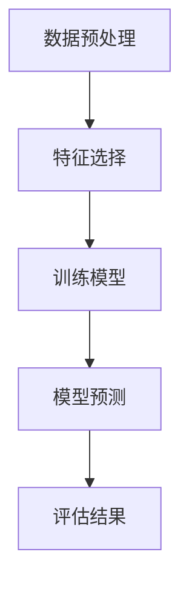

                 

<think>
好的，我需要撰写一篇关于《股市估值对跨境数字营销效果评估的影响》的博客文章，严格按照用户提供的目录大纲来组织内容。每个部分都需要详细展开，确保涵盖所有必要的信息，并且逻辑清晰。

### 第一部分：背景与概念

#### 第1章：股市估值与数字营销概述

##### 1.1 股市估值的基本概念
- **定义**：股市估值是指通过分析公司的财务状况、行业地位和市场表现，来评估其股票的合理价格。
- **主要指标**：包括市盈率（P/E）、市净率（P/B）、股息率等。
- **影响因素**：宏观经济环境、公司业绩、行业趋势、市场情绪等。

##### 1.2 跨境数字营销的定义与特点
- **定义**：跨境数字营销是指通过数字渠道（如网站、社交媒体、搜索引擎等）进行跨国营销活动。
- **特点**：全球化、数据驱动、精准定位、实时互动、跨文化挑战。

##### 1.3 问题背景与研究意义
- **背景**：股市波动会影响企业的营销预算和策略，而数字营销活动反过来也可能影响企业的市场表现。
- **意义**：研究两者的关系有助于优化营销策略，提升企业价值，降低市场风险。

---

#### 第2章：核心概念分析

##### 2.1 股市估值的指标与方法
- **市盈率（P/E）**：衡量股票价格是否合理。
- **市净率（P/B）**：评估股票相对于账面价值的高低。
- **股息率**：衡量股票的收益能力。

##### 2.2 数字营销效果的评估体系
- **点击率（CTR）**：评估广告的吸引力。
- **转化率（CR）**：衡量广告效果。
- **投资回报率（ROI）**：评估营销活动的盈利能力。

##### 2.3 两者的联系与区别
- **联系**：股市估值的变化会影响企业的营销预算，而数字营销效果又会影响企业的市场表现。
- **区别**：股市估值关注整体市场表现，数字营销关注具体营销活动效果。

---

### 第二部分：理论基础

#### 第3章：股市估值的理论基础

##### 3.1 基本面分析方法
- **定义**：通过分析公司的财务报表来评估其内在价值。
- **步骤**：分析收入、利润、资产等指标。

##### 3.2 技术分析方法
- **定义**：通过分析历史价格和成交量来预测未来走势。
- **常用工具**：K线图、均线、MACD等。

##### 3.3 行为金融学对股市的影响
- **定义**：研究投资者心理和行为对市场的影响。
- **影响**：投资者情绪波动会影响股市估值。

#### 第4章：数字营销的理论基础

##### 4.1 数字营销的核心理论
- **4A理论**：Attention（注意）、Action（行动）、Attract（吸引）、Assess（评估）。
- **数据驱动决策**：通过数据分析优化营销策略。

##### 4.2 数据驱动的营销策略
- **数据分析**：利用大数据技术分析消费者行为。
- **个性化营销**：基于用户数据进行精准营销。

##### 4.3 跨境营销的特殊性
- **文化差异**：不同国家的消费者行为和偏好不同。
- **法律法规**：不同国家的广告法规和隐私保护政策不同。

---

### 第三部分：影响机制分析

#### 第5章：股市波动对数字营销的影响

##### 5.1 股市波动如何影响营销预算
- **市场繁荣**：增加营销预算。
- **市场衰退**：减少营销预算。

##### 5.2 投资者情绪与营销策略调整
- **乐观情绪**：企业可能增加营销投入。
- **悲观情绪**：企业可能减少营销投入。

##### 5.3 股市危机中的营销机会
- **低谷期**：通过低价获取市场份额。
- **危机营销**：利用危机事件进行品牌推广。

#### 第6章：数字营销对股市估值的影响

##### 6.1 高效营销提升公司价值
- **品牌价值**：提升品牌知名度和美誉度。
- **业绩增长**：通过有效营销带来收入增长。

##### 6.2 数字营销如何影响投资者决策
- **信息透明度**：提供更透明的信息影响投资者判断。
- **投资者情绪**：通过营销活动影响投资者情绪。

##### 6.3 营销活动与股价的相关性分析
- **案例分析**：分析大型营销活动对股价的影响。

---

### 第四部分：模型与算法

#### 第7章：股市与营销的关联模型

##### 7.1 构建模型的基本步骤
- **数据收集**：收集股市数据和营销数据。
- **特征选择**：筛选相关特征。
- **模型验证**：通过回测验证模型的有效性。

##### 7.2 数据特征选择
- **重要性排序**：识别关键特征。
- **特征工程**：处理数据以提高模型性能。

##### 7.3 模型的验证与优化
- **回测分析**：评估模型在历史数据上的表现。
- **参数优化**：调整模型参数以提高预测准确性。

#### 第8章：算法实现

##### 8.1 数据预处理方法
- **数据清洗**：处理缺失值、异常值。
- **数据标准化**：标准化特征以提高模型性能。

##### 8.2 机器学习算法选择
- **线性回归**：预测连续型变量。
- **随机森林**：用于分类和回归任务。
- **时间序列分析**：ARIMA模型预测股市走势。

##### 8.3 模型实现的代码示例
```python
import pandas as pd
from sklearn.ensemble import RandomForestRegressor
from sklearn.metrics import mean_absolute_error
from sklearn.model_selection import train_test_split

# 加载数据
data = pd.read_csv('marketing_stock_data.csv')

# 特征选择
features = ['ad_clicks', 'sales', 'market_sentiment']
target = 'stock_price'

# 划分数据集
X_train, X_test, y_train, y_test = train_test_split(data[features], data[target], test_size=0.2)

# 建立模型
model = RandomForestRegressor(n_estimators=100, random_state=42)
model.fit(X_train, y_train)

# 预测与评估
y_pred = model.predict(X_test)
print(mean_absolute_error(y_test, y_pred))
```

##### 8.4 使用mermaid绘制算法流程图


---

### 第五部分：系统架构与实现

#### 第9章：系统设计

##### 9.1 需求分析
- **目标**：开发一个评估系统，分析数字营销对股市的影响。
- **用户需求**：企业营销部门和投资者。

##### 9.2 功能模块设计
- **数据采集模块**：收集股市和营销数据。
- **分析模块**：应用算法模型进行分析。
- **可视化模块**：展示分析结果。

##### 9.3 系统架构图


---

### 第六部分：总结与展望

#### 第10章：结论与展望

##### 10.1 研究总结
- **主要发现**：数字营销对股市估值有显著影响。
- **局限性**：模型的预测精度受数据质量和市场复杂性影响。

##### 10.2 未来研究方向
- **模型优化**：引入深度学习技术提高预测精度。
- **多因素分析**：考虑更多影响因素，如宏观经济指标。

##### 10.3 对行业的影响与建议
- **企业建议**：根据股市走势调整营销策略。
- **政策建议**：制定相关政策规范数字营销行为。

---

作者：AI天才研究院/AI Genius Institute & 禅与计算机程序设计艺术 /Zen And The Art of Computer Programming

