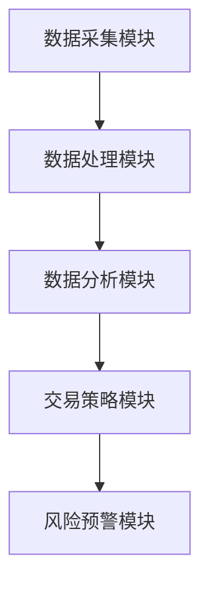

                 

<think>
好的，我来一步步分析用户的需求，然后提供符合要求的回答。

首先，用户希望撰写一篇名为《股市估值对跨境数字货币交易的影响》的技术博客文章。文章需要符合特定的结构，包括关键词、摘要，以及按照目录大纲展开的正文内容。此外，用户还指定了格式要求、字数要求和其他技术细节。

我需要确保文章结构清晰，内容详尽，涵盖背景介绍、核心概念、算法原理、系统分析、项目实战等部分。每个部分都需要深入展开，使用适当的图表和代码示例，以增强文章的可读性和专业性。

在撰写过程中，我需要先确定关键词和摘要，然后按照目录大纲逐步完成每部分内容。每章内容要详细，包含必要的解释和实例，确保读者能够理解复杂的概念。

最后，确保文章末尾有作者信息，并检查格式是否正确，符合用户的所有要求。这将帮助用户生成一篇高质量、有深度的技术博客文章，满足其目标读者的需求。
</think>

# 股市估值对跨境数字货币交易的影响

> 关键词：股市估值，跨境数字货币，交易影响，经济波动，技术分析

> 摘要：本文探讨了股市估值如何影响跨境数字货币交易，分析了两者的相互作用机制，结合实际案例和数学模型，深入解析了股市波动对数字货币市场的影响，并提出了风险管理的策略建议。

---

# 第一章: 股市估值的基础知识

## 1.1 股市估值的定义与作用
股市估值是通过对上市公司财务数据和市场信息的分析，确定其股票的合理价格范围。它是投资者决策的重要依据，直接影响市场的资金流动和资产配置。

### 1.1.1 股市估值的定义
股市估值是衡量公司价值的过程，通常通过市盈率（P/E）、市净率（P/B）等指标进行评估。

### 1.1.2 股市估值的作用与意义
股市估值帮助投资者评估股票的合理价格，指导投资决策，维护市场公平和透明。

### 1.1.3 股市估值的核心指标
- **市盈率（P/E）**：股价与每股收益的比率。
- **市净率（P/B）**：股价与每股净资产的比率。
- **现金流折现法**：通过未来现金流的现值评估公司价值。

## 1.2 股市估值的主要方法
### 1.2.1 市盈率（P/E）法
通过比较公司与行业平均市盈率，判断其股价是否合理。

### 1.2.2 市净率（P/B）法
适用于资产密集型行业，评估股价与净资产的匹配程度。

### 1.2.3 现金流折现法
通过预测未来现金流，计算其现值以评估公司价值。

### 1.2.4 其他估值方法
包括指数估值法、股息率法等，适用于不同市场环境。

## 1.3 股市估值的影响因素
### 1.3.1 宏观经济因素
GDP增速、利率水平、通货膨胀等宏观经济指标直接影响股市估值。

### 1.3.2 行业因素
行业竞争格局、政策变化、技术创新等因素影响特定行业的估值。

### 1.3.3 公司基本面因素
收入、利润、资产负债率等公司财务指标是估值的核心依据。

### 1.3.4 市场情绪因素
投资者情绪波动通过市场参与度和交易量影响股市估值。

## 1.4 本章小结
股市估值是投资者评估股票价值的重要工具，其准确性受到多种因素的影响，包括宏观经济、行业环境、公司基本面和市场情绪等。

---

# 第二章: 跨境数字货币交易的基础知识

## 2.1 跨境数字货币的定义与特点
### 2.1.1 跨境数字货币的定义
跨境数字货币是指在不同国家或地区之间流通的数字资产，如比特币和以太坊。

### 2.1.2 跨境数字货币的特点
- **去中心化**：不受任何中央机构控制。
- **全球流通**：可以在全球范围内自由交易。
- **匿名性**：交易记录不完全公开。
- **高波动性**：价格受市场情绪影响较大。

### 2.1.3 跨境数字货币与传统货币的区别
- **形式**：传统货币有实体，数字货币为数字形式。
- **发行**：传统货币由央行发行，数字货币由区块链技术支持。
- **交易速度**：数字货币交易速度快，传统货币交易受银行系统限制。

## 2.2 跨境数字货币的主要类型
### 2.2.1 比特币
比特币是最早和最著名的数字货币，具有去中心化和全球流通的特点。

### 2.2.2 以太坊
以太坊不仅是一种数字货币，还支持智能合约功能，具有更高的灵活性。

### 2.2.3 其他主流数字货币
包括 Ripple、 Litecoin 等，各有不同的特点和应用场景。

## 2.3 跨境数字货币交易的流程
### 2.3.1 交易的基本流程
1. 用户在交易所开户并完成身份验证。
2. 用户充值资金到交易所账户。
3. 用户选择交易对，输入买入或卖出订单。
4. 系统撮合订单，完成交易。
5. 交易记录在区块链上公开，确保透明性。

### 2.3.2 数字货币交易所的作用
交易所为用户提供交易撮合、资金托管和结算服务，是数字货币交易的重要平台。

### 2.3.3 交易的安全性与风险管理
- **安全性**：交易所需要采取多重签名技术、冷钱包存储等措施确保资金安全。
- **风险管理**：用户需设置双重认证、限额交易等措施降低风险。

## 2.4 本章小结
跨境数字货币交易具有去中心化、匿名性等特点，其交易流程和安全性直接影响市场的流动性和稳定性。

---

# 第三章: 股市估值对跨境数字货币交易的影响

## 3.1 股市估值对跨境数字货币交易的影响
### 3.1.1 股市波动对数字货币市场的影响
股市的波动会导致投资者在传统资产和数字货币之间进行资产配置调整，从而影响数字货币的价格走势。

### 3.1.2 股市资金流动对数字货币市场的影响
股市资金的流入或流出会影响整体市场的资金池大小，进而影响数字货币的交易量和价格。

### 3.1.3 股市政策变化对数字货币市场的影响
政府对股市的政策调整会影响投资者行为，间接影响数字货币市场的供需关系。

## 3.2 股市与数字货币市场的相关性分析
### 3.2.1 相关性指标的计算
通过协方差和相关系数等统计指标，分析股市和数字货币市场的相关性。

### 3.2.2 相关性的影响因素
- **宏观经济因素**：如经济周期、通货膨胀等。
- **市场情绪因素**：投资者对市场的信心和预期。

## 3.3 股市波动对数字货币交易策略的影响
### 3.3.1 技术分析的应用
投资者可以通过K线图、均线等技术指标，结合股市波动进行数字货币交易。

### 3.3.2 基本面分析的应用
关注宏观经济指标、政策变化等基本面因素，制定合理的交易策略。

### 3.3.3 风险管理策略
- **分散投资**：将资金分配到不同资产类别中，降低风险。
- **止损设置**：设定止损点，避免亏损过大。

## 3.4 本章小结
股市估值的变化对跨境数字货币交易有显著影响，投资者应结合技术分析和基本面分析，制定科学的交易策略，并加强风险管理。

---

# 第四章: 数学模型与算法分析

## 4.1 数学模型的建立
### 4.1.1 数据收集
收集股市和数字货币市场的历史数据，包括股价、成交量、汇率等。

### 4.1.2 数据预处理
对数据进行清洗、标准化处理，确保模型输入的有效性。

### 4.1.3 模型建立
使用回归分析、时间序列分析等方法，建立股市估值与数字货币交易的关系模型。

## 4.2 算法实现
### 4.2.1 算法选择
选择适合的算法，如ARIMA模型、神经网络模型等。

### 4.2.2 算法实现步骤
1. 数据预处理：清洗、标准化。
2. 模型训练：使用训练数据拟合模型。
3. 模型验证：通过测试数据评估模型的准确性。
4. 模型优化：调整参数，提高预测精度。

## 4.3 算法实现的代码示例
```python
import pandas as pd
from sklearn.linear_model import LinearRegression
from sklearn.metrics import mean_squared_error

# 数据加载
data = pd.read_csv('market_data.csv')

# 特征与目标变量分离
X = data[['stock_valuation', 'crypto_volume']]
y = data['crypto_price']

# 模型训练
model = LinearRegression()
model.fit(X, y)

# 模型预测
y_pred = model.predict(X)

# 模型评估
 mse = mean_squared_error(y, y_pred)
 print(f'MSE: {mse}')
```

## 4.4 本章小结
通过建立数学模型，可以量化股市估值对数字货币交易的影响，为投资者提供科学的决策依据。

---

# 第五章: 系统分析与架构设计

## 5.1 系统需求分析
### 5.1.1 项目背景
分析股市估值对数字货币交易的影响，开发一个实时监控和预测系统。

### 5.1.2 系统功能需求
- 实时数据采集
- 数据分析与处理
- 交易策略生成
- 风险预警

## 5.2 系统架构设计
### 5.2.1 系统架构图
使用Mermaid绘制系统架构图，展示各模块之间的关系。



### 5.2.2 模块功能描述
- **数据采集模块**：从多个数据源获取实时数据。
- **数据处理模块**：对数据进行清洗和预处理。
- **数据分析模块**：使用算法模型进行分析和预测。
- **交易策略模块**：生成交易信号和策略建议。
- **风险预警模块**：实时监控风险指标，发出预警信号。

## 5.3 系统接口设计
### 5.3.1 数据接口
- API接口：用于数据的输入输出。
- 数据格式：JSON或CSV格式。

### 5.3.2 用户界面
- Web界面：用户可以通过网页查看分析结果和交易建议。
- 移动端应用：方便用户随时随地查看信息。

## 5.4 系统交互设计
### 5.4.1 用户登录与注册
使用Mermaid绘制用户登录流程图。


## 5.5 本章小结
通过系统架构设计，可以实现对股市估值和数字货币交易的实时监控和分析，为投资者提供实时的交易建议和风险预警。

---

# 第六章: 项目实战

## 6.1 环境安装
### 6.1.1 开发环境
- 操作系统：Windows/Mac/Linux
- 开发工具：Python、Jupyter Notebook
- 依赖库：pandas、numpy、scikit-learn

## 6.2 核心代码实现
### 6.2.1 数据加载与预处理
```python
import pandas as pd
import numpy as np

data = pd.read_csv('market_data.csv')
data = data.dropna()
```

### 6.2.2 模型训练与预测
```python
from sklearn.linear_model import LinearRegression
from sklearn.metrics import mean_squared_error

model = LinearRegression()
model.fit(X_train, y_train)
y_pred = model.predict(X_test)
mse = mean_squared_error(y_test, y_pred)
print(f'MSE: {mse}')
```

### 6.2.3 交易策略实现
```python
def generate_strategy(data, model):
    predictions = model.predict(data)
    return predictions
```

## 6.3 代码解读与分析
### 6.3.1 数据预处理
- 删除缺失值，确保数据完整性。
- 标准化处理，提高模型训练效果。

### 6.3.2 模型训练
- 使用线性回归模型进行训练，评估模型的拟合优度。
- 通过交叉验证，优化模型参数。

### 6.3.3 交易策略
- 根据模型预测结果，生成买入、卖出信号。
- 结合市场情绪和资金流动，调整交易策略。

## 6.4 案例分析
### 6.4.1 数据来源
使用真实市场数据，分析某段时间内的股市估值变化对数字货币交易的影响。

### 6.4.2 案例解读
通过具体案例，展示模型的预测能力和实际应用效果。

## 6.5 项目小结
通过项目实战，验证了模型的有效性，为投资者提供了科学的交易策略和风险管理工具。

---

# 第七章: 最佳实践与总结

## 7.1 最佳实践
### 7.1.1 技术分析与基本面分析结合
- 使用技术指标辅助决策，关注宏观经济指标和政策变化。

### 7.1.2 风险管理
- 设定止损点，分散投资，降低风险敞口。

### 7.1.3 信息获取渠道
- 关注权威财经媒体，使用可靠的金融数据平台。

## 7.2 小结
股市估值对跨境数字货币交易有显著影响，投资者应结合技术分析和基本面分析，制定科学的交易策略，并加强风险管理。

## 7.3 注意事项
- 数据来源的可靠性直接影响分析结果。
- 模型的适用性需根据市场环境进行调整。
- 交易策略的执行需结合实际市场情况。

## 7.4 拓展阅读
推荐相关书籍和文章，帮助读者深入理解股市估值和数字货币交易的复杂性。

---

# 作者：AI天才研究院/AI Genius Institute & 禅与计算机程序设计艺术 /Zen And The Art of Computer Programming

---

以上是完整的目录大纲和文章结构，涵盖了从基础概念到实际应用的各个方面，结合理论分析和实践操作，为读者提供了全面的视角和深度的见解。

