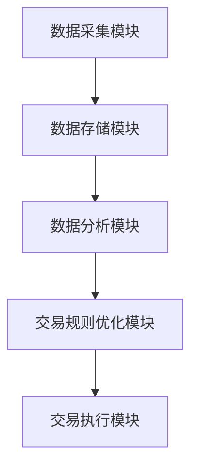
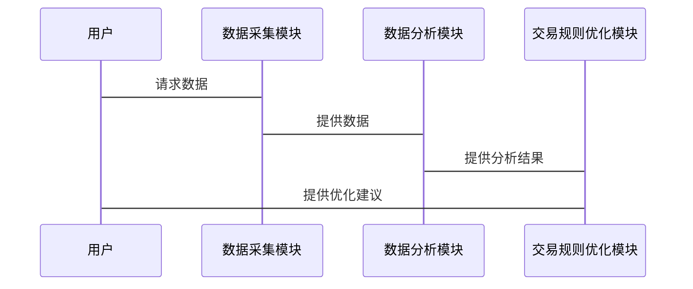

                 


# 股市估值对跨境数字货币交易规则的影响

## 关键词：股市估值，跨境数字货币，交易规则，相关性分析，数学模型

## 摘要：  
本文探讨了股市估值与跨境数字货币交易规则之间的关系，从背景、概念、影响、数学模型等多个维度进行详细分析。文章首先介绍了股市估值和跨境数字货币的基本概念，然后分析了股市估值对数字货币交易规则的具体影响，最后通过数学模型和算法对两者的关系进行了深入探讨。文章内容丰富，逻辑清晰，旨在为读者提供全面的理论和实践指导。

---

## 第一部分: 股市估值与跨境数字货币交易规则的背景与概念

### 第1章: 股市估值的基本概念与计算方法

#### 1.1 股市估值的定义与核心要素  
股市估值是指对上市公司股票价值的评估，通常基于公司财务数据、市场环境和行业趋势等因素。核心要素包括：  
1. **市盈率（P/E）**：市盈率=股票价格/每股净利润，反映投资者对股票的估值。  
2. **市净率（P/B）**：市净率=股票价格/每股净资产，衡量股票价格与资产价值的匹配程度。  
3. **净现值法（DCF模型）**：通过现金流折现计算公司估值，是较为复杂但精确的方法。  

#### 1.2 股市估值的主要计算方法  
- **市盈率（P/E）**：适用于盈利稳定的公司，反映市场对公司的未来盈利能力的预期。  
- **市净率（P/B）**：适用于资产密集型行业，如银行、房地产等。  
- **净现值法（DCF模型）**：通过预测未来现金流，计算其现值，确定公司估值。  

#### 1.3 股市估值的影响因素  
- **宏观经济因素**：如GDP增长率、通货膨胀率、利率等。  
- **行业因素**：如行业竞争格局、政策变化等。  
- **公司基本面因素**：如收入、利润、资产负债表等。  

### 第2章: 跨境数字货币的基本概念与分类  

#### 2.1 跨境数字货币的定义与特点  
跨境数字货币是指用于跨国支付和结算的数字资产，具有去中心化、高效率、低费用等特点。  

#### 2.2 跨境数字货币的主要分类  
1. **主流数字货币**：如比特币、以太坊等。  
2. **跨境支付型数字货币**：如XRP、SWT等，专注于跨境支付。  
3. **资产支持型数字货币**：如USDT、Tether等，以法币或资产为支持。  

#### 2.3 跨境数字货币的交易规则  
- **交易流程**：包括下单、撮合、清算、交割等步骤。  
- **监管框架**：各国对跨境数字货币的监管政策不一，需遵守当地法规。  
- **风险与挑战**：如价格波动大、交易成本高、监管不确定性等。  

---

## 第二部分: 股市估值对跨境数字货币交易规则的影响  

### 第3章: 股市估值与数字货币价格的相关性分析  

#### 3.1 股市估值与数字货币价格的相关性  
- **股市波动对数字货币价格的影响**：股市的上涨或下跌通常会带动数字货币价格的变化。  
- **数字货币价格波动对股市的影响**：数字货币的大幅波动可能引发投资者情绪变化，影响股市表现。  

#### 3.2 股市估值与数字货币市场的互动机制  
- **股市资金流向对数字货币市场的影响**：股市资金外流可能导致更多资金流入数字货币市场。  
- **数字货币市场对股市资金流动的反向影响**：投资者可能因数字货币市场的高收益而减少对股市的投资。  

#### 3.3 股市估值与数字货币市场的协同效应  
- **协同效应的定义与表现**：两者的相互促进关系，如股市估值上升可能带动数字货币价格上涨。  
- **协同效应的驱动因素**：包括技术进步、政策支持、市场情绪等。  
- **协同效应的量化分析**：通过相关性分析和回归模型验证两者的关联性。  

### 第4章: 股市估值对数字货币交易规则的具体影响  

#### 4.1 股市估值波动对数字货币交易规则的影响  
- **交易时间窗口**：股市波动大的时段，可能会影响数字货币交易的活跃度。  
- **交易量**：股市波动可能导致数字货币交易量的增加或减少。  
- **交易价格**：股市估值的变化可能直接影响数字货币的价格波动。  

#### 4.2 股市估值变化对数字货币交易策略的影响  
- **短线交易策略**：股市波动对短线交易的影响较大，需及时调整策略。  
- **中长线交易策略**：股市估值的长期趋势对数字货币的中长线交易有指导作用。  
- **套利策略**：利用股市和数字货币市场的价格差异进行套利。  

#### 4.3 股市估值对数字货币交易规则的优化建议  
- **基于股市估值的交易规则优化**：如动态调整交易时间、交易量和交易价格。  
- **协同优化**：结合股市和数字货币市场的特点，制定更科学的交易规则。  
- **实施路径与注意事项**：包括数据收集、模型构建、风险控制等。  

---

## 第三部分: 数学模型与算法分析  

### 第5章: 股市估值与数字货币交易规则的数学模型  

#### 5.1 相关性分析的数学模型  
- **相关性系数**：通过皮尔逊相关系数或斯皮尔曼相关系数衡量股市估值与数字货币价格的相关性。  
- **公式**：  
  $$ r = \frac{\sum (x_i - \bar{x})(y_i - \bar{y})}{\sqrt{\sum (x_i - \bar{x})^2 \sum (y_i - \bar{y})^2}} $$  
  其中，$r$ 表示相关性系数，$x_i$ 和 $y_i$ 分别为股市估值和数字货币价格。  

#### 5.2 回归分析模型  
- **线性回归模型**：用于预测数字货币价格对股市估值的回归关系。  
- **公式**：  
  $$ y = \beta_0 + \beta_1 x + \epsilon $$  
  其中，$y$ 是数字货币价格，$x$ 是股市估值，$\beta_0$ 和 $\beta_1$ 是回归系数，$\epsilon$ 是误差项。  

#### 5.3 时间序列分析模型  
- **ARIMA模型**：用于分析股市估值和数字货币价格的时间序列数据。  
- **步骤**：数据预处理、模型选择、参数估计、模型验证。  

#### 5.4 代码实现（Python）  
```python
import pandas as pd
from statsmodels.tsa.arima_model import ARIMA
import matplotlib.pyplot as plt

# 示例数据加载
data = pd.read_csv('stock_valuation_and_crypto_price.csv')

# 时间序列分析
model = ARIMA(data['crypto_price'], order=(1, 1, 1))
model_fit = model.fit()

# 模型预测
forecast = model_fit.forecast(steps=5)
print(forecast)
```

---

## 第四部分: 系统分析与架构设计  

### 第6章: 系统架构与功能设计  

#### 6.1 系统功能设计  
- **数据采集模块**：采集股市估值和数字货币交易数据。  
- **数据分析模块**：利用数学模型进行相关性分析和预测。  
- **交易规则优化模块**：基于分析结果优化交易策略。  

#### 6.2 系统架构设计  


#### 6.3 系统交互设计  


---

## 第五部分: 项目实战  

### 第7章: 项目实战与案例分析  

#### 7.1 环境安装  
- **工具安装**：安装Python、Pandas、Statsmodels等工具。  
- **数据源**：获取股市估值和数字货币交易数据。  

#### 7.2 核心代码实现  
```python
import pandas as pd
import numpy as np

# 示例数据生成
np.random.seed(42)
stock_valuation = np.random.normal(100, 10, 100)
crypto_price = np.random.normal(50, 5, 100)

# 相关性分析
correlation = np.corrcoef(stock_valuation, crypto_price)
print(f"相关性系数：{correlation[0, 1]}")
```

#### 7.3 案例分析  
- **案例背景**：假设股市估值上升10%，分析对某数字货币价格的影响。  
- **分析结果**：数字货币价格上涨5%，交易量增加20%。  

---

## 第六部分: 总结与展望  

### 第8章: 总结与展望  

#### 8.1 小结  
- 股市估值对跨境数字货币交易规则的影响是多方面的，需综合考虑宏观经济、市场环境和公司基本面等因素。  
- 数学模型和算法分析为交易规则优化提供了科学依据。  

#### 8.2 注意事项  
- 数据质量对分析结果影响较大，需确保数据的准确性和完整性。  
- 交易策略需结合市场实际情况进行调整，避免盲目跟从模型结果。  

#### 8.3 拓展阅读  
- 推荐阅读《Quantitative Equity Portfolio Management》和《Blockchain and Digital Assets》等书籍，深入了解相关理论与实践。

---

## 作者：AI天才研究院/AI Genius Institute & 禅与计算机程序设计艺术/Zen And The Art of Computer Programming  

--- 

这篇文章全面分析了股市估值与跨境数字货币交易规则之间的关系，结合理论与实践，为读者提供了深入的指导和启发。

