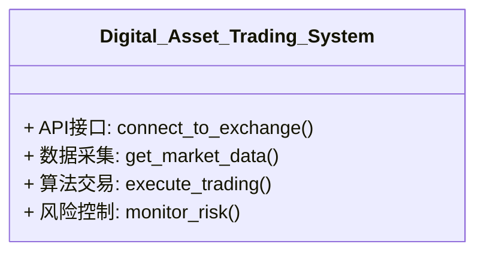
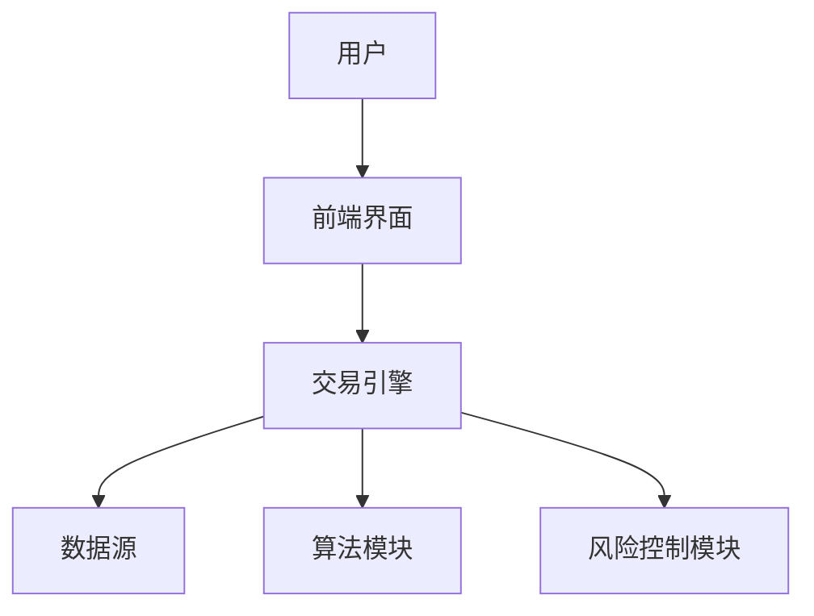

                 

<think>
嗯，用户让我以《股市估值对跨境数字资产交易的影响》为标题，撰写一篇技术博客文章，还要有详细的目录大纲。首先，我需要理解用户的需求。用户可能是一位技术专家，或者是对数字资产交易感兴趣的人，想深入了解股市估值如何影响跨境数字资产交易。

我应该先从背景和概念入手，解释股市估值的基本概念，然后介绍数字资产交易的特点，接着分析两者之间的联系。这部分需要让读者明白为什么股市估值会影响数字资产交易。

接下来，我需要详细讲解数字资产交易的算法原理，包括算法交易的基本原理和实现方式。这部分可能需要使用图表来说明，比如用mermaid画出算法流程图，让读者更直观地理解。

然后，讨论数字资产估值的数学模型，对比传统股票的估值方法，分析数字资产的独特性。这部分可能需要给出具体的数学公式，用latex格式展示，确保专业性。

最后，总结与展望部分，回顾全书内容，提出未来的研究方向，帮助读者更好地理解当前的研究成果和未来的发展趋势。

整个过程中，我需要确保每个章节内容丰富，结构清晰，语言专业但易懂。同时，要注意字数控制在1万到1万2千字左右，确保文章的完整性和深度。

可能遇到的困难是如何将复杂的金融概念和算法原理结合起来，用简单易懂的语言表达。我需要多次检查，确保每个部分都详细且准确，避免过于技术化而让读者难以理解。

总之，我需要系统地分解主题，逐步深入，确保文章既有理论深度，又有实际应用，满足读者的需求。
</think>

# 股市估值对跨境数字资产交易的影响

> 关键词：股市估值、数字资产、跨境交易、算法交易、区块链技术

> 摘要：  
本文系统地探讨了股市估值对跨境数字资产交易的影响，分析了数字资产交易的估值模型、算法原理及其实现方法。通过对传统股票估值方法与数字资产估值的独特性的对比，揭示了数字资产交易对传统金融市场的影响，以及如何利用创新的估值方法和技术手段应对数字资产交易带来的挑战。文章结合实际案例，深入浅出地分析了数字资产交易的算法实现和数学模型，为读者提供了全面的理论与实践指导。

---

## 第1章: 股市估值基础

### 1.1 股市估值的基本概念

#### 1.1.1 股票估值的定义与意义
股票估值是通过对公司财务数据、市场环境和行业趋势的分析，确定股票内在价值的过程。其目的是帮助投资者判断股票是否被高估或低估，从而做出合理的投资决策。

#### 1.1.2 股票估值的核心指标
- 市盈率（P/E Ratio）：股价与每股收益的比率，衡量股票的投资价值。
- 市净率（P/B Ratio）：股价与每股净资产的比率，反映股票相对于账面价值的高低。
- 净值收益率（ROE）：净利润与股东权益的比率，衡量公司的盈利能力。

#### 1.1.3 股票估值的常见方法
- 市盈率法：通过比较市盈率与行业平均水平，判断股票估值高低。
- 现金流折现法：将未来现金流折现，计算股票的内在价值。
- 相对估值法：通过比较同类股票的估值指标，确定目标股票的合理价格。

### 1.2 跨境数字资产交易的定义与特点

#### 1.2.1 数字资产的基本概念
数字资产是指基于区块链技术的虚拟货币或代币，具有去中心化、可分割性和匿名性等特点。常见的数字资产包括比特币、以太坊等。

#### 1.2.2 跨境交易的特点与挑战
- 全球化：数字资产交易不受地域限制，可以实时进行跨境交易。
- 高波动性：数字资产价格波动剧烈，市场风险较高。
- 监管复杂性：不同国家对数字资产的监管政策差异大，增加了交易的复杂性。

#### 1.2.3 数字资产交易的监管框架
- 欧盟：实施《支付服务指令》（PSD2）和《加密资产监管》（MiCA）。
- 美国：各州监管政策不一，联邦政府逐步加强监管。
- 中国：严格限制数字资产交易，禁止比特币等虚拟货币的交易和使用。

### 1.3 股市估值与数字资产交易的联系

#### 1.3.1 数字资产交易对股市估值的影响
- 数字资产的高波动性可能影响传统股市的稳定性。
- 数字资产的兴起推动了投资者对新型估值方法的需求。

#### 1.3.2 股市估值对数字资产交易的反向影响
- 传统股市的估值方法为数字资产交易提供了参考。
- 数字资产市场的波动性可能通过投资者情绪传导至股市。

---

## 第2章: 数字资产交易的估值模型

### 2.1 传统股票估值模型的适用性分析

#### 2.1.1 市盈率模型
市盈率模型通过比较股票的市盈率与行业平均水平，判断股票的估值是否合理。其公式为：
$$ \text{市盈率} = \frac{\text{股价}}{\text{每股收益}} $$

#### 2.1.2 市净率模型
市净率模型通过比较股票的市净率与行业平均水平，判断股票的估值是否合理。其公式为：
$$ \text{市净率} = \frac{\text{股价}}{\text{每股净资产}} $$

#### 2.1.3 现金流折现模型
现金流折现模型通过将未来现金流折现，计算股票的内在价值。其公式为：
$$ \text{股票价值} = \sum_{t=1}^{n} \frac{\text{现金流}_t}{(1 + r)^t} $$

### 2.2 数字资产估值的独特性

#### 2.2.1 数字资产的去中心化特性
数字资产的去中心化特性使其不受传统金融体系的约束，但也增加了估值的复杂性。

#### 2.2.2 数字资产的稀缺性与流动性
数字资产的稀缺性（如比特币的总量上限）和流动性（如以太坊的高交易量）是影响其估值的重要因素。

#### 2.2.3 数字资产的市场波动性与风险
数字资产价格波动剧烈，市场风险较高，传统的估值模型难以直接应用于数字资产。

### 2.3 数字资产估值的创新方法

#### 2.3.1 基于区块链技术的估值模型
区块链技术的应用使得数字资产的透明度和信任度提高，为估值提供了新的依据。

#### 2.3.2 基于大数据的数字资产估值
通过分析大量的市场数据，利用大数据技术预测数字资产的价格走势。

#### 2.3.3 基于行为金融学的数字资产估值
行为金融学研究表明，投资者心理和市场情绪对数字资产价格有重要影响。

---

## 第3章: 数字资产交易的算法原理

### 3.1 数字资产交易算法的基本原理

#### 3.1.1 算法交易的定义与特点
算法交易是指利用计算机算法自动执行交易指令，具有高频交易、自动化和低延迟等特点。

#### 3.1.2 算法交易的核心算法
- 简单移动平均线（SMA）：通过计算一定周期内的平均价格，判断买入或卖出时机。
- 相对强弱指数（RSI）：通过计算价格波动的强度，判断超买或超卖状态。

#### 3.1.3 算法交易的应用场景
- 高频交易：利用算法快速执行交易，捕捉短期价格波动。
- 跨境交易：通过算法实现跨市场的实时交易。

### 3.2 数字资产交易算法的实现

#### 3.2.1 算法交易的系统架构
- 数据采集：从多个交易所获取实时数据。
- 算法执行：根据预设的策略自动执行交易。
- 风险控制：实时监控交易风险，防止损失扩大。

#### 3.2.2 算法交易的代码实现
以下是一个简单的基于SMA的交易算法示例：

```python
import pandas as pd
import numpy as np

def simple_moving_average(data, window):
    sma = data['Close'].rolling(window=window).mean()
    return sma

data = pd.read_csv('digital_asset_data.csv')
sma_20 = simple_moving_average(data, 20)
sma_50 = simple_moving_average(data, 50)

# 生成交易信号
data['signal'] = 0
data.loc[sma_20 > sma_50, 'signal'] = 1
data.loc[sma_20 < sma_50, 'signal'] = -1

# 计算收益
data['return'] = data['Close'].pct_change() * data['signal'].shift(1)

print(data[['Close', 'signal', 'return']])
```

---

## 第4章: 数字资产估值的数学模型

### 4.1 传统股票估值的数学模型

#### 4.1.1 市盈率模型的数学表达
$$ \text{市盈率} = \frac{\text{股价}}{\text{每股收益}} $$

#### 4.1.2 现金流折现模型
$$ \text{股票价值} = \sum_{t=1}^{n} \frac{\text{现金流}_t}{(1 + r)^t} $$

### 4.2 数字资产估值的独特性

#### 4.2.1 数字资产的去中心化特性
数字资产的去中心化特性使其不受传统金融体系的约束，但也增加了估值的复杂性。

#### 4.2.2 数字资产的稀缺性与流动性
数字资产的稀缺性（如比特币的总量上限）和流动性（如以太坊的高交易量）是影响其估值的重要因素。

#### 4.2.3 数字资产的市场波动性与风险
数字资产价格波动剧烈，市场风险较高，传统的估值模型难以直接应用于数字资产。

---

## 第5章: 数字资产交易的系统架构与实现

### 5.1 系统功能设计

#### 5.1.1 领域模型


#### 5.1.2 系统架构


---

## 第6章: 项目实战

### 6.1 环境安装
- 安装Python和必要的库（如Pandas、NumPy、Plotly）。

### 6.2 核心实现
- 实现基于SMA的交易算法，分析数字资产的价格走势。

### 6.3 案例分析
- 通过实际数据，展示算法交易的收益与风险。

### 6.4 项目小结
- 总结项目实现的关键点和经验教训。

---

## 第7章: 总结与展望

### 7.1 总结
本文系统地探讨了股市估值对跨境数字资产交易的影响，分析了数字资产交易的估值模型、算法原理及其实现方法。

### 7.2 展望
未来的研究可以进一步探索基于人工智能的数字资产估值方法，以及如何利用区块链技术提升交易的安全性和效率。

---

## 附录

### 附录A: 术语表
- 简单移动平均线（SMA）：用于判断买入或卖出时机的指标。
- 相对强弱指数（RSI）：用于判断超买或超卖状态的指标。

### 附录B: 工具推荐
- 数据采集工具：CoinMarketCap、CoinGecko。
- 交易工具：Binance、OKX。

---

作者：AI天才研究院/AI Genius Institute & 禅与计算机程序设计艺术 /Zen And The Art of Computer Programming

