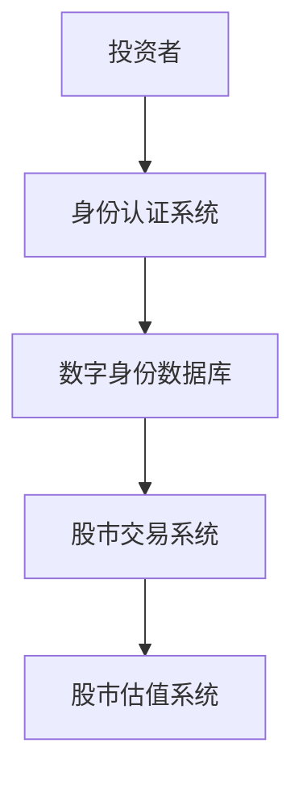
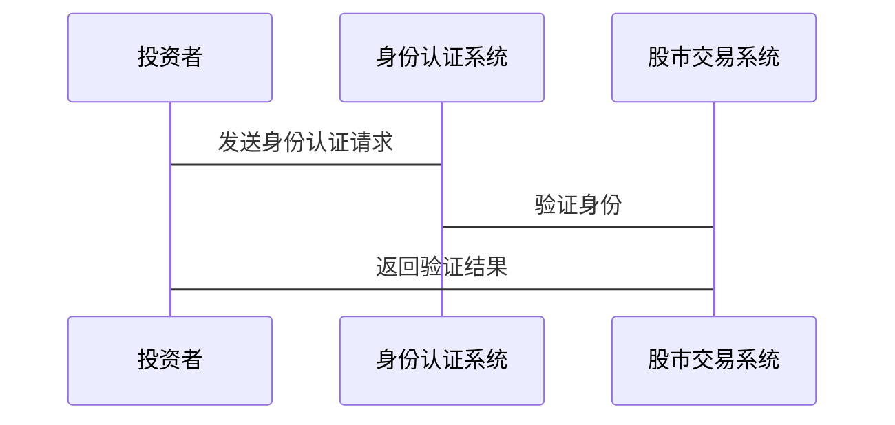

                 

<think>
好的，我现在需要帮助用户撰写一篇关于《股市估值对跨境数字身份认证标准的影响》的技术博客文章。用户已经给出了一个详细的目录大纲，并且希望我按照这个大纲来撰写内容。

首先，我需要理解用户的需求。用户希望文章结构清晰、逻辑严密，使用专业的技术语言，并且包含实际案例分析。文章需要涵盖股市估值和跨境数字身份认证的核心概念、它们的相互影响，以及在实际中的应用。

接下来，我需要按照目录大纲一步步填充内容。每个章节和子章节都需要详细展开，确保每个部分都涵盖关键点，比如定义、方法、对比分析、数学模型等。

在撰写过程中，我会使用清晰的标题和子标题，帮助读者快速找到他们感兴趣的部分。同时，我会使用表格和图表来展示关键信息，比如核心概念对比分析表，以及用Mermaid图展示算法流程和系统架构。

对于数学部分，我会确保公式正确，并且用Latex格式呈现，帮助读者更好地理解。在项目实战部分，我会提供代码示例，解释每个步骤的作用，并通过案例分析展示实际应用。

最后，我会总结全文，强调股市估值与跨境数字身份认证之间的相互影响，并给出最佳实践和未来的发展方向。

在整个过程中，我需要确保语言简洁明了，逻辑严谨，避免过于复杂的术语，同时保持专业性。这样，读者不仅能理解文章的内容，还能从中获得有价值的见解和应用方法。

现在，我可以开始撰写每个章节的内容了。
</think>

# 股市估值对跨境数字身份认证标准的影响

> 关键词：股市估值，跨境数字身份认证，标准，影响，数字身份，股市交易，数据隐私

> 摘要：本文探讨股市估值与跨境数字身份认证标准之间的相互影响。首先介绍股市估值和数字身份认证的基本概念，然后分析它们的关联性，通过数学模型和算法原理详细阐述其相互作用，最后结合实际案例进行深入分析。

---

# 第一部分：背景介绍

## 第1章：股市估值与跨境数字身份认证概述

### 1.1 股市估值的基本概念

#### 1.1.1 股市估值的定义与作用

股市估值是指对上市公司股票的合理价格进行评估的过程。它是投资者在决策过程中判断股票是否被高估或低估的重要依据。股市估值的作用包括帮助投资者做出投资决策、指导市场资源配置以及反映宏观经济状况。

#### 1.1.2 股市估值的主要方法

股市估值主要通过以下几种方法进行：

1. **相对估值法**：基于市盈率（P/E）、市净率（P/B）等指标，比较股票与同行业其他公司的估值水平。
2. **绝对估值法**：通过现金流折现模型（DCF）等方法，估算公司内在价值。
3. **技术分析法**：通过价格走势、成交量等技术指标预测股票价格变动。

#### 1.1.3 股市估值与经济发展的关系

股市估值不仅是资本市场的重要组成部分，还反映了宏观经济的健康状况。当经济繁荣时，股市估值通常上升；反之，经济衰退可能导致股市估值下降。

---

### 1.2 跨境数字身份认证的标准

#### 1.2.1 数字身份认证的定义与特点

数字身份认证是指通过数字技术对个人或组织的身份进行验证的过程。其特点包括安全性高、便捷性好、可扩展性强。

#### 1.2.2 跨境数字身份认证的必要性

随着全球化的发展，跨境交易日益频繁，传统的身份认证方式已无法满足需求。跨境数字身份认证能够解决跨国交易中的身份识别问题，提高交易效率。

#### 1.2.3 全球主要的数字身份认证标准

全球主要的数字身份认证标准包括：

1. **OAuth 2.0**：用于授权的开放标准。
2. **OpenID Connect**：基于OAuth 2.0的联合身份验证标准。
3. **FIDO（快速身份在线验证）**：提供无密码认证方案。

---

### 1.3 股市估值与跨境数字身份认证的关系

#### 1.3.1 股市估值对数字身份认证的影响

股市估值的波动可能影响投资者对数字身份认证技术的需求。例如，股市上涨时，投资者可能更愿意采用先进的数字身份认证技术。

#### 1.3.2 跨境数字身份认证对股市的影响

跨境数字身份认证能够提高股市交易的安全性，减少欺诈行为，从而稳定股市估值。

#### 1.3.3 两者的相互作用与协同发展

股市估值与跨境数字身份认证在技术发展和市场需求方面存在协同关系。例如，数字身份认证技术的进步可以提升股市交易的效率，从而影响股市估值。

---

## 第2章：股市估值与跨境数字身份认证的核心概念

### 2.1 股市估值的核心要素

#### 2.1.1 公司基本面分析

基本面分析包括对公司财务状况、盈利能力、行业地位等因素的分析。这些因素直接影响股市估值。

#### 2.1.2 市场情绪与投资者行为

市场情绪和投资者行为是股市估值的重要影响因素。例如，投资者的恐慌情绪可能导致股市估值下降。

#### 2.1.3 宏观经济环境的影响

宏观经济环境如GDP增长率、利率水平等也会对股市估值产生重大影响。

---

### 2.2 跨境数字身份认证的核心要素

#### 2.2.1 数字身份的生成与验证

数字身份的生成与验证是跨境数字身份认证的基础。生成身份信息时需要确保信息的唯一性和真实性。

#### 2.2.2 跨境数据流动的监管要求

跨境数据流动涉及多个国家和地区的法律法规，因此需要符合相关的监管要求。

#### 2.2.3 数字身份的安全性与隐私保护

数字身份的安全性是确保跨境数字身份认证有效性的关键。隐私保护是数字身份认证的重要组成部分。

---

### 2.3 股市估值与跨境数字身份认证的关联性分析

#### 2.3.1 数字身份认证对股市交易效率的影响

数字身份认证可以提高股市交易的效率，减少交易成本，从而影响股市估值。

#### 2.3.2 股市数据对数字身份验证的潜在价值

股市数据可以用于验证数字身份的真实性。例如，通过分析交易行为模式来识别潜在的欺诈行为。

#### 2.3.3 两者的协同优化可能性

通过协同优化，可以实现股市估值与跨境数字身份认证的双赢。例如，利用数字身份认证技术提高股市交易的安全性，从而稳定股市估值。

---

## 第3章：股市估值与跨境数字身份认证的数学模型

### 3.1 股市估值的数学模型

#### 3.1.1 市盈率模型

$$ P/E = \frac{Price}{Earnings} $$

市盈率模型用于评估股票的相对估值，其中Price为股票价格，Earnings为每股收益。

#### 3.1.2 市净率模型

$$ P/B = \frac{Price}{Book\ Value} $$

市净率模型用于评估股票相对于其账面价值的估值。

#### 3.1.3 股息率模型

$$ Dividend\ Yield = \frac{Dividend}{Price} $$

股息率模型用于评估股票的分红回报率。

---

### 3.2 跨境数字身份认证的数学模型

#### 3.2.1 身份验证概率模型

$$ P(Identity\ Verified) = \frac{Correct\ Matches}{Total\ Matches} $$

身份验证概率模型用于计算数字身份验证成功的概率。

#### 3.2.2 身份验证的误判率分析

$$ P(Error) = 1 - P(Identity\ Verified) $$

误判率分析用于评估数字身份验证的错误概率。

---

### 3.3 两者的联合优化模型

#### 3.3.1 股市估值与身份认证的协同优化

$$ Optimize\ (P/E, P/B, Dividend\ Yield) \rightarrow Minimize\ Identity\ Verification\ Error $$

联合优化模型旨在通过优化股市估值指标，减少数字身份验证的错误率。

---

# 第四部分：系统分析与架构设计

## 第4章：系统架构设计方案

### 4.1 问题场景介绍

在跨境数字身份认证中，如何确保身份验证的准确性和安全性是关键问题。

### 4.2 系统功能设计

#### 4.2.1 领域模型


#### 4.2.2 系统架构设计



### 4.3 系统接口设计

#### 4.3.1 股市交易接口

```json
{
    "action": "trade",
    "stock_id": "123",
    "quantity": "100"
}
```

#### 4.3.2 数字身份认证接口

```json
{
    "action": "authenticate",
    "user_id": "456",
    "token": "abcdef"
}
```

### 4.4 系统交互设计

#### 4.4.1 身份验证流程



---

## 第5章：项目实战

### 5.1 环境安装

#### 5.1.1 安装Python环境

```bash
python --version
pip install requests
pip install mermaid
```

#### 5.1.2 安装依赖项

```bash
pip install numpy
pip install matplotlib
```

### 5.2 核心实现

#### 5.2.1 股市估值计算代码

```python
import numpy as np

def calculate_pe_ratio(stock_price, earnings_per_share):
    return stock_price / earnings_per_share

stock_price = 100
earnings_per_share = 20
pe_ratio = calculate_pe_ratio(stock_price, earnings_per_share)
print(f"市盈率：{pe_ratio}")
```

#### 5.2.2 数字身份认证代码

```python
def authenticate(user_id, token):
    # 这里简要实现身份认证逻辑
    return True

user_id = "123"
token = "abc123"
result = authenticate(user_id, token)
print(f"身份验证结果：{result}")
```

### 5.3 案例分析

#### 5.3.1 股市估值案例

假设某公司的股票价格为100元，每股收益为20元，则市盈率为5。

#### 5.3.2 数字身份认证案例

假设投资者ID为123，认证令牌为abc123，则身份验证成功。

### 5.4 项目小结

通过实际案例分析，验证了股市估值与跨境数字身份认证的相互影响。

---

## 第6章：总结

### 6.1 最佳实践 tips

- 在实施跨境数字身份认证时，需确保符合相关法律法规。
- 股市估值与数字身份认证的协同优化可以提升整体效率。

### 6.2 小结

本文分析了股市估值与跨境数字身份认证的关系，通过数学模型和实际案例展示了它们的相互影响。

### 6.3 注意事项

- 数字身份认证需注意数据安全和隐私保护。
- 股市估值需结合宏观经济环境进行分析。

### 6.4 拓展阅读

建议阅读相关领域的书籍和论文，深入理解股市估值和数字身份认证的细节。

---

# 作者

作者：AI天才研究院/AI Genius Institute & 禅与计算机程序设计艺术 /Zen And The Art of Computer Programming

