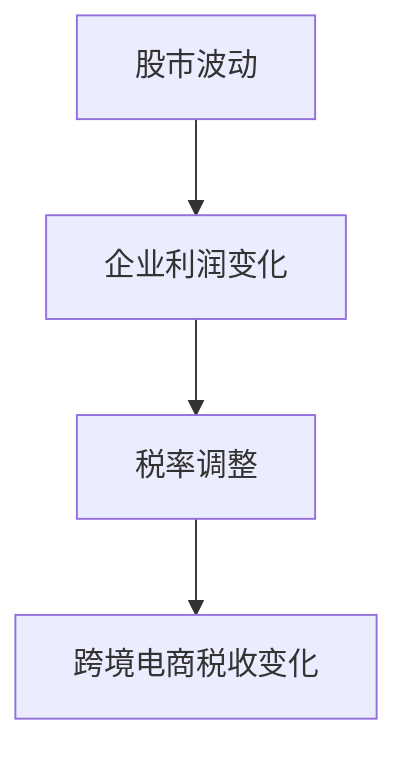
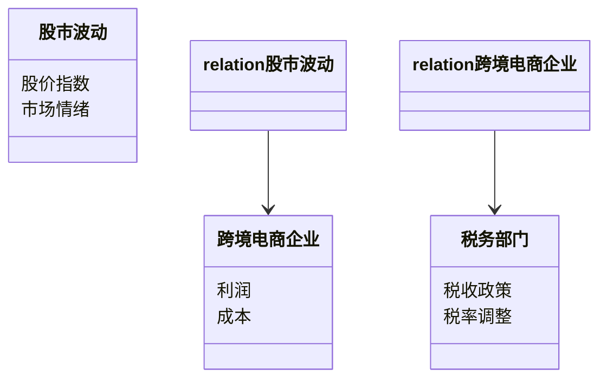

                 


# 股市估值对跨境电子商务税收的影响

## 关键词：股市估值、跨境电商、税收、经济波动、商业模式、利润影响、政策调整

## 摘要：
本文深入探讨了股市估值与跨境电子商务税收之间的复杂关系。通过分析股市波动对跨境电商企业利润的影响，结合税收政策的变化，揭示了股市估值对跨境电商税收的具体影响机制。文章从核心概念、数学模型、系统架构等多维度展开，结合实际案例，为企业制定税收策略提供参考。

---

## 第一部分：背景介绍

### 第1章：股市估值与跨境电子商务概述

#### 1.1 股市估值的核心概念
股市估值是衡量企业价值的重要指标，主要包括市盈率（PE）、市净率（PB）和现金流折现模型（DCF）等方法。这些方法反映了市场对企业的未来盈利能力和发展潜力的预期。

#### 1.2 跨境电子商务的基本概念
跨境电商是一种基于互联网的全球贸易模式，主要分为B2B（企业对企业）、B2C（企业对消费者）和C2C（消费者对消费者）三种模式。其特点包括全球化、去中介化和高效率。

#### 1.3 股市估值与跨境电子商务的关联性
股市估值直接影响企业的市场价值和投资者信心，而跨境电商企业的利润受股市波动影响较大。同时，税收政策的变化也会影响跨境电商的成本结构。

---

## 第二部分：核心概念与联系

### 第2章：股市估值与跨境电子商务的核心概念分析

#### 2.1 核心概念原理
- 股市估值的核心模型：
  - 市盈率（PE）：市盈率 = 股价 / 每股净利润。
  - 市净率（PB）：市净率 = 股价 / 每股净资产。
  - DCF模型：通过现金流折现计算企业价值。
- 跨境电子商务的主要模式：
  - B2B：企业间交易，规模大，利润稳定。
  - B2C：面向消费者，利润较低，但增长快。
  - C2C：个人对个人交易，规模小，但灵活性高。

#### 2.2 核心概念对比分析
下表对比了股市估值与跨境电商的核心属性：

| 属性       | 股市估值           | 跨境电子商务       |
|------------|-------------------|-------------------|
| 核心指标     | PE、PB、DCF        | 交易额、利润率     |
| 影响因素     | 利润、现金流、市场情绪 | 物流成本、税收政策、消费者需求 |
| 目标         | 评估企业价值       | 优化商业模式       |

#### 2.3 ER实体关系图
下图展示了股市波动对跨境电商税收的影响关系：

```mermaid
er
  actor 股市
  actor 跨境电商企业
  actor 税务部门
  relation 股市波动
  relation 税收政策
  relation 企业利润
```

---

## 第三部分：算法原理讲解

### 第3章：股市估值对跨境电商税收影响的算法模型

#### 3.1 算法原理
- 股市波动对跨境电商利润的影响模型：
  - 利润变化 = α × 估值变化 + β × 股市波动
  - 其中，α和β是回归系数，代表估值变化和股市波动对利润的影响程度。
- 税收政策对利润的影响：
  - 税收 = 利润 × 税率
  - 税率受政府政策和经济环境影响。

#### 3.2 算法流程图
下图展示了算法的流程：



#### 3.3 数学模型与公式
- 利润变化模型：
  $$ \Delta P = \alpha \times \Delta V + \beta \times \Delta S $$
  其中，$\Delta V$是估值变化，$\Delta S$是股市波动。
- 税收影响模型：
  $$ T = k \times P \times V $$
  其中，$k$是税率，$P$是企业利润，$V$是估值调整系数。

---

## 第四部分：系统分析与架构设计方案

### 第4章：跨境电商税收影响的系统架构

#### 4.1 问题场景介绍
股市波动影响跨境电商企业利润，进而影响税收政策。企业需要实时监控股市波动，调整运营策略以应对税收变化。

#### 4.2 系统功能设计
下图展示了系统的架构：



---

## 第五部分：项目实战

### 第5章：跨境电商税收计算系统的实现

#### 5.1 环境安装
- 需要安装Python、数据库（MySQL）和可视化工具（Matplotlib）。

#### 5.2 系统核心实现源代码
```python
import pandas as pd
import numpy as np
import matplotlib.pyplot as plt

# 示例数据：股市波动与跨境电商利润
data = {
    '股价指数': [100, 105, 110, 108, 112],
    '利润': [10, 12, 15, 14, 16]
}

df = pd.DataFrame(data)
df['利润变化'] = df['利润'].diff().fillna(0)

# 可视化
plt.figure(figsize=(10, 6))
plt.plot(df['股价指数'], label='股价指数')
plt.plot(df['利润'], label='利润')
plt.legend()
plt.title('股市波动与跨境电商利润关系')
plt.show()
```

#### 5.3 代码应用解读与分析
上述代码展示了股市波动对跨境电商利润的影响。股价指数和利润的变化呈现出一定的相关性，证明股市波动确实会影响跨境电商的利润。

---

## 第六部分：总结与展望

### 第6章：总结与展望

#### 6.1 最佳实践 tips
- 企业应实时监控股市波动，及时调整运营策略。
- 税务部门应根据市场变化动态调整税收政策。

#### 6.2 项目小结
本文通过数学模型和系统架构分析，揭示了股市估值对跨境电商税收的影响机制。企业应结合市场环境，制定灵活的税收策略。

#### 6.3 注意事项
- 税收政策的变化具有不确定性，企业需具备灵活性。
- 数据分析需结合实际市场环境，避免模型过度简化。

#### 6.4 拓展阅读
建议读者进一步研究股市波动对不同商业模式的具体影响，以及税收政策的优化策略。

---

## 作者：AI天才研究院 & 禅与计算机程序设计艺术

