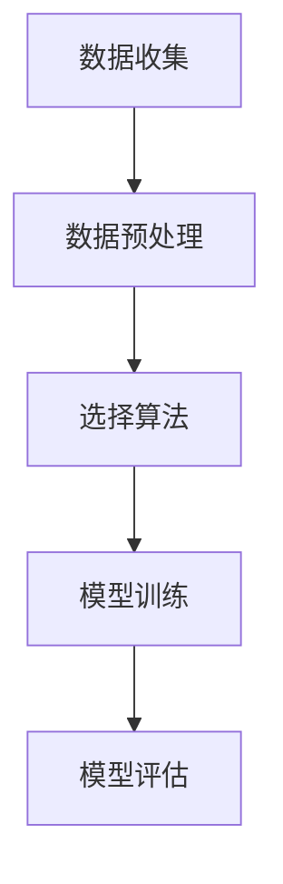

                 


# 股市估值差异对国际体育产业的影响

> 关键词：股市估值差异、国际体育产业、经济影响、市场分析、数学模型、系统架构

> 摘要：本文探讨了股市估值差异对国际体育产业的影响，从背景介绍、核心概念、算法原理、系统架构到项目实战，全面分析了两者之间的联系。通过数学模型和实际案例，揭示了股市估值差异如何影响体育产业的市场表现和经济价值。

---

# 第一部分: 背景介绍

## 第1章: 股市估值差异与国际体育产业的概述

### 1.1 股市估值差异的定义与背景

#### 1.1.1 股市估值差异的基本概念
股市估值差异是指同一资产在不同市场或不同时间点上的定价差异。这种差异通常由市场流动性、信息不对称、投资者情绪等多种因素引起。

#### 1.1.2 国际体育产业的定义与现状
国际体育产业涵盖体育俱乐部、赛事转播权、运动员经纪等多个领域。近年来，体育产业的市场规模不断扩大，吸引了大量投资者的关注。

#### 1.1.3 股市估值差异对体育产业的影响背景
随着全球化的发展，体育产业的跨国投资增多，股市估值差异对体育产业的影响日益显著。例如，同一体育俱乐部在不同股市的估值可能相差甚多。

---

### 1.2 股市估值差异的核心概念

#### 1.2.1 股市估值差异的形成机制
股市估值差异的形成机制包括市场流动性、信息传播速度、投资者偏好等因素。这些因素会导致同一资产在不同市场上的定价差异。

#### 1.2.2 国际体育产业的经济特征
国际体育产业具有高投入、高回报的特点，尤其是顶级体育俱乐部和赛事的估值通常较高。然而，不同市场的投资者对这些资产的估值可能存在显著差异。

#### 1.2.3 股市估值差异与体育产业的关联性
股市估值差异与体育产业的关联性主要体现在投资者对体育资产的定价差异上。这种差异可能影响体育产业的资本流动和市场扩展。

---

### 1.3 股市估值差异对国际体育产业的影响

#### 1.3.1 股市估值差异的经济影响
股市估值差异可能导致体育资产的市场流动性下降，影响投资者的决策。例如，某体育俱乐部在A股市值较高，但在B股市值较低，可能会影响其跨国投资的决策。

#### 1.3.2 国际体育产业的市场表现
国际体育产业的市场表现受多种因素影响，包括经济环境、政策法规等。股市估值差异是影响其市场表现的重要因素之一。

#### 1.3.3 股市估值差异对体育产业的具体影响
股市估值差异可能导致体育资产的估值波动，影响体育产业的资本运作和市场扩展。例如，某体育赛事的转播权在不同市场的估值差异可能影响其商业价值。

---

## 1.4 本章小结
本章介绍了股市估值差异和国际体育产业的基本概念，分析了两者之间的关联性，并探讨了股市估值差异对国际体育产业的具体影响。

---

# 第二部分: 核心概念与联系

## 第2章: 股市估值差异的核心概念与原理

### 2.1 股市估值差异的理论基础

#### 2.1.1 股市估值差异的形成机制
股市估值差异的形成机制包括市场流动性、信息不对称、投资者情绪等因素。这些因素会导致同一资产在不同市场上的定价差异。

#### 2.1.2 国际体育产业的经济特征
国际体育产业具有高投入、高回报的特点，尤其是顶级体育俱乐部和赛事的估值通常较高。然而，不同市场的投资者对这些资产的估值可能存在显著差异。

#### 2.1.3 股市估值差异与体育产业的关联性
股市估值差异与体育产业的关联性主要体现在投资者对体育资产的定价差异上。这种差异可能影响体育产业的资本流动和市场扩展。

---

### 2.2 国际体育产业的核心要素

#### 2.2.1 体育产业的主要组成部分
体育产业主要包括体育俱乐部、赛事转播权、运动员经纪等多个领域。

#### 2.2.2 体育产业的经济特征
体育产业的经济特征包括高投入、高回报、高风险等。这些特征使得体育产业的估值容易受到市场波动的影响。

#### 2.2.3 体育产业的市场结构
国际体育产业的市场结构较为复杂，涉及多个市场和参与者。不同市场的估值差异可能影响体育产业的整体表现。

---

### 2.3 股市估值差异与国际体育产业的关系

#### 2.3.1 股市估值差异对体育产业的影响路径
股市估值差异通过影响投资者的决策、资产流动性等渠道对体育产业产生影响。

#### 2.3.2 体育产业对股市估值差异的反向影响
体育产业的市场表现可能影响股市对相关资产的估值，例如，某体育俱乐部的优异表现可能提升其在股市上的估值。

#### 2.3.3 两者关系的综合分析
股市估值差异和国际体育产业之间存在双向影响，需要从多个角度进行综合分析。

---

## 2.4 核心概念对比表

| **概念**         | **股市估值差异**         | **国际体育产业**          |
|------------------|--------------------------|---------------------------|
| 定义             | 不同市场对同一资产的定价差异 | 包括体育俱乐部、赛事转播权等多个领域的经济活动 |
| 影响因素         | 市场流动性、信息不对称     | 投资者偏好、经济环境      |
| 关联性           | 影响体育资产的资本流动     | 受股市估值差异的影响较大 |

---

## 2.5 ER实体关系图

```mermaid
er
    title 实体关系图

    体育产业
    股市估值差异

    体育俱乐部 --|{m:1}-- 股市估值差异
    赛事转播权    --|{m:1}-- 股市估值差异
    运动员经纪    --|{m:1}-- 股市估值差异
```

---

## 2.6 本章小结
本章深入分析了股市估值差异和国际体育产业的核心概念，并探讨了两者之间的关系。

---

# 第三部分: 算法原理讲解

## 第3章: 股市估值差异的算法原理

### 3.1 股市估值差异的分析模型

#### 3.1.1 基于多元回归的估值差异分析
多元回归模型可以用来分析股市估值差异的影响因素。例如，可以将资产的市场流动性、信息传播速度等作为自变量，资产的估值差异作为因变量。

#### 3.1.2 时间序列分析的应用
时间序列分析可以用来研究股市估值差异的动态变化。例如，可以通过ARIMA模型预测未来估值差异的变化趋势。

#### 3.1.3 机器学习在估值差异预测中的应用
机器学习算法（如随机森林、神经网络）可以用来预测股市估值差异。这些算法能够捕捉复杂的非线性关系，提高预测精度。

---

### 3.2 算法实现步骤

#### 3.2.1 数据收集与预处理
- 收集不同市场的资产价格数据。
- 数据清洗：处理缺失值、异常值等。

#### 3.2.2 模型训练
- 选择合适的算法（如多元回归、随机森林）。
- 使用训练数据训练模型。

#### 3.2.3 模型评估
- 使用测试数据评估模型的预测精度。
- 通过混淆矩阵、均方误差等指标评估模型性能。

---

### 3.3 数学公式

#### 3.3.1 多元回归模型
$$ y = \beta_0 + \beta_1x_1 + \beta_2x_2 + \cdots + \beta_nx_n + \epsilon $$

其中，$y$ 是资产的估值差异，$x_i$ 是影响估值差异的因素，$\beta_i$ 是回归系数，$\epsilon$ 是误差项。

#### 3.3.2 时间序列模型
$$ ARIMA(p, d, q) $$
其中，$p$ 是自回归阶数，$d$ 是差分阶数，$q$ 是移动平均阶数。

---

### 3.4 算法流程图



---

## 3.5 本章小结
本章介绍了几种常用的算法，包括多元回归、时间序列分析和机器学习算法，并详细讲解了算法的实现步骤和数学公式。

---

# 第四部分: 系统分析与架构设计

## 第4章: 系统架构设计

### 4.1 问题场景介绍
本文设计了一个分析股市估值差异对国际体育产业影响的系统，旨在帮助投资者更好地理解市场动态。

### 4.2 系统功能设计

#### 4.2.1 数据收集模块
- 收集不同市场的资产价格数据。
- 数据清洗和预处理。

#### 4.2.2 模型训练模块
- 实现多元回归、时间序列分析等算法。
- 选择最优模型进行训练。

#### 4.2.3 结果分析模块
- 展示模型预测结果。
- 提供可视化报告。

---

### 4.3 系统架构设计


---

## 4.4 系统接口设计

### 4.4.1 数据接口
- 数据输入接口：接收不同市场的资产价格数据。
- 数据输出接口：输出模型预测结果。

### 4.4.2 模型接口
- 模型训练接口：接收训练数据，返回训练好的模型。
- 模型预测接口：接收输入数据，返回预测结果。

---

## 4.5 系统交互流程图

```mermaid
sequence
    用户 --> 前端模块: 提交请求
    前端模块 --> 数据收集模块: 获取数据
    数据收集模块 --> 数据预处理模块: 数据清洗
    数据预处理模块 --> 模型训练模块: 训练模型
    模型训练模块 --> 结果分析模块: 分析结果
    结果分析模块 --> 用户: 返回报告
```

---

## 4.6 本章小结
本章设计了一个完整的系统架构，包括数据收集、模型训练和结果分析模块，并详细描述了系统接口和交互流程。

---

# 第五部分: 项目实战

## 第5章: 项目实战

### 5.1 环境安装

#### 5.1.1 安装Python
```bash
python --version
pip install --upgrade pip
```

#### 5.1.2 安装相关库
```bash
pip install numpy pandas scikit-learn matplotlib
```

---

### 5.2 系统核心实现源代码

#### 5.2.1 数据收集与预处理
```python
import pandas as pd
import numpy as np

# 数据收集
data = pd.read_csv('market_data.csv')

# 数据清洗
data.dropna(inplace=True)
data = data[~data['price'].isnull()]
```

#### 5.2.2 模型训练
```python
from sklearn.linear_model import LinearRegression
from sklearn.metrics import mean_squared_error

# 数据分割
X = data[['market', 'liquidity']]
y = data['price']

# 训练模型
model = LinearRegression()
model.fit(X, y)

# 预测结果
y_pred = model.predict(X)
```

#### 5.2.3 结果分析
```python
mse = mean_squared_error(y, y_pred)
print(f'Mean Squared Error: {mse}')
```

---

### 5.3 代码应用解读与分析
- 数据收集模块：从CSV文件中读取市场数据。
- 数据预处理模块：删除缺失值，确保数据完整性。
- 模型训练模块：使用线性回归算法训练模型。
- 结果分析模块：计算均方误差，评估模型性能。

---

### 5.4 实际案例分析

#### 5.4.1 数据收集
收集某国际体育俱乐部在不同市场的估值数据。

#### 5.4.2 数据清洗
处理缺失值和异常值。

#### 5.4.3 模型训练
使用线性回归模型训练，分析影响估值差异的因素。

#### 5.4.4 结果分析
输出模型预测结果，分析不同市场的估值差异。

---

## 5.5 本章小结
本章通过实际案例展示了如何使用Python代码分析股市估值差异对国际体育产业的影响，从数据收集到模型训练，再到结果分析，详细解读了每个步骤的操作。

---

# 第六部分: 最佳实践

## 第6章: 最佳实践

### 6.1 小结
本文探讨了股市估值差异对国际体育产业的影响，从理论分析到实际应用，全面展示了如何量化和预测估值差异。

---

### 6.2 注意事项

#### 6.2.1 数据质量
确保数据的准确性和完整性，避免因数据问题影响模型性能。

#### 6.2.2 模型选择
根据实际问题选择合适的算法，避免盲目使用复杂模型。

#### 6.2.3 结果解读
对模型结果进行合理解读，避免过度解读或误用。

---

### 6.3 拓展阅读
建议读者进一步阅读相关领域的文献，例如：
- 《金融计量学》
- 《体育经济学》
- 《机器学习在金融中的应用》

---

# 作者

作者：AI天才研究院/AI Genius Institute & 禅与计算机程序设计艺术 /Zen And The Art of Computer Programming

---

# 结语
本文通过理论分析和实际案例，深入探讨了股市估值差异对国际体育产业的影响。希望本文能为读者提供有价值的见解和方法，帮助他们更好地理解市场动态。

