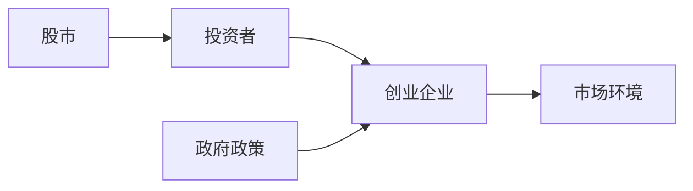

                 


# 股市估值差异对国际创业生态系统的影响

## 关键词：股市估值差异, 创业生态系统, 国际化, 估值差异影响, 创业者, 投资者

## 摘要：
股市估值差异对国际创业生态系统的影响是一个复杂而重要的议题。本文从股市估值差异的定义与背景出发，分析其对创业生态系统的核心要素、利益相关者及生态系统结构的影响。通过对比分析、理论模型构建、算法原理及数学模型的应用，揭示估值差异如何影响创业机会、融资渠道及整体市场环境。最后，本文总结了估值差异对国际创业生态系统的多维度影响，并提出相应的建议与解决方案。

---

# 第一部分: 背景介绍与核心概念

## 第1章: 股市估值差异与国际创业生态系统概述

### 1.1 股市估值差异的定义与背景
#### 1.1.1 股市估值的基本概念
股市估值是指对一家公司股票的内在价值进行评估，通常基于财务指标（如市盈率、市净率等）和市场因素（如市场需求、宏观经济环境等）。股市估值差异则指同一市场内不同股票或不同市场间股票估值的差异。

#### 1.1.2 估值差异的形成原因
估值差异的形成主要由以下几个因素引起：
1. **市场效率**：信息不对称、市场参与者行为差异导致不同股票估值差异。
2. **宏观经济因素**：利率、通货膨胀、政策变化等影响整体市场估值水平。
3. **行业特性**：不同行业的成长性、风险差异导致估值差异。
4. **投资者情绪**：市场参与者情绪波动影响短期估值。

#### 1.1.3 国际化视角下的估值差异特点
在国际化背景下，不同国家的股市估值差异更加显著，主要由于各国经济发展水平、政策环境、市场结构等因素的差异。

### 1.2 国际创业生态系统的核心要素
#### 1.2.1 创业生态系统的定义
创业生态系统是指支持创业活动的各种要素的集合，包括创业者、投资者、政府、金融机构、科技企业等。

#### 1.2.2 创业生态系统的构成要素
1. **创业者**：核心推动者。
2. **投资者**：提供资金支持。
3. **金融机构**：提供融资服务。
4. **政府政策**：法规、税收优惠等。
5. **科技企业**：创新环境。

#### 1.2.3 国际化创业生态系统的特征
1. **多样性**：不同国家的政策、市场环境差异显著。
2. **互动性**：跨国资本流动、技术转移频繁。
3. **复杂性**：涉及多利益相关者，关系错综复杂。

## 第2章: 股市估值差异对创业生态系统的影响机制

### 2.1 估值差异与创业机会的关系
#### 2.1.1 估值差异如何影响创业机会的识别
低估值市场可能提供被低估的创业机会，而高估值市场可能抑制创业者的积极性。

#### 2.1.2 不同市场间的估值差异对创业的影响
跨国资本流动受估值差异驱动，可能导致资源分配不均，影响创业活动。

#### 2.1.3 估值差异对创业企业融资的影响
高估值市场可能吸引更多投资者，而低估值市场融资难度增加。

### 2.2 创业生态系统中的利益相关者分析
#### 2.2.1 创业者与投资者的角色
创业者寻求资金支持，投资者寻找高回报项目。

#### 2.2.2 金融机构与市场的互动
金融机构通过贷款、投资等方式连接创业者和市场。

#### 2.2.3 政府政策与法规的影响
政府政策直接影响市场环境和创业企业的生存空间。

---

# 第二部分: 核心概念与理论框架

## 第3章: 股市估值差异的理论分析

### 3.1 估值差异的经济学解释
#### 3.1.1 市场分割理论
市场分割理论认为，不同市场间存在壁垒，导致估值差异。

#### 3.1.2 信息不对称理论
信息不对称导致买卖双方估值差异，影响市场效率。

#### 3.1.3 资本流动与市场效率
资本从低估值市场流向高估值市场，影响整体市场效率。

### 3.2 创业生态系统中的博弈论模型
#### 3.2.1 创业者与投资者的博弈分析
创业者与投资者之间存在收益分配的博弈，影响估值差异。

#### 3.2.2 创业生态系统中的多方博弈
政府、投资者、创业者等多个利益相关者博弈，影响市场环境。

#### 3.2.3 博弈论对估值差异的影响
博弈论模型解释了估值差异的形成机制及其对创业生态系统的复杂影响。

## 第4章: 核心概念的对比分析

### 4.1 股市估值差异与创业生态系统的核心要素对比
#### 4.1.1 估值差异的维度分析
从市盈率、市净率等维度分析估值差异。

#### 4.1.2 创业生态系统要素的层次分析
从微观到宏观分析创业生态系统的构成。

#### 4.1.3 两者对比的特征总结
估值差异与创业生态系统要素相互影响，形成复杂的关系网络。

### 4.2 创业生态系统中的实体关系图


---

# 第三部分: 算法原理与数学模型

## 第5章: 估值差异的量化分析

### 5.1 估值差异的计算方法
#### 5.1.1 相对估值法
通过比较同类企业的估值指标，计算目标企业的估值。

#### 5.1.2 绝对估值法
基于DCF模型等方法，计算企业内在价值。

#### 5.1.3 市场指数法
通过市场指数波动，分析整体估值差异。

### 5.2 创业生态系统中估值差异的算法实现


## 第6章: 数学模型与公式

### 6.1 估值差异的回归模型
$$ y = \beta_0 + \beta_1x_1 + \beta_2x_2 + \epsilon $$

### 6.2 创业生态系统中的博弈模型
$$ V = \max_{i} \min_{j} v_{ij} $$

---

# 第四部分: 系统分析与架构设计

## 第7章: 系统分析与架构设计方案

### 7.1 问题场景介绍
跨国创业企业在不同市场的估值差异影响其融资和扩张。

### 7.2 系统功能设计
- 数据收集模块：收集各市场的估值数据。
- 模型计算模块：计算估值差异。
- 报告生成模块：生成分析报告。

### 7.3 系统架构设计


---

# 第五部分: 项目实战与案例分析

## 第8章: 项目实战

### 8.1 环境安装
安装Python、Pandas、NumPy等工具。

### 8.2 核心代码实现
```python
import pandas as pd

# 计算市盈率
def calculate_PEG(df):
    df['PEG'] = df['市盈率'] / df['盈利增长率']
    return df

# 示例数据
data = {'公司': ['A', 'B', 'C'],
         '市盈率': [15, 20, 25],
         '盈利增长率': [5, 10, 15]}
df = pd.DataFrame(data)
calculate_PEG(df)
```

### 8.3 案例分析
分析某跨国企业的估值差异对创业生态系统的影响。

---

# 第六部分: 总结与展望

## 第9章: 总结与建议

### 9.1 核心结论
估值差异显著影响国际创业生态系统的资源配置和市场效率。

### 9.2 优化建议
- 提高市场透明度，减少信息不对称。
- 制定合理政策，促进资源合理分配。

### 9.3 未来展望
研究如何利用技术手段优化估值模型，提升市场效率。

---

# 作者：AI天才研究院/AI Genius Institute & 禅与计算机程序设计艺术 /Zen And The Art of Computer Programming

