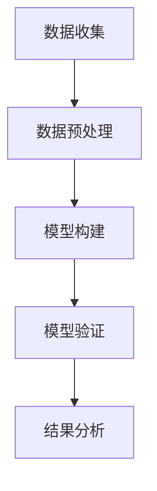
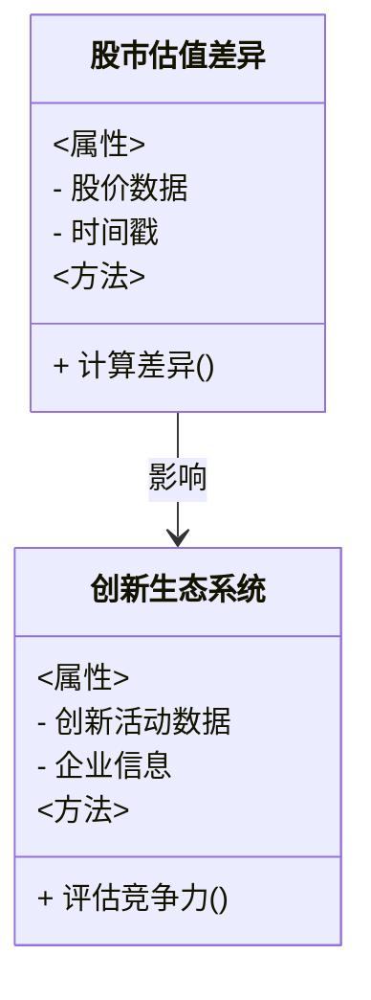

                 


```markdown
# 股市估值差异对国际创新生态系统竞争力的影响

> 关键词：股市估值差异，创新生态系统，竞争力，数学模型，系统设计，项目实战

> 摘要：本文探讨了股市估值差异对国际创新生态系统竞争力的影响，通过分析股市估值差异的形成机制，构建数学模型，设计系统架构，并通过实际案例分析，提出提升创新生态系统竞争力的策略。

---

# 第一部分: 背景介绍

## 第1章: 股市估值差异的基本概念

### 1.1 问题背景

#### 1.1.1 股市估值差异的定义
股市估值差异是指同一股票在不同市场或同一市场不同时间点的估值差异。这种差异通常由市场参与者的预期、信息不对称和市场波动等因素引起。

#### 1.1.2 问题的提出与研究意义
股市估值差异不仅影响投资者的决策，还对企业的创新活动产生深远影响。创新生态系统由企业、研究机构、投资者等组成，其竞争力依赖于高效的资源配置和信息流动。

#### 1.1.3 研究目标与边界
本文旨在分析股市估值差异如何影响创新生态系统的竞争力，重点关注技术驱动型企业的创新活动。

### 1.2 问题描述

#### 1.2.1 股市估值差异的形成机制
- 信息不对称：投资者掌握的信息不同，导致估值差异。
- 市场情绪：投资者情绪波动影响股票估值。
- 市场结构：不同市场的交易规则和监管政策导致估值差异。

#### 1.2.2 创新生态系统的基本特征
- 复杂性：涉及多方利益相关者。
- 互动性：各方合作推动创新。
- 可持续性：生态系统需持续优化以维持竞争力。

#### 1.2.3 问题的复杂性与挑战
- 数据获取困难：需要多源数据支持分析。
- 模型构建复杂：需综合考虑多种因素。
- 实证分析难度大：需长期跟踪观察。

## 第2章: 核心概念与联系

### 2.1 核心概念的原理

#### 2.1.1 股市估值差异的数学模型
股市估值差异可以用以下公式表示：
$$ V = |P_t - P_{t'}| $$
其中，\( V \) 是估值差异，\( P_t \) 是时间 \( t \) 的股价，\( P_{t'} \) 是时间 \( t' \) 的股价。

#### 2.1.2 创新生态系统的核心要素
创新生态系统包括：
1. 创业者：推动创新的核心力量。
2. 投资者：提供资金支持。
3. 研究机构：提供技术支持。
4. 政府：制定政策法规。

#### 2.1.3 两者之间的关系
股市估值差异通过影响投资者信心、资金流动，进而影响创新生态系统的资源配置和创新活动。

### 2.2 概念属性特征对比表格

```markdown
| 概念         | 特性1 | 特性2 | 特性3 |
|--------------|-------|-------|-------|
| 股市估值差异 | 数值化 | 动态性 | 可测量性 |
| 创新生态系统 | 复杂性 | 互动性 | 可持续性 |
```

### 2.3 ER实体关系图

```mermaid
erd
    股市估值差异
    创新生态系统
    股市估值差异 --> 创新生态系统: 影响
```

---

# 第二部分: 数学模型与算法原理

## 第3章: 数学模型与公式

### 3.1 股市估值差异的影响机制

#### 3.1.1 影响机制的数学模型
$$ V = f(S, I) $$
其中，\( V \) 表示股市估值差异，\( S \) 表示创新生态系统，\( I \) 表示其他影响因素。

#### 3.1.2 创新生态系统竞争力的评估
$$ C = g(V, E) $$
其中，\( C \) 表示创新生态系统竞争力，\( V \) 表示股市估值差异，\( E \) 表示其他评估指标。

### 3.2 详细讲解与举例

#### 3.2.1 模型的详细推导
1. 数据收集：收集不同市场的股票价格数据。
2. 数据预处理：标准化处理，消除市场波动影响。
3. 模型构建：建立回归模型，分析估值差异与创新竞争力的关系。
4. 模型验证：使用历史数据验证模型的有效性。

#### 3.2.2 实际案例分析
以某科技公司为例，分析其在不同市场的估值差异如何影响其创新活动。

---

## 第4章: 算法原理

### 4.1 算法原理

#### 4.1.1 算法步骤
1. 数据收集：收集相关股票的市场数据。
2. 数据预处理：清洗数据，处理缺失值。
3. 模型构建：建立回归模型，分析估值差异与创新竞争力的关系。
4. 模型验证：使用测试数据验证模型的准确性。
5. 结果分析：解读模型结果，提出优化建议。

### 4.2 算法流程图



---

# 第三部分: 系统分析与架构设计

## 第5章: 系统分析与架构设计

### 5.1 系统功能设计

#### 5.1.1 领域模型



### 5.2 系统架构设计


---

# 第四部分: 项目实战

## 第6章: 项目实战

### 6.1 环境配置

```bash
# 安装所需库
pip install pandas numpy matplotlib
```

### 6.2 系统核心实现源代码

```python
import pandas as pd
import numpy as np
import matplotlib.pyplot as plt

# 示例数据
data = {'市场': ['A', 'B', 'C'], '估值差异': [1.2, 2.5, 1.8]}
df = pd.DataFrame(data)

# 可视化
plt.bar(df['市场'], df['估值差异'])
plt.title('股市估值差异')
plt.show()
```

### 6.3 实际案例分析

#### 6.3.1 案例分析
以某科技公司为例，分析其在不同市场的估值差异如何影响其创新活动。

---

# 第五部分: 总结与展望

## 第7章: 总结与展望

### 7.1 项目小结
通过本文的分析，我们得出股市估值差异对创新生态系统竞争力有显著影响。建议企业关注市场估值差异，优化资源配置。

### 7.2 注意事项
- 数据收集的准确性
- 模型的适用性
- 政策环境的影响

### 7.3 拓展阅读
推荐相关书籍和论文，供读者深入学习。

---

# 作者

作者：AI天才研究院/AI Genius Institute & 禅与计算机程序设计艺术 /Zen And The Art of Computer Programming
```

