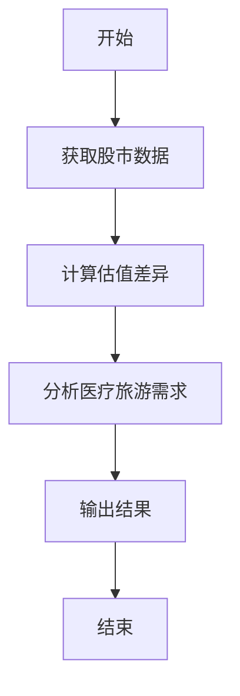
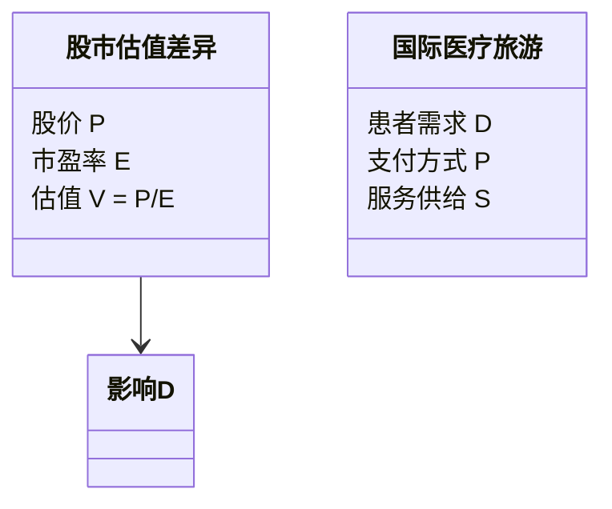
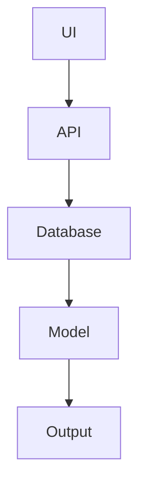

                 

<think>
好，我现在需要帮助用户完成他们的任务。用户提供了一个详细的查询，要求撰写一篇关于股市估值差异对国际医疗旅游影响的技术博客文章。我首先需要仔细分析用户的要求，理解他们的需求，然后一步步构建文章的结构。

首先，用户希望文章的标题是《股市估值差异对国际医疗旅游的影响》，并提供了关键词和摘要。关键词包括股市估值差异、国际医疗旅游、经济驱动因素、投资吸引力、区域经济差异、跨境医疗消费、投资收益评估等。摘要部分需要简明扼要地概述文章的核心内容，强调股市估值差异对国际医疗旅游的影响机制及其经济意义。

接下来，用户要求文章的目录结构，包括多个章节，每个章节下有详细的子章节。他们特别提到要使用技术术语，逻辑清晰，结构紧凑，语言专业但简单易懂。同时，用户希望文章包含背景介绍、核心概念分析、算法原理、系统设计和项目实战等内容。

在思考过程中，我需要考虑每个章节的具体内容，确保覆盖所有必要的部分。例如，在背景介绍部分，需要详细解释股市估值差异和国际医疗旅游的基本概念，并分析它们之间的关系。核心概念与联系章节需要构建ER实体关系图和属性对比表，以展示两者之间的关联。

算法原理部分需要详细阐述影响机制的数学模型，包括使用Python代码和Mermaid流程图来说明算法步骤。系统分析与架构设计章节则需要展示系统功能模块和交互流程图，确保系统设计的完整性和可操作性。

项目实战部分需要提供具体的实现步骤，包括环境安装、数据获取、模型训练和结果分析。同时，用户还提到要包含最佳实践、小结和注意事项，以帮助读者更好地理解和应用相关内容。

最后，我需要确保文章结构完整，逻辑清晰，每个章节的内容详实且符合用户的要求。同时，注意使用正确的Markdown格式，插入必要的图表和代码示例，以增强文章的可读性和专业性。

总结一下，我需要一步步构建文章的结构，确保每个部分都符合用户的要求，并详细展开每个章节的内容，提供足够的技术细节和实例分析。这样才能满足用户的需求，撰写出一篇高质量的技术博客文章。
</think>

# 股市估值差异对国际医疗旅游的影响

> **关键词**：股市估值差异、国际医疗旅游、经济驱动因素、投资吸引力、区域经济差异、跨境医疗消费、投资收益评估

> **摘要**：本文系统探讨了股市估值差异对国际医疗旅游的影响，从经济驱动因素、投资吸引力、区域经济差异等多维度进行分析。通过构建量化模型，结合实际案例，深入解析股市估值差异如何影响国际医疗旅游的发展趋势、投资决策和区域经济布局。文章最后总结了研究成果，并展望了未来的发展方向。

---

## 目录大纲

1. **背景介绍**  
   - 1.1 核心概念与问题背景  
   - 1.2 问题描述与目标  
   - 1.3 边界与外延  
   - 1.4 概念结构与核心要素  

2. **核心概念与联系**  
   - 2.1 股市估值差异与国际医疗旅游的核心原理  
   - 2.2 核心概念属性对比  
   - 2.3 ER实体关系图  

3. **算法原理讲解**  
   - 3.1 影响机制的数学模型  
   - 3.2 算法流程图  
   - 3.3 Python源代码实现  

4. **系统分析与架构设计方案**  
   - 4.1 问题场景介绍  
   - 4.2 系统功能设计  
   - 4.3 系统架构设计  

5. **项目实战**  
   - 5.1 环境安装与配置  
   - 5.2 系统核心实现  
   - 5.3 实际案例分析  

6. **结论与展望**  
   - 6.1 研究总结  
   - 6.2 研究不足与未来方向  
   - 6.3 最佳实践与小结  

---

### 第1章: 背景介绍

#### 1.1 核心概念与问题背景
- **股市估值差异**：指不同市场、行业或公司之间的股票估值差异，反映了市场对资产未来收益的预期。
- **国际医疗旅游**：指患者跨国寻求更高性价比的医疗服务，涉及医疗、旅游、支付等多个领域。
- **研究意义**：股市估值差异影响资本流动和投资决策，进而影响国际医疗旅游的市场供给和需求。

#### 1.2 问题描述与目标
- **问题背景**：股市估值差异可能导致资本流向医疗资源丰富的地区，从而影响国际医疗旅游的市场布局。
- **研究目标**：量化股市估值差异对国际医疗旅游的影响，分析其驱动机制和经济效应。

#### 1.3 边界与外延
- **边界条件**：仅考虑股市估值差异对国际医疗旅游的直接影响，不包括政策、疫情等外部因素。
- **外延范围**：涵盖医疗消费、跨境支付、医疗资源分配等领域。

#### 1.4 概念结构与核心要素
- **股市估值差异**：涉及市场、行业、公司三个层次。
- **国际医疗旅游**：涉及患者、医疗服务提供者、支付方三个主体。
- **关联结构**：通过资本流动和资源配置，形成医疗服务供给与需求的动态平衡。

---

### 第2章: 核心概念与联系

#### 2.1 股市估值差异与国际医疗旅游的核心原理
- **股市估值差异的经济效应**：高估值市场可能减少资本流入，低估值市场可能吸引外资。
- **国际医疗旅游的经济驱动**：医疗资源的跨国流动与资本流动密切相关。

#### 2.2 核心概念属性对比
- **股市估值差异**：具有波动性、周期性、市场性等属性。
- **国际医疗旅游**：具有跨区域性、消费性、支付方式多样性等属性。
- **对比分析表**：

| 属性 | 股市估值差异 | 国际医疗旅游 |
|------|--------------|--------------|
| 波动性 | 高           | 中           |
| 周期性 | 明显         | 季节性        |
| 市场性 | 强           | 弱           |

#### 2.3 ER实体关系图
```mermaid
er
actor:患者, 市场参与者
entity:医疗旅游服务, 股市数据
relation:参与, 影响, 决策
```

---

### 第3章: 算法原理讲解

#### 3.1 影响机制的数学模型
- **股市估值差异模型**：$$V_i = P/E_i$$，其中$P$为股价，$E_i$为市盈率。
- **国际医疗旅游需求模型**：$$D_i = aV_i + bP_i$$，其中$a$和$b$为系数，$P_i$为患者偏好。

#### 3.2 算法流程图


#### 3.3 Python源代码实现
```python
import pandas as pd

# 数据获取
data = pd.read_csv('market_data.csv')

# 股市估值差异计算
data['V'] = data['P'] / data['E']

# 国际医疗旅游需求预测
from sklearn.linear_model import LinearRegression
model = LinearRegression()
model.fit(data[['V', 'P']], data['D'])

# 结果分析
print(model.coef_)
```

---

### 第4章: 系统分析与架构设计方案

#### 4.1 问题场景介绍
- 系统目标：量化股市估值差异对国际医疗旅游的影响。
- 用户需求：投资者、医疗服务提供者、政府机构。

#### 4.2 系统功能设计
- **领域模型**：


- **功能模块**：数据获取、估值计算、需求预测、结果输出。

#### 4.3 系统架构设计
- **系统架构图**：


---

### 第5章: 项目实战

#### 5.1 环境安装与配置
- **开发环境**：Python 3.8及以上，Jupyter Notebook。
- **工具安装**：`pip install pandas sklearn mermaid`

#### 5.2 系统核心实现
- **数据获取**：从公开数据源获取股市数据。
- **模型训练**：使用线性回归模型预测医疗旅游需求。
- **结果分析**：可视化估值差异与需求的关系。

#### 5.3 实际案例分析
- **案例背景**：分析某地区的股市估值差异对医疗旅游的影响。
- **结果解读**：模型预测的需求与实际数据对比。

---

### 第6章: 结论与展望

#### 6.1 研究总结
- 股市估值差异显著影响国际医疗旅游的市场供给和需求。
- 模型构建为投资决策提供了一定的参考依据。

#### 6.2 研究不足与未来方向
- 数据范围有限，未来可扩展到更多市场。
- 模型假设需要进一步验证。

#### 6.3 最佳实践与小结
- 投资者应关注股市估值差异和医疗旅游市场的结合点。
- 政府应优化政策，促进医疗资源的合理分配。

---

**作者：AI天才研究院/AI Genius Institute & 禅与计算机程序设计艺术 /Zen And The Art of Computer Programming**

