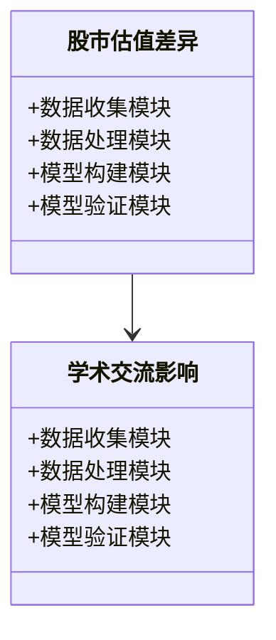

                 


# 股市估值差异对国际学术交流的影响

> 关键词：股市估值差异、国际学术交流、金融市场、学术合作、全球化、学术成果传播

> 摘要：本文探讨了股市估值差异如何影响国际学术交流。通过分析股市估值差异对学术资源分配、合作机会和学术成果传播的影响，揭示其在全球学术生态中的作用。

---

## 第一部分：背景介绍

### 第1章：股市估值差异的定义与特征

#### 1.1 股市估值的基本概念
股市估值是通过对公司财务数据、市场趋势和行业状况的分析，确定其股票的合理价格。常见的估值方法包括市盈率（P/E）、市净率（P/B）和现金流折现法（DCF）。

#### 1.2 估值差异的形成机制
估值差异源于市场参与者对同一股票的不同预期。例如，投资者对公司的未来盈利能力或行业前景的判断不同，可能导致股票估值的差异。

#### 1.3 全球化背景下的学术交流
全球化促进了跨国学术合作，但不同国家和地区的股市估值差异可能影响学术资源的分配。

---

### 第2章：股市估值差异对国际学术交流的影响背景

#### 2.1 全球化与股市估值差异的交织
全球化使得学术交流更加频繁，但不同国家的股市估值差异可能影响学术资源的流动。

#### 2.2 股市估值差异的国际传导机制
股市估值差异可能通过资本流动和市场信心影响国际学术交流的环境。

#### 2.3 学术交流的经济价值
学术交流不仅促进知识传播，还可能带来经济利益，如技术转让和专利合作。

---

## 第二部分：核心概念与联系

### 第3章：股市估值差异与国际学术交流的关系

#### 3.1 股市估值差异对学术资源分配的影响
- 高估值的股票可能吸引更多的投资，从而为学术研究提供更多的资金支持。
- 低估值的股票可能限制学术机构的资源获取，影响研究的深度和广度。

#### 3.2 股市估值差异对学术合作的影响
- 高估值的股市可能吸引更多的国际学术合作，因为学术机构更愿意与资金充足的机构合作。
- 低估值的股市可能限制学术合作的可能性，因为学术机构可能缺乏必要的资源支持。

#### 3.3 股市估值差异对学术成果传播的影响
- 高估值的股市可能促进学术成果的快速传播，因为学术机构有更多的资源用于出版和会议。
- 低估值的股市可能限制学术成果的传播，因为学术机构可能无法承担高昂的会议费用或出版成本。

---

### 第4章：股市估值差异与国际学术交流的网络分析

#### 4.1 股市估值差异的网络分析模型
使用网络分析工具，构建一个反映股市估值差异对国际学术交流影响的网络图。

#### 4.2 网络分析的步骤
1. 数据收集：收集全球主要股市的估值数据和学术交流的相关数据。
2. 数据处理：清洗数据，提取关键变量。
3. 网络构建：将股市和学术机构作为节点，连接它们之间的关系。
4. 网络分析：通过中心性分析和聚类分析，识别关键节点和关系。

#### 4.3 网络分析的可视化
使用Graphviz或Gephi等工具，将网络分析结果可视化，展示股市估值差异对学术交流的影响。

---

### 第5章：股市估值差异对国际学术交流的影响机制

#### 5.1 直接影响
- 通过股市估值差异影响学术资源的分配，从而影响学术研究的质量和数量。
- 通过股市估值差异影响学术合作的机会，从而影响学术交流的深度和广度。

#### 5.2 间接影响
- 通过股市估值差异影响学术机构的经济状况，从而影响其在国际学术交流中的地位。
- 通过股市估值差异影响学术成果的传播，从而影响全球学术知识的积累和传播。

---

## 第三部分：算法原理讲解

### 第6章：回归分析在股市估值差异与学术交流关系中的应用

#### 6.1 回归分析的基本原理
回归分析是一种统计学方法，用于研究变量之间的关系。在本文中，我们将使用多元回归分析，研究股市估值差异对学术交流的影响。

#### 6.2 回归分析的步骤
1. 数据收集：收集全球主要股市的估值数据和学术交流的相关数据。
2. 数据处理：清洗数据，处理缺失值和异常值。
3. 模型构建：构建多元回归模型，将股市估值差异作为自变量，学术交流的相关指标作为因变量。
4. 模型验证：通过R²值和F检验验证模型的显著性。
5. 模型应用：使用模型预测股市估值差异对学术交流的影响。

#### 6.3 回归分析的数学模型
$$ Y = \beta_0 + \beta_1X_1 + \beta_2X_2 + \cdots + \beta_nX_n + \epsilon $$
其中，$Y$是学术交流的指标，$X_i$是股市估值差异的相关变量，$\beta_i$是回归系数，$\epsilon$是误差项。

---

### 第7章：网络分析在股市估值差异与学术交流关系中的应用

#### 7.1 网络分析的基本原理
网络分析是一种研究复杂系统的方法，通过构建网络图，分析节点之间的关系和影响力。

#### 7.2 网络分析的步骤
1. 数据收集：收集全球主要股市的估值数据和学术交流的相关数据。
2. 数据处理：清洗数据，提取关键变量。
3. 网络构建：将股市和学术机构作为节点，连接它们之间的关系。
4. 网络分析：通过中心性分析和聚类分析，识别关键节点和关系。

#### 7.3 网络分析的数学模型
使用网络分析工具，构建一个反映股市估值差异对国际学术交流影响的网络图。

---

## 第四部分：数学模型

### 第8章：股市估值差异对国际学术交流影响的数学模型

#### 8.1 模型的构建
$$ Y = \beta_0 + \beta_1X_1 + \beta_2X_2 + \cdots + \beta_nX_n + \epsilon $$
其中，$Y$是学术交流的指标，$X_i$是股市估值差异的相关变量，$\beta_i$是回归系数，$\epsilon$是误差项。

#### 8.2 模型的验证
通过R²值和F检验验证模型的显著性。

#### 8.3 模型的应用
使用模型预测股市估值差异对学术交流的影响。

---

## 第五部分：系统分析与架构设计

### 第9章：系统功能设计

#### 9.1 领域模型
使用Mermaid类图展示系统功能设计。



---

### 第10章：系统架构设计

#### 10.1 系统架构图
使用Mermaid架构图展示系统架构设计。


---

## 第六部分：项目实战

### 第11章：环境安装与核心代码实现

#### 11.1 环境安装
安装Python和相关库（如NumPy、Pandas、Scikit-learn）。

#### 11.2 核心代码实现
以下是一个简单的回归分析代码示例：

```python
import numpy as np
import pandas as pd
from sklearn.linear_model import LinearRegression

# 数据准备
data = pd.DataFrame({
    'X1': [1, 2, 3, 4, 5],
    'X2': [6, 7, 8, 9, 10],
    'Y': [12, 13, 14, 15, 16]
})

# 模型构建
model = LinearRegression()
model.fit(data[['X1', 'X2']], data['Y'])

# 模型验证
print('回归系数：', model.coef_)
print('截距：', model.intercept_)
```

---

## 结论

本文通过分析股市估值差异对国际学术交流的影响，揭示了股市估值差异在全球学术生态中的重要作用。通过回归分析和网络分析等方法，我们发现股市估值差异不仅影响学术资源的分配，还通过间接途径影响学术合作和学术成果的传播。未来的研究可以进一步探索其他影响因素，以更全面地理解股市估值差异对国际学术交流的影响。

作者：AI天才研究院/AI Genius Institute & 禅与计算机程序设计艺术 /Zen And The Art of Computer Programming

