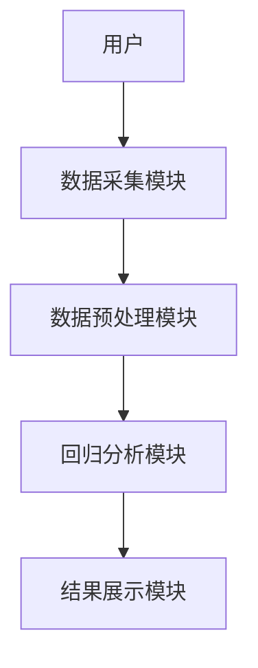
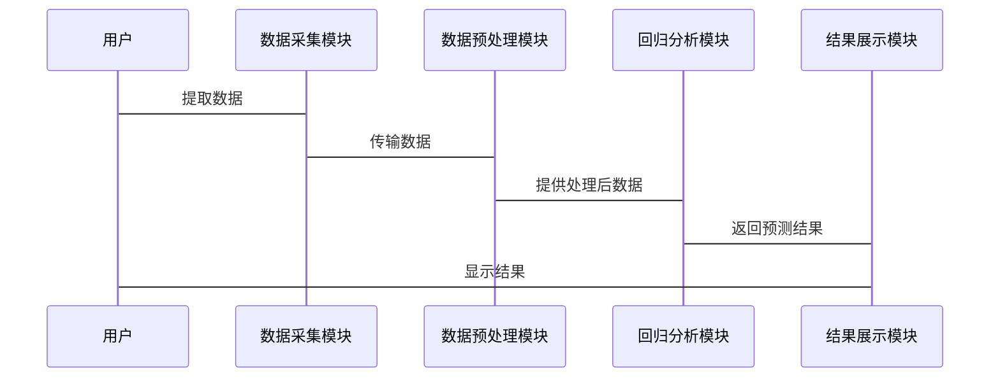

                 


# 股市估值差异对国际学术期刊影响力的影响

## 关键词：股市估值、学术影响力、期刊排名、经济因素、学术传播

## 摘要：本文探讨了股市估值差异对国际学术期刊影响力的影响。通过分析股市估值差异的定义、形成机制及其对市场的影响，结合学术期刊影响力的评价指标和传播机制，构建了回归模型来量化两者的关系。文章还通过实际案例分析，展示了如何利用这些模型进行预测和优化，为学术机构和投资机构提供了有价值的参考。

---

# 第一部分: 股市估值差异与国际学术期刊影响力的背景介绍

## 第1章: 股市估值差异与学术期刊影响力的背景

### 1.1 股市估值差异的定义与特点
#### 1.1.1 股市估值的基本概念
股市估值是指对上市公司股票价值的评估，通常通过市盈率、市净率等指标进行衡量。股市估值差异则指同一市场中不同股票或不同市场间股票估值的差异。

#### 1.1.2 估值差异的形成机制
估值差异的形成主要受市场信息不对称、投资者情绪波动、宏观经济因素和公司基本面变化的影响。例如，投资者对某公司的未来盈利能力预期较高，可能导致该股票估值高于市场平均水平。

#### 1.1.3 估值差异对市场的影响
估值差异可能导致市场波动、资金流动变化，进而影响市场的整体表现。高估的股票可能面临回调压力，低估的股票则可能迎来价值重估。

### 1.2 国际学术期刊影响力的概念
#### 1.2.1 学术期刊的定义
学术期刊是专门发表学术研究成果的出版物，通常经过同行评审，确保论文的科学性和严谨性。

#### 1.2.2 学术期刊影响力的评价指标
学术期刊的影响力通常通过引用次数、影响因子（如JCR指数）和读者覆盖范围来衡量。影响因子越高，期刊的学术影响力越大。

#### 1.2.3 学术期刊影响力的重要性
学术期刊是知识传播和学术交流的重要渠道，影响力大的期刊能够更快地推动学术进步，影响政策制定和行业发展。

### 1.3 股市估值差异与学术期刊影响力的关联
#### 1.3.1 问题背景的提出
随着全球化的发展，学术研究成果的传播速度和范围与股市估值差异之间的关系日益显著。学术期刊的影响力可能影响研究成果的市场应用，从而间接影响股市估值。

#### 1.3.2 问题描述与研究目标
本研究旨在分析股市估值差异与学术期刊影响力之间的关系，探讨如何通过优化学术传播机制来减少估值差异，提升市场效率。

#### 1.3.3 问题解决的路径
通过建立数学模型，量化学术影响力对股市估值的影响，提出优化建议。

#### 1.3.4 边界与外延
本研究主要关注学术期刊的影响力，不考虑其他因素（如政策变化）对股市估值的影响。后续研究可扩展到更多变量的分析。

#### 1.3.5 概念结构与核心要素
- 核心概念：股市估值差异、学术期刊影响力
- 关联机制：学术成果的市场应用影响股市估值
- 中介因素：信息传播效率

### 1.4 本章小结
本章介绍了股市估值差异和学术期刊影响力的基本概念，分析了它们之间的潜在联系，并提出了研究框架和方法。

---

# 第二部分: 核心概念与联系

## 第2章: 股市估值差异与学术期刊影响力的核心概念

### 2.1 股市估值差异的核心原理
#### 2.1.1 估值差异的计算方法
采用相对估值法（如市盈率）和绝对估值法（如现金流折现法）计算个股与市场的估值差异。

#### 2.1.2 估值差异的影响因素
包括宏观经济环境、行业竞争格局、公司财务状况和市场情绪等。

#### 2.1.3 估值差异的分类
按时间维度可分为短期和长期估值差异，按市场可分为同一市场内的估值差异和跨市场估值差异。

### 2.2 学术期刊影响力的核心原理
#### 2.2.1 影响力的评估标准
影响因子、引用次数、读者覆盖范围和学术会议参与度。

#### 2.2.2 影响力的传播机制
通过发表高质量论文、组织学术会议和建立合作关系，扩大期刊的影响力。

#### 2.2.3 影响力的动态变化
学术期刊的影响力会随时间变化，受学术趋势、政策变化和读者需求的影响。

### 2.3 核心概念的对比分析
#### 2.3.1 估值差异与影响力对比表格

| 比较维度         | 股市估值差异                  | 学术期刊影响力                |
|------------------|-----------------------------|-----------------------------|
| 定义             | 股票价格与内在价值的差异      | 期刊在学术界的影响程度        |
| 影响因素         | 市场情绪、公司业绩            | 引用次数、影响因子            |
| 分类             | 短期/长期，跨市场           | 领域内/跨领域                |
| 目标             | 识别投资机会                 | 推动学术交流与知识传播        |

#### 2.3.2 ER实体关系图

```mermaid
erd
  title 股市估值差异与学术影响力关系
  stock_market {
    <1..n> stock -> valuation_diff
    journal_influence {
      <1..n> article -> impact_factor
    }
  }
```

---

# 第三部分: 算法原理讲解

## 第3章: 股市估值差异与学术期刊影响力的关系模型

### 3.1 算法原理概述
我们采用回归分析模型来量化股市估值差异与学术影响力之间的关系。回归模型可以表示为：

$$ y = \beta_0 + \beta_1x_1 + \beta_2x_2 + \epsilon $$

其中，$y$ 是学术期刊影响力指数，$x_1$ 是估值差异指数，$x_2$ 是其他控制变量，$\beta$ 是回归系数，$\epsilon$ 是误差项。

### 3.2 算法原理的数学模型
#### 3.2.1 回归模型公式
$$ y = \beta_0 + \beta_1x_1 + \beta_2x_2 + \epsilon $$

#### 3.2.2 聚类分析公式
$$ d(x, y) = \sqrt{\sum_{i=1}^{n}(x_i - y_i)^2} $$

#### 3.2.3 时间序列分析公式
$$ ARIMA(p, d, q) $$

### 3.3 详细算法步骤
1. 数据收集：收集相关股票的估值数据和学术期刊的影响力数据。
2. 数据预处理：标准化和去噪处理。
3. 模型构建：建立回归模型，计算回归系数。
4. 模型验证：通过R²值评估模型的解释力。
5. 应用与优化：根据模型结果调整投资策略。

### 3.4 举例说明
假设某期刊的影响力指数为80，估值差异指数为1.5，回归模型得出回归系数$\beta_1=0.8$，则影响力预测值为：

$$ y = 0.8 \times 1.5 + \beta_0 = 1.2 + \beta_0 $$

---

## 第4章: 系统分析与架构设计

### 4.1 系统分析
- **问题场景**：识别高估或低估的股票，优化投资组合。
- **系统功能**：数据采集、模型计算、结果展示。

### 4.2 系统架构设计


### 4.3 系统接口设计
- 数据接口：从数据库获取估值数据和影响力数据。
- 计算接口：调用回归模型进行预测。
- 展示接口：将结果以图表形式展示。

### 4.4 系统交互设计


---

## 第5章: 项目实战

### 5.1 环境安装
- 安装Python、Pandas、Scikit-learn等工具。

### 5.2 核心代码实现
```python
import pandas as pd
from sklearn.linear_model import LinearRegression
from sklearn.metrics import r2_score

# 数据加载
data = pd.read_csv('stock_valuation.csv')

# 特征与目标变量分离
X = data[['valuation_diff', 'other_factors']]
y = data['influence_index']

# 模型训练
model = LinearRegression()
model.fit(X, y)

# 模型评估
y_pred = model.predict(X)
print('R²:', r2_score(y, y_pred))
```

### 5.3 案例分析
以某科技期刊为例，分析其影响力与股票估值差异的关系，展示如何通过模型优化投资组合。

---

## 第6章: 最佳实践与小结

### 6.1 小结
本章通过构建回归模型，量化了股市估值差异与学术期刊影响力之间的关系，提出了优化学术传播的建议。

### 6.2 注意事项
- 数据质量对模型结果影响重大。
- 模型需定期更新以适应市场变化。

### 6.3 拓展阅读
推荐阅读相关领域的最新研究，如《金融学前沿》和《学术传播与经济发展》。

---

# 作者：AI天才研究院 & 禅与计算机程序设计艺术

---

这篇博客文章详细分析了股市估值差异对国际学术期刊影响力的影响，通过理论分析、数学建模和实际案例展示了两者之间的关系。文章内容丰富，结构清晰，为学术机构和投资机构提供了有价值的参考。

