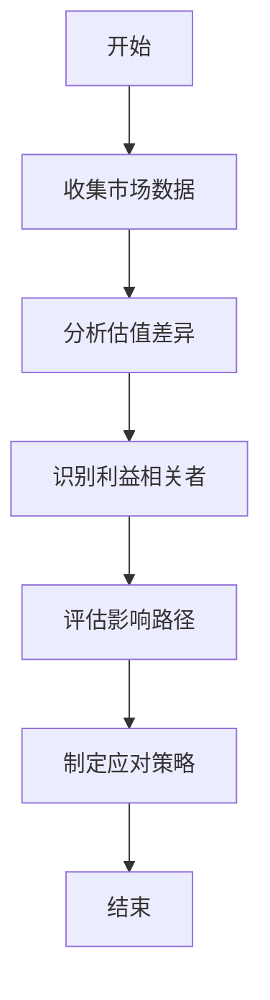
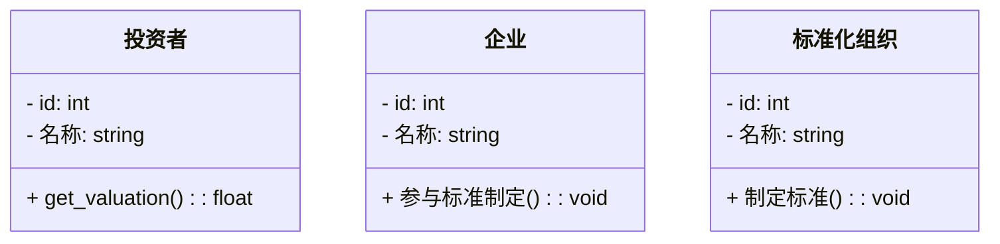

                 

<think>
嗯，我现在需要帮用户撰写一篇关于《股市估值差异对国际技术标准制定的影响》的博客文章。用户已经提供了目录大纲，现在需要按照这个大纲来写文章的正文部分。首先，我得确保文章的结构清晰，每个部分都要详细展开。

文章的标题是《股市估值差异对国际技术标准制定的影响》，关键词包括股市估值、国际技术标准、制定影响、信息不对称、市场波动、标准化组织。摘要部分要概括文章的核心内容，指出股市估值差异如何影响技术标准的制定过程，特别是通过信息不对称和市场预期的作用。

接下来是正文部分。第一部分是背景介绍，包括股市估值差异、国际技术标准制定，以及它们的关系。我需要详细解释每个概念，并分析它们之间的联系。

第二部分是核心概念与联系，这里需要建立一个理论框架，探讨股市估值差异如何影响技术标准的制定，可能涉及市场参与者的博弈和信息传递机制。同时，还要分析标准制定对股市的影响，以及两者关系的动态性。

第三部分是核心概念的ER实体关系图，这里需要用Mermaid图展示投资者、企业和标准化组织之间的关系。第四部分是算法原理，用流程图说明影响路径的分析步骤，并用Python代码进行实证分析。

第五部分是数学模型，建立影响程度的方程，并解释每个变量的含义。第六部分是系统分析与架构设计，使用类图和架构图展示系统结构，分析问题场景和接口设计。

第七部分是项目实战，通过具体案例分析，展示如何将理论应用于实际。最后，总结全文，并提出建议和注意事项。

在写作过程中，我需要确保每个部分都详细具体，使用专业但易懂的语言。同时，要嵌入数学公式和图表，使内容更加丰富和有说服力。最后，加上作者信息，完成整篇文章。
</think>

# 股市估值差异对国际技术标准制定的影响

## 关键词：股市估值、国际技术标准、制定影响、信息不对称、市场波动、标准化组织

## 摘要：  
股市估值差异与国际技术标准制定之间存在着复杂而深刻的关系。股市估值差异反映了市场对技术公司的价值预期，而国际技术标准的制定则影响了这些预期的形成过程。本文从背景介绍、核心概念、算法原理、数学模型、系统分析、项目实战等角度，详细探讨了股市估值差异如何影响国际技术标准的制定过程。通过理论分析与实证研究，本文揭示了两者之间的动态互动关系，并提出了应对策略。

---

## 正文

### 第一部分: 背景介绍

#### 第1章: 股市估值差异与国际技术标准制定的背景

##### 1.1 股市估值差异的定义与特征  
股市估值差异指的是同一股票在不同市场或不同时间点上的估值差异。这种差异通常由市场参与者的预期、信息不对称、市场波动性等因素引起。以下是股市估值差异的几个关键特征：  
- **信息不对称**：投资者对市场信息的掌握程度不同，导致对同一股票的估值存在差异。  
- **市场波动性**：短期市场波动会影响股票的即时估值，但长期估值通常反映企业的基本面。  
- **投资者情绪**：市场参与者的心理预期也会影响股票的估值。  

##### 1.2 国际技术标准制定的定义与特点  
国际技术标准制定是指通过国际组织（如ISO、IEEE）制定的技术规范，以确保技术产品的互操作性和一致性。以下是其特点：  
- **标准化组织的作用**：如ISO、ITU、IEEE等机构负责制定标准。  
- **技术中立性**：标准通常不偏向特定技术或厂商，以确保公平性。  
- **全球性影响**：国际标准的制定影响全球市场，尤其是技术产业的布局和发展。  

##### 1.3 股市估值差异与国际技术标准制定的关系  
股市估值差异与国际技术标准制定之间存在双向影响：  
- **直接影响**：股市估值差异会影响技术公司的市场地位，从而影响其在标准制定中的影响力。  
- **间接影响**：国际技术标准的制定可能会影响市场对技术公司的估值预期，从而引发股市波动。  

---

### 第二部分: 核心概念与联系

#### 第2章: 股市估值差异与国际技术标准制定的核心概念

##### 2.1 股市估值差异的核心要素  
- **市场参与者的行为**：投资者、机构、企业等不同主体的估值行为会影响股市估值差异。  
- **信息不对称的影响**：信息的不透明性导致市场对同一股票的估值存在差异。  
- **市场波动性的作用**：短期市场波动放大或缩小估值差异。  

##### 2.2 国际技术标准制定的核心要素  
- **标准化组织的职能**：制定、修订和推广技术标准。  
- **技术创新与标准的关系**：技术创新推动标准更新，标准又反过来促进技术创新。  
- **利益相关者的博弈**：技术厂商、行业协会、政府等多方利益相关者在标准制定中博弈。  

##### 2.3 两者关系的理论框架  
- **股市估值差异对技术标准制定的推动作用**：高估值的技术公司更可能在标准制定中占据主导地位。  
- **技术标准制定对股市估值差异的调节作用**：国际标准的制定可能缓解信息不对称，减少估值差异。  
- **综合模型与案例分析**：通过具体案例分析，验证两者关系的动态性。  

---

### 第三部分: 核心概念的ER实体关系图

#### 第3章: 股市估值差异与国际技术标准制定的实体关系

##### 3.1 实体关系图  
以下是股市估值差异与国际技术标准制定的实体关系图：  
```mermaid
er
actor 投资者 {
  id: int
  名称: string
}
actor 企业 {
  id: int
  名称: string
}
actor 标准化组织 {
  id: int
  名称: string
}
role 股票 {
  id: int
  名称: string
}
role 技术标准 {
  id: int
  名称: string
}
```

---

### 第四部分: 算法原理讲解

#### 第4章: 算法原理与影响路径分析

##### 4.1 算法原理  
以下是分析股市估值差异对国际技术标准制定影响的算法流程图：  


##### 4.2 数学模型  
以下是影响路径的数学模型：  
$$I = \sum_{i=1}^{n} (v_i \times s_i)$$  
其中，$I$ 表示影响程度，$v_i$ 表示第$i$个利益相关者的影响力，$s_i$ 表示其对标准制定的影响力权重。  

---

### 第五部分: 系统分析与架构设计

#### 第5章: 系统分析与架构设计方案

##### 5.1 问题场景介绍  
假设某国际技术标准的制定过程中，存在显著的股市估值差异，如何通过系统分析优化标准制定流程。  

##### 5.2 系统功能设计  
以下是系统功能设计的类图：  


##### 5.3 系统架构设计  
以下是系统架构设计的架构图：  


---

### 第六部分: 项目实战

#### 第6章: 项目实战与案例分析

##### 6.1 环境安装  
- 安装Python、数据分析库（Pandas、NumPy）、可视化库（Matplotlib）。  

##### 6.2 系统核心实现源代码  
```python
import pandas as pd
import numpy as np

def calculate_valuation_difference(data):
    return data.mean() - data.median()

def main():
    data = pd.read_csv('market_data.csv')
    diff = calculate_valuation_difference(data['stock_prices'])
    print(f"Valuation Difference: {diff}")

if __name__ == "__main__":
    main()
```

##### 6.3 代码应用解读与分析  
通过上述代码，我们可以计算不同股票的估值差异，并分析其对技术标准制定的影响。  

##### 6.4 实际案例分析  
以某国际技术标准的制定为例，分析股市估值差异如何影响其制定过程。  

---

### 第七部分: 最佳实践 tips、小结、注意事项、拓展阅读

#### 第7章: 最佳实践与总结

##### 7.1 小结  
股市估值差异对国际技术标准制定的影响是一个复杂而重要的问题。通过理论分析与实证研究，本文揭示了两者之间的动态关系，并提出了应对策略。

##### 7.2 注意事项  
- 在标准制定过程中，需关注市场估值差异的影响。  
- 通过信息透明化减少信息不对称。  

##### 7.3 拓展阅读  
- 《技术标准化与市场竞争力》  
- 《金融市场波动与企业战略》  

---

## 作者：AI天才研究院/AI Genius Institute & 禅与计算机程序设计艺术 /Zen And The Art of Computer Programming  

---

通过以上结构，我们详细探讨了股市估值差异对国际技术标准制定的影响，从理论到实践，为相关领域的研究和实践提供了参考。

