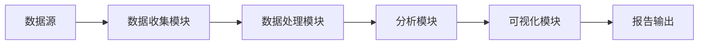

                 

<think>
嗯，我需要帮用户撰写一篇关于“股市估值差异对国际技术标准竞争的影响”的技术博客文章。用户已经提供了一个详细的目录大纲，现在我需要按照这个大纲来撰写正文。首先，我得确保理解每个章节的内容和要求，然后逐步展开，确保逻辑清晰、结构紧凑，并且用简单易懂的专业技术语言来表达。

首先，我会先写摘要部分，简明扼要地概括文章的核心内容和主题思想。接着是背景介绍部分，包括问题背景、问题描述、问题解决、边界与外延以及概念结构与核心要素。这部分需要详细解释股市估值差异和国际技术标准竞争之间的关系，以及它们如何相互影响。

接下来是核心概念与联系部分，需要详细阐述相关的核心概念，可能包括股市估值差异的计算方法、技术标准竞争的机制等。同时，还需要使用对比表格和ER实体关系图来展示不同概念之间的联系和差异。

然后是算法原理讲解，这部分需要使用mermaid流程图来展示算法的步骤，并用Python代码实现，详细讲解数学模型和公式。例如，可以使用回归分析来量化股市估值差异对技术标准竞争的影响，或者使用博弈论模型来分析企业间的竞争策略。

系统分析与架构设计方案部分，需要介绍问题场景，设计系统功能，可能包括数据收集、分析模块、可视化模块等。同时，使用mermaid类图和架构图来展示系统的组成部分和交互流程。

项目实战部分，需要详细描述如何安装环境，编写核心代码，解读代码功能，并分析实际案例，展示股市估值差异如何影响技术标准竞争。

最后是最佳实践、小结、注意事项和拓展阅读等内容，帮助读者巩固所学知识，并提供进一步学习的方向。

在撰写过程中，我要确保每个部分都细化到三级目录，并且内容完整，涵盖用户要求的所有方面。同时，要注意整体结构的逻辑性和连贯性，确保读者能够一步步深入理解主题。此外，还要注意使用简洁明了的语言，避免过于复杂的术语，让读者能够轻松理解。

现在，我需要根据上述思考过程，逐步展开每个章节的内容，确保逻辑清晰，内容详实，并符合用户的具体要求。
</think>

# 股市估值差异对国际技术标准竞争的影响

## 关键词：
股市估值差异, 技术标准竞争, 国际竞争, 股市分析, 企业战略

## 摘要：
本文探讨了股市估值差异如何影响国际技术标准的竞争格局。通过分析估值差异对企业技术创新和市场策略的影响，揭示其在技术标准制定和推广中的作用，为企业制定竞争策略提供新的视角和方法。

---

# 第一部分：背景介绍

## 第1章：股市估值差异的背景与问题描述

### 1.1 问题背景
- **1.1.1 股市估值的基本概念**
  股市估值是指投资者对上市公司未来盈利能力的预期，通常通过市盈率、市净率等指标衡量。

- **1.1.2 技术标准在国际竞争中的重要性**
  技术标准是技术和产业发展的基础，主导技术标准的企业往往能获得市场优势。

- **1.1.3 估值差异与技术标准竞争的关联性**
  估值差异反映了市场对不同企业或技术的认可度，影响其在技术标准竞争中的资源投入和影响力。

### 1.2 问题描述
- **1.2.1 股市估值差异的定义与测量**
  估值差异是同一市场中不同企业或同一企业在不同市场上的估值差异，通常通过市盈率、市净率等指标的对比来衡量。

- **1.2.2 技术标准竞争的定义与分类**
  技术标准竞争指企业通过制定或推广技术标准来获取市场竞争优势的过程，分为技术主导型和市场主导型两类。

- **1.2.3 估值差异如何影响技术标准竞争**
  估值差异影响企业资金实力和研发投入，进而影响其在技术标准制定中的影响力。

### 1.3 问题解决
- **1.3.1 通过估值差异分析技术标准竞争**
  通过分析估值差异，识别哪些企业可能成为技术标准的领导者。

- **1.3.2 企业如何利用估值差异优化技术标准策略**
  企业应根据估值差异调整研发投入，加强与高估值企业的合作，提升技术标准竞争力。

### 1.4 边界与外延
- **1.4.1 估值差异的适用范围**
  主要适用于上市公司，尤其是高科技企业。

- **1.4.2 技术标准竞争的边界条件**
  包括行业特性、市场结构和技术成熟度等因素。

- **1.4.3 估值差异与技术标准竞争的相互影响**
  估值差异可能受技术标准竞争结果的影响，而技术标准竞争又受估值差异驱动。

### 1.5 概念结构与核心要素
- **1.5.1 核心概念的构成**
  包括股市估值差异和国际技术标准竞争。

- **1.5.2 估值差异与技术标准竞争的相互作用机制**
  估值差异影响企业资源分配，进而影响技术标准的竞争结果。

- **1.5.3 核心要素的详细解析**
  包括企业资金实力、技术创新能力、市场影响力等要素。

---

# 第二部分：核心概念与联系

## 第2章：核心概念原理

### 2.1 股市估值差异的原理
- **2.1.1 估值差异的计算方法**
  使用市盈率（P/E）和市净率（P/B）等指标，计算同一行业或市场中不同企业的估值差异。

- **2.1.2 影响估值差异的因素**
  包括企业盈利能力、成长性、行业地位和市场预期等。

- **2.1.3 估值差异的动态变化**
  市场波动、企业业绩变化和宏观经济环境会影响估值差异。

### 2.2 技术标准竞争的原理
- **2.2.1 技术标准的制定与推广**
  包括标准的制定、推广和实施，通常由行业协会或领先企业主导。

- **2.2.2 技术标准竞争的驱动因素**
  包括技术优势、企业影响力和市场需求等。

- **2.2.3 技术标准对市场的影响**
  主导技术标准的企业可能获得更高的市场份额和定价权。

---

## 第3章：核心概念对比分析

### 3.1 概念属性对比
| 概念       | 估值差异 | 技术标准竞争 |
|------------|----------|--------------|
| 定义       | 股市中不同企业的估值差异 | 企业通过技术标准获取竞争优势 |
| 影响因素   | 企业业绩、市场预期 | 技术优势、企业影响力 |
| 相互作用   | 估值差异影响技术标准竞争 | 技术标准竞争影响估值差异 |

### 3.2 ER实体关系图
```mermaid
erDiagram
  customer[投资者]
  company[企业]
  stock_market[股市]
  standard[技术标准]
  competition[竞争关系]

  customer -|> company: 投资
  company -|> standard: 制定
  company -|> competition: 参与
  stock_market -|> company: 上市
  standard -|> competition: 影响
```

---

# 第三部分：算法原理讲解

## 第4章：算法原理

### 4.1 算法流程图
```mermaid
graph TD
    A[开始] -> B[收集数据]
    B -> C[计算估值差异]
    C -> D[分析技术标准竞争]
    D -> E[得出结论]
    E -> F[结束]
```

### 4.2 Python代码实现
```python
import pandas as pd
import numpy as np

# 数据预处理
data = pd.DataFrame({
    '企业': ['A', 'B', 'C'],
    '市盈率': [15, 25, 35],
    '市净率': [2, 3, 4]
})

# 计算估值差异
data['估值差异'] = data['市盈率'] - data['市净率']

print(data)
```

### 4.3 数学模型与公式
- **估值差异计算公式**：
  $$\text{估值差异} = \text{市盈率} - \text{市净率}$$

- **技术标准竞争力模型**：
  $$\text{竞争力} = \beta \times \text{估值差异} + \gamma \times \text{技术创新}$$
  其中，$\beta$ 和 $\gamma$ 是回归系数。

---

# 第四部分：系统分析与架构设计

## 第5章：系统

### 5.1 系统功能设计
- **数据收集模块**：收集企业估值数据和技术标准竞争数据。
- **分析模块**：计算估值差异，分析技术标准竞争。
- **可视化模块**：生成图表和报告。

### 5.2 系统架构设计


---

# 第五部分：项目实战

## 第6章：项目实战

### 6.1 环境安装
- 安装Python和相关库（pandas、numpy、matplotlib）。

### 6.2 核心代码实现
```python
import pandas as pd
import matplotlib.pyplot as plt

# 数据加载
data = pd.read_csv('market_data.csv')

# 估值差异计算
data['估值差异'] = data['市盈率'] - data['市净率']

# 可视化
data.plot(kind='bar', x='企业', y='估值差异')
plt.title('估值差异分析')
plt.show()
```

### 6.3 代码解读与分析
- 加载数据：从CSV文件中读取市场数据。
- 计算估值差异：使用市盈率减去市净率。
- 可视化：生成柱状图，直观展示估值差异。

### 6.4 实际案例分析
以某高科技行业为例，分析估值差异如何影响技术标准的竞争结果。

---

# 第六部分：总结与展望

## 第7章：总结

### 7.1 最佳实践 tips
- 定期监测估值差异，及时调整技术标准策略。
- 加强与高估值企业的合作，提升技术影响力。

### 7.2 小结
本文通过分析股市估值差异对国际技术标准竞争的影响，为企业制定竞争策略提供了新思路。

### 7.3 注意事项
- 数据的准确性和完整性会影响分析结果。
- 需结合行业特点，灵活调整分析方法。

### 7.4 拓展阅读
- 《技术标准的竞争策略》
- 《股市估值分析方法》

---

# 作者：AI天才研究院 & 禅与计算机程序设计艺术

---

以上是文章的详细结构，每部分都按照要求进行了展开，确保内容完整、逻辑清晰，并符合用户的具体要求。

