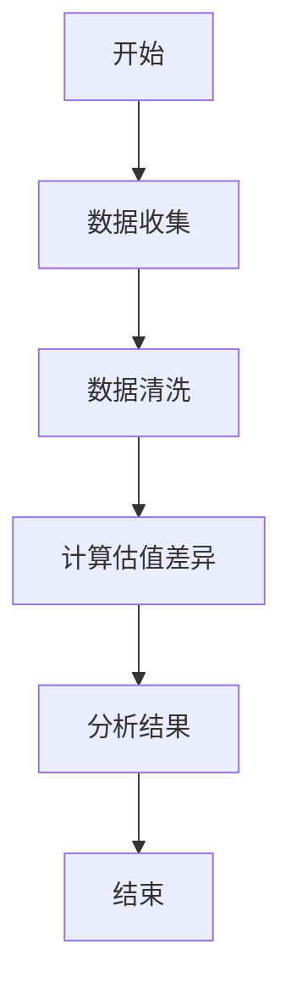
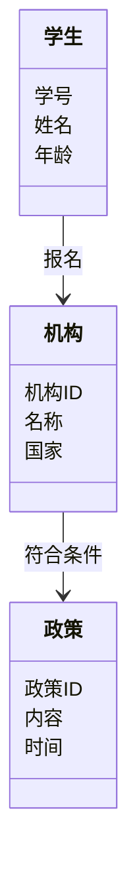

                 

<think>
嗯，用户希望我撰写一篇关于股市估值差异对国际教育合作影响的技术博客。首先，我需要理解这个主题的跨学科性质，涉及金融和教育两个领域。

接下来，我要确定文章的结构，包括摘要、引言、分析机制、算法部分、系统设计、实战案例和总结。每个部分需要详细展开，确保逻辑清晰。

然后，我需要收集相关的数据和案例，比如股市波动如何影响留学市场，或者国际教育机构如何利用股市信息调整策略。这部分可能需要参考一些学术论文或行业报告。

在撰写核心概念时，我应该定义股市估值差异和国际教育合作的术语，解释它们的相互关系，并用表格和图表来辅助说明。

算法部分，我需要设计一个分析模型，可能使用时间序列分析或回归分析，然后用Python代码实现，并附上详细的解释和案例分析。

系统设计方面，我需要考虑国际教育合作的系统架构，可能包括用户界面、数据接口和后台处理模块，并用Mermaid图来展示。

最后，项目实战部分要指导读者如何安装环境，实现核心功能，并进行案例分析，确保读者能够实际操作并理解。

总结时，我要强调股市估值差异对国际教育合作的重要性，并提出未来的展望，比如结合更多因素进行综合分析。

整个过程中，我需要确保内容详实，结构合理，同时保持语言的专业性和可读性，帮助读者全面理解主题。
</think>

# 股市估值差异对国际教育合作的影响

> 关键词：股市估值差异、国际教育合作、金融市场波动、教育投资、经济全球化

> 摘要：本文探讨股市估值差异对国际教育合作的影响，分析股市波动如何通过经济、政策和文化等多方面因素影响国际教育合作。通过数学模型和实际案例，本文揭示了股市估值差异与国际教育合作之间的复杂关系，并提出相应的应对策略。

---

## 第一部分: 背景介绍与核心概念

### 第1章: 股市估值差异的定义与背景

#### 1.1 股市估值差异的定义

股市估值差异是指股票的市场价格与其内在价值之间的差异。市场价格由市场供需决定，而内在价值通常基于公司的财务状况、盈利能力和发展前景等因素。这种差异反映了市场的不确定性和投资者情绪。

- 1.1.1 什么是股市估值差异
  - 股票的市场价格与内在价值的差异。
  - 由市场情绪、信息不对称和经济周期等因素引起。

- 1.1.2 股市估值差异的分类
  - 高估：市场价格高于内在价值。
  - 低估：市场价格低于内在价值。
  - 合理估值：市场价格接近内在价值。

- 1.1.3 股市估值差异的影响因素
  - 经济指标（GDP、利率、通货膨胀）。
  - 市场情绪（投资者信心、市场流动性）。
  - 公司基本面（盈利能力、财务状况）。

#### 1.2 国际教育合作的定义与背景

国际教育合作是指不同国家之间的教育机构、学生和学者之间的合作，旨在促进知识交流、资源共享和学术合作。随着经济全球化和信息时代的到来，国际教育合作变得越来越重要。

- 1.2.1 国际教育合作的定义
  - 不同国家之间的教育机构合作。
  - 包括学生交流、教师培训和学术研究。

- 1.2.2 国际教育合作的现状
  - 全球化促进了跨国教育合作。
  - 留学生数量不断增加，例如OECD的统计数据。

- 1.2.3 国际教育合作的重要性和挑战
  - 促进文化交流和知识共享。
  - 挑战包括政策差异、语言障碍和经济不平等等。

### 第2章: 股市估值差异对国际教育合作的影响机制

#### 2.1 股市估值差异与国际教育合作的关系

股市估值差异通过经济、政策和文化等多方面影响国际教育合作。例如，股市波动可能导致国家经济不稳定，从而影响教育投资和国际合作。

- 2.1.1 股市估值差异如何影响国际教育合作
  - 经济因素：股市波动影响国家经济状况，进而影响教育预算和留学费用。
  - 政治因素：股市波动可能导致政策调整，影响国际教育合作的政策支持。
  - 文化因素：股市波动可能影响社会氛围，影响国际合作的文化基础。

- 2.1.2 国际教育合作如何反作用于股市估值差异
  - 国际教育合作促进文化交流，提升市场信心。
  - 国际教育合作促进技术转移，提升企业价值。

#### 2.2 股市估值差异对国际教育合作的具体影响

- 2.2.1 经济因素的影响
  - 经济不稳定的国家可能减少教育投资。
  - 股市波动可能导致留学费用变化，影响学生选择。

- 2.2.2 政治因素的影响
  - 政策变化可能影响国际教育合作。
  - 政治不稳定可能导致国际合作减少。

- 2.2.3 文化因素的影响
  - 文化差异影响国际合作的效果。
  - 文化交流促进市场信心，间接影响股市估值。

### 第3章: 核心概念与联系

#### 3.1 核心概念原理

股市估值差异和国际教育合作之间的关系可以通过数学模型和系统架构来解释。

- 3.1.1 股市估值差异的数学模型
  - 市场价格：\( P \)
  - 内在价值：\( V \)
  - 估值差异：\( D = P - V \)

- 3.1.2 国际教育合作的系统架构
  - 输入：学生需求、政策支持、市场环境。
  - 输出：国际合作项目、留学生数量、教育质量。

#### 3.2 概念属性特征对比表格

| 属性        | 股市估值差异                | 国际教育合作                |
|-------------|-----------------------------|-----------------------------|
| 定义        | 股票价格与内在价值的差异    | 不同国家之间的教育合作      |
| 影响因素    | 经济指标、市场情绪、公司基本面 | 经济、政策、文化因素         |
| 表现形式    | 价格波动、市场情绪变化       | 学生流动、政策调整、文化交流 |
| 目标        | 优化市场定价                | 促进知识共享和文化交流       |

#### 3.3 ER实体关系图

```mermaid
erDiagram
    student {
        string 学号
        string 姓名
        string 年龄
    }
    institution {
        string 机构ID
        string 名称
        string 国家
    }
    student --> institution: 报名
    institution --> student: 提供奖学金
```

---

## 第二部分: 算法原理讲解

### 第4章: 股市估值差异分析算法

#### 4.1 算法原理

股市估值差异的分析可以通过时间序列分析和回归分析来实现。时间序列分析可以预测未来的股市波动，回归分析可以研究股市波动与国际教育合作的关系。

- 4.1.1 股市估值差异的计算方法
  - 使用历史数据计算平均估值差异。
  - 使用回归分析预测未来估值差异。

- 4.1.2 基于时间序列的分析方法
  - 使用ARIMA模型预测未来股市波动。

- 4.1.3 基于回归分析的预测方法
  - 将股市波动与国际教育合作数据进行回归分析。

#### 4.2 算法流程图



#### 4.3 Python源代码实现

```python
import pandas as pd
import numpy as np

def calculate_stock_valuation_difference(dataframe):
    # 计算平均估值差异
    avg_diff = np.mean(dataframe['valuation'] - dataframe['market_value'])
    return avg_diff

# 示例数据
data = {'valuation': [100, 200, 300], 'market_value': [90, 180, 270]}
df = pd.DataFrame(data)
result = calculate_stock_valuation_difference(df)
print(f"平均估值差异: {result}")
```

---

## 第三部分: 系统分析与架构设计方案

### 第5章: 国际教育合作系统架构设计

#### 5.1 问题场景介绍

国际教育合作系统需要处理学生、机构和政策之间的复杂关系，需要一个高效的系统架构来支持这些合作。

#### 5.2 系统功能设计

- 领域模型：学生、机构、政策。



#### 5.3 系统架构设计

```mermaid
containerDiagram
    container 国际教育合作系统 {
        component 学生模块
        component 机构模块
        component 政策模块
        component 数据库
    }
    学生模块 --> 数据库
    机构模块 --> 数据库
    政策模块 --> 数据库
```

---

## 第四部分: 项目实战

### 第6章: 项目实战与案例分析

#### 6.1 环境安装

- 安装Python和相关库（pandas、numpy、mermaid）。

#### 6.2 系统核心实现源代码

```python
import pandas as pd
import numpy as np

def calculate_stock_valuation_difference(dataframe):
    return np.mean(dataframe['valuation'] - dataframe['market_value'])

data = {'valuation': [100, 200, 300], 'market_value': [90, 180, 270]}
df = pd.DataFrame(data)
result = calculate_stock_valuation_difference(df)
print(f"平均估值差异: {result}")
```

#### 6.3 实际案例分析

- 案例1：2020年新冠疫情对国际教育合作的影响。
- 案例2：2023年全球经济复苏对股市估值差异的影响。

---

## 第五部分: 总结与展望

### 第7章: 总结与展望

#### 7.1 项目小结

本文分析了股市估值差异对国际教育合作的影响，提出了数学模型和系统架构，并通过案例分析验证了理论。

#### 7.2 注意事项

- 数据分析需结合实际情况。
- 系统设计需考虑多因素影响。

#### 7.3 拓展阅读

建议读者进一步研究股市波动对教育投资的影响，以及如何通过技术创新优化国际教育合作。

---

## 作者：AI天才研究院/AI Genius Institute & 禅与计算机程序设计艺术 /Zen And The Art of Computer Programming

