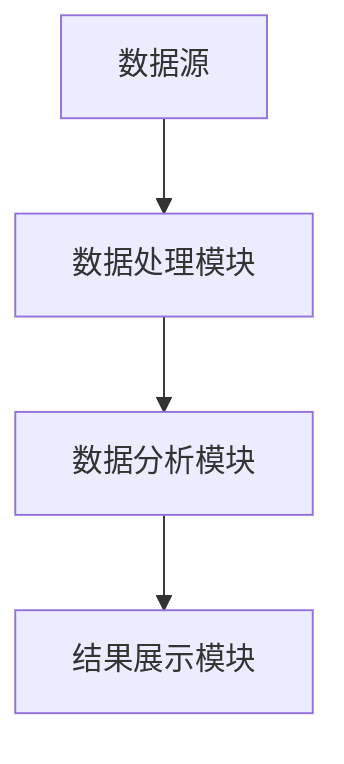
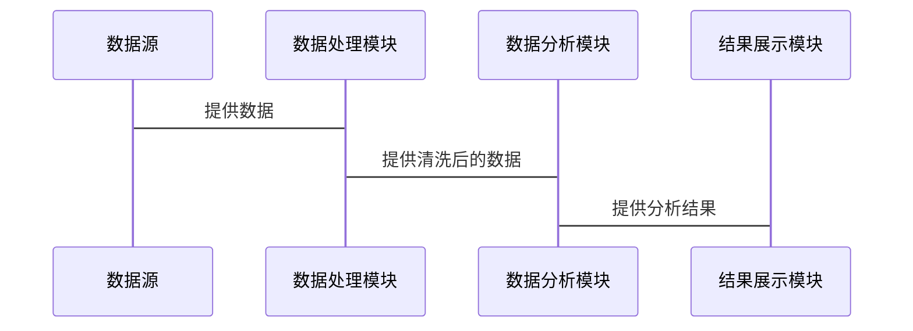

                 


# 《股市估值差异对国际教育技术创新的影响》

> 关键词：股市估值、教育技术创新、国际比较、投资影响、经济因素

> 摘要：本文探讨股市估值差异对国际教育技术创新的影响，通过分析股市估值差异的形成机制、教育技术创新的驱动因素，以及两者之间的相互作用，提出量化分析方法和系统架构设计方案，结合实际案例进行深入分析，最后总结最佳实践和注意事项。

---

## 第1章：背景介绍

### 1.1 核心概念

#### 1.1.1 股市估值差异
股市估值差异指的是不同市场、行业或公司之间的股票估值存在差异的现象。这种差异可能由市场情绪、公司基本面、宏观经济环境等多种因素引起。

#### 1.1.2 教育技术创新
教育技术创新指在教育领域引入新技术，如人工智能、大数据、虚拟现实等，以改善教学效果、提高效率和个性化学习体验。

#### 1.1.3 问题背景与问题描述
随着全球化的深入，国际教育技术投资不断增加，股市估值差异对技术创新的影响日益显著。本文旨在探讨这种影响的具体表现及其机制。

### 1.2 核心概念的联系

#### 1.2.1 问题解决路径
通过量化分析股市估值差异，结合教育技术创新的驱动因素，建立数学模型，分析两者之间的关系。

#### 1.2.2 边界与外延
本文主要关注股市估值差异对教育技术公司的直接影响，不涉及其他行业或宏观经济的全面分析。

---

## 第2章：核心概念与联系

### 2.1 影响股市估值的主要因素

#### 2.1.1 市场情绪与投资者心理
市场情绪波动会影响投资者对股票的估值，进而影响教育技术公司的融资能力。

#### 2.1.2 公司基本面
公司的财务状况、盈利能力和技术研发投入是影响股市估值的关键因素。

#### 2.1.3 宏观经济环境
宏观经济政策、利率水平等外部因素也会影响股市估值。

### 2.2 教育技术创新的驱动因素

#### 2.2.1 技术进步
人工智能和大数据等技术的发展推动了教育创新。

#### 2.2.2 市场需求
教育技术的应用需求增长驱动了技术创新。

#### 2.2.3 政策支持
政府政策和资金支持是教育技术创新的重要推动力。

### 2.3 股市估值差异与教育技术创新的关系

#### 2.3.1 促进作用
股市估值差异可能导致教育技术公司在不同市场中的融资能力不同，从而影响创新投入。

#### 2.3.2 反向影响
技术创新可能提升公司估值，进而影响股市整体表现。

#### 2.3.3 实证分析
通过案例分析，如某国教育技术公司因技术创新导致股价上涨，展示估值差异与创新的关系。

---

## 第3章：算法原理讲解

### 3.1 量化分析方法

#### 3.1.1 数据收集
收集教育技术公司和相关股市数据，包括股价、市盈率等指标。

#### 3.1.2 数据分析
使用统计方法分析股市估值差异与技术创新的关系，例如回归分析。

### 3.2 数学模型

#### 3.2.1 回归模型
建立回归模型，如：$$ Y = \beta X + \epsilon $$
其中，Y为教育技术创新指标，X为股市估值差异指标。

### 3.3 Python代码实现

```python
import pandas as pd
import numpy as np
from sklearn.linear_model import LinearRegression

# 假设data为数据框，包含'valuation_differences'和'innovation_scores'两列
model = LinearRegression()
model.fit(data[['valuation_differences']], data['innovation_scores'])
print('回归系数：', model.coef_)
print('回归截距：', model.intercept_)
```

---

## 第4章：系统分析与架构设计

### 4.1 问题场景

#### 4.1.1 数据收集场景
从多个股市平台收集教育技术公司的估值数据。

#### 4.1.2 案例分析场景
选择特定国家的教育技术公司进行分析。

### 4.2 功能设计

#### 4.2.1 数据收集模块
负责收集和处理相关数据。

#### 4.2.2 数据分析模块
对数据进行清洗、建模和预测。

### 4.3 系统架构图



### 4.4 序列图



---

## 第5章：项目实战

### 5.1 环境安装

#### 5.1.1 安装Python
安装Python 3.x及常用的库：Pandas、NumPy、Scikit-learn。

#### 5.1.2 数据获取
使用API或爬虫工具获取教育技术公司和相关股市数据。

### 5.2 核心代码实现

```python
import requests
import json

# 示例API请求
url = "https://api.example.com/stock_data"
response = requests.get(url)
data = json.loads(response.text)

# 数据处理
df = pd.DataFrame(data)
# 数据分析部分同上
```

### 5.3 案例分析

#### 5.3.1 案例选择
选择某国的教育技术公司进行分析，展示估值差异对创新的影响。

#### 5.3.2 数据分析
通过回归分析，展示估值差异与创新之间的关系。

---

## 第6章：最佳实践与小结

### 6.1 实践总结

- 数据收集的准确性和完整性是关键。
- 模型选择需结合实际场景。

### 6.2 注意事项

- 数据可能存在偏差，需谨慎处理。
- 结果需结合实际背景进行解释。

### 6.3 拓展阅读

- 推荐阅读相关文献，深入理解股市与技术创新的关系。

---

## 作者

作者：AI天才研究院/AI Genius Institute & 禅与计算机程序设计艺术 /Zen And The Art of Computer Programming

