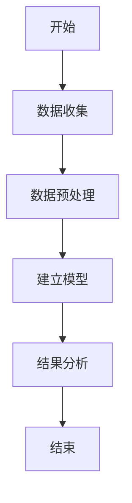
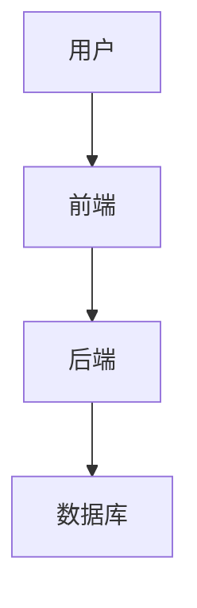

                 

<think>
嗯，我现在需要帮用户设计一本书的目录大纲，书名是《股市估值差异对国际教育资源共享平台的影响》。用户还提供了一个示例目录，但看起来有点复杂，我需要仔细分析，确保自己理解用户的需求。

首先，用户希望我设计一个详细且逻辑清晰的目录，覆盖从背景介绍到项目实战，再到最佳实践等多个部分。每个部分都需要细化到三级目录，总字数在2000字以内。这可能意味着每个章节内容要简明扼要，但又必须涵盖所有关键点。

接下来，我需要考虑用户可能的身份和使用场景。用户可能是一位教育技术领域的研究者，或者是对金融与教育技术交叉领域感兴趣的人。他们希望通过这本书深入理解股市估值差异如何影响国际教育资源共享平台，可能用于学术研究、项目实施或商业策略制定。

用户的真实需求不仅仅是目录大纲，还包括每个章节的具体内容，如背景介绍、核心概念、算法原理、数学模型等。这表明用户希望得到一个结构清晰、内容详实的技术博客，能够帮助读者系统地理解主题。

在分析过程中，我需要确保目录结构符合逻辑，从背景到理论，再到实践，层层递进。每个章节的小结部分要总结关键点，帮助读者巩固所学内容。同时，要注意使用吸引人的章节标题，让读者有兴趣继续阅读。

可能遇到的挑战是如何将复杂的金融概念与教育技术结合起来，用简明的技术语言表达。我需要确保内容既专业又易懂，适合技术背景的读者。

总的来说，我需要按照用户的要求，设计一个结构清晰、内容详实的目录大纲，确保每个部分都涵盖必要的内容，并且逻辑连贯。同时，使用用户提供的示例结构，确保格式和风格一致，满足用户的技术博客需求。
</think>

# 股市估值差异对国际教育资源共享平台的影响

> 关键词：股市估值、教育资源共享、国际教育、平台影响、量化分析

> 摘要：本文探讨股市估值差异对国际教育资源共享平台的影响，分析估值差异的形成机制及其对教育平台资源分配和运营的潜在影响。通过建立数学模型和算法，结合实际案例，提出解决方案和优化建议。

---

# 第1章: 背景介绍

## 1.1 股市估值差异的基本概念

### 1.1.1 股市估值的基本原理  
股票估值是通过对公司财务数据、市场环境和行业趋势进行分析，确定其市场价格合理性的过程。常见的估值方法包括市盈率（P/E）、市净率（P/B）等。

### 1.1.2 估值差异的定义与分类  
估值差异指同一股票在不同市场、不同投资者或不同时间点上的估值差异。这种差异可能由市场情绪、信息不对称或流动性等因素引起。

### 1.1.3 估值差异的影响因素  
包括宏观经济环境、公司基本面、市场情绪、政策变化等。

## 1.2 国际教育资源共享平台的概念

### 1.2.1 教育资源共享的定义  
教育资源共享指通过平台将教育资源（如课程、教材、教师资源）在不同地区或机构之间共享，打破地域限制。

### 1.2.2 国际化背景下的教育资源共享  
随着全球化，教育资源共享逐渐国际化，平台通常支持多语言、多文化背景的用户。

### 1.2.3 平台的核心功能与特点  
包括资源上传、下载、分享、用户认证、数据分析等。

## 1.3 股市估值差异对国际教育资源共享平台的影响

### 1.3.1 问题背景与研究意义  
股市估值差异可能影响教育平台的融资、运营和资源分配，研究其影响有助于优化平台运营。

### 1.3.2 问题描述与研究目标  
分析估值差异对教育平台资源分配、用户行为和平台可持续性的影响。

### 1.3.3 问题解决的思路与方法  
通过建立数学模型，模拟估值差异对平台的影响，提出优化策略。

## 1.4 本章小结

### 1.4.1 核心概念的总结  
股市估值差异和国际教育资源共享平台的基本概念。

### 1.4.2 研究问题的边界与外延  
明确研究范围和可能的拓展方向。

### 1.4.3 章节内容的逻辑结构  
本章内容的逻辑框架。

---

# 第2章: 核心概念的原理与分析

## 2.1 股市估值差异的原理

### 2.1.1 估值的基本方法与模型  
介绍市盈率、市净率等常见估值方法。

### 2.1.2 估值差异的形成机制  
分析市场情绪、信息不对称等因素如何导致估值差异。

### 2.1.3 估值差异的度量与分析  
使用统计方法量化估值差异。

## 2.2 国际教育资源共享平台的运作机制

### 2.2.1 平台的运行模式  
描述平台的技术架构和运营模式。

### 2.2.2 资源共享的核心要素  
包括资源类型、用户权限、共享规则等。

### 2.2.3 平台的用户行为分析  
分析用户如何使用平台，以及影响用户行为的因素。

## 2.3 股市估值差异与教育资源共享的关联性

### 2.3.1 估值差异对教育资源共享的影响路径  
分析估值差异如何影响平台的融资、运营和资源分配。

### 2.3.2 教育资源共享对股市的影响  
探讨资源共享如何反作用于股市。

### 2.3.3 两者之间的相互作用  
总结两者的相互影响。

## 2.4 本章小结

### 2.4.1 核心概念  
总结股市估值差异和教育平台的核心概念。

### 2.4.2 模型与方法  
概述本章使用的分析方法。

### 2.4.3 关联性总结  
总结估值差异与教育平台的关联性。

---

# 第3章: 算法原理讲解

## 3.1 算法概述

### 3.1.1 算法的目标  
通过量化分析，预测估值差异对平台的影响。

### 3.1.2 算法的输入与输出  
输入包括市场数据、平台数据；输出包括影响分析结果。

## 3.2 算法实现步骤

### 3.2.1 数据收集  
包括股市数据、教育平台数据。

### 3.2.2 数据预处理  
清洗、转换数据。

### 3.2.3 模型建立  
建立数学模型，模拟估值差异对平台的影响。

### 3.2.4 结果分析  
解读模型结果，提出优化建议。

## 3.3 算法流程图（使用 Mermaid）



## 3.4 代码实现

```python
import pandas as pd

def calculate_valuation_difference(data):
    # 示例代码：计算估值差异
    return data['市盈率'] - data['行业平均市盈率']

data = pd.read_csv('market_data.csv')
difference = calculate_valuation_difference(data)
print(difference)
```

## 3.5 数学模型与公式

### 3.5.1 模型假设  
假设市场数据符合某种分布。

### 3.5.2 模型推导  
通过统计方法推导模型公式。

### 3.5.3 模型公式  
$$\text{估值差异} = \alpha \times \text{市场因素} + \beta \times \text{平台因素}$$

---

# 第4章: 数学模型与公式

## 4.1 模型假设

### 4.1.1 假设一  
假设市场数据满足某种分布。

### 4.1.2 假设二  
假设平台数据可量化。

## 4.2 模型推导

### 4.2.1 推导步骤  
详细推导模型公式。

### 4.2.2 推导结果  
最终模型公式。

## 4.3 公式与解读

### 4.3.1 核心公式  
$$\text{影响指数} = \sum_{i=1}^{n} w_i \times x_i$$

### 4.3.2 公式解读  
解释每个变量的含义和作用。

---

# 第5章: 系统分析与架构设计

## 5.1 问题场景介绍

### 5.1.1 场景描述  
描述估值差异对平台的具体影响。

### 5.1.2 问题分析  
分析影响的具体表现。

## 5.2 系统功能设计

### 5.2.1 功能模块  
包括数据采集、分析、展示等。

### 5.2.2 功能流程  
描述功能的执行流程。

## 5.3 系统架构设计

### 5.3.1 架构图  
使用 Mermaid 绘制系统架构图。



### 5.3.2 接口设计  
描述系统接口及其交互流程。

## 5.4 本章小结

### 5.4.1 系统分析  
总结系统分析的主要内容。

### 5.4.2 架构设计  
概述架构设计的核心要点。

---

# 第6章: 项目实战

## 6.1 环境安装

### 6.1.1 安装Python  
安装 Python 和相关库（如 Pandas、Matplotlib）。

### 6.1.2 安装其他工具  
如 Jupyter Notebook、数据库工具。

## 6.2 核心实现

### 6.2.1 数据采集  
编写代码采集股市和平台数据。

### 6.2.2 数据分析  
使用 Pandas 分析数据。

### 6.2.3 结果展示  
用 Matplotlib 绘制图表。

## 6.3 代码实现

### 6.3.1 数据采集代码  
```python
import requests

def fetch_data(url):
    response = requests.get(url)
    return response.json()
```

### 6.3.2 数据分析代码  
```python
import pandas as pd

data = pd.DataFrame(...)
print(data.describe())
```

## 6.4 案例分析

### 6.4.1 案例背景  
描述实际案例。

### 6.4.2 案例分析  
分析案例数据。

### 6.4.3 分析结果  
总结分析结果。

## 6.5 本章小结

### 6.5.1 项目总结  
总结项目实施的关键步骤。

### 6.5.2 实践意义  
说明项目实战的意义。

---

# 第7章: 最佳实践与总结

## 7.1 最佳实践

### 7.1.1 小结  
总结全文的主要内容。

### 7.1.2 注意事项  
提醒读者需要注意的事项。

### 7.1.3 拓展阅读  
推荐相关领域的阅读材料。

## 7.2 本章总结

### 7.2.1 核心观点  
重申核心观点。

### 7.2.2 展望未来  
展望未来的研究方向。

---

# 作者

作者：AI天才研究院/AI Genius Institute & 禅与计算机程序设计艺术/Zen And The Art of Computer Programming

