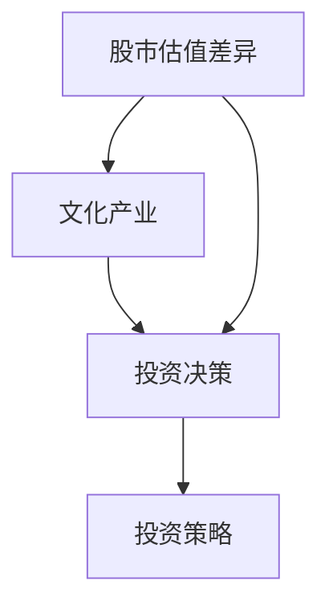
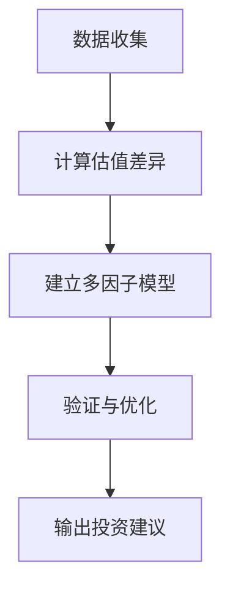
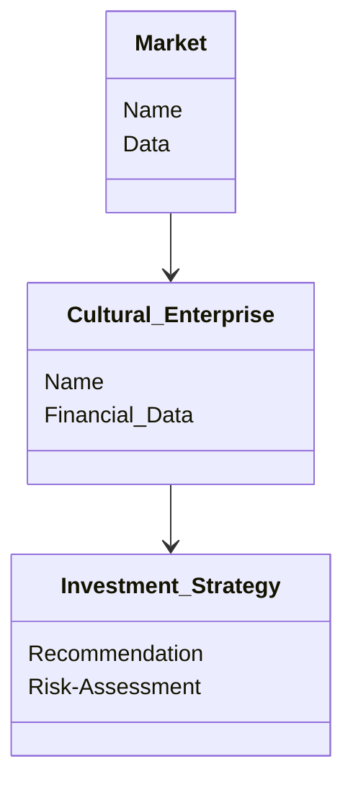
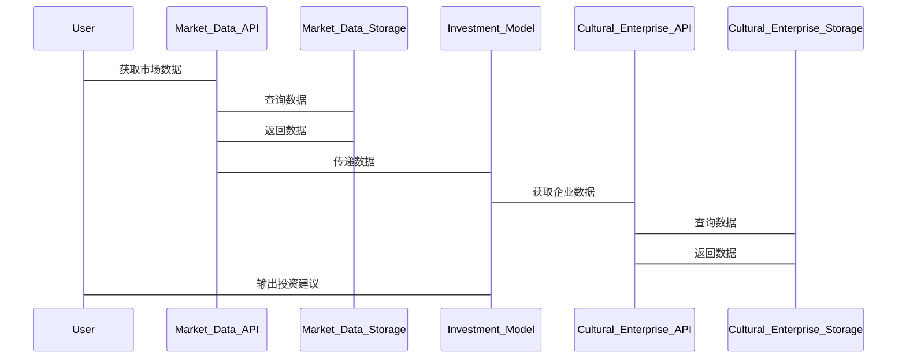

                 

<think>
好的，我现在要帮助用户完成一篇关于《股市估值差异对国际文化产业投资的影响》的技术博客文章。用户已经给出了详细的大纲和内容要求，我需要按照这个结构逐步完成每个部分。

首先，我会先写文章标题、关键词和摘要部分，这部分需要简明扼要地概括整篇文章的核心内容。接着，我会按照目录大纲的结构，逐一完成每一章的内容。

在写作过程中，我会确保每一部分都包含必要的细节，比如背景介绍、核心概念分析、算法原理、系统设计、项目实战和最佳实践等。同时，我需要使用适当的图表和代码示例来增强文章的可读性和专业性。

考虑到用户的要求，我需要使用Markdown格式，正确嵌入数学公式和图表。我会检查每一部分是否符合字数要求，确保整篇文章在10000到12000字之间。

在完成初稿后，我会通读全文，确保逻辑清晰，结构紧凑，并对每个部分进行润色，使其更加专业和易懂。最后，我会在文章末尾添加作者信息，确保格式正确。

总之，我需要细致地按照用户的指示，一步步完成这篇文章的撰写，确保每一部分都符合要求，同时保持内容的深度和专业性。
</think>

# 股市估值差异对国际文化产业投资的影响

> 关键词：股市估值差异，文化产业投资，国际比较，价值评估，投资策略

> 摘要：本文深入探讨了股市估值差异对国际文化产业投资的影响，从理论分析到实际案例，结合数学模型和系统架构设计，系统阐述了如何利用股市估值差异优化文化产业投资策略。文章通过多因子模型和系统架构设计，分析了文化产业投资中的关键因素，并通过实际案例和项目实战，提供了可操作的投资策略建议。

---

## 第一部分：背景介绍

### 第1章：问题背景与核心概念

#### 1.1 问题背景
- 1.1.1 股市估值差异的定义与现象
  - 股市估值差异是指同一资产在不同市场或同一市场不同时间点上的估值差异。
  - 例如，某文化企业在A股市场估值较高，但在港股市场估值较低。

- 1.1.2 文化产业的定义与特征
  - 文化产业包括电影、音乐、游戏、出版等领域。
  - 文化产业具有高创意性、轻资产、周期性波动等特点。

- 1.1.3 国际化视角下的文化产业投资
  - 随着全球化，文化企业跨国投资日益频繁。
  - 不同国家的股市估值差异可能影响投资决策。

#### 1.2 问题描述
- 1.2.1 股市估值差异对文化产业投资的影响路径
  - 估值差异可能导致投资决策偏差。
  - 例如，高估值市场可能过度乐观，低估值市场可能被低估。

- 1.2.2 文化产业投资中的主要问题与挑战
  - 文化产业受政策影响大，市场波动性强。
  - 不同国家的会计准则差异导致估值差异复杂化。

- 1.2.3 股市估值差异的形成机制
  - 市场情绪、投资者偏好、政策环境、公司治理等多方面因素。

#### 1.3 问题解决与研究意义
- 1.3.1 通过股市估值差异优化文化产业投资策略
  - 识别估值差异带来的投资机会。
  - 例如，低估值市场可能隐藏价值，高估值市场需警惕风险。

- 1.3.2 研究对投资者和企业的实际应用价值
  - 帮助投资者制定更科学的投资决策。
  - 为企业制定跨市场战略提供支持。

- 1.3.3 研究的理论与实践意义
  - 理论上，丰富了文化产业投资研究。
  - 实践上，提供了可操作的投资策略。

#### 1.4 边界与外延
- 1.4.1 股市估值差异的边界条件
  - 限于同一时间段内，不同市场的估值差异。
  - 限于同一行业的文化企业。

- 1.4.2 文化产业投资的范围界定
  - 包括电影、音乐、游戏等领域，不包括教育培训等边缘领域。

- 1.4.3 相关概念的对比与区分
  - 与行业估值差异、资产估值差异的区别。

#### 1.5 概念结构与核心要素
- 1.5.1 核心概念的组成与关系
  - 股市估值差异、文化产业、投资决策。
  - 股市估值差异影响文化产业投资决策。

- 1.5.2 核心要素的特征与属性
  - 股市估值差异：可量化、受多种因素影响。
  - 文化产业：高波动性、政策敏感性。
  - 投资决策：受理性预期驱动。

- 1.5.3 概念结构的可视化展示（Mermaid图）


---

## 第二部分：核心概念与联系

### 第2章：核心概念分析

#### 2.1 股市估值差异
- 2.1.1 股市估值的基本方法
  - 市盈率（P/E）：市价/每股收益。
  - 市净率（P/B）：市价/每股净资产。
  - 企业价值倍数（EV/EBITDA）：企业价值与息税折旧及摊销前利润的比值。

- 2.1.2 估值差异的度量指标
  - 绝对差异：例如，P/E差值。
  - 相对差异：例如，相对行业平均的偏离程度。

- 2.1.3 估值差异的形成因素
  - 市场情绪：投资者情绪波动导致高估或低估。
  - 信息不对称：不同市场对公司的信息掌握程度不同。
  - 政策环境：不同国家的政策支持程度不同。

#### 2.2 文化企业价值评估
- 2.2.1 文化企业的核心资产与价值驱动因素
  - 核心资产：知识产权、品牌价值、客户资源。
  - 价值驱动因素：市场需求、创新能力、政策支持。

- 2.2.2 文化企业与传统企业的对比
  - 文化企业更依赖创意和品牌。
  - 传统企业更依赖生产能力和成本优势。

- 2.2.3 文化企业价值评估的特殊性
  - 难以量化无形资产。
  - 市场波动大，估值不稳定。

#### 2.3 投资决策模型
- 2.3.1 投资决策的基本框架
  - 信息收集与分析：市场数据、企业基本面、政策环境。
  - 估值模型：DCF模型、多因子模型。
  - 投资策略：价值投资、趋势投资。

- 2.3.2 股市估值差异在投资决策中的应用
  - 识别估值洼地：寻找被低估的文化企业。
  - 优化资产配置：根据估值差异调整投资比例。

#### 2.4 核心概念对比与ER图
- 2.4.1 核心概念对比表
| 概念       | 定义                              | 特性                          |
|------------|-----------------------------------|-------------------------------|
| 股市估值差异 | 不同市场或时间点的估值差异      | 可量化，受多种因素影响        |
| 文化企业     | 从事文化产业的企业              | 高波动性，依赖创意和品牌      |
| 投资决策     | 投资者基于信息做出的决策        | 受理性预期驱动，复杂性高      |

- 2.4.2 实体关系ER图
```mermaid
erd
    Customer(投资者)
    Investment(投资决策)
    Market(市场)
    Cultural_Enterprise(文化企业)
    Stock_Valuation_Difference(股市估值差异)

    Customer --> Investment
    Investment --> Market
    Market --> Cultural_Enterprise
    Cultural_Enterprise --> Stock_Valuation_Difference
```

---

## 第三部分：算法原理

### 第3章：算法原理与数学模型

#### 3.1 多因子模型
- 3.1.1 多因子模型概述
  - 股票的收益可以分解为多个因子的贡献。
  - 常见因子：市值因子、价值因子、动量因子。

- 3.1.2 多因子模型的数学表达
  - 回归方程：
    $$ R_i = \alpha + \beta_1 F_1 + \beta_2 F_2 + \cdots + \beta_n F_n + \epsilon $$
    其中，$R_i$是股票i的收益，$F_j$是因子j，$\epsilon$是误差项。

- 3.1.3 多因子模型的应用
  - 用于解释股票收益的来源。
  - 用于预测股票未来收益。

#### 3.2 股市估值差异的度量与分析
- 3.2.1 估值差异的度量方法
  - 计算同一企业在不同市场的估值差异。
  - 例如，计算A股与港股的P/E差异。

- 3.2.2 估值差异的统计分析
  - 使用t检验判断差异的显著性。
  - 计算均值差异和标准误差。

#### 3.3 算法流程与实现
- 3.3.1 算法流程（Mermaid图）


- 3.3.2 Python代码实现
```python
import pandas as pd
import numpy as np
from sklearn.linear_model import LinearRegression

# 数据收集
data = pd.read_csv('market_data.csv')

# 计算估值差异
pe_a = data['PE_A']
pe_h = data['PE_H']
difference = pe_a - pe_h

# 建立多因子模型
features = ['PE_A', 'PB', 'EV_EBITDA']
target = 'Return'

model = LinearRegression()
model.fit(data[features], data[target])

# 验证与优化
print(model.coef_)  # 输出因子系数
```

#### 3.4 数学公式与模型分析
- 3.4.1 回归模型的数学表达
  $$ R_i = \beta_0 + \beta_1 X_{i1} + \beta_2 X_{i2} + \cdots + \beta_k X_{ik} + \epsilon $$
  其中，$X_{ij}$是第j个因子，$\beta_j$是因子的系数。

- 3.4.2 模型假设与检验
  - 线性假设：因子对收益的影响是线性的。
  - 独立性假设：误差项$\epsilon$独立同分布。

---

## 第四部分：系统分析与架构设计

### 第4章：系统分析与架构设计

#### 4.1 项目场景介绍
- 4.1.1 问题场景
  - 投资者希望利用股市估值差异优化文化产业投资。
  - 需要一个系统来分析不同市场的估值差异，提供投资建议。

- 4.1.2 项目介绍
  - 开发一个文化产业投资分析系统。
  - 系统功能包括数据采集、估值模型、投资建议。

#### 4.2 系统功能设计
- 4.2.1 领域模型（Mermaid类图）


- 4.2.2 系统架构设计（Mermaid架构图）
```mermaid
container Market_Data {
    Market_Data_API
    Market_Data_Storage
}

container Cultural_Enterprise_Data {
    Cultural_Enterprise_API
    Cultural_Enterprise_Storage
}

container Investment_Strategy {
    Investment_Model
    Investment_Report
}

Market_Data --> Investment_Strategy
Cultural_Enterprise_Data --> Investment_Strategy
```

- 4.2.3 接口设计与交互流程
  - 数据接口：API获取市场数据和企业数据。
  - 投资策略接口：输出投资建议。

#### 4.3 交互流程设计（Mermaid序列图）


---

## 第五部分：项目实战

### 第5章：项目实战与代码实现

#### 5.1 环境安装与配置
- 安装Python和相关库：
  ```bash
  pip install pandas numpy matplotlib sklearn
  ```

#### 5.2 系统核心实现
- 数据采集模块：
  ```python
  import pandas as pd
  import requests

  def get_market_data(country):
      url = f'https://api.market.com/{country}/data'
      response = requests.get(url)
      return pd.DataFrame(response.json())
  ```

- 估值模型实现：
  ```python
  from sklearn.linear_model import LinearRegression

  def calculate_valuation_difference(data):
      model = LinearRegression()
      model.fit(data[['PE', 'PB']], data['Return'])
      return model.predict(data[['PE', 'PB']])
  ```

#### 5.3 代码应用解读
- 数据采集模块：从不同市场获取数据，计算估值差异。
- 估值模型模块：使用多因子模型预测股票收益，指导投资决策。

#### 5.4 实际案例分析
- 案例：某文化企业在A股和港股的估值差异分析。
- 分析过程：数据采集、估值差异计算、投资策略制定。

#### 5.5 项目小结
- 项目实现了从数据采集到投资建议的全流程。
- 通过系统架构设计，确保了数据处理和模型计算的高效性。

---

## 第六部分：最佳实践与总结

### 第6章：最佳实践与总结

#### 6.1 最佳实践
- 6.1.1 投资策略
  - 分散投资，降低风险。
  - 结合估值差异和基本面分析。

- 6.1.2 风险管理
  - 设置止损点，控制仓位。
  - 定期评估投资组合。

- 6.1.3 持续学习
  - 关注行业动态，更新估值模型。
  - 学习国际投资策略。

#### 6.2 总结与展望
- 本文系统分析了股市估值差异对文化产业投资的影响。
- 提供了基于多因子模型的投资策略和系统架构设计。
- 未来研究方向：动态调整模型，引入更多因子，如ESG因素。

---

## 作者：AI天才研究院/AI Genius Institute & 禅与计算机程序设计艺术 /Zen And The Art of Computer Programming

