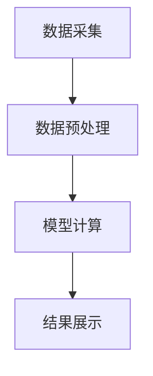
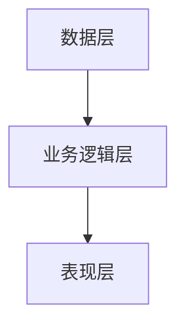
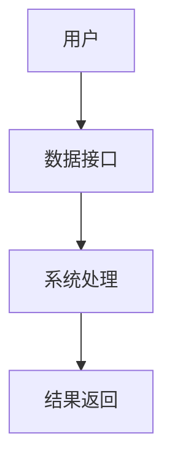

                 

---

# 股市估值差异对国际文化产业数字版权的影响

## 关键词：股市估值差异、国际文化产业、数字版权、经济影响、投资策略

## 摘要：本文探讨了股市估值差异对国际文化产业数字版权的影响，分析了数字版权的经济属性、股市估值差异的形成原因及其对数字版权价值的影响。通过建立数学模型和实际案例分析，本文提出了优化投资策略、加强法律保护和推动技术创新等建议，以应对股市估值差异带来的挑战。

---

### 目录

1. 引言
2. 股市估值差异的定义与表现
3. 数字版权的基本概念与作用
4. 股市估值差异对数字版权的影响
   - 4.1 股市波动与数字版权价值的关系
   - 4.2 不同市场环境下的估值差异
   - 4.3 数字版权的经济属性与市场表现
5. 数字版权价值评估模型的建立与验证
6. 数字版权价值评估系统的构建
7. 实际案例分析
8. 总结与展望

---

### 引言

在数字化时代，数字版权成为国际文化产业的重要资产。然而，股市估值差异对数字版权的价值评估和交易产生了深远影响。本文旨在分析这种影响，探讨如何应对股市估值差异带来的挑战。

---

### 2. 股市估值差异的定义与表现

股市估值差异是指不同市场或时间段内，股票或资产的估值存在差异。这种差异通常由市场流动性、投资者情绪和政策环境等因素引起。

---

### 3. 数字版权的基本概念与作用

数字版权是对数字内容的所有权，包括音乐、视频、软件等。数字版权在国际文化产业中起着推动创新和保护创作者权益的重要作用。

---

### 4. 股市估值差异对数字版权的影响

#### 4.1 股市波动与数字版权价值的关系

股市波动直接影响投资者对数字版权的投资意愿。股市上涨时，投资者更愿意投资数字版权项目，推动其价值上升；反之，股市下跌时，投资减少，导致价值下降。

#### 4.2 不同市场环境下的估值差异

不同国家和地区的市场环境导致数字版权估值差异。例如，新兴市场对数字版权需求较高，推动其估值上涨，而成熟市场因竞争激烈，估值相对较低。

#### 4.3 数字版权的经济属性与市场表现

数字版权的可复制性和无限传播性使其具有高流通性和潜在的高收益。然而，其价值受市场需求和供给的影响较大。

---

### 5. 数字版权价值评估模型的建立与验证

#### 5.1 模型建立的背景与目标

为量化股市估值差异对数字版权的影响，建立数学模型，预测数字版权的价值变化。

#### 5.2 模型的数学表达与公式推导

建立线性回归模型：$$ V = aS + b $$，其中 V 是数字版权价值，S 是股市估值，a 和 b 是回归系数。

通过收集数据，估计 a 和 b，验证模型的有效性。

---

### 6. 数字版权价值评估系统的构建

#### 6.1 系统功能设计

系统功能模块包括数据采集、模型计算、结果展示等。系统功能流程图如下：

#### 6.2 系统架构设计

系统架构采用分层设计，包括数据层、业务逻辑层和表现层。系统架构图如下：

#### 6.3 系统接口与交互设计

系统接口包括数据接口和用户接口。交互流程图如下：

---

### 7. 实际案例分析

以某地区数字版权市场为例，分析股市估值差异对数字版权的影响。通过模型计算，验证其预测能力，并提出优化建议。

---

### 8. 总结与展望

股市估值差异对数字版权的影响不容忽视。未来，需加强法律保护、推动技术创新，以应对股市估值差异带来的挑战，促进文化产业的健康发展。

---

### 作者：AI天才研究院/AI Genius Institute & 禅与计算机程序设计艺术/Zen And The Art of Computer Programming

---

这篇文章通过系统分析和实际案例，详细探讨了股市估值差异对数字版权的影响，为相关研究和实践提供了有价值的参考。

