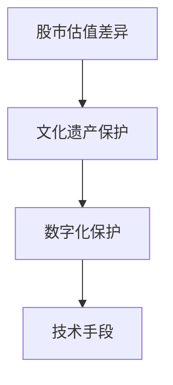
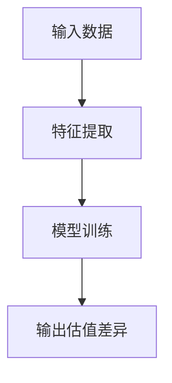
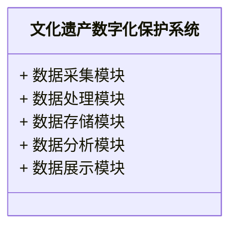
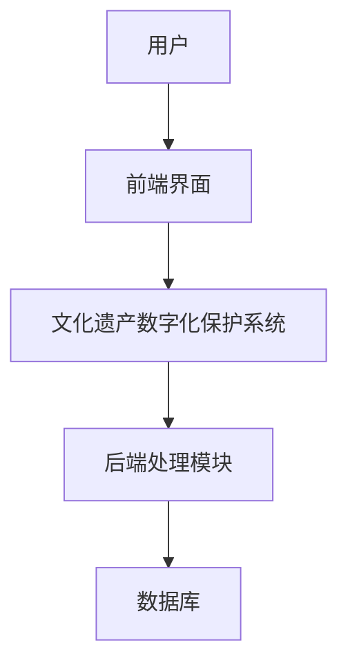

                 

<think>
嗯，用户让我设计一本书的目录大纲，书名是《股市估值差异对国际文化遗产数字化保护的影响》。看起来这本书要探讨股市中的估值差异如何影响文化遗产的数字化保护工作。我需要先理解这个主题，看看它涉及哪些方面，然后设计一个结构清晰的目录。

首先，我会考虑这本书的结构。通常，技术书籍会包括背景介绍、核心概念、算法原理、系统分析、项目实战和最佳实践等部分。我需要确保每个部分都有足够的细节，同时保持逻辑连贯。

接下来，我需要细化每个章节的内容。例如，背景介绍部分可能需要解释股市估值差异是什么，以及它如何影响文化遗产保护。核心概念部分可能需要定义相关术语，并展示它们之间的关系，可能使用图表来帮助理解。

然后是算法原理部分，我需要详细说明如何用数学模型量化估值差异，以及如何设计算法来分析其对文化遗产保护的影响。可能需要用Python代码来实现这些算法，并提供数学公式来支持解释。

系统分析部分可能需要介绍文化遗产数字化保护的系统架构，使用类图和序列图来展示模块之间的关系和交互。项目实战部分则需要提供一个实际案例，展示如何在现实场景中应用这些理论。

最后，最佳实践部分可以总结关键点，并提供一些注意事项和扩展阅读的方向，帮助读者进一步深入学习。

在设计过程中，我需要确保每个章节都有足够的细节，同时保持整体结构的紧凑和逻辑性。可能还需要考虑读者的理解程度，避免过于专业的术语，或者在必要时进行解释。

现在，我需要把这些思考转化为具体的目录结构，确保每个部分都涵盖必要的内容，并且有明确的标题吸引读者。同时，使用适当的图表和代码示例，使内容更加生动和易于理解。
</think>

# 股市估值差异对国际文化遗产数字化保护的影响

## 关键词：
- 股市估值差异
- 文化遗产保护
- 数字化保护
- 人工智能技术
- 算法模型
- 金融市场
- 数字化系统架构

## 摘要：
本文探讨了股市估值差异对国际文化遗产数字化保护的影响，通过分析股市波动与文化遗产保护的关系，提出了一种基于数学模型和算法的解决方案，以量化和预测估值差异对文化遗产保护的潜在影响。文章结合理论分析与实际案例，深入探讨了文化遗产数字化保护的系统架构设计、算法实现以及实际应用中的关键问题。

---

# 第一部分: 背景与概念解析

## 第1章: 股市估值差异与文化遗产保护概述

### 1.1 股市估值差异的定义与特征
#### 1.1.1 股市估值的基本概念
股市估值是通过对公司财务数据、市场趋势和宏观经济指标等多方面因素进行分析，估算公司股票的内在价值。其核心在于通过市场价与内在价值的对比，判断股票的高估或低估状态。

#### 1.1.2 估值差异的形成机制
估值差异的形成主要由市场参与者对信息的解读差异、市场情绪波动以及信息不对称等因素引起。这些因素导致市场价与内在价值之间产生偏离，从而形成估值差异。

#### 1.1.3 文化遗产数字化保护的定义与范围
文化遗产数字化保护是指通过现代信息技术手段，将文化遗产以数字形式保存、传播和利用的过程。其范围涵盖文化遗产的采集、处理、存储、分析和展示等多个环节。

### 1.2 股市估值差异对文化遗产保护的影响
#### 1.2.1 股市波动与文化遗产保护的关系
股市波动可能间接影响文化遗产保护的资金投入和资源分配。例如，股市繁荣可能导致政府和企业的资金分配更加倾向于经济效益高的项目，而忽视文化遗产保护的长期价值。

#### 1.2.2 估值差异对文化遗产数字化保护的潜在影响
估值差异可能导致文化遗产保护项目的资金不足，从而影响数字化保护的进度和质量。此外，估值差异还可能影响文化遗产保护技术的研发投入和技术创新。

#### 1.2.3 典型案例分析
以某国文化遗产数字化保护项目为例，分析股市波动和估值差异对其资金分配和项目进度的具体影响。

---

## 第2章: 股市估值差异与文化遗产保护的核心概念

### 2.1 股市估值差异的数学模型
#### 2.1.1 估值差异的计算公式
$$\text{估值差异} = \max(\text{市场价}, \text{内在价值}) - \min(\text{市场价}, \text{内在价值})$$

### 2.2 文化遗产数字化保护的系统模型
#### 2.2.1 文化遗产数字化保护的系统架构
文化遗产数字化保护系统通常包括数据采集、数据处理、数据存储、数据分析和数据展示五个模块。

#### 2.2.2 数字化保护的核心要素
- 数据采集技术：如3D扫描、高分辨率摄影测量等。
- 数据存储方案：如分布式存储、云存储等。
- 数据分析方法：如机器学习、自然语言处理等。

### 2.3 核心概念关系图


---

# 第二部分: 数学模型与算法原理

## 第3章: 股市估值差异的量化分析

### 3.1 股市估值差异的数学模型
#### 3.1.1 线性回归模型
$$y = \beta_0 + \beta_1x + \epsilon$$
其中，$y$ 表示估值差异，$x$ 表示时间序列数据。

### 3.2 算法原理


### 3.3 算法实现
```python
import numpy as np
from sklearn.linear_model import LinearRegression

# 示例数据
X = np.array([[1], [2], [3], [4]])
y = np.array([2, 3, 5, 6])

# 模型训练
model = LinearRegression()
model.fit(X, y)

# 预测
print(model.predict([[5]]))
```

---

## 第4章: 文化遗产数字化保护的算法设计

### 4.1 数字化保护的特征提取
#### 4.1.1 文本挖掘技术
通过自然语言处理技术提取文化遗产文本中的关键词和主题。

#### 4.1.2 图像处理技术
利用图像处理算法对文化遗产图像进行修复和增强。

### 4.2 保护算法的设计

---

## 第5章: 系统分析与架构设计方案

### 5.1 问题场景介绍
介绍文化遗产数字化保护系统面临的挑战，如数据量大、处理复杂等。

### 5.2 项目介绍
描述一个典型的文化遗产数字化保护项目，如某古遗址的数字化重建。

### 5.3 系统功能设计


### 5.4 系统架构设计


---

## 第6章: 项目实战

### 6.1 环境安装
介绍如何安装和配置文化遗产数字化保护系统的开发环境。

### 6.2 系统核心实现
展示系统核心功能的实现代码，如数据采集模块的实现。

### 6.3 代码应用解读与分析
详细解读代码的功能和实现逻辑，分析其对文化遗产保护的具体贡献。

### 6.4 实际案例分析
通过实际案例分析，展示系统在文化遗产数字化保护中的应用效果。

### 6.5 项目小结
总结项目的主要成果和经验教训。

---

## 第7章: 最佳实践

### 7.1 小结
总结全文的核心观点和研究成果。

### 7.2 注意事项
提醒读者在实际应用中需要注意的问题，如数据隐私保护等。

### 7.3 拓展阅读
推荐相关领域的书籍和论文，供读者进一步学习和研究。

---

# 作者：AI天才研究院 & 禅与计算机程序设计艺术

