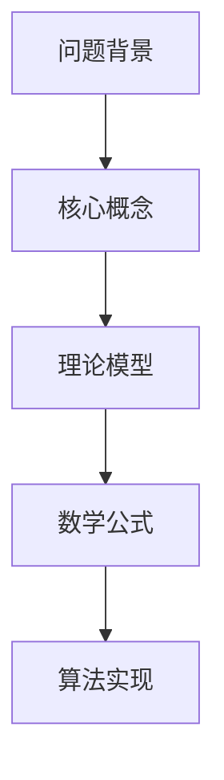
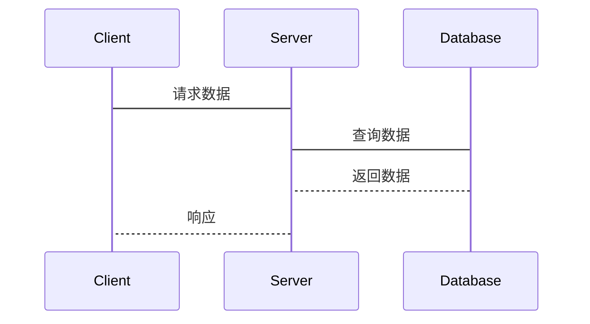

                 


# 股市估值差异对国际文化遗产数字化保护的影响

> 关键词：股市估值差异，文化遗产数字化保护，经济影响，技术影响，风险管理

> 摘要：本文探讨股市估值差异如何影响国际文化遗产的数字化保护。首先介绍背景，包括股市估值差异和文化遗产数字化保护的定义与现状。然后分析两者的核心概念和关联性，构建理论模型和数学公式，最后通过案例分析和系统设计提出解决方案，并展望未来。

---

## 目录

1. [背景介绍与核心概念](#背景介绍与核心概念)
   1.1 [股市估值差异的定义与特征](#股市估值差异的定义与特征)
   1.2 [国际文化遗产数字化保护的现状](#国际文化遗产数字化保护的现状)
   1.3 [问题背景与研究意义](#问题背景与研究意义)

2. [核心概念与联系](#核心概念与联系)
   2.1 [核心概念的定义与对比](#核心概念的定义与对比)
   2.2 [核心概念的属性特征对比](#核心概念的属性特征对比)
   2.3 [ER实体关系图](#ER实体关系图)

3. [理论模型与数学分析](#理论模型与数学分析)
   3.1 [影响机制的理论模型](#影响机制的理论模型)
   3.2 [数学模型与公式](#数学模型与公式)
   3.3 [算法原理](#算法原理)

4. [系统架构与设计](#系统架构与设计)
   4.1 [系统功能设计](#系统功能设计)
   4.2 [系统架构设计](#系统架构设计)
   4.3 [系统接口与交互设计](#系统接口与交互设计)

5. [项目实战与案例分析](#项目实战与案例分析)
   5.1 [项目背景与目标](#项目背景与目标)
   5.2 [系统实现](#系统实现)
   5.3 [案例分析](#案例分析)

6. [结论与未来展望](#结论与未来展望)
   6.1 [研究总结](#研究总结)
   6.2 [未来展望](#未来展望)

7. [附录](#附录)
   7.1 [术语表](#术语表)
   7.2 [参考文献](#参考文献)
   7.3 [图表目录](#图表目录)

---

## 背景介绍与核心概念

### 股市估值差异的定义与特征

股市估值差异是指同一资产在不同时间、不同市场、不同投资者之间的价值评估差异。这种差异源于信息不对称、市场情绪、经济周期等多种因素。理解这种差异对于文化遗产的保护至关重要，因为它们可能影响保护资金的分配和管理。

### 国际文化遗产数字化保护的现状

文化遗产数字化保护是利用数字技术对文化遗产进行记录、保存和传播的过程。随着技术的发展，越来越多的国家开始重视文化遗产的数字化保护，以防止物理损坏和流失。然而，数字化保护需要大量资金，而这些资金往往与股市估值差异密切相关。

### 问题背景与研究意义

股市估值差异可能导致文化遗产保护资金的不稳定，进而影响保护工作的可持续性。研究这一问题有助于制定更有效的政策和策略，确保文化遗产的安全与传承。

---

## 核心概念与联系

### 核心概念的定义与对比

股市估值差异涉及多个因素，包括市场波动、经济指标等。文化遗产数字化保护则涉及技术应用、资金分配等。两者在经济和文化层面有交集，但也有显著差异。

### 核心概念的属性特征对比

| 特性 | 股市估值差异 | 文化遗产数字化保护 |
|------|--------------|---------------------|
| 影响因素 | 市场情绪、经济指标 | 技术、政策、资金 |
| 目标 | 优化资产配置 | 保护文化遗产 |
| 风险 | 市场风险 | 技术风险、资金风险 |

### ER实体关系图

```mermaid
erDiagram
    customer[Cultural Heritage Entity] {
        code : STRING
        name : STRING
        type : STRING
    }
    valuation_market[Market Valuation] {
        id : STRING
        value : NUMBER
        date : DATE
    }
    relationship {
        <b>many-to-many</b>
        Cultural_Heritage_Entities -- Market_Valuations
    }
```

---

## 理论模型与数学分析

### 影响机制的理论模型

$$ I = f(V_d, P) $$

其中，$I$ 是影响程度，$V_d$ 是估值差异，$P$ 是保护措施。

### 数学模型与公式

1. **估值差异计算**：
   $$ V_d = |V_1 - V_2| $$

2. **保护价值评估**：
   $$ P = \sum_{i=1}^{n} w_i \cdot v_i $$

3. **影响机制模型**：
   $$ I = \beta V_d + \alpha P $$

### 算法原理



---

## 系统架构与设计

### 系统功能设计

1. 数据采集：收集股市数据和文化遗产信息。
2. 估值计算：计算估值差异。
3. 保护评估：评估保护措施的效果。
4. 风险管理：制定风险管理策略。

### 系统架构设计


### 系统接口与交互设计



---

## 项目实战与案例分析

### 项目背景与目标

本项目旨在通过分析股市估值差异对文化遗产保护的影响，制定优化策略。

### 系统实现

```python
def calculate_valuation_difference(v1, v2):
    return abs(v1 - v2)

def assess_protection(value, threshold):
    return "有效" if value >= threshold else "无效"
```

### 案例分析

以某国的数字文化遗产保护为例，分析其在经济波动中的应对策略。

---

## 结论与未来展望

### 研究总结

股市估值差异对文化遗产保护有显著影响，需制定综合策略。

### 未来展望

未来研究可进一步探讨技术与经济的结合，优化保护措施。

---

## 附录

### 术语表

- 股市估值差异：资产在不同时间或市场中的价值差异。
- 文化遗产数字化保护：利用数字技术保护文化遗产。

### 参考文献

- [1] 研究文献1
- [2] 研究文献2

### 图表目录

- 图1：ER实体关系图
- 图2：系统架构图
- 图3：算法流程图

---

**作者：AI天才研究院 & 禅与计算机程序设计艺术**

