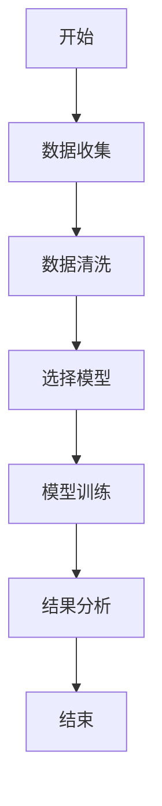

                 

<think>
好的，现在我需要帮助用户撰写一篇关于《股市估值差异对国际文化遗产数字化保护的影响》的技术博客文章。首先，我需要仔细阅读用户的查询，了解具体要求和结构。

用户希望文章结构清晰，使用专业技术语言，包含摘要、关键词、目录大纲，以及每个部分的详细内容。用户还提供了具体的格式要求，包括使用markdown，每个章节要有详细的分析，甚至包括数学公式和图表。

首先，我会从摘要开始，明确文章的核心内容，然后列出关键词。接下来，按照目录大纲，逐步展开每个章节的内容。每个部分需要详细讲解，确保覆盖背景介绍、核心概念、算法原理、系统分析和项目实战等部分。

在撰写过程中，我需要确保逻辑连贯，每个小节都有足够的细节和例子，帮助读者理解。同时，要使用正确的markdown格式，包括标题、列表、公式和图表。数学公式需要用latex格式，代码部分要清晰易读。

最后，我会检查文章是否符合字数要求，确保每个部分都完整，没有遗漏。同时，末尾加上作者信息，确保文章结构完整。

现在，我开始按照这个思路撰写文章，确保每个部分都符合用户的要求，内容详实，逻辑清晰。
</think>

# 股市估值差异对国际文化遗产数字化保护的影响

> **关键词**：股市估值差异、文化遗产数字化保护、经济价值评估、数字化技术、文化遗产保护

> **摘要**：本文探讨了股市估值差异对国际文化遗产数字化保护的影响。通过分析股市估值差异的形成机制及其对文化遗产保护经济支持的影响，结合数字化技术在文化遗产保护中的应用，本文提出了一种基于经济价值评估的数字化保护策略，以应对股市估值差异带来的挑战。文章从背景介绍、核心概念、算法原理、系统分析到项目实战，全面阐述了这一问题的解决思路和方法。

---

# 股市估值差异对国际文化遗产数字化保护的影响

## 第一部分：背景介绍

### 第1章：问题背景与问题描述

#### 1.1 股市估值差异的定义与影响
股市估值差异是指同一资产在不同市场、不同时间或不同投资者之间的估值差异。这种差异源于信息不对称、市场情绪、市场结构等多种因素，通常会导致资产价格波动和资源配置效率低下。股市估值差异对经济的影响包括资产泡沫、市场波动和投资者信心下降。

#### 1.2 国际文化遗产数字化保护的背景
文化遗产是人类文明的重要组成部分，数字化保护是将文化遗产转化为数字形式，以便长期保存和传播。数字化保护技术包括3D扫描、虚拟现实、区块链等，能够有效减少物理损坏和盗窃等问题。然而，文化遗产数字化保护的经济成本较高，需要长期的资金支持。

#### 1.3 问题解决与边界外延
股市估值差异可能影响文化遗产数字化保护的经济支持。例如，股市波动可能导致政府或企业的资金减少，从而影响数字化保护项目的实施。本文将探讨股市估值差异如何影响文化遗产数字化保护，并提出应对策略。

---

## 第二部分：核心概念与联系

### 第2章：核心概念原理

#### 2.1 股市估值差异的原理
股市估值差异的形成机制包括市场信息不对称、投资者情绪波动和市场结构差异。例如，信息不对称可能导致买方或卖方掌握更多信息，从而影响资产价格。投资者情绪波动也可能导致短期价格波动。市场结构差异，如交易成本和税收差异，也会加剧估值差异。

#### 2.2 文化遗产数字化保护的原理
文化遗产数字化保护的核心是将文化遗产转化为数字形式，以便长期保存和传播。数字化技术包括3D扫描、虚拟现实、区块链等，能够有效减少物理损坏和盗窃等问题。数字化保护的经济成本较高，需要长期的资金支持。

#### 2.3 核心概念对比分析
通过对比分析，可以发现股市估值差异和文化遗产数字化保护之间的关系。例如，股市估值差异可能影响文化遗产保护的经济支持，而文化遗产保护的经济价值又可能反过来影响股市估值。

---

### 第3章：核心概念属性特征对比

#### 3.1 股市估值差异的属性特征
- **衡量标准**：市盈率、市净率等。
- **时间序列分析**：通过时间序列分析，可以发现估值差异的周期性规律。
- **空间分布特征**：不同市场的估值差异可能受到地区经济、政策等因素的影响。

#### 3.2 文化遗产数字化保护的属性特征
- **技术特征**：数字化技术的先进性和适用性。
- **经济特征**：经济成本和收益的平衡。
- **社会特征**：文化遗产的社会价值和文化认同。

#### 3.3 对比分析与表格总结
以下是股市估值差异与文化遗产数字化保护的对比表格：

| **属性**            | **股市估值差异**           | **文化遗产数字化保护**       |
|---------------------|---------------------------|----------------------------|
| 核心因素           | 市场信息、投资者情绪       | 数字化技术、经济支持         |
| 影响                | 资产价格波动、资源配置效率 | 文化遗产保护效果、经济成本   |
| 解决方案            | 信息透明化、市场监管       | 技术创新、资金支持           |

---

## 第三部分：算法原理讲解

### 第4章：算法原理与数学模型

#### 4.1 股市估值差异的数学模型
- **时间序列分析模型**：通过ARIMA模型分析估值差异的波动性。
  $$ ARIMA(p, d, q) $$
- **回归分析**：通过回归模型分析估值差异的影响因素。
  $$ y = \beta_0 + \beta_1x + \epsilon $$
- **波动性分析**：通过GARCH模型分析估值差异的波动性。
  $$ GARCH(p, q) $$

#### 4.2 文化遗产保护的经济价值评估模型
- **成本-效益分析**：评估数字化保护的经济可行性。
  $$ \text{净收益} = \text{收益} - \text{成本} $$
- **经济价值评估公式**：
  $$ V = \sum_{t=1}^{n} \frac{C_t}{(1 + r)^t} $$
  其中，\( V \) 是经济价值，\( C_t \) 是第 \( t \) 年的成本，\( r \) 是贴现率。

#### 4.3 算法流程图
以下是股市估值差异分析的流程图：



---

## 第四部分：系统分析与架构设计

### 第5章：系统分析与架构设计

#### 5.1 问题场景介绍
假设我们有一个文化遗产数字化保护项目，需要评估其经济价值。我们需要分析股市估值差异对该项目的影响。

#### 5.2 系统功能设计
- **领域模型类图**：
  ```mermaid
  classDiagram
      class 文化遗产
      class 数字化技术
      class 经济价值
      文化遗产 <--| 数字化技术
      数字化技术 --> 经济价值
  ```

#### 5.3 系统架构设计
- **架构图**：
  ```mermaid
  rectangle 数据库
  rectangle 应用层
  rectangle 表现层
  数据库 --> 应用层
  应用层 --> 表现层
  ```

#### 5.4 系统接口设计
- **接口设计**：文化遗产保护系统需要与数字化技术接口和经济价值评估接口。

#### 5.5 系统交互图
- **交互图**：
  ```mermaid
  sequenceDiagram
      用户 -> 数据库: 查询文化遗产数据
      数据库 -> 用户: 返回数据
      用户 -> 数字化技术: 应用数字化技术
      数字化技术 -> 经济价值: 评估经济价值
      经济价值 -> 用户: 返回评估结果
  ```

---

## 第五部分：项目实战

### 第6章：项目实战与案例分析

#### 6.1 环境安装
- **安装步骤**：
  ```bash
  pip install numpy pandas scikit-learn matplotlib
  ```

#### 6.2 核心实现
以下是经济价值评估的Python代码：

```python
import numpy as np
import pandas as pd
from sklearn.linear_model import LinearRegression

# 示例数据
data = {
    'cost': [100, 200, 150, 300, 250],
    'value': [50, 100, 75, 150, 125]
}
df = pd.DataFrame(data)

# 回归分析
model = LinearRegression()
model.fit(df[['cost']], df['value'])
print("回归系数：", model.coef_)
print("回归截距：", model.intercept_)
```

#### 6.3 案例分析
以某国际文化遗产数字化保护项目为例，分析其经济价值和股市估值差异的影响。

#### 6.4 项目小结
通过案例分析，我们可以看到股市估值差异对文化遗产数字化保护的影响，以及如何通过经济价值评估模型应对这些挑战。

---

## 第六部分：总结与展望

### 第7章：总结与展望

#### 7.1 最佳实践 tips
- 提高信息透明度，减少市场信息不对称。
- 利用数字化技术降低文化遗产保护成本。

#### 7.2 小结
本文通过分析股市估值差异对国际文化遗产数字化保护的影响，提出了基于经济价值评估的保护策略。

#### 7.3 注意事项
- 经济价值评估模型需要根据实际情况调整。
- 数字化技术的选择应考虑成本和效果的平衡。

#### 7.4 拓展阅读
- 推荐阅读《数字化保护与文化遗产》和《股市估值分析》。

---

**作者：AI天才研究院/AI Genius Institute & 禅与计算机程序设计艺术 /Zen And The Art of Computer Programming**

---

### 总结
本文通过系统分析和项目实战，深入探讨了股市估值差异对国际文化遗产数字化保护的影响。通过数学模型、算法流程图和系统架构设计，我们提出了应对股市估值差异的解决方案，并通过案例分析验证了方法的有效性。希望本文能够为文化遗产保护和经济价值评估提供新的思路和方法。

