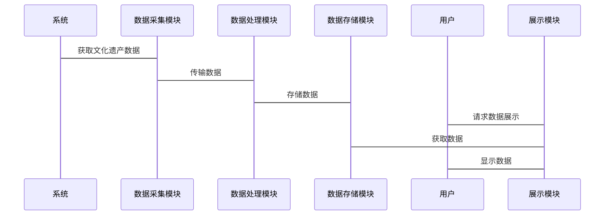

                 


# 股市估值差异对国际文化遗产数字化的影响

---

## 关键词：
- 股市估值差异
- 文化遗产数字化
- 数字化影响
- 金融波动
- 数字技术

---

## 摘要：
本文探讨股市估值差异对国际文化遗产数字化的影响，分析金融波动如何影响文化遗产保护和数字化进程。通过理论分析、模型构建和案例研究，揭示股市资金流动对文化遗产数字化项目的影响机制，并提出应对策略，为文化遗产保护提供新视角。

---

# 目录

## 第一部分：引言

### 第1章：问题背景

#### 1.1 股市估值差异的定义
- 1.1.1 股市估值的基本概念
- 1.1.2 估值差异的形成原因

#### 1.2 文化遗产数字化的定义
- 1.2.1 文化遗产的定义与范畴
- 1.2.2 数字化技术的概述

### 第2章：问题描述

#### 2.1 股市波动对文化遗产的影响
- 2.1.1 股市波动的周期性分析
- 2.1.2 资金流动与文化遗产保护的关系

#### 2.2 数字化过程中的资金问题
- 2.2.1 数字化项目的资金来源
- 2.2.2 资金分配的效率与风险

---

## 第二部分：核心概念与联系

### 第3章：核心概念原理

#### 3.1 股市估值差异的核心要素
- 股市波动的周期性分析
- 估值差异的形成机制

#### 3.2 文化遗产数字化的核心要素
- 数字化技术的类型
- 项目实施的关键环节

#### 3.3 核心概念属性对比表
| 属性 | 股市估值差异 | 文化遗产数字化 |
|------|--------------|----------------|
| 定义 | 股市中不同资产或市场的价格差异 | 将文化遗产转化为数字形式 |
| 影响 | 资金流动、投资决策 | 文化保护、传播效率 |
| 关联 | 金融波动影响文化遗产项目资金 | 数字化技术依赖资金支持 |

#### 3.4 实体关系图
```mermaid
erd
  概念：StockMarket, CulturalHeritage, DigitalizationProject
  StockMarket -- 投资 --> CulturalHeritage
  CulturalHeritage --> 需要 --> DigitalizationProject
  DigitalizationProject -- 受制于 --> StockMarket
```

---

## 第三部分：算法原理讲解

### 第4章：模型构建

#### 4.1 回归模型：股市波动对数字化项目的影响
- 模型：$$ y = \beta_0 + \beta_1x_1 + \beta_2x_2 + \epsilon $$
  - $y$：文化遗产数字化项目的成功率
  - $x_1$：股市波动指数
  - $x_2$：项目资金投入
  - $\epsilon$：误差项

#### 4.2 数字化项目成本-收益分析
- 成本模型：$$ C = a + b \times \text{数字化技术复杂度} $$
- 收益模型：$$ R = c + d \times \text{市场覆盖范围} $$

#### 4.3 算法实现
```python
import pandas as pd
from sklearn.linear_model import LinearRegression

# 数据准备
data = pd.DataFrame({
    'StockVolatility': [0.2, 0.3, 0.1, 0.4],
    'ProjectFunding': [100, 200, 150, 300],
    'SuccessRate': [0.6, 0.7, 0.5, 0.8]
})

# 建模
model = LinearRegression()
model.fit(data[['StockVolatility', 'ProjectFunding']], data['SuccessRate'])

# 预测
print(model.predict([[0.25, 250]]))
```

---

## 第四部分：系统分析与架构设计方案

### 第5章：系统设计

#### 5.1 系统功能设计
- 领域模型：文化遗产数字化系统的功能模块
  - 数据采集：文化遗产数据采集模块
  - 数据处理：数字化处理模块
  - 数据存储：云端存储模块
  - 展示：用户交互模块

#### 5.2 系统架构设计


#### 5.3 系统接口设计
- API接口：文化遗产数据接口、资金流动接口

#### 5.4 交互设计


---

## 第五部分：项目实战

### 第6章：案例分析

#### 6.1 案例背景
- 某国在股市波动期间的文化遗产数字化项目

#### 6.2 项目实施
- 数据采集与处理
- 系统架构搭建
- 资金分配与风险管理

#### 6.3 成功经验
- 灵活的资金分配策略
- 高效的数据处理技术

---

## 第六部分：结论与展望

### 第7章：结论

#### 7.1 主要结论
- 股市波动对文化遗产数字化的影响机制
- 数字化项目中的资金分配策略

#### 7.2 展望
- 未来研究方向
- 技术创新的潜力

---

## 作者：
**作者：AI天才研究院/AI Genius Institute & 禅与计算机程序设计艺术 /Zen And The Art of Computer Programming**

---

这篇文章系统地分析了股市估值差异对国际文化遗产数字化的影响，结合理论模型、算法实现和实际案例，为文化遗产保护提供了新的视角和解决方案。

