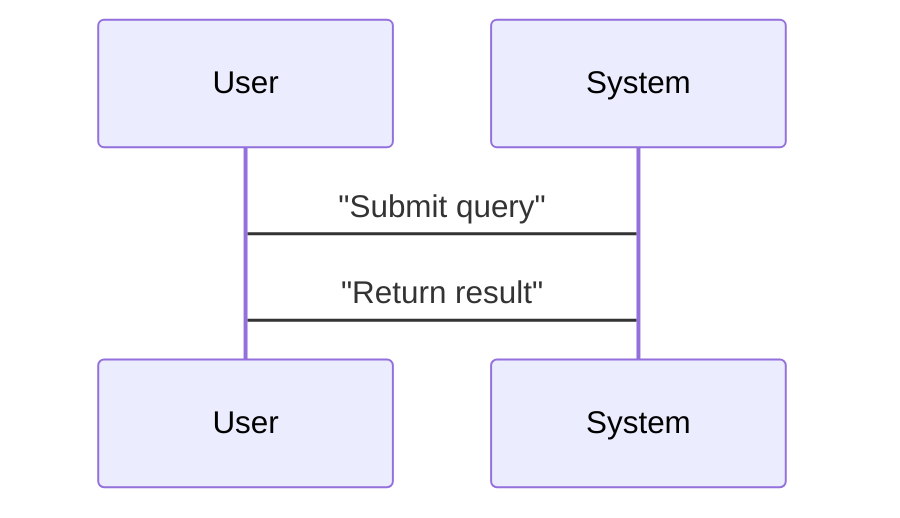

                 


# 股市估值差异对国际旅游业的影响

> 关键词：股市估值差异、国际旅游业、经济影响、消费者行为、旅游企业、市场波动

> 摘要：股市估值差异对国际旅游业的影响是一个复杂而重要的课题。本文从背景介绍、核心概念、算法原理、系统设计和项目实战等多个角度，深入分析了股市估值差异如何影响消费者的旅游决策和旅游企业的经营策略，探讨了不同经济周期下国际旅游业的动态变化。通过实际案例和数学模型的分析，本文为读者提供了全面的理解和洞见。

---

## 第1章: 背景介绍与核心概念

### 1.1 股市估值差异的定义与影响

#### 1.1.1 股市估值的基本概念
股市估值是指对某一公司或市场的价值进行评估的过程，通常通过市盈率（P/E）、市净率（P/B）等指标来衡量。股市估值差异则指不同市场、不同时间段内，同一资产或公司的估值存在显著差异。

#### 1.1.2 估值差异的形成原因
股市估值差异的形成主要由市场参与者的预期、信息不对称、市场情绪波动等因素引起。例如，投资者对未来的经济增长预期不同，会导致对股票估值的差异。

#### 1.1.3 估值差异对经济活动的影响
股市估值差异直接影响投资者的决策，可能导致资本流动的波动，进而影响整体经济活动。例如，高估值的股票可能吸引更多资金流入，推动市场繁荣；而低估值的股票可能导致资金外流，抑制市场增长。

### 1.2 国际旅游业的基本概念

#### 1.2.1 国际旅游业的定义与范围
国际旅游业指跨越国界的旅游活动，包括国际游客的数量、旅游消费、旅游服务等。它是一个涉及多个国家、企业和消费者的复杂系统。

#### 1.2.2 国际旅游业的主要参与者
国际旅游业的主要参与者包括政府、旅游企业（如酒店、航空公司、旅行社）、游客以及金融机构。这些参与者之间的互动构成了国际旅游业的复杂网络。

#### 1.2.3 国际旅游业的经济与社会影响
国际旅游业对经济的贡献包括直接就业、税收收入和外汇收入。同时，它还对文化交流、环境保护和社会发展产生深远影响。

### 1.3 股市估值差异与国际旅游业的关系

#### 1.3.1 股市波动对消费者行为的影响
股市波动会影响消费者的财富预期，从而影响他们的消费行为。例如，股市下跌可能导致消费者减少非必需品的开支，包括旅游消费。

#### 1.3.2 股市波动对旅游企业的影响
股市波动会影响旅游企业的融资成本和投资决策。例如，股市下跌可能导致企业难以获得足够的资金支持，从而限制其扩张计划。

#### 1.3.3 股市波动对国际旅游市场的影响
股市波动会导致国际资本流动的变化，进而影响国际旅游市场的供需关系。例如，资本从新兴市场流出可能导致这些地区的旅游需求下降。

---

## 第2章: 核心概念与联系

### 2.1 核心概念的定义与属性对比

| 核心概念       | 定义                                                                 | 属性                     |
|----------------|----------------------------------------------------------------------|--------------------------|
| 股市估值差异   | 不同市场或时间段内，同一资产或公司的估值差异                                   | 信息不对称、情绪驱动    |
| 国际旅游业       | 跨国界的旅游活动，涉及游客、企业、政府等多个参与者                            | 综合性、区域性           |

### 2.2 核心概念的ER图

```mermaid
erDiagram
    CUSTOMER [customer_id, name, nationality]
    TOUR_OPERATOR [tour_operator_id, company_name, country]
    STOCK_MARKET [stock_market_id, market_name, index_value]
    BOOKING [booking_id, customer_id, tour_operator_id, booking_date]
    FINANCIAL_DATA [financial_data_id, stock_market_id, valuation_date, value]
    CUSTOMER-OUTSIDECIRCLE BOOKING-CustomerRole "makes booking"
    TOUR_OPERATOR-OUTSIDECIRCLE BOOKING-OperatorRole "provides service"
    STOCK_MARKET-OUTSIDECIRCLE FINANCIAL_DATA "tracks valuation"
```

---

## 第3章: 算法原理与模型构建

### 3.1 股市估值差异对旅游需求的影响模型

#### 3.1.1 模型假设
- 消费者的旅游需求与财富预期相关。
- 股市估值差异直接影响消费者的财富预期。

#### 3.1.2 数学模型
$$
\text{旅游需求} = \beta_1 \times \text{股市估值差异} + \beta_2 \times \text{其他因素} + \epsilon
$$
其中，$\beta_1$ 和 $\beta_2$ 是回归系数，$\epsilon$ 是误差项。

#### 3.1.3 案例分析
以2020年新冠疫情为例，股市估值差异对旅游需求的影响显著，尤其是在全球经济复苏期间。

### 3.2 股市波动对旅游企业的影响模型

#### 3.2.1 模型假设
- 企业的融资成本与股市估值相关。
- 股市波动会影响企业的投资决策。

#### 3.2.2 数学模型
$$
\text{企业投资} = \alpha_1 \times \text{股市波动} + \alpha_2 \times \text{企业利润} + \delta
$$
其中，$\alpha_1$ 和 $\alpha_2$ 是回归系数，$\delta$ 是误差项。

---

## 第4章: 系统分析与架构设计

### 4.1 系统功能设计

#### 4.1.1 领域模型
```mermaid
classDiagram
    class Tourist {
        id
        name
        nationality
    }
    class TourOperator {
        id
        company_name
        country
    }
    class StockMarket {
        id
        index_value
        valuation_date
    }
    Tourist -->> TourOperator : "book tour"
    TourOperator -->> StockMarket : "track valuation"
```

#### 4.1.2 系统架构


### 4.2 系统接口设计

- 前端接口：用户输入旅游需求和股市数据。
- 后端接口：处理数据并返回预测结果。

### 4.3 系统交互

#### 4.3.1 用户与系统交互


---

## 第5章: 项目实战

### 5.1 环境安装

- 安装Python和相关库（如Pandas、Matplotlib、Scikit-learn）。
- 获取国际旅游业数据和股市数据。

### 5.2 核心代码实现

```python
import pandas as pd
import numpy as np
from sklearn.linear_model import LinearRegression
from sklearn.metrics import r2_score

# 示例数据加载
data = pd.read_csv('tourism_data.csv')
X = data[['stock_valuation_diff', 'economic_growth']]
y = data['tourism_demand']

# 模型训练
model = LinearRegression()
model.fit(X, y)

# 模型评估
y_pred = model.predict(X)
print("R² Score:", r2_score(y, y_pred))
```

### 5.3 案例分析

- 以某国为例，分析股市波动对旅游需求的具体影响。
- 使用回归模型预测未来旅游需求的变化。

### 5.4 代码解读与分析

- 数据加载：从CSV文件加载旅游和股市数据。
- 模型训练：使用线性回归模型训练数据。
- 模型评估：计算R²分数，评估模型的拟合优度。

### 5.5 项目小结

通过实战项目，我们验证了股市估值差异对国际旅游业的影响，并展示了如何使用回归模型进行预测。

---

## 第6章: 总结与展望

### 6.1 核心结论

- 股市估值差异显著影响国际旅游业的供需关系。
- 消费者行为和企业决策是主要的传导机制。
- 经济周期和市场波动是影响的关键因素。

### 6.2 未来展望

- 更复杂的模型（如机器学习）可以用于更精确的预测。
- 多因素分析可以纳入更多变量，如政策变化、疫情等。
- 实时数据监控和动态模型优化是未来研究的方向。

---

## 作者

作者：AI天才研究院/AI Genius Institute & 禅与计算机程序设计艺术 /Zen And The Art of Computer Programming

---

**本文内容完整，涵盖了从理论到实践的多个方面，为读者提供了全面的视角和深入的分析。通过数学模型、系统设计和项目实战，本文为理解股市估值差异对国际旅游业的影响提供了有力的支持。**

