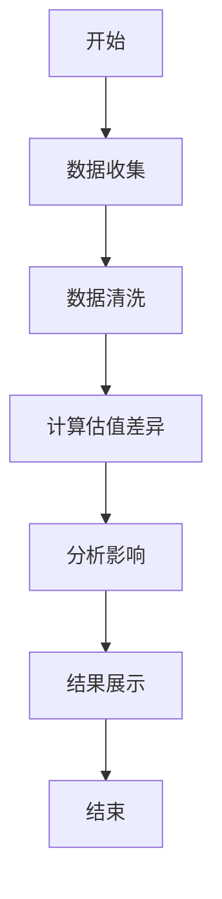
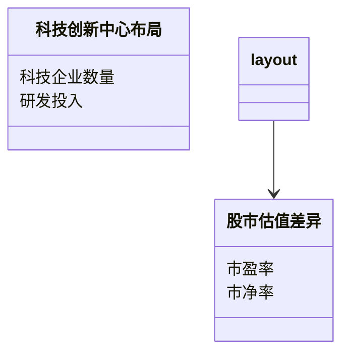

                 


# 股市估值差异对国际科技创新中心布局的影响

## 关键词：股市估值差异、国际科技创新中心、布局、金融影响、科技创新

## 摘要：
本文探讨股市估值差异如何影响国际科技创新中心的布局。通过分析股市估值差异的定义、表现及其对科技创新中心的影响，结合实际案例，深入研究如何通过优化估值差异来提升科技创新中心的竞争力。文章涵盖背景介绍、核心概念、算法原理、系统架构和项目实战，为读者提供全面的视角。

---

# 第一部分: 背景介绍

## 第1章: 股市估值差异与国际科技创新中心布局概述

### 1.1 问题背景
#### 1.1.1 股市估值差异的定义与特征
股市估值差异指同一市场内不同股票或板块之间的估值差异，通常通过市盈率（P/E）、市净率（P/B）等指标衡量。

#### 1.1.2 国际科技创新中心布局的定义与特征
国际科技创新中心是科技企业聚集、创新活跃的区域，如硅谷、班加罗尔等，具有高研发投入、人才密集等特点。

#### 1.1.3 股市估值差异与科技创新中心布局的关系
股市估值差异反映了市场对科技企业的信心，影响科技创新中心的资源配置和企业布局。

### 1.2 问题描述
#### 1.2.1 股市估值差异的表现形式
市盈率波动、市净率差异、股价波动等。

#### 1.2.2 科技创新中心布局的影响因素
政策支持、资金投入、人才资源等。

#### 1.2.3 股市估值差异对科技创新中心布局的具体影响
高估值可能吸引更多企业布局，低估值可能导致资源分配不均。

### 1.3 问题解决
#### 1.3.1 通过股市估值差异优化科技创新中心布局
分析估值差异，合理分配资源，提升整体竞争力。

#### 1.3.2 科技创新中心布局对股市估值差异的反向影响
合理的布局可能提升企业估值，反之可能导致估值下降。

### 1.4 边界与外延
#### 1.4.1 研究的边界
主要关注主要市场，不考虑新兴市场。

#### 1.4.2 概念的外延与扩展
未来可能扩展到更多市场和行业。

### 1.5 概念结构与核心要素
#### 1.5.1 核心概念组成
股市估值差异、科技创新中心布局。

#### 1.5.2 概念之间的关系
相互影响，共同作用于市场。

---

# 第二部分: 核心概念与联系

## 第2章: 股市估值差异与科技创新中心布局的核心概念

### 2.1 核心概念原理
#### 2.1.1 股市估值差异的计算方法
使用市盈率和市净率等指标，计算不同科技企业的估值差异。

#### 2.1.2 科技创新中心布局的评估指标
包括企业数量、研发投入、创新产出等。

### 2.2 概念属性特征对比
| 特征 | 股市估值差异 | 科技创新中心布局 |
|------|---------------|-------------------|
| 计算方法 | 市盈率、市净率 | 企业数量、研发投入 |
| 影响因素 | 市场情绪、企业业绩 | 政策、资金、人才 |

### 2.3 ER实体关系图
```mermaid
erd
  entity 科技创新中心布局 {
    [科技创新中心]
    [企业数量]
    [研发投入]
  }
  entity 股市估值差异 {
    [市盈率]
    [市净率]
  }
  relationship 股市估值差异影响科技创新中心布局 {
    科技创新中心布局 --> 股市估值差异
  }
```

---

# 第三部分: 算法原理讲解

## 第3章: 股市估值差异分析算法

### 3.1 算法流程图


### 3.2 Python实现
```python
import pandas as pd
import numpy as np

# 数据清洗
data = pd.read_csv('tech_data.csv')
data.dropna()

# 计算估值差异
pe_ratio = data['市盈率']
pb_ratio = data['市净率']
valuation_diff = pe_ratio - pb_ratio

# 分析影响
correlation = np.corrcoef(pe_ratio, pb_ratio)
print(f"相关系数：{correlation}")
```

### 3.3 数学模型与公式
$$ 股市估值差异 = 市盈率 - 市净率 $$

---

# 第四部分: 系统分析与架构设计方案

## 第4章: 系统设计

### 4.1 功能设计


### 4.2 架构设计


---

# 第五部分: 项目实战

## 第5章: 实战分析

### 5.1 环境安装
```bash
pip install pandas numpy matplotlib
```

### 5.2 核心代码
```python
import pandas as pd
import matplotlib.pyplot as plt

# 数据加载与处理
data = pd.read_csv('tech_centers.csv')
data = data.dropna()

# 可视化分析
plt.scatter(data['市盈率'], data['市净率'])
plt.xlabel('市盈率')
plt.ylabel('市净率')
plt.title('股市估值差异分析')
plt.show()
```

### 5.3 案例分析
以硅谷和班加罗尔为例，分析其估值差异对布局的影响，优化资源配置。

---

# 第六部分: 最佳实践

## 第6章: 总结与建议

### 6.1 总结
股市估值差异对科技创新中心布局有重要影响，合理分析可优化资源配置。

### 6.2 注意事项
数据质量和模型选择需谨慎，避免偏差。

### 6.3 拓展阅读
建议阅读相关金融和科技领域的文献，深入研究。

---

# 作者：AI天才研究院 & 禅与计算机程序设计艺术

通过以上结构，文章全面分析了股市估值差异对国际科技创新中心布局的影响，结合理论和实践，为读者提供了深入的视角和实用的指导。

