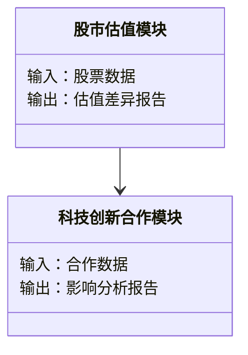
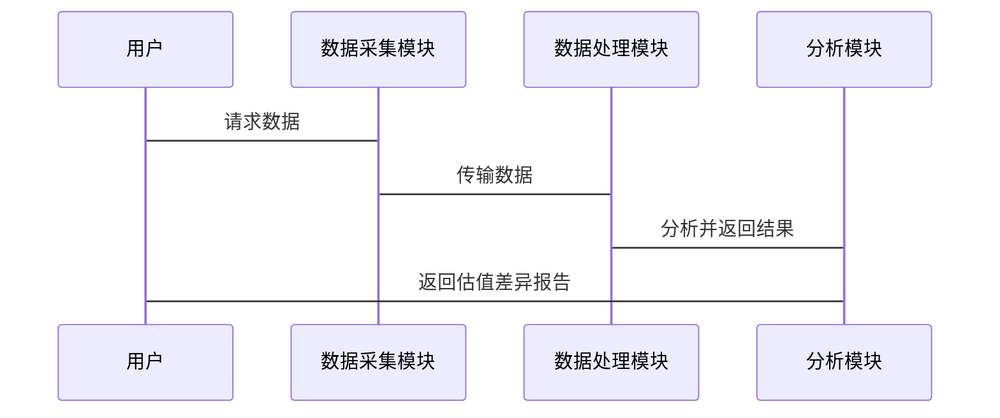

                 


# 股市估值差异对国际科技创新合作的影响

## 关键词：股市估值差异、国际科技创新合作、数学模型、算法原理、系统架构

## 摘要：本文探讨股市估值差异如何影响国际科技创新合作。通过分析股市估值差异的形成机制及其对科技创新合作的影响，构建数学模型，设计算法，并提出系统架构，最后通过案例分析验证模型，为实际应用提供参考。

---

## 第1章 核心概念与问题背景

### 1.1 股市估值差异的定义与特征

#### 1.1.1 股市估值的基本概念
股市估值是指市场参与者对某只股票的内在价值和市场价值的评估。常见估值方法包括市盈率（P/E）、市净率（P/B）和现金流折现模型（DCF）。

#### 1.1.2 股市估值差异的形成机制
估值差异主要由信息不对称、市场情绪、经济周期和政策变化引起。例如，市场情绪高涨时，投资者可能高估股票价值。

#### 1.1.3 股市估值差异的影响因素
包括宏观经济环境、公司基本面、行业趋势和市场参与者的行为等。

### 1.2 国际科技创新合作的定义与特征

#### 1.2.1 科技创新合作的内涵
指跨国企业和研究机构在技术研发、知识产权共享等方面的合作。

#### 1.2.2 国际科技创新合作的模式
包括技术授权、联合研发、技术转让和合资企业等。

#### 1.2.3 科技创新合作的关键要素
资金、技术、人才和政策支持是合作成功的关键。

### 1.3 股市估值差异与国际科技创新合作的关系

#### 1.3.1 股市估值差异对科技创新合作的潜在影响
高估或低估可能导致合作双方利益不均衡，影响合作意愿。

#### 1.3.2 科技创新合作对股市估值差异的反向作用
成功的合作可能提升市场信心，从而影响估值。

---

## 第2章 核心概念与问题描述

### 2.1 股市估值差异的核心要素

#### 2.1.1 市场参与者的认知差异
不同投资者对同一股票的估值可能不同，导致差异。

#### 2.1.2 信息不对称与市场预期
信息不对称可能导致市场参与者对股票价值的预期差异。

#### 2.1.3 经济周期与市场波动
经济周期波动会影响股市整体估值，进而影响科技创新合作。

### 2.2 国际科技创新合作的核心要素

#### 2.2.1 技术创新的跨国流动
技术从发达国家流向发展中国家，促进当地产业升级。

#### 2.2.2 知识产权保护与利益分配
知识产权保护不力可能导致合作失败，利益分配不均会影响合作意愿。

#### 2.2.3 政策环境与国际规则
政策支持和国际规则是合作顺利进行的重要保障。

### 2.3 问题解决的边界与外延

#### 2.3.1 股市估值差异的边界条件
包括市场深度、流动性、参与者行为等。

#### 2.3.2 科技创新合作的边界条件
涵盖技术复杂性、合作双方的资源投入、合作期限等。

#### 2.3.3 问题解决的外延与扩展
包括如何通过政策调节和市场机制缩小估值差异，促进合作。

---

## 第3章 核心概念与联系

### 3.1 股市估值差异与国际科技创新合作的核心原理

#### 3.1.1 股市估值差异对科技创新合作的驱动机制
高估可能导致合作双方期望过高，低估可能导致合作动力不足。

#### 3.1.2 科技创新合作对股市估值差异的调节机制
成功合作可能提升市场信心，缩小估值差异。

### 3.2 核心概念属性特征对比表

| 属性        | 股市估值差异                  | 国际科技创新合作                  |
|-------------|-----------------------------|----------------------------------|
| 定义          | 市场参与者对股票价值的差异评估 | 跨国技术合作                      |
| 影响因素      | 市场情绪、经济周期            | 技术、政策、知识产权              |
| 解决方式      | 市场调节、政策干预            | 技术共享、利益分配                |

### 3.3 ER实体关系图

```mermaid
erd
    股市估值差异和国际科技创新合作的关系
    1. 股市估值差异 -> 信息不对称
    2. 科技创新合作 -> 技术创新
    3. 信息不对称 <-> 科技创新合作
    4. 股市估值差异 <-> 科技创新合作
```

---

## 第4章 算法原理与流程

### 4.1 股市估值差异分析算法

#### 4.1.1 数据采集与预处理
从数据库中获取股票数据，清洗异常值，标准化处理。

#### 4.1.2 股市估值差异计算方法
使用相对估值法（P/E、P/B）和绝对估值法（DCF）计算差异。

#### 4.1.3 差异分析的可视化
用折线图和散点图展示差异趋势和分布。

### 4.2 科技创新合作影响分析算法

#### 4.2.1 数据特征提取
提取合作项目的技术领域、合作次数、投资金额等特征。

#### 4.2.2 合作影响的量化模型
构建回归模型，分析合作对市场估值的影响。

#### 4.2.3 模型验证与优化
使用交叉验证优化模型参数，提升准确率。

---

## 第5章 数学模型与公式

### 5.1 股市估值差异的数学模型

#### 5.1.1 股市估值差异计算公式
$$ \text{估值差异} = \max(V_i - V_j, 0) $$

#### 5.1.2 相关性分析公式
$$ \rho = \frac{\sum (x_i - \bar{x})(y_i - \bar{y})}{\sqrt{\sum (x_i - \bar{x})^2 \sum (y_i - \bar{y})^2}} $$

### 5.2 科技创新合作的影响模型

#### 5.2.1 回归分析模型
$$ Y = \beta_0 + \beta_1 X + \epsilon $$

#### 5.2.2 聚类分析模型
$$ \text{聚类中心} = \text{K-means算法} $$

---

## 第6章 系统分析与架构设计

### 6.1 系统架构设计

#### 6.1.1 系统功能设计（领域模型）


#### 6.1.2 系统架构图


#### 6.1.3 系统接口设计
接口定义：RESTful API，用于数据传输和结果查询。

#### 6.1.4 系统交互序列图


---

## 第7章 项目实战

### 7.1 环境安装

```bash
pip install numpy pandas matplotlib
```

### 7.2 核心代码实现

```python
import numpy as np
import pandas as pd
import matplotlib.pyplot as plt

# 数据预处理
data = pd.read_csv('stock_data.csv')
data = data.dropna()

# 股市估值差异计算
def calculate_difference(df):
    valuations = df['valuation']
    differences = []
    for i in range(len(valuations)):
        for j in range(i+1, len(valuations)):
            differences.append(abs(valuations[i] - valuations[j]))
    return differences

differences = calculate_difference(data)
plt.hist(differences, bins=50)
plt.show()
```

### 7.3 案例分析与代码解读

分析某科技公司合作案例，使用上述代码计算估值差异，绘制分布图，分析合作对估值的影响。

### 7.4 项目小结

项目展示了如何通过数据驱动的方法分析股市估值差异对合作的影响，代码可扩展性强，适用于不同数据集。

---

## 最佳实践 Tips

1. 在进行数据分析前，确保数据清洗和预处理到位。
2. 使用多种可视化方法展示结果，便于理解。
3. 结合实际案例进行分析，增强说服力。

---

## 小结

本文通过理论分析和案例研究，探讨了股市估值差异对国际科技创新合作的影响，构建了数学模型，并提出了系统架构设计方案。希望本文能为相关研究和实践提供参考。

---

## 注意事项

1. 数据分析需结合具体市场环境，避免过度简化。
2. 模型需不断优化，以适应市场变化。
3. 注意数据隐私和合规性问题。

---

## 拓展阅读

1. 《金融市场与估值》
2. 《技术创新管理》
3. 《数据驱动的决策分析》

---

## 作者：AI天才研究院 & 禅与计算机程序设计艺术

---

这篇文章通过系统化的分析和详细的代码示例，深入探讨了股市估值差异对国际科技创新合作的影响，为实际应用提供了理论和实践指导。

