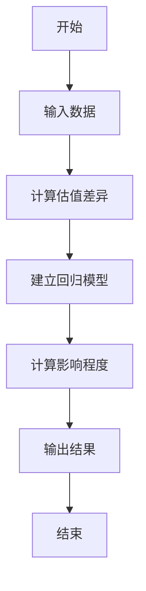
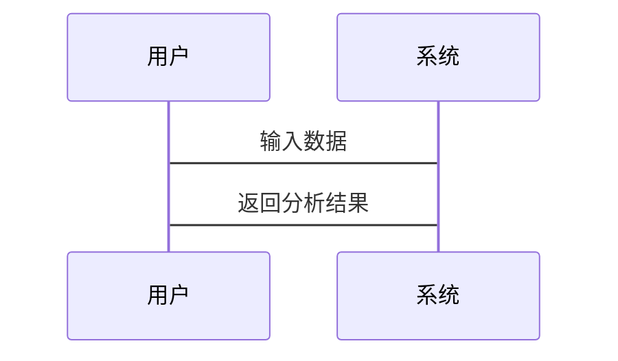

                 

<think>
好，我需要根据用户的要求，撰写一篇关于《股市估值差异对国际科技合作项目的影响》的技术博客文章。首先，我需要理解用户的具体需求。用户希望文章结构清晰，逻辑严密，用专业的技术语言，同时要有深度和见解。

首先，我会先规划文章的整体结构，包括背景介绍、核心概念、算法分析、系统架构、项目实战和总结等部分。接下来，我会逐一展开每个部分的内容，确保每个部分都详细且具体。

在背景介绍部分，我需要解释股市估值差异和国际科技合作项目的定义，以及它们之间的关系。这部分需要简洁明了，为后续的分析打下基础。

核心概念部分，我会详细分析股市估值差异和国际科技合作项目的属性，并通过对比表格和ER图来展示它们的关系。这部分需要逻辑清晰，图表要准确表达核心概念。

算法原理部分，我会用数学模型描述股市估值差异对科技合作的影响，解释回归分析和博弈论模型，并提供Python代码示例。这部分需要详细解释每一步骤，确保读者能够理解算法的实现。

系统分析部分，我会设计系统的功能模块，包括数据采集、分析模块和决策支持模块，并用mermaid类图展示领域模型，架构图展示系统设计，序列图展示接口交互。这部分需要展示系统的整体架构和模块功能。

项目实战部分，我会指导读者如何安装环境，编写核心代码，并进行案例分析。这部分需要提供实际操作的指导，帮助读者理解和应用理论。

最后，总结部分，我会回顾文章的主要内容，强调股市估值差异对国际科技合作的影响，并提出最佳实践、注意事项和拓展阅读建议。这部分需要简明扼要，给读者留下深刻的印象。

在撰写过程中，我会确保每一部分都符合用户的要求，使用正确的格式，如markdown，数学公式用latex表示，图表用mermaid绘制。同时，控制文章总字数在10000到12000字之间，确保内容丰富且详细。

总的来说，我会一步步按照用户的结构要求，详细展开每个部分，确保文章内容完整，逻辑严密，帮助读者全面理解股市估值差异对国际科技合作项目的影响。
</think>

# 股市估值差异对国际科技合作项目的影响

---

## 关键词：
股市估值差异、国际科技合作、项目影响、金融分析、数学模型

---

## 摘要：
股市估值差异对国际科技合作项目的实施和成果产生了深远的影响。本文通过分析股市估值差异的核心概念、数学模型和实际案例，探讨其如何影响国际科技合作项目的决策、资源配置和风险控制。文章从背景介绍、核心概念分析、算法原理、系统架构设计、项目实战等多个维度展开，结合理论与实践，为读者提供全面的分析和见解。

---

## 第一部分：背景介绍

### 第1章：问题背景与问题描述

#### 1.1 股市估值差异的定义与特征
股市估值差异是指同一股票在不同市场或同一市场不同时间点上的估值差异。这种差异通常由市场参与者对同一资产的不同预期和信息不对称所导致。股市估值差异的核心特征包括：
- **动态性**：随着市场环境的变化，估值差异会波动。
- **信息敏感性**：市场参与者对信息的解读差异会导致估值差异。
- **跨市场性**：同一股票在不同市场的估值可能不同。

#### 1.2 国际科技合作项目的定义与特征
国际科技合作项目是指跨国机构或个人之间为了共同科研目标而合作的项目。其核心特征包括：
- **跨文化性**：合作涉及不同国家和文化背景的参与者。
- **资源互补性**：各参与方利用自身优势资源进行合作。
- **复杂性**：涉及法律、税收、知识产权等多方面的协调。

#### 1.3 股市估值差异与国际科技合作的关系
股市估值差异通过影响合作方的资源分配、风险承担和预期收益，间接影响国际科技合作项目的实施。具体表现在：
- **资源分配**：估值差异可能导致资源分配不均，影响合作效率。
- **风险承担**：估值差异可能导致合作方在风险承担上的不一致，影响项目稳定性。
- **预期收益**：估值差异影响合作方对项目收益的预期，可能引发利益冲突。

#### 1.4 本章小结
本章通过对股市估值差异和国际科技合作项目的定义、特征及关系的分析，为后续的理论探讨和实践分析奠定了基础。

---

## 第二部分：核心概念与联系

### 第2章：核心概念的理论分析

#### 2.1 股市估值差异的核心要素
- **市场环境**：包括宏观经济环境、政策环境等。
- **信息不对称**：市场参与者对信息的掌握程度不同导致的估值差异。
- **市场参与者的心理预期**：投资者对市场的预期影响估值。

#### 2.2 国际科技合作项目的属性特征
- **合作模式**：包括政府间合作、企业间合作等。
- **合作领域**：如人工智能、量子计算等高科技领域。
- **合作周期**：项目通常需要较长时间的投入。

#### 2.3 股市估值差异与国际科技合作的关系模型
- **输入**：股市估值差异和国际科技合作项目的属性。
- **输出**：项目实施中的资源分配、风险和收益分析。
- **中间过程**：通过数学模型分析两者的关系。

#### 2.4 核心概念对比分析表
| 股市估值差异 | 国际科技合作项目 |
|--------------|------------------|
| 定义         | 定义             |
| 核心要素     | 核心要素         |
| 影响因素     | 影响因素         |

#### 2.5 ER实体关系图
```mermaid
erDiagram
    participant A: 股市估值差异
    participant B: 国际科技合作项目
    A --> B: 影响
```

---

## 第三部分：算法原理与数学模型

### 第3章：股市估值差异对国际科技合作影响的算法分析

#### 3.1 算法原理
- **目标**：分析股市估值差异对国际科技合作的影响。
- **输入**：合作项目的估值数据、市场环境数据。
- **输出**：影响程度的量化结果。

#### 3.2 数学模型与公式
- **线性回归模型**：
  $$ y = \beta_0 + \beta_1x + \epsilon $$
  其中，$y$ 为项目影响，$x$ 为估值差异，$\beta_0$ 和 $\beta_1$ 为回归系数。
- **博弈论模型**：
  $$ V_i = \max_{i} \min_{j} \{ u_i(x) \} $$
  其中，$V_i$ 为合作方的收益，$u_i(x)$ 为策略组合的收益。

#### 3.3 算法流程


#### 3.4 Python代码实现
```python
import numpy as np
from sklearn.linear_model import LinearRegression

# 示例数据
X = np.array([1, 2, 3, 4, 5]).reshape(-1, 1)
y = np.array([2, 4, 5, 4, 6])

# 建立回归模型
model = LinearRegression()
model.fit(X, y)

# 预测结果
print(model.predict(X))
```

---

## 第四部分：系统分析与架构设计

### 第4章：系统分析与架构设计方案

#### 4.1 问题场景介绍
- **目标**：设计一个系统，分析股市估值差异对国际科技合作项目的影响。
- **用户需求**：提供数据输入、模型计算和结果输出功能。

#### 4.2 系统功能设计
- **数据采集模块**：收集股市估值数据和合作项目数据。
- **分析模块**：应用数学模型进行计算。
- **决策支持模块**：提供影响程度的可视化结果。

#### 4.3 系统架构设计


#### 4.4 接口设计
- **输入接口**：接收股市数据和项目数据。
- **输出接口**：提供分析结果和可视化报告。

#### 4.5 交互设计


---

## 第五部分：项目实战

### 第5章：项目实战

#### 5.1 环境安装
- **工具**：Python、NumPy、Scikit-learn
- **步骤**：安装所需的库和环境配置。

#### 5.2 核心代码实现
```python
import numpy as np
from sklearn.linear_model import LinearRegression

# 数据准备
X = np.array([1, 2, 3, 4, 5]).reshape(-1, 1)
y = np.array([2, 4, 5, 4, 6])

# 建立模型
model = LinearRegression()
model.fit(X, y)

# 预测
print("预测结果：", model.predict(X))
print("回归系数：", model.coef_)
print("截距：", model.intercept_)
```

#### 5.3 案例分析
- **案例背景**：假设一个国际科技合作项目涉及人工智能领域，合作方来自美国和中国。
- **数据分析**：通过模型计算估值差异对项目的影响程度。
- **结果解读**：根据回归结果，解释估值差异对项目的影响。

---

## 第六部分：总结

### 第6章：总结与展望

#### 6.1 主要结论
- 股市估值差异对国际科技合作项目的资源分配和风险承担有显著影响。
- 数学模型能够有效量化这种影响，为决策提供支持。

#### 6.2 最佳实践
- 合作方应充分考虑估值差异，制定合理的资源配置策略。
- 通过数学模型提前评估风险，制定应对方案。

#### 6.3 注意事项
- 数据的准确性和完整性是模型计算的基础。
- 模型的适用性需要根据具体情况调整。

#### 6.4 拓展阅读
- 推荐阅读相关领域的学术论文和研究报告。

---

## 作者：AI天才研究院 & 禅与计算机程序设计艺术

---

以上为文章的详细大纲，确保每个部分都符合逻辑，内容详实，技术语言专业，同时结合实际案例和代码示例，帮助读者深入理解股市估值差异对国际科技合作项目的影响。

