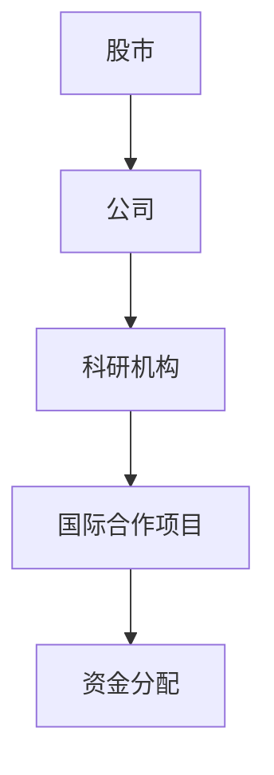
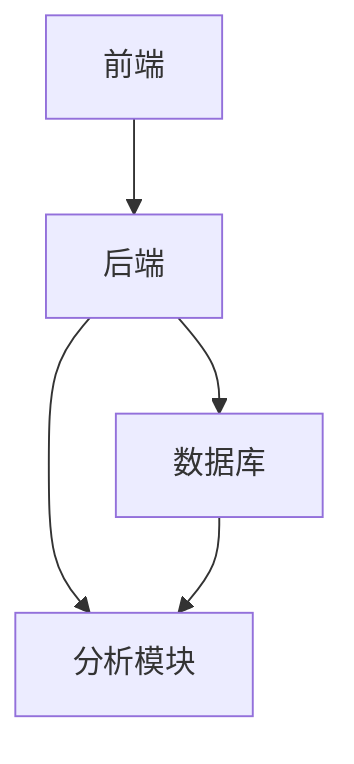
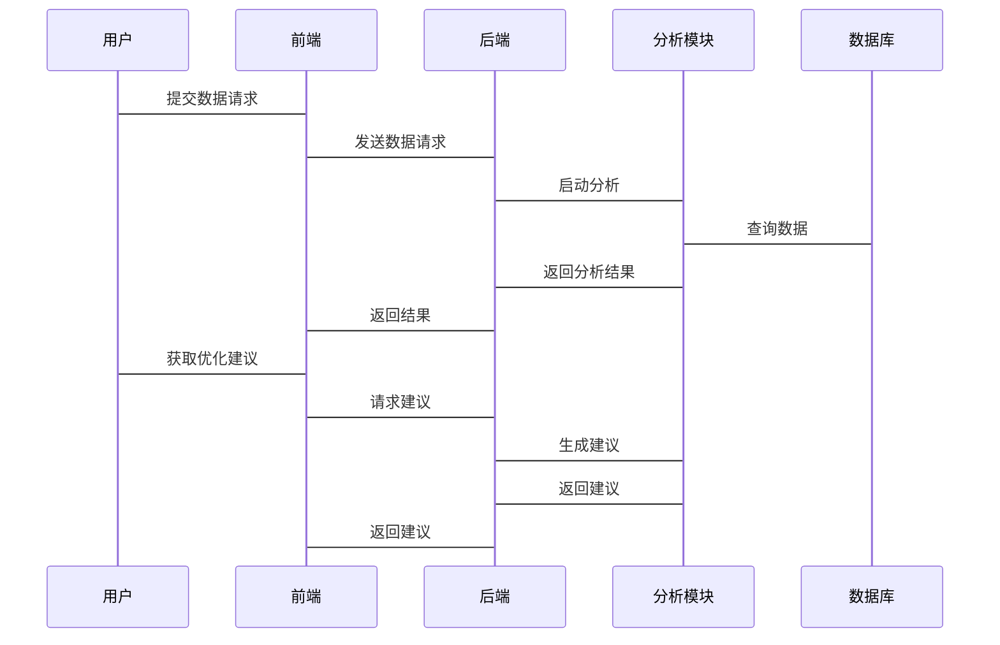

                 


# 股市估值差异对国际科研合作的影响

> **关键词**：股市估值差异、国际科研合作、线性回归模型、系统架构、算法实现

> **摘要**：本文探讨了股市估值差异对国际科研合作的影响，从背景、核心概念、算法原理、系统架构到项目实战，全面分析了股市估值差异如何影响科研合作的效率与效果，并提出了相应的解决方案。

---

## 第一部分：背景介绍

### 第1章：股市估值差异与国际科研合作的背景

#### 1.1 股市估值差异的定义与特征

股市估值差异指的是不同市场或同一市场中不同公司股票估值的差异。这些差异通常由市场信息不对称、投资者情绪、市场效率等因素引起。股市估值差异可以分为高估和低估两种情况，分别对应于市场参与者对公司的过高或过低评价。

#### 1.2 国际科研合作的定义与现状

国际科研合作是指跨国或跨机构的科学研究合作，通常涉及学术机构、企业和政府机构。随着全球化的发展，国际科研合作越来越重要，但同时也面临资金分配不均、沟通障碍等问题。

---

## 第二部分：核心概念与联系

### 第2章：股市估值差异与国际科研合作的关系

#### 2.1 核心概念的原理分析

股市估值差异直接影响科研资金的分配，进而影响国际合作的效率。例如，股市估值高的公司可能有更多的资金用于科研，而估值低的公司可能受限。不同国家股市的估值差异也会影响跨国合作的资源分配。

#### 2.2 核心概念对比表格

| 股市估值差异 | 国际科研合作 |
|--------------|--------------|
| 形成原因      | 资金分配模式  |
| 影响因素      | 合作效率      |
| 解决方案      | 资金优化配置  |

#### 2.3 ER实体关系图



---

## 第三部分：算法原理讲解

### 第3章：股市估值差异对国际科研合作影响的算法模型

#### 3.1 算法原理

线性回归模型用于量化股市估值差异对科研合作效率的影响。模型假设合作效率与股市估值差异呈线性关系。

#### 3.2 算法实现

```python
import numpy as np
from sklearn.linear_model import LinearRegression

# 示例数据
X = np.array([[1], [2], [3], [4], [5]])
y = np.array([2, 4, 5, 4, 8])

# 训练模型
model = LinearRegression()
model.fit(X, y)

# 预测
print(model.predict([[6]]))
```

#### 3.3 数学模型与公式

线性回归模型公式：$$ y = \beta_0 + \beta_1 x + \epsilon $$

评估指标：$$ R^2 = 1 - \frac{\sum (y_i - \hat{y}_i)^2}{\sum (y_i - \bar{y})^2} $$

---

## 第四部分：系统分析与架构设计方案

### 第4章：国际科研合作中的系统架构

#### 4.1 问题场景介绍

跨国科研项目因股市估值差异导致资金分配不均，影响合作效率。

#### 4.2 系统功能设计

- 数据采集：收集股市数据和科研项目数据。
- 数据分析：应用线性回归模型分析估值差异对合作效率的影响。
- 优化建议：基于分析结果提出资金分配建议。

#### 4.3 系统架构设计



#### 4.4 系统接口设计

- 数据接口：用于数据导入和查询。
- 分析接口：用于模型训练和预测。
- 建议接口：用于获取优化建议。

#### 4.5 系统交互序列图



---

## 第五部分：项目实战

### 第5章：基于股市估值差异的国际科研合作分析

#### 5.1 环境安装

安装Python、NumPy、Scikit-learn。

#### 5.2 核心实现源代码

```python
import numpy as np
from sklearn.linear_model import LinearRegression

# 示例数据
X = np.array([[1], [2], [3], [4], [5]])
y = np.array([2, 4, 5, 4, 8])

# 训练模型
model = LinearRegression()
model.fit(X, y)

# 预测
print(model.predict([[6]]))
```

#### 5.3 实际案例分析

分析跨国公司的股市估值差异对科研合作的影响，提出优化建议。

#### 5.4 项目小结

总结项目成果，讨论模型的有效性和局限性，提出改进建议。

---

## 第六部分：小结与最佳实践

### 6.1 总结全文

股市估值差异显著影响国际科研合作的效率和效果，通过算法模型和系统设计可以优化资源配置。

### 6.2 最佳实践 tips

- 使用线性回归模型量化影响。
- 设计高效的系统架构支持合作。
- 定期更新模型和系统以适应变化。

### 6.3 注意事项

- 数据质量影响模型准确性。
- 模型假设可能限制应用范围。

### 6.4 拓展阅读

推荐相关书籍和文章，供读者深入学习。

---

**作者：AI天才研究院/AI Genius Institute & 禅与计算机程序设计艺术 /Zen And The Art of Computer Programming**

---

这篇文章通过系统的分析和详细的案例，探讨了股市估值差异对国际科研合作的影响，并提供了相应的解决方案和实践指导。

