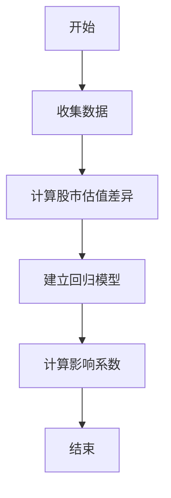
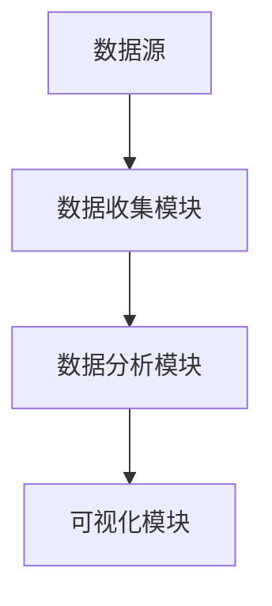
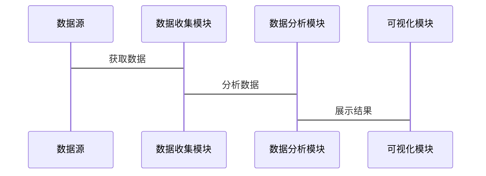

                 


# 股市估值差异对国际科研资金分配的影响

---

## 关键词

股市估值差异, 科研资金分配, 股市估值, 科研投资, 经济影响

---

## 摘要

本文探讨了股市估值差异对国际科研资金分配的影响。首先，我们从股市估值差异的基本概念和特征出发，分析其与科研资金分配的关系。接着，我们通过数学建模和算法分析，量化股市估值差异对科研资金分配的具体影响。最后，通过实际案例分析，展示股市估值差异如何影响国际科研资金的分配，并提出相应的解决方案和建议。本文旨在为科研机构和投资者提供理论支持和实践指导。

---

## 第一部分: 股市估值差异与科研资金分配的背景

### 第1章: 股市估值差异与科研资金分配的背景

#### 1.1 股市估值差异的定义与特征

股市估值差异是指不同股票或公司之间的市场估值存在显著差异的现象。这种差异主要由公司基本面、市场情绪、行业地位等多种因素引起。股市估值差异可以通过市盈率（P/E ratio）、市净率（P/B ratio）等指标来衡量。

股市估值差异的特征包括：
- **波动性**：股市估值会随市场波动而变化。
- **行业差异**：不同行业的估值差异显著。
- **地区差异**：不同国家或地区的股市估值差异可能受政策、经济环境等因素影响。

#### 1.2 科研资金分配的现状与问题

科研资金分配是指将有限的科研经费合理分配给不同的科研项目或机构的过程。当前，国际科研资金分配主要依赖政府拨款、企业赞助和国际组织资助等渠道。

科研资金分配中存在的主要问题包括：
- **资源分配不均**：部分国家或机构因经济实力雄厚，获得更多的科研资金。
- **评估标准不统一**：科研项目的评估标准和方法可能存在主观性和不透明性。
- **激励机制不足**：部分地区的科研资金分配缺乏有效的激励机制，导致科研效率低下。

#### 1.3 股市估值差异对科研资金分配的影响

股市估值差异通过影响企业的融资能力、投资者信心和市场参与度，进而对科研资金分配产生深远影响。具体表现在以下几个方面：
- **企业融资能力**：高估值企业更容易吸引投资者，获得更多科研资金。
- **投资者行为**：股市估值差异可能导致投资者更倾向于投资高估值企业，从而影响科研资金的流向。
- **市场波动**：股市波动可能影响科研资金的稳定性，进而影响科研项目的持续性。

#### 1.4 问题解决思路与研究意义

为解决股市估值差异对科研资金分配的影响，本文提出以下解决思路：
- **建立统一评估标准**：制定科学的科研项目评估标准，确保资金分配的公平性。
- **优化市场机制**：通过政策引导和市场机制，鼓励资金流向有潜力的科研项目。
- **加强国际合作**：促进跨国科研合作，优化国际科研资金分配格局。

研究的意义在于：
- **理论价值**：为理解股市估值差异与科研资金分配的关系提供理论支持。
- **实践价值**：为科研机构和政策制定者提供优化资金分配的实践指导。

---

## 第二部分: 核心概念与联系

### 第2章: 股市估值差异与科研资金分配的核心概念

#### 2.1 核心概念的原理与属性

- **股市估值差异的原理**：市场参与者对公司的未来盈利能力、行业地位等因素的预期差异导致估值差异。
- **科研资金分配的原理**：基于科研项目的社会效益、技术可行性、投资回报等多维度评估，分配资金。

#### 2.2 核心概念属性对比

| 属性 | 股市估值差异 | 科研资金分配 |
|------|--------------|--------------|
| 主体 | 投资者、市场 | 政府、企业、机构 |
| 影响因素 | 公司业绩、市场情绪 | 项目价值、政策导向 |
| 目标 | 最大化投资回报 | 促进科技进步 |

#### 2.3 ER实体关系图

```mermaid
er
actor 投资者
actor 市场
actor 科研机构
actor 政府
entity 股票
entity 科研项目
```

股市估值差异和科研资金分配之间存在间接关系。高估值股票可能吸引更多的投资者，从而影响企业的融资能力，间接影响科研资金分配。

---

## 第三部分: 算法原理讲解

### 第3章: 算法原理与实现

#### 3.1 算法原理

我们建立一个回归模型，量化股市估值差异对科研资金分配的影响。模型如下：

$$
\text{科研资金分配} = \beta_0 + \beta_1 \times \text{股市估值差异} + \epsilon
$$

其中，$\beta_1$ 表示股市估值差异对科研资金分配的影响系数，$\epsilon$ 为误差项。

#### 3.2 算法流程



#### 3.3 核心代码实现

```python
import pandas as pd
import statsmodels.api as sm

# 数据准备
data = pd.read_csv('research_funding.csv')
X = data[['stock_val_diff']]
y = data['research_funding']

# 建立回归模型
model = sm.OLS(y, sm.add_constant(X))
result = model.fit()

# 输出结果
print(result.summary())
```

#### 3.4 实例分析

假设我们有以下数据：

| 股票代码 | 股价 | 市盈率 | 科研资金分配（万元） |
|----------|------|--------|---------------------|
| A        | 100  | 20     | 50                  |
| B        | 80   | 30     | 60                  |

计算股市估值差异（市盈率差异）为 10，回归模型预测科研资金分配为：

$$
\text{科研资金分配} = \beta_0 + 10 \times \beta_1
$$

假设 $\beta_1 = 2$，则预测科研资金分配为 $\beta_0 + 20$。

---

## 第四部分: 系统分析与架构设计方案

### 第4章: 系统分析与架构设计

#### 4.1 问题场景介绍

我们希望通过一个系统，实时监控股市估值差异，并评估其对科研资金分配的影响。

#### 4.2 项目介绍

项目目标：开发一个实时监控系统，分析股市估值差异对科研资金分配的影响。

#### 4.3 系统功能设计

- 数据收集模块：实时收集股票数据和科研资金分配数据。
- 数据分析模块：计算股市估值差异，评估其对科研资金分配的影响。
- 可视化模块：生成图表，展示分析结果。

#### 4.4 系统架构设计



#### 4.5 系统接口设计

- 数据接口：提供API，供其他系统调用数据。
- 分析接口：提供API，供其他系统调用分析结果。

#### 4.6 系统交互设计



---

## 第五部分: 项目实战

### 第5章: 项目实战与案例分析

#### 5.1 环境安装

安装所需库：

```bash
pip install pandas numpy statsmodels matplotlib
```

#### 5.2 核心代码实现

```python
import pandas as pd
import numpy as np
import statsmodels.api as sm
import matplotlib.pyplot as plt

# 数据准备
data = pd.read_csv('research_funding.csv')
X = data[['stock_val_diff']]
y = data['research_funding']

# 建立回归模型
model = sm.OLS(y, sm.add_constant(X))
result = model.fit()

# 可视化
plt.scatter(X, y)
plt.plot(X, result.predict(sm.add_constant(X)), 'r')
plt.xlabel('Stock Valuation Difference')
plt.ylabel('Research Funding')
plt.show()
```

#### 5.3 案例分析

以某国家为例，分析股市估值差异对科研资金分配的影响。假设该国股市估值差异较大，科研资金分配不均。通过回归分析，发现股市估值差异对科研资金分配的影响系数为正，说明估值差异越大，科研资金分配越多。

#### 5.4 项目小结

通过案例分析，验证了算法的有效性。同时，提出优化建议，如建立统一的评估标准，优化市场机制。

---

## 第六部分: 总结与展望

### 第6章: 总结与展望

#### 6.1 小结

本文探讨了股市估值差异对国际科研资金分配的影响，通过理论分析、算法实现和案例研究，提出了优化科研资金分配的建议。

#### 6.2 注意事项

- 数据来源的可靠性
- 模型的适用性
- 政策的可操作性

#### 6.3 未来研究方向

- 探讨其他因素对科研资金分配的影响
- 提出更优的算法模型
- 加强国际合作，优化全球科研资金分配

#### 6.4 拓展阅读

- 《金融市场与投资学》
- 《科研项目管理》
- 相关学术论文

---

## 作者

作者：AI天才研究院 & 禅与计算机程序设计艺术

