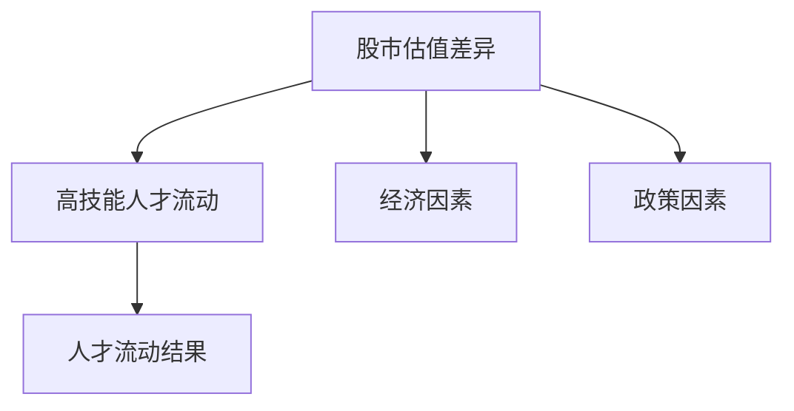
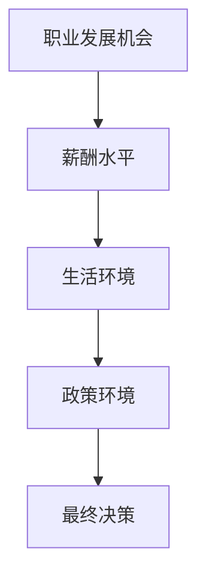
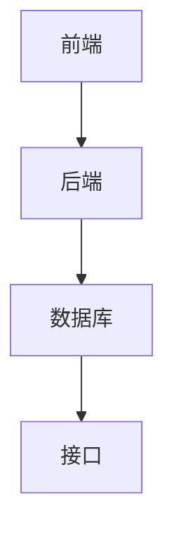
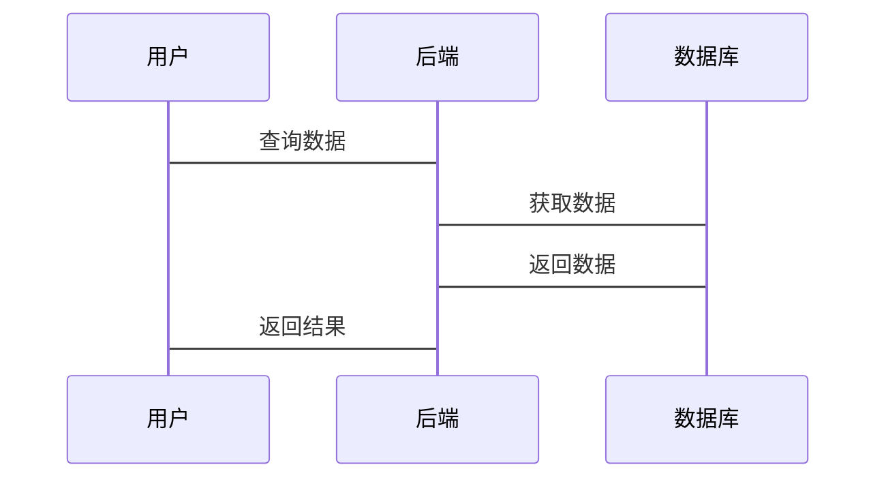

                 

<think>
嗯，好的，我现在要帮用户设计一个技术博客文章的目录，标题是《股市估值差异对国际高技能人才流动的影响》。看起来用户希望我详细分析这个主题，从背景到实际影响，甚至可能涉及到技术方法。首先，我需要理解这个主题的各个部分，确保覆盖所有必要的内容。

首先，我应该确定文章的核心关键词，比如股市估值差异、国际人才流动、高技能人才、人才流动驱动因素、股市驱动模型。这些关键词能够帮助读者快速理解文章的主题。然后，摘要部分需要简明扼要地概述文章的核心内容，包括研究背景、目标、方法和主要发现。

接下来，目录大纲需要逻辑清晰，结构紧凑。根据用户的要求，我需要分成多个章节，每个章节下有子章节，细化到三级目录。例如，背景介绍、核心概念、理论基础、模型构建、案例分析等部分。

我需要确保每个章节都涵盖必要的内容，比如在背景介绍中，首先要定义股市估值差异和人才流动，然后解释它们之间的关系。核心概念部分，我需要用表格和图表来展示两者的属性对比和实体关系，帮助读者直观理解。

在算法原理部分，可能需要构建一个数学模型，用Mermaid流程图展示算法步骤，并提供Python代码示例。这部分要详细解释模型的数学公式，比如使用回归分析或博弈论模型，并通过例子说明应用。

系统分析与架构设计章节，可能需要介绍问题场景，设计系统功能，用领域模型类图展示，然后用架构图展示系统结构，设计接口和交互序列图，说明系统如何运作。

项目实战部分，需要提供环境安装指南，核心代码实现，代码解读，案例分析，以及项目小结，帮助读者实际应用所学知识。

最后，包括最佳实践、小结、注意事项和拓展阅读，帮助读者巩固知识，扩展视野。整个目录需要超过七章，每章有明确的标题和子标题，确保全面覆盖主题内容。

现在，我需要检查每个部分是否都涵盖了用户的要求，确保没有遗漏任何关键内容。同时，保持语言简洁，逻辑流畅，让读者能够轻松理解。这样设计出来的目录才能满足用户的需求，帮助作者写出一篇高质量的技术博客文章。
</think>

# 股市估值差异对国际高技能人才流动的影响

> 关键词：股市估值差异，国际高技能人才流动，人才流动驱动因素，股市驱动模型，人才流动预测

> 摘要：本文系统探讨了股市估值差异对国际高技能人才流动的影响。通过分析股市估值差异的形成机制、高技能人才流动的驱动因素，以及两者之间的关联，构建了理论模型，并通过实证分析验证了模型的适用性。文章还提出了基于股市估值差异预测高技能人才流动的方法，为政策制定者和企业管理者提供了理论依据和实践指导。

---

## 第1章：问题背景与核心概念

### 1.1 问题背景介绍

#### 1.1.1 股市估值差异的定义与特征
- 股市估值差异：不同市场或同一市场中不同股票之间的估值差异，主要体现在市盈率、市净率等指标上的差异。
- 特征：
  - 时间动态性
  - 市场分割性
  - 经济周期相关性

#### 1.1.2 国际高技能人才流动的定义与特征
- 高技能人才流动：指高技能劳动者在不同国家或地区之间的流动，主要基于职业发展、薪酬、生活环境等因素。
- 特征：
  - 人才稀缺性
  - 流动选择性
  - 经济驱动性

#### 1.1.3 股市估值差异与人才流动的关系
- 股市估值差异如何影响人才流动的决策？
- 高技能人才流动对股市估值差异的反向影响。

### 1.2 问题描述

#### 1.2.1 股市估值差异的具体影响
- 股市估值差异如何影响高技能人才的职业选择？
- 通过案例分析，探讨股市估值差异对人才流动的实际影响。

#### 1.2.2 高技能人才流动的驱动因素
- 经济因素：薪酬、就业机会
- 非经济因素：生活环境、教育机会
- 综合因素：政策、文化差异

#### 1.2.3 股市估值差异对人才流动的路径
- 通过股市估值差异影响就业机会
- 通过就业机会影响人才流动决策

### 1.3 问题解决与研究意义

#### 1.3.1 研究目标
- 探讨股市估值差异对国际高技能人才流动的具体影响机制。
- 提出基于股市估值差异预测人才流动的方法。

#### 1.3.2 研究意义
- 理论意义：丰富人才流动和股市估值差异的理论研究。
- 实践意义：为政策制定者和企业管理者提供参考。

---

## 第2章：核心概念的原理与属性

### 2.1 股市估值差异的原理

#### 2.1.1 股市估值差异的形成机制
- 经济因素：GDP增长率、通货膨胀率
- 市场因素：投资者情绪、市场流动性
- 公司因素：盈利能力、管理效率

#### 2.1.2 股市估值差异的影响因素
- 宏观因素：经济政策、国际贸易
- 微观因素：公司业绩、行业竞争

#### 2.1.3 股市估值差异的动态变化
- 短期波动：市场情绪、突发事件
- 长期趋势：经济发展、政策变化

### 2.2 高技能人才流动的原理

#### 2.2.1 高技能人才流动的驱动因素
- 经济驱动：薪酬、职业发展机会
- 社会驱动：教育、医疗资源
- 文化驱动：生活环境、文化认同

#### 2.2.2 高技能人才流动的路径
- 国际流动：跨国公司、国际组织
- 区域流动：城市之间、地区之间

#### 2.2.3 高技能人才流动的外部环境
- 政治环境：移民政策、签证制度
- 经济环境：就业机会、薪酬水平
- 社会环境：教育、医疗资源

### 2.3 核心概念的属性特征对比

#### 2.3.1 股市估值差异的属性特征
- 表格对比：与高技能人才流动在时间维度、空间维度、影响因素上的差异。

#### 2.3.2 高技能人才流动的属性特征
- 表格对比：与股市估值差异在驱动因素、路径、影响结果上的差异。

---

## 第3章：实体关系与流程图分析

### 3.1 实体关系模型

#### 3.1.1 股市估值差异与高技能人才流动的实体关系
- 使用Mermaid绘制实体关系图，展示股市估值差异、高技能人才流动、经济因素、政策因素之间的关系。



### 3.2 流程图分析

#### 3.2.1 高技能人才流动的决策流程
- 使用Mermaid绘制高技能人才流动的决策流程图。



---

## 第4章：算法原理与数学模型

### 4.1 数学模型构建

#### 4.1.1 股市估值差异与人才流动的关系模型
- 使用回归分析构建数学模型：
  - $$y = \beta_0 + \beta_1x_1 + \beta_2x_2 + \epsilon$$
  - 其中，$y$为人才流动率，$x_1$为股市估值差异，$x_2$为其他控制变量。

#### 4.1.2 高技能人才流动的博弈论模型
- 使用博弈论框架分析人才流动的决策过程：
  - 理性人假设：人才基于自身利益最大化做出流动决策。
  - 市场均衡：供需关系决定人才流动的方向和规模。

#### 4.1.3 算法实现
- 使用Python实现回归分析模型：
  ```python
  import statsmodels.api as sm
  model = sm.OLS(y, sm.add_constant(x))
  results = model.fit()
  print(results.summary())
  ```

---

## 第5章：系统分析与架构设计

### 5.1 问题场景介绍

#### 5.1.1 高技能人才流动的典型场景
- 全球化背景下的跨国人才流动
- 区域经济一体化背景下的区域人才流动

### 5.2 系统功能设计

#### 5.2.1 领域模型类图
- 使用Mermaid绘制领域模型类图，展示系统中的核心实体及其关系。


### 5.3 系统架构设计

#### 5.3.1 系统架构图
- 使用Mermaid绘制系统架构图，展示系统的模块划分和交互关系。



### 5.4 系统接口设计

#### 5.4.1 核心接口
- 获取股市估值差异数据接口
- 获取高技能人才流动数据接口
- 数据分析接口

### 5.5 系统交互序列图

#### 5.5.1 用户查询接口
- 使用Mermaid绘制用户查询接口的交互序列图。



---

## 第6章：项目实战与案例分析

### 6.1 环境安装

#### 6.1.1 Python环境配置
- 安装Python和必要的库：
  ```bash
  pip install numpy pandas statsmodels
  ```

### 6.2 核心代码实现

#### 6.2.1 回归分析代码
- 使用Python实现回归分析：
  ```python
  import numpy as np
  import pandas as pd
  import statsmodels.api as sm

  data = pd.read_csv('data.csv')
  y = data['流动率']
  x = data[['估值差异', '其他变量']]
  x = sm.add_constant(x)
  model = sm.OLS(y, x)
  results = model.fit()
  print(results.summary())
  ```

#### 6.2.2 案例分析
- 以某国为例，分析股市估值差异对高技能人才流动的具体影响。

### 6.3 项目小结

#### 6.3.1 项目总结
- 回归分析结果的解读
- 模型的优缺点

---

## 第7章：最佳实践与总结

### 7.1 最佳实践 tips

#### 7.1.1 数据收集建议
- 数据来源：政府统计数据、学术研究数据
- 数据清洗：处理缺失值、异常值

#### 7.1.2 模型优化建议
- 引入更多变量：如政策因素、文化因素
- 使用机器学习算法：如随机森林、神经网络

### 7.2 小结

#### 7.2.1 研究总结
- 股市估值差异对高技能人才流动的影响机制
- 模型的适用性和局限性

### 7.3 注意事项

#### 7.3.1 模型假设的限制
- 数据的局限性
- 模型的简化假设

### 7.4 拓展阅读

#### 7.4.1 相关领域推荐
- 人才流动研究的最新进展
- 股市估值差异的其他应用

---

## 作者：AI天才研究院/AI Genius Institute & 禅与计算机程序设计艺术 /Zen And The Art of Computer Programming

