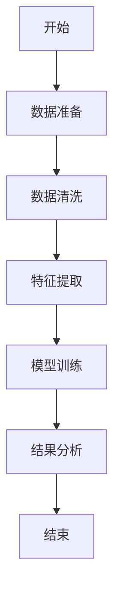
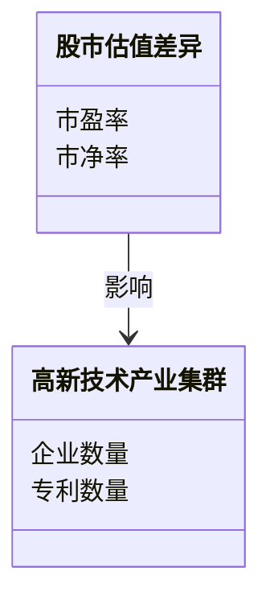
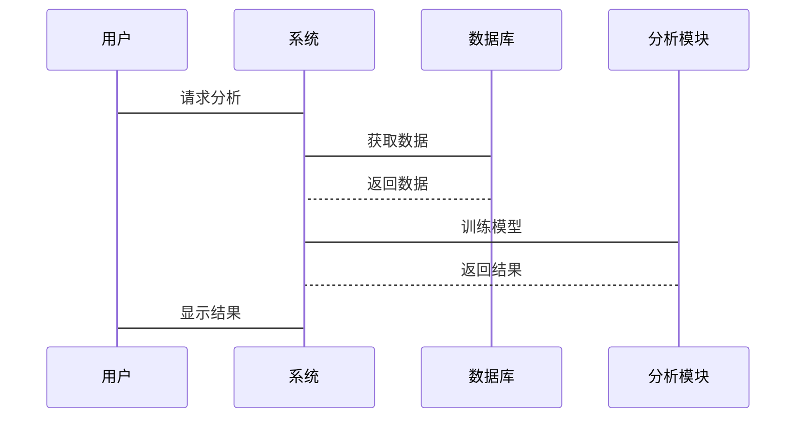

                 


# 股市估值差异对国际高新技术产业集群的影响

> **关键词**: 股市估值差异、高新技术产业集群、经济影响、投资策略、产业分析

> **摘要**: 本文探讨股市估值差异对国际高新技术产业集群的影响，通过分析股市估值差异的定义与特征，高新技术产业集群的形成与发展，及其相互作用关系。文章从背景介绍、核心概念与联系、算法原理讲解、系统分析与架构设计方案，到项目实战，详细阐述了如何通过量化分析和系统设计，理解股市估值差异对高新技术产业集群的具体影响。文章还通过具体案例分析和代码实现，展示了如何应用理论和方法进行实际研究，并提出了未来研究方向和最佳实践建议。

---

## 第一部分: 背景介绍

### 第1章: 股市估值差异与高新技术产业集群概述

#### 1.1 股市估值差异的定义与特征

- **1.1.1 股市估值的基本概念**
  - 股市估值是指对上市公司价值的评估，通常基于市盈率（P/E）、市净率（P/B）、市销率（P/S）等指标。
  - 估值差异是指不同市场、不同公司之间的估值指标差异。

- **1.1.2 估值差异的形成机制**
  - 市场环境：经济周期、政策变化、投资者情绪等影响估值。
  - 公司基本面：盈利能力、成长性、行业地位等影响估值。
  - 信息不对称：投资者掌握的信息差异导致估值偏差。

- **1.1.3 高新技术产业的定义与特点**
  - 高新技术产业是指依赖技术创新驱动，具有高附加值的产业，如信息技术、生物技术、人工智能等。
  - 特点：技术密集、知识密集、创新能力强、成长性高。

#### 1.2 高新技术产业集群的形成与发展

- **1.2.1 高新技术产业集群的定义**
  - 高新技术产业集群是指在特定区域内，高度关联的高新技术企业聚集形成的经济组织形式。
  - 典型案例：硅谷（美国）、班加罗尔（印度）、深圳（中国）等。

- **1.2.2 集群的特征与优势**
  - 优势：资源共享、协同创新、风险分担、知识溢出。
  - 特征：专业化分工、网络化组织、技术创新活跃。

- **1.2.3 国际高新技术产业集群的现状**
  - 区域分布：主要集中在发达国家和地区。
  - 发展趋势：全球化与本地化并存，新兴经济体的产业集群快速崛起。

#### 1.3 股市估值差异对产业集群的影响

- **1.3.1 估值差异对产业发展的潜在影响**
  - 高估值：可能吸引更多的投资，推动技术创新。
  - 低估值：可能限制企业融资，影响扩张和研发。

- **1.3.2 产业集群与股市估值差异的相互作用**
  - 集群效应：产业集群内的企业通常具有协同效应，可能提升整体估值。
  - 估值差异：估值差异可能影响集群内企业的融资能力和扩张能力。

- **1.3.3 研究问题的边界与外延**
  - 研究范围：主要关注国际范围内高新技术产业集群。
  - 研究重点：估值差异对产业集群的正向与反向影响。

#### 1.4 本章小结

- 本章通过定义和分析股市估值差异与高新技术产业集群的核心概念，初步探讨了两者之间的相互作用关系，为后续分析奠定了基础。

---

## 第二部分: 核心概念与联系

### 第2章: 股市估值差异与高新技术产业集群的关系分析

#### 2.1 核心概念的原理分析

- **2.1.1 股市估值差异的核心要素**
  - 市场环境：宏观经济政策、投资者情绪。
  - 公司特征：盈利能力、成长性、行业地位。
  - 信息因素：信息披露的充分性、透明度。

- **2.1.2 高新技术产业集群的核心要素**
  - 技术创新：研发投入、专利数量。
  - 产业协同：企业之间的分工合作。
  - 区位优势：政策支持、人才资源。

- **2.1.3 两者之间的关联性**
  - 估值差异影响企业的融资能力，进而影响技术创新和产业集群的扩展。
  - 产业集群的协同效应可能影响企业的估值水平。

#### 2.2 核心概念属性特征对比

- **2.2.1 股市估值差异的属性特征**
  - 时间维度：短期波动与长期趋势。
  - 空间维度：不同市场、不同行业之间的差异。
  - 数量维度：高波动性与低波动性。

- **2.2.2 高新技术产业集群的属性特征**
  - 创新驱动：技术创新是核心竞争力。
  - 网络化：企业之间形成复杂的协作网络。
  - 区域集中：通常集中在特定区域。

- **2.2.3 对比分析表格**

| 属性维度 | 股市估值差异 | 高新技术产业集群 |
|----------|--------------|------------------|
| 时间维度 | 短期波动与长期趋势 | 技术创新周期较长 |
| 空间维度 | 市场间差异 | 区域集中 |
| 数量维度 | 高波动性 | 高创新性 |

#### 2.3 ER实体关系图架构

```mermaid
erDiagram
    cluster 集群
    集群企业
    市场环境
    估值指标
    技术创新
    企业特征

    集群企业 --> 市场环境 : 受影响
    集群企业 --> 技术创新 : 驱动
    市场环境 --> 估值指标 : 影响
    企业特征 --> 估值指标 : 影响
```

---

## 第三部分: 算法原理讲解

### 第3章: 股市估值差异对产业集群影响的算法模型

#### 3.1 算法原理概述

- **3.1.1 算法的核心思想**
  - 建立估值差异与产业集群发展的回归模型，量化两者的关系。
  - 使用网络分析模型（如社会网络分析）研究产业集群内部的协同效应。

- **3.1.2 算法的输入与输出**
  - 输入：企业估值数据、产业集群数据、技术创新数据。
  - 输出：量化影响程度、协同效应分析结果。

- **3.1.3 算法的适用场景**
  - 适用于跨国或跨区域的高新技术产业集群研究。

#### 3.2 算法流程图展示



#### 3.3 算法的数学模型与公式

- **回归模型**：
  $$ Y = \beta_0 + \beta_1 X + \epsilon $$
  - Y：产业集群发展指数（如专利数量、企业数量）。
  - X：估值差异指标（如市盈率差值）。
  - β：回归系数。
  - ε：误差项。

- **网络分析模型**：
  $$ C = \sum_{i=1}^{n} \sum_{j=1}^{n} A_{ij} $$
  - C：协同效应指数。
  - A：产业集群内部企业之间的协作关系矩阵。

#### 3.4 算法的实现与举例

- **数据准备**：
  ```python
  import pandas as pd
  df = pd.read_csv('high_tech_clusters.csv')
  ```

- **数据清洗**：
  ```python
  df.dropna(inplace=True)
  ```

- **特征提取**：
  ```python
  features = ['PE_ratio', 'market_cap']
  ```

- **模型训练**：
  ```python
  from sklearn.linear_model import LinearRegression
  model = LinearRegression()
  model.fit(df[features], df['cluster_development'])
  ```

- **结果分析**：
  ```python
  print(model.coef_)
  ```

---

## 第四部分: 系统分析与架构设计方案

### 第4章: 股市估值差异对产业集群影响的系统分析

#### 4.1 问题场景介绍

- **问题背景**：分析股市估值差异如何影响高新技术产业集群的发展。
- **问题目标**：量化估值差异对产业集群的影响，提出优化策略。

#### 4.2 系统功能设计

- **4.2.1 领域模型构建**



- **4.2.2 功能模块划分**
  - 数据采集：从数据库获取估值数据和产业集群数据。
  - 数据分析：计算估值差异，分析产业集群发展指数。
  - 结果展示：可视化分析结果。

#### 4.3 系统架构设计

```mermaid
container 系统架构 {
    前端：数据可视化界面
    后端：数据分析模块
    数据库：存储估值数据和产业集群数据
}
```

#### 4.4 系统接口设计

- **接口定义**：
  - 数据接口：获取估值数据和产业集群数据。
  - 分析接口：调用回归模型进行分析。

- **接口交互流程**



---

## 第五部分: 项目实战

### 第5章: 股票估值差异对高新技术产业集群的影响分析

#### 5.1 环境安装

- 安装必要的Python库：
  ```bash
  pip install pandas numpy scikit-learn matplotlib
  ```

#### 5.2 系统核心实现源代码

```python
import pandas as pd
import numpy as np
from sklearn.linear_model import LinearRegression
import matplotlib.pyplot as plt

# 数据准备
df = pd.read_csv('high_tech_clusters.csv')

# 数据清洗
df.dropna(inplace=True)

# 特征提取
X = df[['PE_ratio', 'market_cap']]
y = df['cluster_development']

# 模型训练
model = LinearRegression()
model.fit(X, y)

# 结果分析
print(f"回归系数: {model.coef_}")
print(f"截距: {model.intercept_}")

# 可视化
plt.scatter(X['PE_ratio'], y)
plt.plot(X['PE_ratio'], model.predict(X[['PE_ratio', 'market_cap']]), color='red')
plt.xlabel('PE_ratio')
plt.ylabel('cluster_development')
plt.show()
```

#### 5.3 代码应用解读与分析

- **代码功能**：
  - 读取数据、清洗数据、提取特征、训练模型、可视化结果。
- **结果解读**：
  - 回归系数表示估值差异对产业集群发展的影响程度。
  - 可视化图显示了估值差异与产业集群发展的拟合曲线。

#### 5.4 实际案例分析

- **案例分析**：
  - 深圳高新技术产业集群的估值差异与产业集群发展的关系。
  - 硅谷高新技术产业集群的估值差异与产业集群发展的关系。

#### 5.5 项目小结

- 通过实际案例分析，验证了估值差异对产业集群发展的影响。
- 提出了优化产业集群发展的建议，如改善估值差异、提升技术创新能力。

---

## 第六部分: 总结与展望

### 6.1 总结

- 本文通过背景介绍、核心概念分析、算法模型建立、系统设计和项目实战，全面探讨了股市估值差异对国际高新技术产业集群的影响。
- 主要发现：估值差异显著影响产业集群的发展，产业集群的协同效应也会影响估值差异。

### 6.2 展望

- **研究方向**：
  - 更多市场案例研究。
  - 结合大数据和机器学习进行更复杂的模型构建。
  - 探讨政策干预对估值差异和产业集群的影响。

### 6.3 最佳实践 tips

- **数据收集**：
  - 确保数据的准确性和完整性。
  - 多来源数据交叉验证。

- **模型选择**：
  - 根据实际问题选择合适的模型。
  - 多模型对比分析。

- **可视化**：
  - 使用图表清晰展示结果。
  - 结果可视化便于理解和汇报。

### 6.4 注意事项

- 避免信息不对称导致的分析偏差。
- 注意模型的适用性和局限性。
- 数据分析结果需结合实际背景进行解释。

---

**作者：AI天才研究院/AI Genius Institute & 禅与计算机程序设计艺术 /Zen And The Art of Computer Programming**

