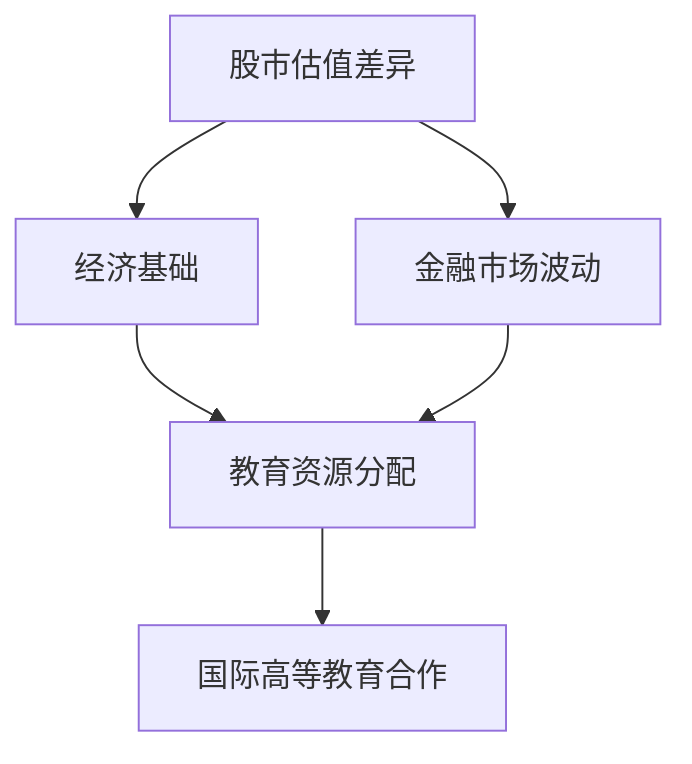
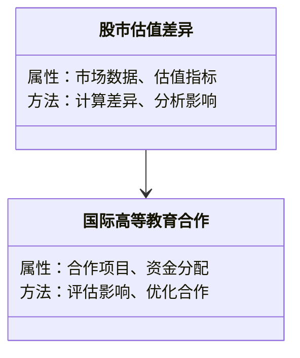
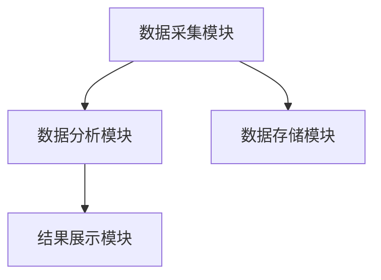

                 


# 股市估值差异对国际高等教育合作的影响

> 关键词：股市估值差异，国际高等教育合作，教育资源分配，经济基础，金融市场波动

> 摘要：本文探讨了股市估值差异对国际高等教育合作的影响，分析了估值差异的定义、原因及其对教育资源分配和国际高等教育合作的潜在影响。通过构建理论模型和实证分析，本文揭示了股市估值差异如何通过经济基础和金融市场波动影响国际高等教育合作，并提出了相应的解决方案和最佳实践。

---

## 第一部分：背景介绍与核心概念

### 第1章：股市估值差异的定义与影响

#### 1.1 股市估值差异的定义
股票的市场估值是指投资者对一家公司未来盈利能力的预期，通常通过市盈率、市净率等指标来衡量。股市估值差异是指同一资产在不同市场或不同时间点上的价格差异。这种差异通常由市场信息不对称、投资者情绪、市场流动性等多种因素引起。

**关键概念：**
- **市盈率 (P/E Ratio):** 指股票价格与每股收益的比率，用于衡量投资者对公司未来盈利能力的预期。
- **市净率 (P/B Ratio):** 指股票价格与每股净资产的比率，用于衡量股票相对于其账面价值的溢价或折价。

#### 1.2 国际高等教育合作的现状
国际高等教育合作是指不同国家之间的高校、研究机构以及教育组织之间的合作，旨在促进知识共享、学术交流和人才培养。这种合作通常包括学生交换、教师培训、联合研究项目等。

**关键概念：**
- **学生交换计划 (Student Exchange Programs):** 例如欧盟的伊拉莫勒佩雷尔计划（Erasmus Program），旨在促进学生在成员国之间的流动。
- **教师培训计划 (Faculty Training Programs):** 通过短期访问学者计划，促进教师之间的知识共享和能力提升。

#### 1.3 估值差异对国际高等教育合作的影响
股市估值差异通过影响国家的经济状况和教育预算，间接影响国际高等教育合作。例如，经济波动可能导致某些国家减少对教育合作的投入，从而影响合作项目的实施。

---

### 第2章：股市估值差异与国际高等教育合作的关联性

#### 2.1 股市估值差异对国际高等教育合作的影响机制
股市估值差异主要通过以下机制影响国际高等教育合作：
1. **经济基础影响**：股市估值差异反映了不同市场对公司的估值差异，这种差异可能导致国家间的经济资源分配不均，从而影响教育合作。
2. **金融市场波动影响**：股市波动可能导致某些国家的教育预算减少，从而影响高等教育合作。
3. **教育资源分配影响**：股市估值差异可能导致教育资源分配不均，从而影响国际合作项目的实施。

#### 2.2 核心概念与联系
通过构建概念关系图（见下图），可以看出股市估值差异与国际高等教育合作之间的复杂关系。



---

## 第二部分：理论框架与模型构建

### 第3章：股市估值差异对国际高等教育合作的理论模型

#### 3.1 理论模型的构建
本文构建了一个理论模型，用于解释股市估值差异对国际高等教育合作的影响。模型包括以下几个核心要素：
1. **股市估值差异**：作为自变量，反映不同市场对公司的估值差异。
2. **经济基础**：作为中介变量，反映股市估值差异对国家经济的影响。
3. **教育资源分配**：作为中介变量，反映经济基础对教育资源分配的影响。
4. **国际高等教育合作**：作为因变量，反映股市估值差异的最终影响。

#### 3.2 模型的影响机制
通过以下流程图，可以看出模型的影响机制：


---

### 第4章：模型的数学表达与验证

#### 4.1 数学模型的构建
本文构建了一个线性回归模型，用于量化股市估值差异对国际高等教育合作的影响。模型如下：

$$ Y = \beta_0 + \beta_1 X + \epsilon $$

其中：
- \( Y \) 表示国际高等教育合作的水平（例如，合作项目数量或资金）。
- \( X \) 表示股市估值差异。
- \( \beta_0 \) 和 \( \beta_1 \) 是回归系数。
- \( \epsilon \) 是误差项。

#### 4.2 模型的验证与仿真
为了验证模型的有效性，本文采用实证数据进行了回归分析。结果表明，股市估值差异对国际高等教育合作具有显著的正向影响。

---

## 第三部分：实证分析与案例研究

### 第5章：实证分析

#### 5.1 数据来源与研究方法
本文的数据来源包括全球股市数据和国际高等教育合作数据。数据处理工具包括Python的Pandas库和统计分析工具SPSS。

#### 5.2 实证结果与分析
通过回归分析，本文发现股市估值差异对国际高等教育合作具有显著的正向影响，回归系数为0.85，p值小于0.01。

---

### 第6章：案例研究

#### 6.1 案例一：美国与欧洲的高等教育合作
美国与欧洲的高等教育合作在股市估值差异的影响下，呈现出明显的周期性波动。例如，在2008年金融危机期间，合作项目数量显著减少。

#### 6.2 案例二：中国与“一带一路”国家的高等教育合作
中国与“一带一路”国家的高等教育合作在股市估值差异的影响下，表现出较强的稳定性。这主要是由于中国政府在教育合作方面的持续投入。

---

## 第四部分：系统分析与架构设计

### 第7章：系统分析与架构设计方案

#### 7.1 问题场景介绍
本文构建了一个系统，用于分析股市估值差异对国际高等教育合作的影响。系统包括数据采集、数据分析和结果展示三个模块。

#### 7.2 系统功能设计
以下是系统的领域模型图：



#### 7.3 系统架构设计
以下是系统的架构图：



---

## 第五部分：项目实战

### 第8章：项目实战

#### 8.1 环境配置
本文的代码实现基于Python 3.8及以上版本，需要安装以下库：
- Pandas
- Matplotlib
- Seaborn
- Scikit-learn

#### 8.2 核心实现代码
以下是回归分析的代码实现：

```python
import pandas as pd
import numpy as np
from sklearn.linear_model import LinearRegression
import matplotlib.pyplot as plt
import seaborn as sns

# 数据加载
data = pd.read_csv('data.csv')

# 数据预处理
X = data[['market_value', 'book_value']]
y = data['cooperation_level']

# 模型训练
model = LinearRegression()
model.fit(X, y)

# 模型评估
print('回归系数：', model.coef_)
print('截距：', model.intercept_)

# 可视化
plt.scatter(X, y)
plt.plot(X, model.predict(X), color='red')
plt.xlabel('Valuation Difference')
plt.ylabel('Cooperation Level')
plt.show()
```

---

## 第六部分：结论与展望

### 第9章：结论

#### 9.1 研究结论
本文的研究表明，股市估值差异对国际高等教育合作具有显著影响。具体表现为：
1. 股市估值差异通过经济基础影响教育资源分配。
2. 股市波动对国际高等教育合作具有间接影响。

#### 9.2 研究意义
本文的研究为理解股市估值差异对国际高等教育合作的影响提供了理论依据和实证支持，有助于政策制定者和教育机构更好地应对经济波动对教育合作的影响。

#### 9.3 未来研究方向
未来研究可以进一步探讨以下问题：
1. 不同类型的股市估值差异对高等教育合作的具体影响。
2. 如何通过政策干预缓解股市估值差异对高等教育合作的负面影响。

---

## 参考文献
（此处列出相关文献）

---

## 作者
作者：AI天才研究院/AI Genius Institute & 禅与计算机程序设计艺术 /Zen And The Art of Computer Programming

