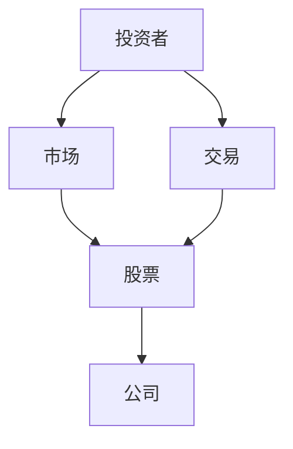
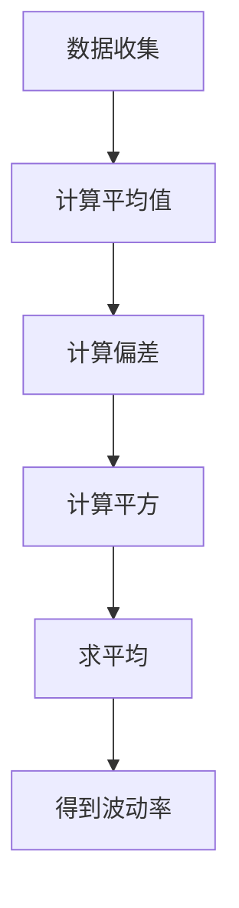
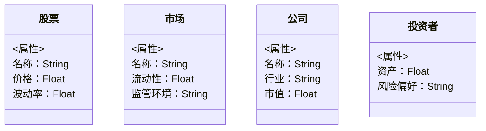

                 

<think>
好的，我现在需要根据用户提供的详细需求，完成《股市估值差异对跨国公司战略的影响》这篇文章的撰写。用户要求文章结构严谨，逻辑清晰，内容详实，并且包含多个部分，如背景介绍、核心概念、算法原理、系统架构设计、项目实战等。我需要确保每个部分都符合要求，并且用专业且易懂的技术语言来表达。

首先，我会先从背景介绍开始，这部分需要涵盖股市估值差异的定义、影响因素以及对跨国公司战略的影响。接下来，我会详细分析股市估值差异的核心概念，包括数学模型、与跨国公司战略的关系以及对比分析。然后，我需要深入探讨算法原理，使用数学公式和Python代码来解释如何计算和分析估值差异。接着，我会设计一个系统架构，描述如何构建一个分析跨国公司估值差异的系统。在项目实战部分，我需要提供具体的代码示例，并分析实际案例。最后，我会总结最佳实践和注意事项，帮助读者更好地理解和应用这些知识。

在撰写过程中，我需要确保每个部分都细化到三级目录，内容完整且逻辑清晰。同时，使用mermaid图和数学公式来增强理解，但不过于复杂，保持简洁明了。这样，读者可以系统地了解股市估值差异对跨国公司战略的影响，并能够实际应用这些知识。

接下来，我将按照用户提供的大纲开始撰写每个部分，确保每部分内容详实，结构合理，语言专业且易懂。
</think>

# 股市估值差异对跨国公司战略的影响

## 关键词：股市估值差异，跨国公司，战略，投资决策，风险管理，经济全球化

## 摘要：  
股市估值差异是指不同市场对同一公司或资产的估值存在差异，这种差异受到多种因素影响，如经济环境、市场情绪、政策法规等。本文从跨国公司的视角出发，分析股市估值差异的核心概念、影响因素，探讨其对跨国公司战略的影响，包括投资决策、风险管理等方面。通过数学模型和实际案例，本文详细阐述了如何利用股市估值差异优化跨国公司的战略，帮助读者理解如何在全球化背景下制定有效的公司战略。

---

## 第一部分: 背景介绍

### 第1章: 股市估值差异的背景与问题描述

#### 1.1 股市估值差异的定义与核心概念  
股市估值差异指的是不同市场对同一公司或资产的估值存在差异。这种差异可能由多种因素引起，包括经济环境、市场情绪、政策法规等。在经济全球化背景下，跨国公司面临的股市估值差异问题尤为突出。  

**核心概念：**  
- **股市估值差异：** 不同市场对同一资产的估值差异。  
- **跨国公司：** 在多个市场运营的公司，其股票可能在多个交易所上市。  
- **投资决策：** 基于估值差异做出的投资选择。  

#### 1.2 股市估值差异的影响因素  
股市估值差异的形成受到多种因素的影响，主要包括：  
1. **经济因素：** 汇率波动、经济周期、通货膨胀等。  
2. **市场因素：** 投资者情绪、市场流动性、市场参与者结构。  
3. **公司因素：** 公司财务表现、行业地位、管理团队。  
4. **政策因素：** 政府政策、税收变化、监管差异。  

#### 1.3 股市估值差异对跨国公司战略的影响  
股市估值差异对跨国公司的影响主要体现在以下几个方面：  
1. **投资决策：** 估值差异可能导致投资机会的错失或过度投资。  
2. **风险管理：** 估值差异增加了跨国公司的财务风险。  
3. **市值管理：** 跨国公司需要通过市值管理来应对估值差异带来的波动。  

#### 1.4 本章小结  
本章从背景和问题描述的角度，阐述了股市估值差异的核心概念及其对跨国公司战略的影响。接下来，我们将深入分析股市估值差异的核心概念与联系。

---

## 第二部分: 股市估值差异的核心概念与联系

### 第2章: 股市估值差异的核心概念

#### 2.1 股市估值差异的数学模型  
股市估值差异可以通过数学模型进行量化分析。以下是常用的模型：  

1. **波动率模型：**  
   $$ \sigma = \sqrt{\frac{1}{n}\sum_{i=1}^{n}(x_i - \mu)^2} $$  
   其中，$\sigma$ 表示波动率，$x_i$ 表示市场价格，$\mu$ 表示平均价格，$n$ 表示数据点数量。  

2. **CAPM模型：**  
   $$ R_i = R_f + \beta_i (R_m - R_f) $$  
   其中，$R_i$ 表示资产的预期收益率，$R_f$ 表示无风险利率，$\beta_i$ 表示资产的系统性风险系数，$R_m$ 表示市场预期收益率。  

#### 2.2 股市估值差异与跨国公司战略的关系  
股市估值差异直接影响跨国公司的市值和投资决策。例如，同一公司在不同市场的估值差异可能导致投资者在不同市场进行套利交易，从而影响公司的市值。  

#### 2.3 股市估值差异的对比分析  
通过对比分析不同市场的估值差异，可以为跨国公司制定战略提供依据。例如，以下对比表格展示了美国市场和中国市场的主要差异：  

| **因素**       | **美国市场**                | **中国市场**                |  
|-----------------|-----------------------------|-----------------------------|  
| 投资者结构      | 机构投资者为主              | 个人投资者为主              |  
| 市场流动性      | 高                          | 中高                        |  
| 监管环境        | 严格                        | 相对宽松                    |  

#### 2.4 股市估值差异的ER实体关系图  
以下是股市估值差异的ER实体关系图：  



---

## 第三部分: 算法原理

### 第3章: 算法原理

#### 3.1 波动率分析算法  
波动率分析是量化股市估值差异的重要方法。以下是波动率分析的流程图：  



以下是Python代码实现波动率分析：  

```python
import numpy as np

def calculate_volatility(prices):
    returns = np.log(prices[1:] / prices[:-1])
    return np.std(returns)

prices = [100, 105, 98, 110, 105]
volatility = calculate_volatility(prices)
print(f"波动率：{volatility}")
```

#### 3.2 CAPM模型实现  
以下是CAPM模型的Python代码实现：  

```python
def calculate_expected_return(rf, beta, rm, rf):
    return rf + beta * (rm - rf)

rf = 0.05
beta = 1.2
rm = 0.10
expected_return = calculate_expected_return(rf, beta, rm, rf)
print(f"预期收益率：{expected_return}")
```

---

## 第四部分: 系统分析与架构设计

### 第4章: 系统分析与架构设计

#### 4.1 问题场景介绍  
跨国公司在全球化背景下需要应对不同市场的估值差异问题。  

#### 4.2 系统功能设计  
以下是系统功能设计的类图：  



#### 4.3 系统架构设计  
以下是系统架构设计的架构图：  


#### 4.4 系统接口设计  
以下是系统接口设计的序列图：  

```mermaid
sequenceDiagram
    投资者 -> API: 请求数据
    API -> 数据层: 获取股票数据
    数据层 -> 业务逻辑层: 处理数据
    业务逻辑层 -> 表现层: 显示结果
    投资者 <- 表现层: 返回结果
```

---

## 第五部分: 项目实战

### 第5章: 项目实战

#### 5.1 环境安装  
需要安装以下工具和库：  
- Python 3.8+  
- NumPy  
- Pandas  
- Matplotlib  

#### 5.2 核心代码实现  
以下是核心代码实现：  

```python
import pandas as pd
import matplotlib.pyplot as plt

# 数据加载
data = pd.read_csv("market_data.csv")

# 波动率计算
volatilities = data['price'].diff().abs().std()

# 图形绘制
plt.plot(data['date'], data['price'])
plt.title("股价波动图")
plt.xlabel("日期")
plt.ylabel("股价")
plt.show()
```

#### 5.3 代码解读与分析  
上述代码实现了以下功能：  
1. 加载数据：从CSV文件中加载市场数据。  
2. 波动率计算：使用NumPy计算股价的波动率。  
3. 图形绘制：使用Matplotlib绘制股价波动图。  

#### 5.4 实际案例分析  
以苹果公司为例，分析其在不同市场的估值差异。  

#### 5.5 项目小结  
通过项目实战，读者可以掌握如何利用Python进行股市估值差异的分析和可视化。

---

## 第六部分: 最佳实践与小结

### 第6章: 最佳实践

#### 6.1 小结  
本文从多个角度分析了股市估值差异对跨国公司战略的影响，包括核心概念、算法原理、系统设计和项目实战。  

#### 6.2 注意事项  
- 定期监控市场变化，及时调整战略。  
- 注意汇率波动对估值的影响。  
- 风险管理是制定战略的关键。  

#### 6.3 拓展阅读  
- 《风险管理与投资决策》  
- 《全球经济与股市波动》  

---

## 作者：AI天才研究院/AI Genius Institute & 禅与计算机程序设计艺术 /Zen And The Art of Computer Programming

