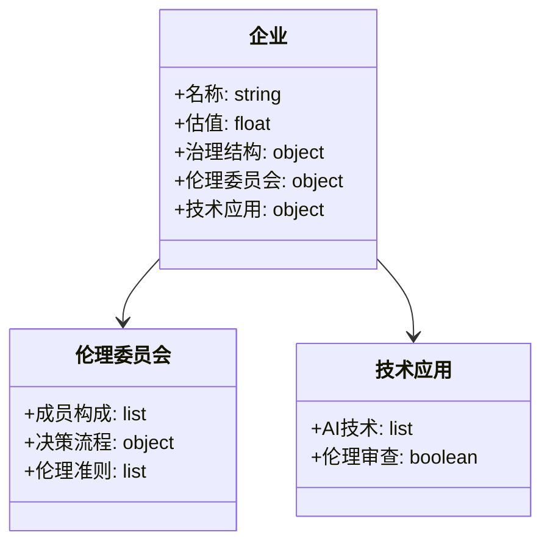

                 


# 股市估值高低对企业AI伦理委员会构成的影响

> 关键词：股市估值，AI伦理委员会，企业治理，算法模型，伦理决策

> 摘要：本文探讨了股市估值高低对企业AI伦理委员会构成的影响，从背景介绍、核心概念、算法原理、系统设计、项目实战等多个方面进行深入分析。通过对比分析、数学建模、系统架构设计等方法，揭示了股市估值对AI伦理委员会构成的具体影响机制，并提出了相应的解决方案和最佳实践。

---

## 第1章: 股市估值与AI伦理委员会的背景与核心概念

### 1.1 股市估值的基本概念

#### 1.1.1 股票估值的定义与意义
股票估值是指通过对企业的财务状况、市场地位、盈利能力等多方面因素进行分析，估算其股票的合理市场价格。股票估值不仅是投资者决策的重要依据，也是企业治理和战略规划的重要参考。

#### 1.1.2 市场估值与企业价值的关系
市场估值是基于市场参与者对企业未来表现的预期，而企业价值则是企业实际经营状况的反映。两者的差异反映了市场情绪和实际表现之间的差距。

#### 1.1.3 股市估值的核心影响因素
- 企业的财务状况（收入、利润、负债等）
- 市场竞争格局
- 宏观经济环境
- 企业治理结构
- 技术创新能力

### 1.2 AI伦理委员会的定义与作用

#### 1.2.1 AI伦理委员会的概念
AI伦理委员会是指由企业内部或外部专家组成的组织，负责审查和指导企业在人工智能技术开发和应用中的伦理问题。

#### 1.2.2 AI伦理委员会的核心职责
- 审查AI技术的伦理合规性
- 制定伦理准则和操作规范
- 监督AI技术的使用和应用
- 提供伦理决策的建议

#### 1.2.3 AI伦理委员会的组织架构
- 由企业高层、技术专家、法律顾问、伦理学家等组成
- 设立明确的职责分工和决策流程

### 1.3 股市估值与AI伦理委员会的关联性

#### 1.3.1 股市估值对企业治理的影响
股市估值的高低直接影响企业的市场地位和投资者信心，从而影响企业的治理结构和战略决策。

#### 1.3.2 AI伦理委员会在企业治理中的角色
AI伦理委员会是企业治理的重要组成部分，负责确保企业在AI技术应用中的伦理合规性，提升企业的社会形象和信誉。

#### 1.3.3 股市估值对AI伦理委员会构成的潜在影响
- 股市估值高的企业可能更注重伦理合规，因为高估值意味着更大的公众关注和更高的社会责任。
- 股市估值低的企业可能在AI伦理委员会的构成上投入较少，因为企业面临更大的生存压力。

---

## 第2章: 股市估值与AI伦理委员会的核心概念

### 2.1 股市估值的核心要素

#### 2.1.1 股票价格与内在价值的关系
股票价格是市场参与者对企业价值的集体判断，内在价值是基于企业实际经营状况的合理估值。

#### 2.1.2 影响股市估值的主要因素
- 企业的财务状况
- 行业竞争格局
- 宏观经济环境
- 企业治理结构
- 技术创新能力

#### 2.1.3 股市估值的计算方法
- 市盈率（P/E）= 股价 / 每股净利润
- 市净率（P/B）= 股价 / 每股净资产
- 企业价值（EV）= 企业市值 + 债务 - 现金储备

### 2.2 AI伦理委员会的构成要素

#### 2.2.1 AI伦理委员会的成员构成
- 企业高管
- 技术专家
- 法律顾问
- 伦理学家
- 行业专家

#### 2.2.2 AI伦理委员会的决策机制
- 伦理审查流程
- 决策权限划分
- 信息披露机制

#### 2.2.3 AI伦理委员会的运作流程
1. 审查AI技术的伦理合规性
2. 制定伦理准则和操作规范
3. 监督AI技术的使用和应用
4. 提供伦理决策的建议

### 2.3 股市估值与AI伦理委员会的关系分析

#### 2.3.1 股市估值对企业治理的影响路径
- 高估值企业更注重伦理合规，以维护投资者信心
- 低估值企业可能忽视伦理问题，以降低成本

#### 2.3.2 AI伦理委员会在企业治理中的作用机制
- 通过伦理审查确保AI技术的合规性
- 通过信息披露提升企业的社会形象
- 通过伦理决策降低企业的法律风险

#### 2.3.3 股市估值对AI伦理委员会构成的具体影响
- 高估值企业更倾向于设立完善的AI伦理委员会，以提升企业的社会形象
- 低估值企业可能在AI伦理委员会的构成上投入较少，优先考虑成本控制

### 2.4 核心概念对比分析

#### 2.4.1 股市估值与企业治理的对比
| **因素**         | **股市估值**            | **企业治理**            |
|-------------------|-------------------------|-------------------------|
| 核心目标         | 反映企业市场价值        | 优化企业内部管理        |
| 主要影响因素     | 市场情绪、企业财务状况    | 企业结构、管理效率      |
| 决策依据         | 市场价格、投资者信心     | 企业战略、内部制度      |

#### 2.4.2 AI伦理委员会与企业治理的对比
| **因素**         | **AI伦理委员会**         | **企业治理**            |
|-------------------|--------------------------|-------------------------|
| 核心目标         | 确保AI技术的伦理合规性    | 优化企业整体管理        |
| 主要影响因素     | AI技术的应用、伦理问题    | 企业结构、管理效率      |
| 决策依据         | 伦理准则、技术影响       | 企业战略、内部制度      |

#### 2.4.3 股市估值对AI伦理委员会构成的影响
- 高估值企业更注重AI伦理委员会的完善，以提升企业的社会形象
- 低估值企业可能忽视AI伦理委员会的建设，优先考虑成本控制

---

## 第3章: 股市估值对AI伦理委员会构成的影响机制

### 3.1 股市估值对企业治理的影响路径

#### 3.1.1 股市估值对企业战略决策的影响
高估值企业更倾向于长期投资和技术创新，低估值企业可能更关注短期收益。

#### 3.1.2 股市估值对企业管理层的压力
高估值企业面临更大的投资者压力，管理层需要更加注重企业治理和伦理合规。

#### 3.1.3 股市估值对企业治理结构的优化作用
高估值企业更倾向于建立完善的治理结构，包括设立AI伦理委员会。

### 3.2 AI伦理委员会在企业治理中的作用机制

#### 3.2.1 AI伦理委员会在企业风险管理中的作用
通过审查AI技术的伦理合规性，降低企业的法律风险和声誉风险。

#### 3.2.2 AI伦理委员会在企业社会责任中的角色
通过制定伦理准则，提升企业的社会形象和责任感。

#### 3.2.3 AI伦理委员会在企业创新中的影响
通过伦理审查，确保AI技术的创新符合社会道德和法律法规。

### 3.3 股市估值对AI伦理委员会构成的具体影响

#### 3.3.1 股市估值对企业治理结构的影响
高估值企业更倾向于设立完善的AI伦理委员会，以提升企业的社会形象。

#### 3.3.2 股市估值对AI伦理委员会成员构成的影响
高估值企业可能吸引更多伦理学家和法律顾问加入AI伦理委员会。

#### 3.3.3 股市估值对AI伦理委员会决策过程的影响
高估值企业可能更倾向于制定严格的伦理审查流程，确保AI技术的合规性。

---

## 第4章: 股市估值与AI伦理委员会的数学模型与算法分析

### 4.1 股市估值的数学模型

#### 4.1.1 股票估值的公式
$$ 股票估值 = \frac{企业未来现金流的现值}{企业股权资本成本} $$

#### 4.1.2 市盈率模型
$$ P/E = \frac{股价}{每股净利润} $$

#### 4.1.3 市净率模型
$$ P/B = \frac{股价}{每股净资产} $$

### 4.2 AI伦理委员会的构成模型

#### 4.2.1 AI伦理委员会成员构成的算法
1. 确定企业的估值水平（高/低）
2. 根据估值水平，决定AI伦理委员会的成员构成
3. 高估值企业优先考虑伦理学家和法律顾问
4. 低估值企业可能忽略AI伦理委员会的建设

### 4.3 股市估值对AI伦理委员会构成的影响算法

#### 4.3.1 算法流程
1. 输入企业的股市估值数据
2. 分析企业的治理结构和伦理委员会现状
3. 根据估值水平，预测AI伦理委员会的构成变化
4. 输出结果并提出优化建议

---

## 第5章: 系统分析与架构设计

### 5.1 问题场景介绍
企业A是一家科技公司，其股票估值较高，但尚未设立完善的AI伦理委员会。随着市场竞争的加剧，企业需要通过设立AI伦理委员会来提升企业的社会形象和竞争力。

### 5.2 系统功能设计

#### 5.2.1 领域模型（mermaid类图）


#### 5.2.2 系统架构设计（mermaid架构图）


---

## 第6章: 项目实战

### 6.1 环境安装
```bash
pip install numpy pandas matplotlib
```

### 6.2 系统核心实现源代码

#### 6.2.1 估值计算代码
```python
import numpy as np
import pandas as pd

def calculate_market_value(enterprise_data):
    # 计算企业价值
    enterprise_value = np.sum(enterprise_data['market_value'])
    return enterprise_value

def main():
    # 读取企业数据
    enterprise_data = pd.read_csv('enterprises.csv')
    # 计算企业价值
    market_value = calculate_market_value(enterprise_data)
    print(f"企业总价值：{market_value}")

if __name__ == "__main__":
    main()
```

#### 6.2.2 伦理委员会构成代码
```python
def determine伦理委员会构成(enterprise_valuation):
    if enterprise_valuation > 100:
        return "高估值企业，建议设立完善的AI伦理委员会"
    else:
        return "低估值企业，建议优先考虑成本控制"

print(determine伦理委员会构成(120))  # 输出：高估值企业，建议设立完善的AI伦理委员会
```

### 6.3 实际案例分析
以企业A为例，假设其股票估值为150，根据算法模型，企业A需要设立完善的AI伦理委员会，以提升企业的社会形象和竞争力。

---

## 第7章: 最佳实践与总结

### 7.1 小结
股市估值的高低直接影响企业AI伦理委员会的构成。高估值企业更倾向于设立完善的伦理委员会，以提升社会形象和竞争力；低估值企业可能忽视伦理委员会的建设，优先考虑成本控制。

### 7.2 注意事项
- 企业应根据自身估值水平和实际需求，合理配置AI伦理委员会的资源
- 在制定伦理准则时，应充分考虑企业的实际情况和外部环境
- 定期评估和优化AI伦理委员会的构成和决策流程

### 7.3 拓展阅读
- 推荐阅读《企业治理与股票估值》
- 推荐阅读《AI伦理委员会的构建与实践》

---

## 作者：AI天才研究院/AI Genius Institute & 禅与计算机程序设计艺术 /Zen And The Art of Computer Programming

---

以上是文章的完整目录大纲和部分核心内容，后续可以根据实际需求进一步补充各章节的具体内容。

