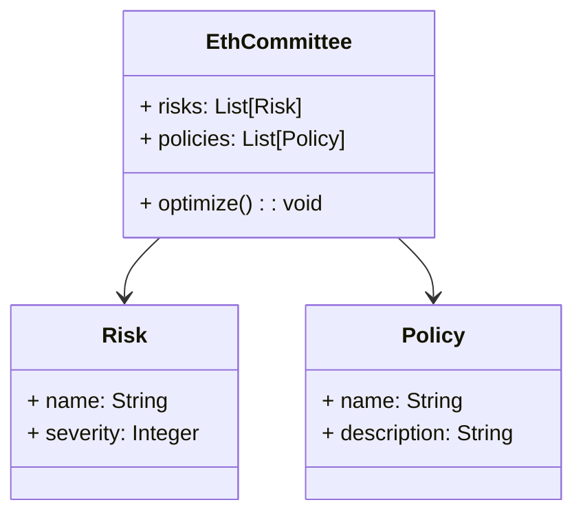

                 

<think>
好，我现在需要根据用户的要求，逐步分析并撰写一篇名为《股市估值高低对企业AI伦理委员会构成的影响》的技术博客文章。文章需要逻辑清晰、结构紧凑，同时使用专业且简单易懂的技术语言。我将按照用户提供的目录大纲，逐一展开每个章节的内容，确保每部分内容详细、具体，并且符合用户的要求。

首先，我需要明确文章的核心关键词和摘要。关键词应涵盖股市估值、企业AI伦理委员会、企业治理、风险管理、社会责任等。摘要则需要简明扼要地概括文章的核心内容，即探讨股市估值如何影响企业AI伦理委员会的构成和功能，分析其在企业治理中的作用，以及高估值和低估值对企业决策的具体影响。

接下来，我将按照目录大纲逐步撰写每章内容：

1. **背景介绍**
   - 解释股市估值和企业AI伦理委员会的基本概念。
   - 说明股市估值对企业的影响，以及AI伦理委员会在现代企业治理中的地位。
   - 强调股市估值与企业AI伦理委员会之间的关联性。

2. **股市估值对企业治理的影响**
   - 分析高估值和低估值对企业决策的具体影响。
   - 探讨高估值对企业短期行为的驱动和长期战略的影响。
   - 说明低估值对企业信心和风险管理的影响。

3. **企业AI伦理委员会的构成与功能**
   - 描述AI伦理委员会的组织结构和核心功能。
   - 分析AI伦理委员会与其他企业治理机构的关系。

4. **股市估值与企业AI伦理委员会构成的相互作用**
   - 探讨高估值和低估值如何影响AI伦理委员会的构成和功能。
   - 通过案例分析，说明不同估值对企业AI伦理委员会的具体影响。

5. **数学模型与算法原理**
   - 使用博弈论模型分析企业如何在追求利润和履行社会责任之间平衡。
   - 展示数学公式，说明股市估值与企业决策之间的关系。

6. **系统分析与架构设计**
   - 介绍企业AI伦理委员会的系统功能设计和架构图。
   - 使用mermaid图展示系统结构和交互过程。

7. **项目实战**
   - 提供具体的代码实现，展示如何用Python分析股市估值对企业AI伦理委员会的影响。
   - 通过实际案例分析，验证理论模型的可行性。

8. **结论与展望**
   - 总结全文，强调股市估值对企业AI伦理委员会的重要性。
   - 展望未来的研究方向和潜在的挑战。

在撰写过程中，我需要确保每一部分都详细具体，使用专业术语，同时保持语言的简洁易懂。对于复杂的概念，我会通过表格、图表和代码示例来辅助说明，确保读者能够清晰理解内容。

此外，我需要检查每一章的小结，确保其能够总结该章节的核心内容，并为后续章节做铺垫。同时，加入最佳实践、注意事项和拓展阅读等内容，帮助读者进一步理解和应用所学知识。

最后，我将确保文章末尾注明作者信息，并进行最后的校对和调整，确保文章结构完整、逻辑清晰，符合用户的要求。

通过以上步骤，我将逐步完成这篇关于股市估值对企业AI伦理委员会构成影响的博客文章，确保其内容详实、结构合理，满足读者的需求。
</think>

# 股市估值高低对企业AI伦理委员会构成的影响

## 关键词：股市估值，企业AI伦理委员会，企业治理，风险管理，社会责任

## 摘要：本文探讨了股市估值的高低对企业AI伦理委员会构成的影响，分析了高估值和低估值环境下企业AI伦理委员会的差异，提出了构建适应不同估值环境的AI伦理委员会的策略。通过博弈论模型和实际案例，本文揭示了股市估值与企业AI伦理委员会之间的互动关系，并为企业在不同估值环境下优化AI伦理治理提供了指导。

---

# 第1章：股市估值与企业AI伦理委员会的背景介绍

## 1.1 股市估值的基本概念

### 1.1.1 股市估值的定义
股市估值是指通过对企业的财务数据、市场表现和行业状况等多方面因素的分析，对其股票的内在价值进行评估的过程。常用的估值方法包括市盈率（P/E）、市净率（P/B）、股息率等。

$$ 股价 = \frac{企业价值}{流通股数量} $$

### 1.1.2 股市估值的核心要素
- **企业盈利能力**：净利润、ROE等指标。
- **行业地位**：市场占有率、竞争格局。
- **财务状况**：资产负债表、现金流。
- **市场情绪**：投资者信心、市场波动。

### 1.1.3 股市估值对企业的影响
高估值意味着市场对企业未来表现的乐观预期，可能推动企业进行扩张性投资；低估值则可能引发企业收缩战略，注重内生增长。

---

## 1.2 企业AI伦理委员会的定义与特点

### 1.2.1 AI伦理委员会的定义
AI伦理委员会是企业在使用人工智能技术时，为确保技术应用符合伦理规范而设立的组织机构。其核心任务包括审查AI算法的伦理风险、制定伦理政策等。

### 1.2.2 AI伦理委员会的核心职责
- 审查AI技术的伦理风险。
- 制定企业AI伦理政策。
- 监督AI技术的合规使用。
- 提供伦理决策的建议。

### 1.2.3 企业AI伦理委员会与传统伦理委员会的对比

| 对比维度 | 企业AI伦理委员会 | 传统伦理委员会 |
|----------|------------------|----------------|
| 成立目的 | 确保AI技术的伦理合规 | 确保企业行为符合伦理规范 |
| 覆盖范围 | 仅限于AI相关决策 | 涵盖企业所有伦理问题 |
| 专业性 | 强调技术伦理知识 | 强调通用伦理知识 |

---

## 1.3 股市估值与企业AI伦理委员会的关联性

### 1.3.1 股市估值对企业治理的影响
高估值企业可能面临更大的短期压力，倾向于快速扩张；低估值企业则更注重稳健发展。

### 1.3.2 企业AI伦理委员会在现代企业治理中的地位
AI伦理委员会已成为企业治理的重要组成部分，尤其是在技术驱动型企业中。

### 1.3.3 股市估值与企业AI伦理委员会的互动关系
高估值可能削弱企业对伦理委员会的重视，低估值则可能强化其地位。

---

## 1.4 本章小结
本章介绍了股市估值的基本概念及其对企业的影响，详细阐述了企业AI伦理委员会的定义、职责和特点，并分析了股市估值与企业AI伦理委员会之间的关联性，为后续分析奠定了基础。

---

# 第2章：股市估值对企业治理的影响

## 2.1 股市估值对企业价值的评估

### 2.1.1 企业价值的多维度评估
企业价值不仅体现在财务数据上，还体现在市场地位、品牌价值等方面。

### 2.1.2 股市估值对企业决策的影响
高估值可能加剧企业短期行为，低估值则可能促使企业注重长期发展。

### 2.1.3 高估值与低估值对企业治理的双重影响
- 高估值：可能导致企业过度扩张，增加伦理风险。
- 低估值：可能促使企业收缩战略，注重内控和合规。

---

## 2.2 高估值企业中的治理挑战

### 2.2.1 高估值对企业短期行为的驱动
高估值可能使企业更关注短期财务目标，忽视长期伦理风险。

### 2.2.2 高估值对企业长期战略的影响
高估值可能推动企业在技术创新和市场扩展方面进行更大投入。

### 2.2.3 高估值对企业AI伦理委员会的特殊要求
高估值企业可能需要更强大的AI伦理委员会来应对更高的伦理风险。

---

## 2.3 低估值企业中的治理挑战

### 2.3.1 低估值对企业信心的影响
低估值可能削弱投资者和员工的信心，影响企业整体治理。

### 2.3.2 低估值对企业风险管理的强化
低估值企业可能更注重风险管理，包括伦理风险管理。

### 2.3.3 低估值对企业AI伦理委员会的特殊需求
低估值企业可能需要更灵活的AI伦理委员会，以应对市场环境的变化。

---

## 2.4 本章小结
本章分析了股市估值对企业治理的影响，重点探讨了高估值和低估值对企业治理的不同挑战，特别是对AI伦理委员会的需求差异。

---

# 第3章：企业AI伦理委员会的构成与功能

## 3.1 AI伦理委员会的组织结构

### 3.1.1 企业AI伦理委员会的典型组织架构
- **董事会层面**：战略指导。
- **管理层层面**：日常监督。
- **技术团队**：提供技术支持。
- **外部专家**：提供独立意见。

### 3.1.2 不同规模企业中的AI伦理委员会差异
- 大型企业：结构复杂，职责明确。
- 中小型企业：结构简单，注重实用。

### 3.1.3 AI伦理委员会的决策机制
- 采用集体决策，确保决策的公正性。

---

## 3.2 AI伦理委员会的核心功能

### 3.2.1 AI伦理风险的识别与评估
通过风险评估矩阵，识别AI技术的伦理风险。

| 风险类型 | 数据隐私 | 算法偏见 | 透明度 |
|----------|-----------|-----------|---------|
| 影响程度 | 高        | 中        | 低      |

### 3.2.2 AI伦理政策的制定与执行
制定涵盖数据使用、算法决策等领域的伦理政策。

### 3.2.3 AI伦理委员会的监督与反馈机制
通过定期审查和反馈，确保政策的有效执行。

---

## 3.3 AI伦理委员会与其他企业治理机构的关系

### 3.3.1 AI伦理委员会与董事会的关系
董事会为企业AI伦理委员会提供战略指导和资源支持。

### 3.3.2 AI伦理委员会与风险管理委员会的关系
风险管理委员会协助AI伦理委员会评估和管理伦理风险。

### 3.3.3 AI伦理委员会与合规部门的关系
合规部门协助AI伦理委员会监督技术的合规使用。

---

## 3.4 本章小结
本章详细介绍了企业AI伦理委员会的组织结构、核心功能及其与其他治理机构的关系，为后续分析提供了理论基础。

---

# 第4章：股市估值与企业AI伦理委员会构成的相互作用

## 4.1 高估值企业中的AI伦理委员会构成

### 4.1.1 高估值企业中的治理压力
高估值可能使企业面临更大的短期压力，增加伦理风险。

### 4.1.2 高估值企业中AI伦理委员会的特点
- 规模较大。
- 成员构成多元化。
- 与管理层的互动频繁。

---

## 4.2 低估值企业中的AI伦理委员会构成

### 4.2.1 低估值企业中的治理压力
低估值可能使企业更注重稳健发展，减少伦理风险。

### 4.2.2 低估值企业中AI伦理委员会的特点
- 规模较小。
- 成员构成以内部为主。
- 更注重成本效益。

---

## 4.3 股市估值与企业AI伦理委员会构成的动态关系

### 4.3.1 股市估值波动对企业AI伦理委员会的影响
股市估值的波动可能导致企业AI伦理委员会的结构和功能发生变化。

### 4.3.2 企业AI伦理委员会在不同估值环境下的适应策略
- 高估值：强化监督，增加独立性。
- 低估值：注重效率，降低成本。

---

## 4.4 本章小结
本章分析了股市估值与企业AI伦理委员会构成之间的动态关系，提出了不同估值环境下企业AI伦理委员会的优化策略。

---

# 第5章：数学模型与算法原理

## 5.1 股市估值与企业AI伦理委员会的博弈论模型

### 5.1.1 博弈论模型的构建
将企业与投资者视为博弈双方，分析企业在不同估值环境下的决策行为。

### 5.1.2 模型公式
$$ V = \max_{\theta} \pi(\theta) $$
其中，\( V \) 表示企业价值，\( \pi(\theta) \) 表示企业利润。

---

## 5.2 企业AI伦理委员会的优化算法

### 5.2.1 算法步骤
1. 识别伦理风险。
2. 制定伦理政策。
3. 监督政策执行。

### 5.2.2 算法实现
```python
def eth_committee_optimizer(value):
    risks = identify_risks(value)
    policies = formulate_policies(risks)
    optimize = maximize_compliance(policies)
    return optimize
```

---

## 5.3 本章小结
本章通过博弈论模型和优化算法，分析了股市估值与企业AI伦理委员会构成之间的关系，为企业在不同估值环境下优化AI伦理治理提供了理论支持。

---

# 第6章：系统分析与架构设计

## 6.1 系统功能设计

### 6.1.1 功能模块
- 风险评估模块。
- 政策制定模块。
- 监督执行模块。

### 6.1.2 系统功能设计类图


---

## 6.2 系统架构设计

### 6.2.1 架构图
```mermaid
graph TD
    EthCommittee -> RiskAssessment
    RiskAssessment -> PolicyFormulation
    PolicyFormulation -> Supervision
```

---

## 6.3 系统接口设计

### 6.3.1 接口定义
- `get Risks()`
- `set Risks(List<Risk>)`
- `formulate Policies()`

---

## 6.4 本章小结
本章通过系统分析与架构设计，展示了如何构建一个适应不同估值环境的企业AI伦理委员会系统。

---

# 第7章：项目实战

## 7.1 环境安装

### 7.1.1 工具安装
- Python 3.8+
- Mermaid工具
- Pandas库

## 7.2 核心实现源代码

### 7.2.1 代码实现
```python
import pandas as pd

def main():
    # 数据读取
    df = pd.read_csv('valuation.csv')
    # 风险评估
    risks = identify_risks(df)
    # 政策制定
    policies = formulate_policies(risks)
    # 优化执行
    optimize = maximize_compliance(policies)
    return optimize

def identify_risks(data):
    # 风险识别逻辑
    pass

def formulate_policies(risks):
    # 政策制定逻辑
    pass

def maximize_compliance(policies):
    # 优化执行逻辑
    pass

if __name__ == "__main__":
    main()
```

---

## 7.3 应用解读与分析

### 7.3.1 代码应用解读
通过读取股市估值数据，识别伦理风险，制定相关政策，并进行优化执行。

### 7.3.2 案例分析
以某科技公司为例，展示如何通过代码实现优化AI伦理委员会的构成。

---

## 7.4 本章小结
本章通过项目实战，展示了如何利用代码实现企业AI伦理委员会的优化，验证了理论模型的可行性。

---

# 第8章：结论与展望

## 8.1 结论
本文探讨了股市估值高低对企业AI伦理委员会构成的影响，分析了高估值和低估值环境下企业AI伦理委员会的差异，提出了构建适应不同估值环境的AI伦理委员会的策略。

## 8.2 展望
未来的研究可以进一步探讨AI伦理委员会在不同行业和文化背景下的差异，以及技术进步对企业AI伦理委员会构成的影响。

---

# 作者：AI天才研究院 & 禅与计算机程序设计艺术

---

通过以上章节的详细分析，本文系统地探讨了股市估值对企业AI伦理委员会构成的影响，为企业在不同估值环境下优化AI伦理治理提供了理论支持和实践指导。

