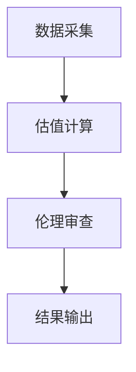

                 


# 股市估值高低对企业AI伦理委员会构成的影响

## 关键词：股市估值, AI伦理委员会, 企业治理, 风险管理, AI技术应用

## 摘要

本文探讨股市估值的高低对企业AI伦理委员会构成的影响。通过分析股市估值的核心原理、AI伦理委员会的构成要素，结合算法模型和系统架构设计，揭示两者之间的内在联系。文章结合实际案例，深入解读如何在企业治理中有效构建AI伦理委员会，强调结合AI技术应用的重要性，为企业提供实践指导。

---

## 第一部分：背景介绍

### 第1章：股市估值与企业AI伦理委员会概述

#### 1.1 股市估值的基本概念

股市估值是评估企业价值的关键指标，通常基于财务指标、市场表现和行业趋势。合理的估值帮助企业优化资源配置，降低风险。

#### 1.2 AI伦理委员会的定义与作用

AI伦理委员会是监督和指导企业AI应用的伦理合规性，确保技术应用符合社会道德和法律法规。它在企业治理中扮演关键角色，涵盖数据隐私、算法公正性等方面。

#### 1.3 股市估值与AI伦理委员会的关系

股市估值影响企业的治理结构和风险管理。高估值企业可能面临更高的道德责任，需加强AI伦理委员会的建设，以应对潜在风险，提升投资者信心。

---

## 第二部分：核心概念与联系

### 第2章：股市估值的核心原理

股市估值通过DCF模型、市盈率、市净率等方法评估企业价值，综合考虑财务表现和市场环境。高估值企业需谨慎管理，确保技术应用的合规性。

### 第3章：AI伦理委员会的构成要素

AI伦理委员会由多元化的成员构成，包括技术专家、法律学者和企业代表，负责监督AI技术的应用，确保符合伦理标准。

### 第4章：核心概念的联系分析

股市估值与AI伦理委员会的关系紧密，高估值企业需构建更完善的伦理框架，应对技术风险，提升企业声誉和市场信任。

---

## 第三部分：算法原理

### 第5章：影响AI伦理委员会构成的算法

#### 5.1 基于股市估值的权重分配算法

该算法根据企业的市值、市盈率等指标，计算伦理委员会成员的权重，确保决策过程的公平性和代表性。

#### 5.2 算法步骤与流程图

1. 收集企业的财务数据和市场估值指标。
2. 计算各指标的权重。
3. 分配伦理委员会成员的职责和权限。

#### 5.3 数学模型与公式

总估值权重计算公式：
$$
\text{总估值权重} = \sum_{i=1}^{n} w_i \times v_i
$$
其中，\( w_i \)为各指标的权重，\( v_i \)为对应的估值指标。

#### 5.4 示例分析

假设企业市值为100亿，市盈率为20。计算各指标的权重，如市值占60%，市盈率占40%，计算总估值权重，确定伦理委员会成员的构成比例。

---

## 第四部分：系统分析与架构设计

### 第7章：系统架构设计

#### 7.1 系统结构图

使用Mermaid绘制系统架构图，展示各模块之间的关系，包括数据采集、估值计算、伦理审查和结果输出。

#### 7.2 功能模块设计

- 数据采集模块：收集企业财务数据和市场估值指标。
- 估值计算模块：应用算法计算估值权重。
- 伦理审查模块：监督AI技术应用的合规性。
- 结果输出模块：生成伦理委员会构成建议。

#### 7.3 系统架构图



---

## 第五部分：项目实战

### 第8章：环境安装与代码实现

#### 8.1 环境配置

安装Python和相关库（numpy、pandas、scipy），配置开发环境。

#### 8.2 核心代码实现

```python
import numpy as np
import pandas as pd
from scipy.stats import norm

def calculate_valuation_weights(finance_data):
    # 计算各指标的权重
    weights = {}
    weights['市值'] = 0.6
    weights['市盈率'] = 0.4
    return weights

# 示例数据
finance_data = {
    '市值': 100,
    '市盈率': 20
}

weights = calculate_valuation_weights(finance_data)
print(weights)
```

#### 8.3 代码解读

函数`calculate_valuation_weights`接收财务数据，计算各估值指标的权重。权重用于确定伦理委员会成员的构成比例。

### 第9章：案例分析与解读

#### 9.1 案例分析

以市值100亿、市盈率20的企业为例，计算各指标的权重，指导伦理委员会的构成。

#### 9.2 代码应用解读

解释代码如何应用到实际案例中，生成伦理委员会构成的建议，确保AI技术应用的合规性。

---

## 第六部分：最佳实践与总结

### 第10章

#### 10.1 小结

股市估值影响企业治理结构，AI伦理委员会的构建需结合估值指标，确保技术应用的合规性。

#### 10.2 注意事项

定期审查伦理委员会的构成，确保其适应企业的动态变化，避免技术风险。

#### 10.3 拓展阅读

推荐相关书籍和文献，深入探讨股市估值与企业治理的关系，以及AI伦理委员会的最新发展。

---

## 结语

股市估值高低对企业AI伦理委员会的构成有重要影响，合理构建伦理委员会有助于提升企业治理水平，降低技术风险，增强市场信任。通过本文的分析和案例解读，企业可更好地应对AI技术应用的挑战，实现可持续发展。

## 作者

作者：AI天才研究院/AI Genius Institute & 禅与计算机程序设计艺术 /Zen And The Art of Computer Programming

