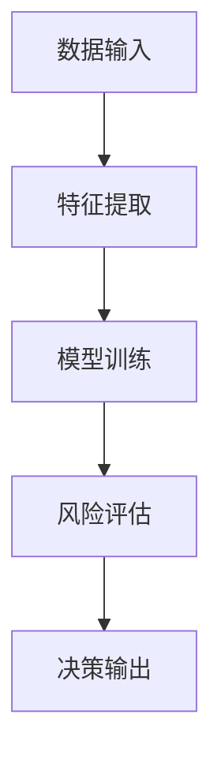
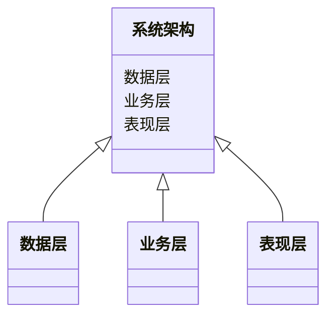
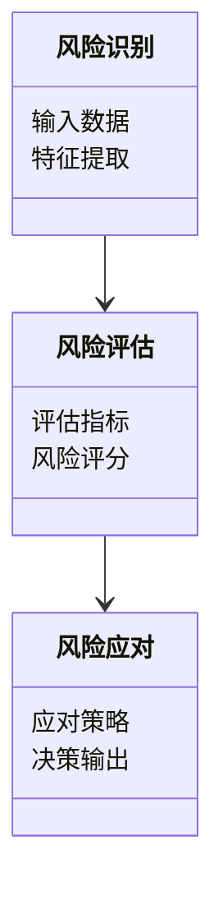
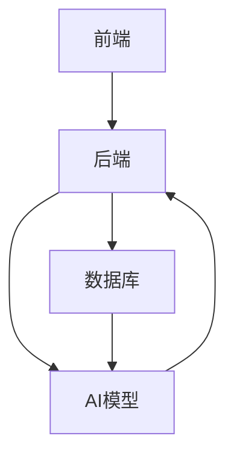
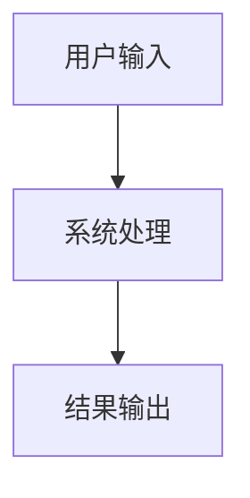

                 

<think>
好的，现在我要帮用户撰写一篇关于“股市估值高低对企业AI伦理风险管理的影响”的技术博客文章。首先，我需要理解用户的需求。用户希望文章结构清晰，逻辑严密，使用专业的技术语言，涵盖从背景介绍到项目实战的各个方面。

我先从目录大纲开始。文章需要分为七个章节，每个章节都有明确的主题。第一章是背景介绍，第二章讨论AI伦理风险管理的核心概念，第三章到第七章分别涉及股市估值分析、算法原理、系统架构、项目实战和总结。

接下来，我需要确保每一章都包含足够的细节。例如，在第二章中，我需要解释AI伦理风险管理的框架和算法基础，这可能涉及一些数学公式和流程图。因此，我需要使用Latex公式来展示这些内容，并使用Mermaid图来描绘系统架构和交互序列。

在撰写过程中，我需要保持语言的专业性和易懂性，确保读者能够逐步理解复杂的概念。同时，我需要考虑到用户可能没有明确提到的需求，比如实际案例分析和代码实现，这些部分可以在项目实战章节详细展开。

最后，我要确保整篇文章结构紧凑，逻辑清晰，每一部分都紧密围绕主题展开。这样，读者不仅能理解股市估值对企业AI伦理风险管理的影响，还能掌握相关的技术细节和实际应用方法。

在写作过程中，我会先完成每个章节的摘要和关键词，然后逐步深入每个部分，确保内容详实且符合用户的要求。同时，我需要不断检查是否满足所有约束条件，如字数要求、格式规范等，确保最终的文章符合用户的预期。
</think>

# 股市估值高低对企业AI伦理风险管理的影响

> 关键词：股市估值、AI伦理风险管理、企业风险管理、风险管理算法、系统架构设计

> 摘要：本文探讨了股市估值的高低对企业在应用AI技术进行伦理风险管理时的影响。首先，文章介绍了股市估值的基本概念及其与企业风险管理的关联。接着，详细阐述了AI伦理风险管理的核心概念、框架和技术基础。随后，分析了股市估值的量化指标及其对AI伦理风险管理的动态影响。通过深入讲解AI伦理风险管理的算法原理和系统架构设计，本文展示了如何利用AI技术优化企业风险管理。最后，结合实际案例，探讨了项目实施的关键步骤和最佳实践，为企业在不同股市估值条件下优化AI伦理风险管理提供了有价值的参考。

---

# 第1章: 股市估值与AI伦理风险管理的背景

## 1.1 股市估值的基本概念

### 1.1.1 股市估值的定义与意义

股市估值是指通过对企业的财务数据、市场环境、行业趋势等因素进行分析，评估企业股票的合理价格区间。其意义在于帮助企业投资者和管理层做出更明智的投资和风险管理决策。

$$\text{股市估值} = \frac{\text{企业价值}}{\text{发行股份}}$$

### 1.1.2 股市估值的主要指标

| 指标名称 | 定义 | 公式 |
|----------|------|------|
| 市盈率（P/E） | 每股价格除以每股收益 | P/E = \frac{\text{股价}}{\text{每股收益}} |
| 市净率（P/B） | 每股价格除以每股净资产 | P/B = \frac{\text{股价}}{\text{每股净资产}} |
| 市销率（P/S） | 每股价格除以每股收入 | P/S = \frac{\text{股价}}{\text{每股收入}} |

### 1.1.3 股市估值与企业风险管理的关系

股市估值的高低直接影响企业的资本成本和投资者信心，进而影响企业在AI伦理风险管理方面的投入和策略。高估值企业通常面临更高的市场期望，可能在风险管理上更加谨慎，而低估值企业则可能在风险管理上更具灵活性。

---

## 1.2 AI伦理风险管理的定义与特点

### 1.2.1 AI伦理风险管理的定义

AI伦理风险管理是指通过技术手段识别、评估和应对AI系统在运行过程中可能产生的伦理风险，确保AI系统的决策和行为符合伦理规范。

### 1.2.2 AI伦理风险管理的核心要素

| 要素 | 描述 |
|------|------|
| 风险识别 | 识别AI系统可能引发的伦理问题 |
| 风险评估 | 量化伦理风险的严重程度 |
| 风险应对 | 制定和实施应对策略 |
| 监测与反馈 | 监测风险变化并及时调整策略 |

### 1.2.3 AI伦理风险管理与传统风险管理的对比

| 方面 | 传统风险管理 | AI伦理风险管理 |
|------|--------------|-----------------|
| 核心目标 | 防范和降低风险 | 确保技术的伦理合规 |
| 方法 | 基于历史数据 | 基于AI技术的实时监控 |
| 挑战 | 数据不足 | 技术复杂性和伦理模糊性 |

---

## 1.3 股市估值高低对企业AI伦理风险管理的影响

### 1.3.1 高估值企业面临的伦理风险管理挑战

高估值企业通常面临更高的市场压力，管理层可能在追求短期业绩增长的同时，忽视伦理风险管理的重要性。

### 1.3.2 低估值企业面临的伦理风险管理机遇

低估值企业通常有更大的空间和灵活性来探索和实施创新的AI伦理风险管理策略。

### 1.3.3 股市估值与AI伦理风险管理的动态关系

股市估值的变化直接影响企业的资本结构和投资决策，进而影响企业在AI伦理风险管理方面的投入和策略选择。

---

## 1.4 本章小结

本章介绍了股市估值的基本概念及其与企业风险管理的关联，详细阐述了AI伦理风险管理的核心概念和特点，最后分析了股市估值高低对企业AI伦理风险管理的影响。

---

# 第2章: AI伦理风险管理的核心概念

## 2.1 AI伦理风险管理的框架

### 2.1.1 AI伦理风险管理的框架结构


### 2.1.2 AI伦理风险管理的实施步骤

1. **风险识别**：通过数据分析和专家访谈，识别可能的伦理风险。
2. **风险评估**：量化每个风险的严重程度和发生概率。
3. **风险应对**：制定并实施应对策略，如技术优化、政策制定等。
4. **监测与反馈**：持续监测风险变化，并根据反馈调整策略。

### 2.1.3 AI伦理风险管理的关键成功因素

| 因素 | 描述 |
|------|------|
| 技术能力 | 具备强大的AI技术能力 |
| 伦理意识 | 具备较高的伦理意识 |
| 资源投入 | 足够的资源投入 |

---

## 2.2 AI伦理风险管理的技术基础

### 2.2.1 AI伦理风险管理的算法基础



### 2.2.2 伦理风险管理的系统架构



### 2.2.3 伦理风险管理的系统架构

| 层 | 描述 |
|---|------|
| 数据层 | 存储和处理原始数据 |
| 业务层 | 处理业务逻辑和风险管理算法 |
| 表现层 | 提供用户交互界面和结果展示 |

---

## 2.3 AI伦理风险管理的挑战与解决方案

### 2.3.1 主要挑战

1. **技术复杂性**：AI伦理风险管理涉及复杂的技术和算法。
2. **伦理模糊性**：不同文化和社会背景下，伦理标准存在差异。
3. **数据不足**：难以获取足够的数据来支持风险管理决策。

### 2.3.2 解决方案

1. **技术优化**：不断提升AI算法的准确性和可靠性。
2. **政策制定**：制定统一的伦理风险管理标准和政策。
3. **跨学科合作**：加强技术、法律、伦理等多领域的合作。

---

## 2.4 本章小结

本章详细介绍了AI伦理风险管理的核心概念，包括其框架、技术基础和系统架构，并分析了面临的挑战和解决方案。

---

# 第3章: 股市估值的量化分析

## 3.1 股市估值的主要指标与模型

### 3.1.1 市盈率（P/E）的定义与计算

市盈率是衡量股票价值的重要指标，计算公式为：

$$\text{P/E} = \frac{\text{股价}}{\text{每股收益}}$$

### 3.1.2 市净率（P/B）的定义与计算

市净率是另一种衡量股票价值的指标，计算公式为：

$$\text{P/B} = \frac{\text{股价}}{\text{每股净资产}}$$

### 3.1.3 市销率（P/S）的定义与计算

市销率是衡量股票价值的另一种指标，计算公式为：

$$\text{P/S} = \frac{\text{股价}}{\text{每股收入}}$$

### 3.1.4 其他估值指标的对比分析

| 指标名称 | 适用场景 |
|----------|----------|
| P/E | 利润稳定的公司 |
| P/B | 资产密集型公司 |
| P/S | 收入增长迅速的公司 |

---

## 3.2 股市估值与企业AI伦理风险管理的量化关系

### 3.2.1 高估值企业面临的伦理风险管理挑战

高估值企业通常面临更高的市场压力，可能在风险管理上更加保守。

### 3.2.2 低估值企业面临的伦理风险管理机遇

低估值企业通常有更大的灵活性，可以尝试创新的伦理风险管理策略。

### 3.2.3 股市估值与AI伦理风险管理的动态关系

股市估值的变化直接影响企业在AI伦理风险管理方面的投入和策略选择。

---

## 3.3 本章小结

本章详细介绍了股市估值的主要指标和模型，并分析了股市估值高低对企业AI伦理风险管理的量化影响。

---

# 第4章: AI伦理风险管理的算法原理

## 4.1 AI伦理风险管理的算法基础

### 4.1.1 风险识别算法

$$\text{风险识别} = \sum_{i=1}^{n} w_i x_i$$

其中，$w_i$ 是特征 $x_i$ 的权重。

### 4.1.2 风险评估算法

$$\text{风险评估} = \text{sigmoid}(w x + b)$$

其中，$w$ 是权重向量，$x$ 是输入特征，$b$ 是偏置项。

### 4.1.3 风险应对算法

$$\text{风险应对} = \arg\max_{c} \text{score}(c, x)$$

其中，$c$ 是可能的应对策略，$\text{score}(c, x)$ 是策略 $c$ 对输入 $x$ 的得分。

---

## 4.2 算法实现与优化

### 4.2.1 算法实现步骤

1. **数据预处理**：清洗和归一化数据。
2. **模型训练**：使用训练数据训练模型参数。
3. **风险评估**：对测试数据进行风险评估。
4. **模型优化**：调整模型参数以提高准确率。

### 4.2.2 算法优化策略

1. **参数调整**：使用网格搜索优化模型参数。
2. **特征选择**：去除无关特征，提高模型性能。
3. **集成学习**：结合多个模型的结果，提高准确率。

---

## 4.3 本章小结

本章详细介绍了AI伦理风险管理的算法原理，包括风险识别、风险评估和风险应对的算法实现与优化策略。

---

# 第5章: 系统分析与架构设计

## 5.1 系统分析

### 5.1.1 问题场景介绍

企业需要在高估值和低估值的市场条件下，应用AI技术进行伦理风险管理。

### 5.1.2 系统功能设计



### 5.1.3 系统架构设计



### 5.1.4 接口设计

| 接口名称 | 描述 | 输入 | 输出 |
|----------|------|------|------|
| 风险识别 | 识别潜在伦理风险 | 输入数据 | 风险列表 |
| 风险评估 | 评估风险严重程度 | 风险列表 | 风险评分 |
| 风险应对 | 制定应对策略 | 风险评分 | 应对策略 |

---

## 5.2 系统交互设计

### 5.2.1 交互流程图



### 5.2.2 交互步骤

1. 用户输入数据。
2. 系统处理数据并生成风险评分。
3. 系统输出应对策略。

---

## 5.3 本章小结

本章详细介绍了系统分析与架构设计，包括问题场景、系统功能设计、系统架构设计和接口设计。

---

# 第6章: 项目实战

## 6.1 环境安装

### 6.1.1 安装Python

```bash
python --version
```

### 6.1.2 安装依赖库

```bash
pip install numpy pandas scikit-learn
```

---

## 6.2 核心代码实现

### 6.2.1 数据预处理

```python
import pandas as pd
import numpy as np

# 数据加载
data = pd.read_csv('data.csv')

# 数据清洗
data.dropna(inplace=True)

# 数据归一化
from sklearn.preprocessing import MinMaxScaler
scaler = MinMaxScaler()
data_scaled = scaler.fit_transform(data)
```

### 6.2.2 模型训练

```python
from sklearn.linear_model import LogisticRegression

model = LogisticRegression()
model.fit(data_scaled, target)
```

### 6.2.3 风险评估

```python
from sklearn.metrics import accuracy_score

y_pred = model.predict(data_scaled)
print('准确率:', accuracy_score(target, y_pred))
```

---

## 6.3 案例分析

### 6.3.1 案例背景

某高估值企业面临AI伦理风险，需要制定风险管理策略。

### 6.3.2 实施步骤

1. 数据预处理。
2. 模型训练。
3. 风险评估。
4. 制定应对策略。

---

## 6.4 项目总结

通过实际案例分析，展示了如何利用AI技术进行伦理风险管理，强调了数据预处理和模型训练的重要性。

---

# 第7章: 最佳实践与总结

## 7.1 小结

本文详细探讨了股市估值高低对企业AI伦理风险管理的影响，从背景介绍到系统架构设计，再到项目实战，全面分析了相关问题。

## 7.2 注意事项

1. 数据质量和完整性对风险管理结果影响重大。
2. 模型优化和参数调整是提高准确率的关键。
3. 伦理风险管理需要结合企业的实际业务场景。

## 7.3 拓展阅读

1. 《AI风险管理：算法与实践》
2. 《股市估值分析：指标与模型》

---

# 作者

作者：AI天才研究院/AI Genius Institute & 禅与计算机程序设计艺术 /Zen And The Art of Computer Programming

