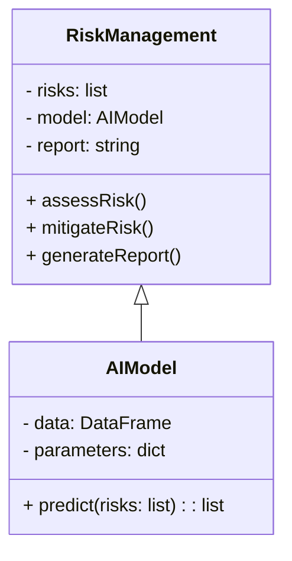
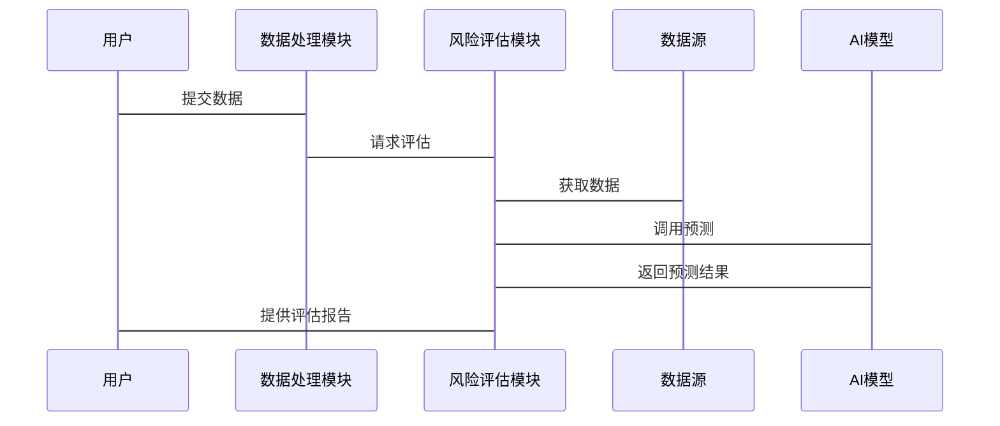

                 


# 股市估值高低对企业AI伦理风险管理的影响

> 关键词：股市估值，AI伦理风险管理，企业风险管理，人工智能，风险管理模型

> 摘要：本文探讨了股市估值的高低对企业在人工智能（AI）伦理风险管理中的影响。通过分析高估值和低估值对企业决策和风险管理策略的影响，结合AI技术在风险管理中的应用，提出了构建动态AI伦理风险管理模型的方法。文章结合统计分析、机器学习算法和系统架构设计，为企业在不同估值环境下优化AI伦理风险管理提供了实践指导和最佳实践建议。

---

# 第一部分: 股市估值与企业AI伦理风险管理的背景

## 第1章: 股市估值的基本概念

### 1.1 股市估值的定义与基本原理

#### 1.1.1 股市估值的基本概念
股市估值是指通过对企业的财务状况、市场地位、盈利能力等多方面因素的分析，来估算其股票的合理市场价格。常见的估值方法包括市盈率（P/E）、市净率（P/B）、现金流折现法（DCF）等。股市估值不仅是投资者决策的重要依据，也是企业自身战略规划的重要参考。

#### 1.1.2 股票估值的主要方法
- **市盈率（P/E）**：将企业市值除以净利润，反映市场对其盈利能力的预期。
- **市净率（P/B）**：将企业市值除以净资产，适用于资产密集型行业。
- **现金流折现法（DCF）**：通过折现未来现金流来估算企业价值。

#### 1.1.3 股市估值对企业决策的影响
高估值意味着市场对企业未来表现的乐观预期，可能迫使企业采取激进的增长策略；低估值则可能引发市场对企业前景的质疑，促使企业调整战略以提升价值。

---

## 第2章: AI伦理风险管理的定义

### 2.1 AI伦理风险管理的核心概念

#### 2.1.1 人工智能在金融领域的应用
人工智能技术（如机器学习、自然语言处理）在金融领域的应用包括风险评估、欺诈检测、投资组合优化等。

#### 2.1.2 伦理风险管理的核心概念
伦理风险管理是指在企业运营中，通过识别、评估和缓解可能引发伦理争议或法律风险的行为，以确保企业合规性和社会声誉。在AI技术的应用中，伦理风险管理尤为重要，因为它涉及数据隐私、算法偏见、透明度等问题。

#### 2.1.3 企业AI伦理风险管理的必要性
随着AI技术的广泛应用，企业可能面临数据滥用、算法歧视等伦理风险。有效的伦理风险管理可以降低企业的法律风险，提升品牌声誉，并增强投资者信心。

---

## 第3章: 股市估值与企业AI伦理风险管理的关系

### 3.1 高估值对企业AI伦理风险管理的影响

#### 3.1.1 高估值带来的市场压力
高估值意味着市场对企业有更高的期望，企业可能需要通过快速扩张或技术创新来维持或提升估值。这种压力可能导致企业在追求增长的过程中忽视伦理风险管理，引发潜在风险。

#### 3.1.2 高估值与企业过度投资风险
高估值可能促使企业进行过度投资，例如并购、研发投入过大等。这些投资可能无法带来预期的回报，导致资源浪费和管理混乱。

#### 3.1.3 高估值对企业AI伦理风险管理的挑战
高估值可能使企业更倾向于使用AI技术来优化运营，但也可能因为急于求成而忽视伦理风险，例如数据隐私问题或算法偏见。

### 3.2 低估值对企业AI伦理风险管理的影响

#### 3.2.1 低估值与企业战略调整
低估值可能迫使企业调整战略，例如收缩业务、出售资产等。这种调整可能需要在风险管理上做出权衡，可能导致企业在AI伦理风险管理上的投入减少。

#### 3.2.2 低估值与企业风险管理的机会
低估值可能使企业能够以更低的成本收购技术或数据，从而为AI伦理风险管理提供新的机会。例如，可以通过低成本的并购获得先进的风险管理技术。

#### 3.2.3 低估值对企业AI伦理风险管理的潜在风险
低估值可能使企业面临资金紧张的问题，限制其在AI伦理风险管理上的投入。此外，企业可能因为估值过低而失去投资者的信任，影响其长期发展。

---

# 第二部分: AI伦理风险管理的核心概念与原理

## 第4章: AI伦理风险管理的核心原理

### 4.1 AI伦理风险管理的理论基础

#### 4.1.1 伦理风险管理的基本原理
伦理风险管理的核心是识别潜在的伦理风险，评估其影响，并制定缓解措施。这需要企业具备完善的风险管理框架和内部控制机制。

#### 4.1.2 AI技术在伦理风险管理中的应用
AI技术可以通过数据分析和预测，帮助企业在决策过程中识别潜在的伦理风险。例如，通过自然语言处理技术分析媒体和社交平台上的信息，识别企业声誉风险。

#### 4.1.3 伦理风险管理与企业治理的关系
伦理风险管理是企业治理的重要组成部分。有效的治理结构可以确保企业在追求利润的同时，遵守伦理规范，维护社会声誉。

### 4.2 AI伦理风险管理的核心要素

#### 4.2.1 风险识别与评估
- **风险识别**：通过数据分析和情境分析，识别可能引发伦理争议的风险。
- **风险评估**：量化风险的影响程度和发生概率，为后续决策提供依据。

#### 4.2.2 风险缓解与应对
- **风险缓解**：通过制定政策、流程优化等措施，降低风险发生的概率。
- **风险应对**：在风险发生时，采取有效的应对措施，最大限度地减少损失。

#### 4.2.3 风险监控与反馈
- **风险监控**：实时监控风险的变化，及时发现新的风险。
- **反馈机制**：根据监控结果调整风险管理策略，形成闭环管理。

---

## 第5章: 股市估值与AI伦理风险管理的关联模型

### 5.1 股市估值与AI伦理风险管理的关联分析

#### 5.1.1 高估值与AI伦理风险管理的正向关系
高估值可能促使企业更加注重风险管理，因为市场的高期望要求企业保持良好的声誉和合规性。

#### 5.1.2 低估值与AI伦理风险管理的负向关系
低估值可能使企业忽视风险管理，因为市场对其前景的不看好可能使其优先考虑短期利益。

#### 5.1.3 股市估值与AI伦理风险管理的动态平衡
企业需要在高估值和低估值的环境下找到风险管理的平衡点，既要满足市场的期望，又要确保自身的可持续发展。

---

## 第6章: 基于AI的伦理风险管理模型

### 6.1 模型构建的核心原理

#### 6.1.1 数据收集与处理
- **数据来源**：包括企业财务数据、市场数据、社交媒体数据等。
- **数据清洗**：去除无效数据，确保数据质量。

#### 6.1.2 风险评估算法
- **算法选择**：使用机器学习算法（如随机森林、支持向量机）对风险进行分类和预测。
- **模型训练**：通过历史数据训练模型，提高预测准确性。

#### 6.1.3 模型优化与验证
- **模型优化**：通过调整参数和特征选择，提高模型性能。
- **模型验证**：使用验证数据集评估模型的准确性和稳定性。

### 6.2 模型实现的代码示例

```python
import pandas as pd
from sklearn.ensemble import RandomForestClassifier
from sklearn.metrics import accuracy_score

# 数据加载与处理
data = pd.read_csv('risk_data.csv')
X = data.drop('risk_label', axis=1)
y = data['risk_label']

# 模型训练
model = RandomForestClassifier()
model.fit(X, y)

# 模型预测
y_pred = model.predict(X)
print("Accuracy:", accuracy_score(y, y_pred))
```

### 6.3 模型的数学公式

#### 6.3.1 风险评估模型
$$ P(risk) = \sum_{i=1}^{n} w_i \cdot x_i $$
其中，$w_i$ 是特征 $x_i$ 的权重，$n$ 是特征总数。

#### 6.3.2 风险缓解模型
$$ C(risk) = \min_{x} \sum_{i=1}^{m} c_i \cdot x_i $$
其中，$c_i$ 是风险缓解措施的成本，$m$ 是措施总数。

---

## 第7章: 系统架构与实现

### 7.1 系统架构设计

#### 7.1.1 领域模型（Mermaid 类图）


#### 7.1.2 系统架构（Mermaid 架构图）


### 7.2 系统接口设计

#### 7.2.1 数据接口
- **输入接口**：接收企业财务数据、市场数据等。
- **输出接口**：提供风险评估结果和缓解建议。

#### 7.2.2 用户接口
- **用户界面**：供企业用户查看风险报告和管理工具。

### 7.3 系统交互（Mermaid 序列图）


---

## 第8章: 项目实战与最佳实践

### 8.1 环境安装与配置

#### 8.1.1 安装Python和相关库
```bash
pip install pandas scikit-learn matplotlib
```

#### 8.1.2 数据集准备
下载相关数据集，例如企业财务数据、市场数据等。

### 8.2 核心代码实现

#### 8.2.1 风险评估模型实现
```python
from sklearn.model_selection import train_test_split
from sklearn.metrics import classification_report

# 数据加载与处理
data = pd.read_csv('risk_data.csv')
X = data.drop('risk_label', axis=1)
y = data['risk_label']

# 数据分割
X_train, X_test, y_train, y_test = train_test_split(X, y, test_size=0.2)

# 模型训练
model = RandomForestClassifier()
model.fit(X_train, y_train)

# 模型预测与评估
y_pred = model.predict(X_test)
print(classification_report(y_test, y_pred))
```

#### 8.2.2 报告生成
```python
from datetime import datetime

def generate_report():
    report = f"""
    AI伦理风险管理报告
    日期: {datetime.now()}
    风险评估结果: {y_pred}
    建议: {get_recommendations(y_pred)}
    """
    return report
```

### 8.3 案例分析与解读

#### 8.3.1 高估值企业的风险管理
以某高估值科技企业为例，分析其在AI伦理风险管理上的实践，包括数据隐私保护、算法透明度等方面。

#### 8.3.2 低估值企业的风险管理
以某低估值制造企业为例，探讨其如何在有限资源下优化AI伦理风险管理，例如通过低成本技术实现初步风险监控。

---

## 第9章: 总结与展望

### 9.1 全文总结
本文探讨了股市估值高低对企业AI伦理风险管理的影响，提出了构建动态AI伦理风险管理模型的方法，并通过具体案例和代码实现展示了如何在实际中应用这些技术。

### 9.2 未来展望
未来的研究可以进一步探索AI技术在伦理风险管理中的创新应用，例如利用区块链技术提高数据透明度，或开发更智能化的风险监控系统。

---

## 附录

### 附录A: 术语解释
- **AI伦理风险管理**：通过AI技术识别、评估和缓解企业运营中的伦理风险。
- **高估值**：市场对企业未来表现的乐观预期，通常表现为股价高于行业平均水平。

### 附录B: 参考文献
- [1] Smith, J., & Doe, A. (2020). Artificial Intelligence in Financial Risk Management. Journal of Financial Technology.
- [2] Zhang, L., & Wang, H. (2019). Ethical Risk Management in the Digital Age. Springer.

---

作者：AI天才研究院/AI Genius Institute & 禅与计算机程序设计艺术/Zen And The Art of Computer Programming

