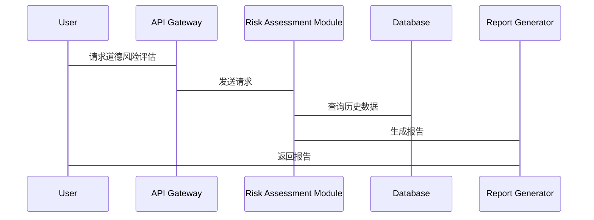

                 


# 股市估值高低对企业AI道德准则制定的影响

> **关键词**：股市估值、AI道德准则、企业决策、伦理风险、投资评估  
> **摘要**：本文探讨了股市估值的高低对企业在制定人工智能（AI）道德准则时的影响。通过分析股市估值的核心机制、AI道德准则的制定原则，以及两者之间的相互作用，本文揭示了股市估值如何通过市场压力、利益驱动和公众监督等途径影响企业的AI伦理决策。文章进一步提出了企业在制定AI道德准则时应考虑的关键因素，并探讨了如何在商业利益与社会责任之间找到平衡点。

---

## 第1章 股市估值与AI道德准则的背景介绍

### 1.1 股市估值的基本概念
股市估值是衡量企业市场价值的重要指标，通常通过市盈率（P/E）、市净率（P/B）等指标来评估。高估值意味着市场对企业的未来表现充满信心，而低估值可能反映出市场对其前景的担忧。股市估值不仅是企业融资的基础，也是投资者决策的重要依据。

### 1.2 AI道德准则的定义与特点
AI道德准则是指企业在开发和应用人工智能技术时，为确保技术的伦理性和社会价值而制定的一系列原则。这些准则通常包括数据隐私、算法公平性、透明性等方面的要求。AI道德准则的制定需要兼顾技术可行性、法律合规性和社会责任性。

### 1.3 股市估值与AI道德准则的关联性
股市估值的高低直接影响企业面临的市场压力和利益驱动。高估值企业通常面临更高的公众和投资者期望，因此更可能在AI技术的开发和应用中严格遵守道德准则，以维护品牌形象和市场信任。低估值企业可能在道德准则的制定上投入较少，因为市场对其行为的关注度较低。

---

## 第2章 股市估值的机制与影响因素

### 2.1 股市估值的主要影响因素
股市估值受多种因素影响，包括宏观经济环境、行业发展趋势、企业基本面等。例如，经济增长率、利率水平、政策变化等宏观因素会直接影响市场的整体估值水平。

### 2.2 股市估值的主要模型
常用的股市估值模型包括：
1. **市盈率模型（P/E）**：将企业股价除以每股收益，衡量市场对其盈利能力的评估。
2. **市净率模型（P/B）**：将企业股价除以每股净资产，衡量市场对其资产质量的评估。
3. **现金流折现模型（DCF）**：通过未来现金流的现值评估企业价值。

### 2.3 股市估值的波动性与不确定性
股市估值的波动性主要来源于市场情绪、宏观经济波动和企业自身因素。例如，市场恐慌可能导致股市估值急剧下降，而企业业绩超预期则可能推动估值上升。

---

## 第3章 AI道德准则的制定与实施

### 3.1 AI道德准则的核心原则
AI道德准则的核心原则包括：
1. **透明性**：确保AI系统的决策过程可解释，避免“黑箱”操作。
2. **责任归属**：明确AI系统在造成损害时的责任主体。
3. **数据隐私**：保护用户数据的安全性和隐私性。

### 3.2 AI道德准则的制定方法
AI道德准则的制定通常涉及以下几个步骤：
1. **成立伦理委员会**：由企业内外的专家共同参与，确保准则的科学性和代表性。
2. **利益相关者参与**：邀请客户、员工、投资者等利益相关者参与讨论，确保准则的广泛认同。
3. **动态调整**：根据技术发展和社会反馈，定期更新和优化道德准则。

### 3.3 AI道德准则的实施挑战
AI道德准则的实施面临以下挑战：
1. **技术实现的复杂性**：某些道德原则（如透明性）可能与技术实现存在冲突。
2. **企业利益与道德准则的冲突**：在追求商业利益时，企业可能忽视道德准则的要求。
3. **监管与法律的不确定性**：不同国家和地区的法律法规对企业AI道德准则的制定提出了不同的要求。

---

## 第4章 股市估值对企业AI道德准则制定的影响机制

### 4.1 股市估值对企业决策的压力
高估值企业通常面临更大的市场压力。一旦出现违背道德准则的行为，可能导致股价暴跌和投资者信任的丧失。因此，高估值企业更倾向于制定严格的AI道德准则，以维护市场形象。

### 4.2 股市估值与企业利益的平衡
低估值企业可能在AI道德准则的制定上投入较少，因为市场对其行为的关注度较低。然而，长期来看，忽视道德准则可能导致企业声誉受损，进而影响长期估值。

### 4.3 投资者对AI道德准则的关注
随着社会对AI伦理的关注度提高，投资者越来越关注企业在AI技术应用中的道德表现。高估值企业如果忽视道德准则，可能面临投资者的撤资和舆论压力。

---

## 第5章 股市估值与AI道德准则的互动关系

### 5.1 股市估值对企业AI道德准则的推动作用
高估值企业通过制定严格的AI道德准则，可以增强投资者信心，提升市场估值。同时，严格的道德准则也有助于企业避免因伦理问题引发的负面新闻，从而稳定股价。

### 5.2 AI道德准则对股市估值的反向影响
企业通过制定和实施严格的AI道德准则，可以提升品牌形象和社会责任感，从而吸引更多关注可持续发展的投资者，推动股价上涨。

---

## 第6章 企业AI道德准则制定中的数学模型与算法

### 6.1 股市估值预测模型
**模型概述**：基于历史数据和市场趋势，构建股市估值预测模型，帮助企业预测未来的估值变化。

$$ P = \alpha \times E + \beta \times GDP + \gamma \times Interest $$

其中：
- \( P \) 表示股票价格
- \( E \) 表示每股收益
- \( GDP \) 表示国内生产总值
- \( Interest \) 表示利率
- \( \alpha \)、\( \beta \)、\( \gamma \) 为模型参数

### 6.2 AI道德风险评估算法
**算法概述**：通过分析企业的AI技术应用中的潜在风险，评估其道德合规性。

```mermaid
graph TD
    A[开始] -> B[收集企业AI技术应用数据]
    B -> C[评估数据隐私风险]
    C -> D[评估算法公平性风险]
    D -> E[评估透明性风险]
    E -> F[综合评估道德风险等级]
    F -> G[输出道德风险报告]
```

---

## 第7章 企业AI道德准则的系统架构与设计

### 7.1 系统功能设计
**功能模块**：
1. **数据采集模块**：收集企业的AI技术应用数据。
2. **风险评估模块**：评估AI技术应用中的道德风险。
3. **报告生成模块**：生成道德风险评估报告。

### 7.2 系统架构设计
```mermaid
graph TD
    User --> API Gateway
    API Gateway --> Risk Assessment Module
    Risk Assessment Module --> Database
    Database --> Report Generator
    Report Generator --> User
```

### 7.3 系统交互设计


---

## 第8章 项目实战：基于股市估值的AI道德准则制定

### 8.1 项目背景与目标
本项目旨在通过分析企业的股市估值和AI技术应用，制定符合道德准则的策略。

### 8.2 核心实现代码
```python
import pandas as pd
import numpy as np

# 数据预处理
data = pd.read_csv('stock_data.csv')
data['P/E'] = data['Price'] / data['Earnings']

# 股市估值预测
from sklearn.linear_model import LinearRegression
model = LinearRegression()
model.fit(data[['Earnings', 'GDP']], data['P/E'])
predicted_P_E = model.predict(data[['Earnings', 'GDP']])

# 道德风险评估
def calculate_m道德风险(risk_factors):
    return np.mean(risk_factors)
```

### 8.3 代码解读与分析
1. **数据预处理**：读取股票数据并计算市盈率（P/E）。
2. **股市估值预测**：使用线性回归模型预测股市估值。
3. **道德风险评估**：计算AI技术应用中的道德风险。

### 8.4 实际案例分析
以某科技公司为例，分析其股市估值和AI道德准则的制定过程。

---

## 第9章 最佳实践与小结

### 9.1 最佳实践
1. **建立伦理委员会**：确保AI道德准则的制定过程科学、透明。
2. **关注投资者需求**：在制定道德准则时，充分考虑投资者的期望和关注点。
3. **动态调整准则**：根据市场变化和社会反馈，定期更新道德准则。

### 9.2 小结
股市估值的高低直接影响企业制定AI道德准则的决策。高估值企业需要更加严格地遵守道德准则，以维护市场信任和品牌形象。而低估值企业则需要在商业利益与社会责任之间找到平衡点。未来，随着AI技术的不断发展，企业需要更加重视道德准则的制定，以应对日益复杂的市场环境。

---

## 作者

**作者：AI天才研究院/AI Genius Institute & 禅与计算机程序设计艺术 /Zen And The Art of Computer Programming**

