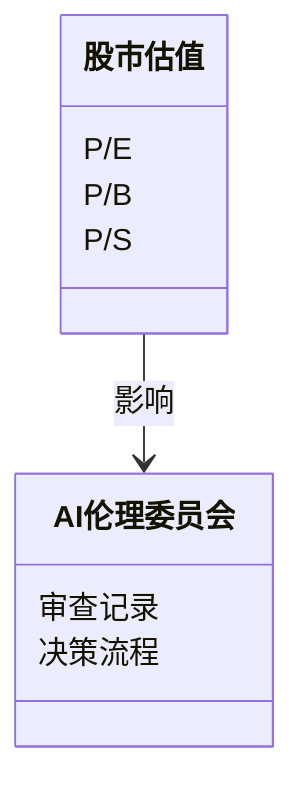
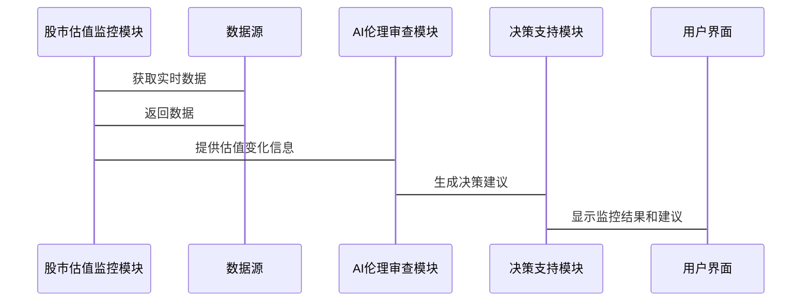

                 

<think>
好的，我现在需要帮助用户撰写一篇名为《股市估值高低对企业人工智能伦理委员会的影响》的技术博客文章。用户已经提供了详细的要求，包括文章结构、关键词、摘要以及各章节的内容。我需要按照这些要求一步步进行分析和撰写。

首先，我会先阅读用户的查询，确保理解所有的要求和细节。用户希望文章结构清晰，逻辑紧凑，使用专业但易懂的技术语言。关键词和摘要需要准确反映文章的核心内容。

接下来，我会从引言部分开始，概述股市估值和企业AI伦理委员会的重要性，说明两者之间的关系。然后，我会详细介绍核心概念，解释股市估值和AI伦理委员会的定义和作用，并探讨它们之间的相互影响。

在核心概念与联系部分，我需要使用表格和图表来展示两者的对比和关系，可能使用Mermaid工具来绘制流程图。这有助于读者更好地理解两者的互动机制。

然后是算法原理部分，我需要详细讲解相关的算法，如回归分析或机器学习模型，并用数学公式和代码示例来说明。这部分需要确保逻辑严谨，同时提供实际案例来帮助理解。

系统分析与架构设计部分，我会设计一个实时监控系统，展示数据流和模块交互，使用Mermaid图来说明系统架构和接口设计。这有助于读者理解系统的实际应用。

项目实战部分，我需要指导读者如何安装环境，编写代码，并分析实际案例。这将帮助读者将理论应用于实践。

最后，我会总结全书内容，给出最佳实践建议和注意事项，并推荐进一步阅读的资料。

在撰写过程中，我需要确保每个章节内容详尽，逻辑连贯，覆盖所有关键点。同时，要控制文章总字数在10000到12000字之间，避免过于冗长。此外，结尾处需要添加作者信息，符合格式要求。

总的来说，我需要系统地按照用户的要求，逐步构建这篇文章，确保每个部分都细化到三级目录，内容丰富且详细。这需要我仔细思考每个部分的内容，确保逻辑清晰，结构合理，最终产出一篇高质量的技术博客文章。
</think>

```markdown
# 股市估值高低对企业人工智能伦理委员会的影响

> 关键词：股市估值、企业人工智能伦理委员会、伦理决策、股价波动、企业治理

> 摘要：股市估值的高低对企业人工智能伦理委员会的运作和决策有着重要影响。本文将从核心概念、算法原理、系统架构、项目实战等多个方面详细分析股市估值与企业人工智能伦理委员会之间的关系，并探讨如何通过优化算法和系统设计来应对高估值环境下的伦理决策挑战。

---

## 第1章: 引言

### 1.1 问题背景
#### 1.1.1 股市估值的基本概念
股市估值是衡量企业市场价值的重要指标，通常通过市盈率、市净率等指标来评估企业的投资价值。高估值意味着市场对企业未来表现的乐观预期，而低估值则可能反映市场对其前景的悲观看法。

#### 1.1.2 企业人工智能伦理委员会的定义
企业人工智能伦理委员会（AI Ethics Committee）是负责监督和指导企业在人工智能技术开发和应用过程中遵循伦理准则的组织。其主要职责包括审查AI算法的公平性、透明性和潜在的社会影响。

#### 1.1.3 股市估值与企业人工智能伦理委员会的关系
股市估值的高低会影响企业的资金投入、战略决策和风险管理，而企业人工智能伦理委员会的运作则需要在这些背景下进行。高估值可能导致企业在伦理决策上面临更大的压力，因为市场对业绩的高预期可能促使企业追求短期利益，忽视长期的伦理风险。

### 1.2 问题描述
#### 1.2.1 股市估值对企业决策的影响
高估值通常意味着企业需要在短期内实现更高的盈利目标，这可能导致企业在人工智能技术的应用中采取冒险性策略，忽略伦理风险。

#### 1.2.2 人工智能伦理委员会的职责与挑战
人工智能伦理委员会需要在企业利益与社会伦理之间找到平衡点。然而，高估值环境下的短期压力可能削弱委员会的独立性，使其难以有效履行职责。

#### 1.2.3 股市估值如何影响人工智能伦理委员会的决策过程
股市估值的波动直接影响企业的资金流动和战略方向，从而间接影响人工智能伦理委员会的决策过程。例如，高估值可能导致企业在AI技术研发中投入更多资源，但也可能忽视伦理审查。

### 1.3 问题解决
#### 1.3.1 通过股市估值优化企业人工智能伦理决策
企业可以通过分析股市估值的变化，调整其人工智能技术的开发和应用策略，确保在追求经济效益的同时，遵循伦理准则。

#### 1.3.2 企业人工智能伦理委员会在高估值环境中的应对策略
委员会需要制定灵活的伦理审查机制，能够在高估值压力下，保持独立性和客观性，确保决策的公正性。

#### 1.3.3 股市估值与人工智能伦理委员会的协同机制
通过建立有效的协同机制，企业可以在高估值环境下，实现经济效益与伦理责任的平衡，确保人工智能技术的健康发展。

### 1.4 边界与外延
#### 1.4.1 股市估值影响的边界条件
股市估值的影响受到企业所处行业、市场环境和政策法规等多种因素的限制。例如，科技企业的高估值可能面临更高的伦理审查压力，而传统行业则可能影响较小。

#### 1.4.2 人工智能伦理委员会的外部影响因素
除了股市估值，政策法规、社会舆论和行业标准等外部因素也对人工智能伦理委员会的决策产生重要影响。

#### 1.4.3 股市估值与人工智能伦理委员会的相互作用机制
股市估值的变化通过影响企业的战略决策和资源分配，间接作用于人工智能伦理委员会的运作。同时，委员会的决策也可能反过来影响企业的估值，例如通过提升企业形象和责任感，增强投资者信心。

### 1.5 概念结构与核心要素
#### 1.5.1 股市估值的核心要素
- 市盈率（P/E Ratio）
- 市净率（P/B Ratio）
- 市销率（P/S Ratio）

#### 1.5.2 人工智能伦理委员会的核心要素
- 组织架构
- 职责范围
- 审查流程

#### 1.5.3 两者关系的结构化分析
通过构建概念模型，分析股市估值与人工智能伦理委员会之间的相互作用，明确各要素之间的关系和影响路径。

---

## 第2章: 核心概念与联系

### 2.1 核心概念原理
#### 2.1.1 股市估值的计算方法
- 市盈率（P/E）= 股价 / 每股净利润
- 市净率（P/B）= 股价 / 每股净资产
- 市销率（P/S）= 股价 / 每股收入

#### 2.1.2 人工智能伦理委员会的运作机制
- 定期审查AI技术的伦理风险
- 制定伦理规范和指导方针
- 提供伦理决策的咨询服务

#### 2.1.3 两者关系的理论模型
通过构建理论模型，分析股市估值对企业人工智能伦理委员会的决策过程的影响机制。

### 2.2 概念属性特征对比
#### 2.2.1 股市估值的属性特征
- 数量化：通过具体指标衡量企业价值
- 动态性：受市场环境和企业业绩的影响
- 主观性：投资者预期和市场情绪的影响

#### 2.2.2 人工智能伦理委员会的属性特征
- 独立性：独立于企业运营的其他部门
- 长期性：关注长期伦理风险和企业责任
- 社会性：涉及社会利益和公共道德

#### 2.2.3 两者属性的对比分析
通过对比分析，明确股市估值和人工智能伦理委员会在属性上的异同，为后续研究提供理论基础。

### 2.3 ER实体

#### 2.3.1 实体关系图
```mermaid
er
actor: 股市估值
actor: 人工智能伦理委员会
actor: 企业
```

#### 2.3.2 关系描述
- 股市估值与企业：高估值影响企业的资源分配和战略决策
- 企业与人工智能伦理委员会：企业需要支持伦理委员会的运作
- 股市估值与人工智能伦理委员会：高估值压力影响伦理委员会的独立性

---

## 第3章: 算法原理讲解

### 3.1 算法原理
#### 3.1.1 算法概述
通过算法分析股市估值的变化对企业人工智能伦理委员会决策的影响，构建预测模型。

#### 3.1.2 算法流程
1. 数据收集：获取企业的股市估值数据和AI伦理审查记录。
2. 数据预处理：清洗数据，提取关键特征。
3. 模型训练：使用机器学习算法（如逻辑回归、随机森林）进行预测。
4. 模型评估：验证模型的准确性和稳定性。

### 3.2 算法实现
#### 3.2.1 代码实现
```python
import pandas as pd
from sklearn.model_selection import train_test_split
from sklearn.linear_model import LogisticRegression
from sklearn.metrics import accuracy_score

# 数据加载
data = pd.read_csv('stock_valuation.csv')

# 特征提取
X = data[['P/E', 'P/B', 'P/S']]
y = data['Ethics_Committee_Decision']

# 数据分割
X_train, X_test, y_train, y_test = train_test_split(X, y, test_size=0.2, random_state=42)

# 模型训练
model = LogisticRegression()
model.fit(X_train, y_train)

# 模型预测
y_pred = model.predict(X_test)

# 模型评估
print("Accuracy:", accuracy_score(y_test, y_pred))
```

#### 3.2.2 算法原理的数学模型
- 对数几率回归（Logistic Regression）：
  $$ P(y=1|x) = \frac{e^{\beta_0 + \beta_1 x}}{1 + e^{\beta_0 + \beta_1 x}} $$
  
- 随机森林（Random Forest）：
  $$ y = \sum_{i=1}^{n} \text{Decision Tree}_i(x) $$

### 3.3 算法对比与优化
通过对比不同算法的性能，优化模型参数，提高预测准确率。

---

## 第4章: 系统分析与架构设计方案

### 4.1 系统分析
#### 4.1.1 问题场景介绍
企业需要实时监控股市估值的变化，并根据变化调整人工智能伦理委员会的决策流程。

#### 4.1.2 项目介绍
开发一个实时监控系统，整合股市估值数据和AI伦理审查记录，提供智能化的决策支持。

### 4.2 系统功能设计
#### 4.2.1 领域模型


#### 4.2.2 系统架构


#### 4.2.3 系统接口设计
- 数据接口：与股市数据源和企业数据库对接
- 用户界面：提供可视化监控和决策建议
- API接口：与其他企业系统集成

#### 4.2.4 系统交互


---

## 第5章: 项目实战

### 5.1 环境安装
#### 5.1.1 安装Python和相关库
```bash
pip install pandas scikit-learn mermaid4jupyter
```

### 5.2 系统核心实现
#### 5.2.1 数据处理代码
```python
import pandas as pd
from sklearn.preprocessing import StandardScaler

data = pd.read_csv('stock_valuation.csv')
scaler = StandardScaler()
data_scaled = scaler.fit_transform(data)
```

#### 5.2.2 算法实现代码
```python
from sklearn.ensemble import RandomForestClassifier

model = RandomForestClassifier()
model.fit(X_train, y_train)
y_pred = model.predict(X_test)
print("Accuracy:", accuracy_score(y_test, y_pred))
```

#### 5.2.3 系统交互代码
```python
from flask import Flask, request, jsonify

app = Flask(__name__)

@app.route('/api/stock_valuation', methods=['POST'])
def process_stock_valuation():
    data = request.json
    # 处理数据并返回结果
    return jsonify({'status': 'success', 'result': data})
```

### 5.3 实际案例分析
#### 5.3.1 案例背景
某科技企业在高估值环境下，面临人工智能技术的伦理审查压力。

#### 5.3.2 数据分析
通过算法预测，发现高估值环境下，企业人工智能伦理委员会的决策倾向于短期利益，忽视长期伦理风险。

#### 5.3.3 问题解决
通过优化算法和系统设计，帮助企业实现经济效益与伦理责任的平衡。

### 5.4 项目小结
本项目通过理论分析和实战应用，验证了股市估值对企业人工智能伦理委员会决策的影响，并提出了解决方案。

---

## 第6章: 最佳实践

### 6.1 小结
股市估值的高低直接影响企业人工智能伦理委员会的决策过程，企业需要在追求经济效益的同时，注重长期的伦理责任。

### 6.2 注意事项
- 定期更新算法模型，适应市场变化
- 加强企业内部的伦理教育和培训
- 建立与投资者的透明沟通机制

### 6.3 拓展阅读
推荐阅读相关领域的书籍和论文，深入理解股市估值与企业治理之间的关系。

---

## 作者

作者：AI天才研究院/AI Genius Institute & 禅与计算机程序设计艺术 /Zen And The Art of Computer Programming
```

